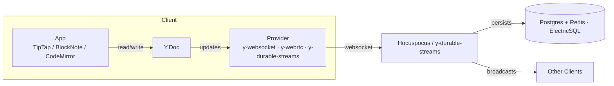

*Back to [Subject_Plan](Subject_Plan) | Part of [00 - 09 - Learning Index](00---09---Learning-Index)*

# 19.7 — Real-Time Systems

> *"In real-time systems, request/response is the wrong shape. The user is in the system, not at one end of it. The system is a continuous conversation, not a series of phone calls."*

By 2026 real-time is everywhere — collaborative docs, multiplayer games, live dashboards, AI agents joining humans in shared documents. The chapter covers the **transports** (WebSocket, SSE, WebRTC, WebTransport), the **collaboration math** (CRDTs, OT), the **netcode patterns** (rollback, snapshot interpolation), and the **2026 Yjs / Hocuspocus / ElectricSQL** ecosystem.

---

## 🎯 Learning Objectives

1. Choose between **WebSocket**, **Server-Sent Events**, **WebRTC**, and **WebTransport** by use case.
2. Implement **presence** + **awareness** with bounded bandwidth.
3. Compare **CRDTs** (Yjs, Automerge, ElectricSQL) vs **Operational Transform** for collaborative editing.
4. Apply **rollback netcode** + **snapshot interpolation** for multiplayer games.
5. Wire **Yjs + Hocuspocus + y-durable-streams** for a 2026-style collaborative app.
6. Reason about **AI agents as CRDT peers** — the 2026 frontier where humans and agents share live state.

---

## 🖼️ Visual Anchor

> *Picture / video reference (external — open in browser):*
> - 📺 [Yjs documentation](https://docs.yjs.dev/)
> - 📺 [Hocuspocus (Yjs websocket backend)](https://tiptap.dev/docs/hocuspocus/introduction)
> - 📺 [Automerge documentation](https://github.com/automerge/automerge)
> - 📺 [Glenn Fiedler — Networking for Game Programmers](https://gafferongames.com/categories/networking-for-game-programmers/)
> - 📺 [Discord Engineering — How Discord scaled WebSockets](https://discord.com/category/engineering)

---

## 📚 1. Transport Selection

| Transport | Direction | Order | Reliability | Browser support | Best at |
|---|---|---|---|---|---|
| **WebSocket** | Bidirectional | Ordered | Reliable (TCP) | Universal | General real-time apps |
| **Server-Sent Events (SSE)** | Server → client | Ordered | Reliable | Universal except old IE | Live feeds, notifications, AI token streams |
| **WebRTC Data Channels** | Bidirectional | Configurable | Configurable (UDP base) | Universal | P2P, low-latency multiplayer, voice/video |
| **WebTransport** | Bidirectional | Per-stream ordered | Reliable + unreliable streams (HTTP/3 + QUIC) | Chromium 2024+, Firefox 2026 GA, Safari trailing | Modern replacement for WebSocket; multiplayer; live media |
| **Long polling** | Pseudo-bidirectional | Ordered | Reliable | Universal | Last-resort fallback only |

**2026 default:** WebSocket for most app traffic, **SSE for AI token streaming** (the dominant LLM streaming mode), **WebRTC** for P2P games and calls, **WebTransport** when your audience is current Chromium and you need multiplexed streams.

---

## 📚 2. Presence & Awareness

Presence answers "who's here, what are they doing right now". The 2026 baseline:
- **Heartbeat** (every 5–15 s) keeps liveness; clients drop after ~30 s silence.
- **Awareness** (cursor positions, selections, current view) updates at 30–60 Hz **but** with **bandwidth budget**: drop frames, quantize positions, send deltas.
- **Last-seen** persisted in Redis or KV; **online list** in a Redis sorted set keyed on user ID.

For collaborative docs: Yjs has built-in **awareness** that piggybacks on the same channel as the CRDT updates, so presence is essentially free.

---

## 📚 3. CRDTs vs Operational Transform

> Yjs has become the dominant toolkit for CRDT-based editors; building a collaborative AI editor on top of it requires integrating CRDT sync for the document, token streaming for the AI, and presence/awareness, each with its own transport, persistence, and failure handling. — paraphrased from [electric-sql — AI agents as CRDT peers](https://electric-sql.com/blog/2026/04/08/ai-agents-as-crdt-peers-with-yjs). Content rephrased for compliance.

> Yjs is the de facto library for collaborative editing on the web — battle-tested, CRDT-based, powering tools like TipTap, CodeMirror, and BlockNote. — paraphrased from [electric-sql — Yjs over Durable Streams](https://electric-sql.com/blog/2026/04/07/yjs-durable-streams-on-electric-cloud). Content rephrased for compliance.

| Approach | How it works | Wins | Trades |
|---|---|---|---|
| **CRDT (Yjs, Automerge)** | Operations are commutative and idempotent; replicas converge without a central server | P2P, offline-first, no central server required | Bigger metadata; nuanced UI integration |
| **Operational Transform (OT)** | Server transforms client ops against concurrent ops | Small payloads, well-known | Requires central server; complex transformation functions |

**The 2026 winner is CRDTs.** Yjs + Hocuspocus + (optional) ElectricSQL or y-durable-streams covers ~90% of collab UIs.

> 2026 OT-vs-CRDT honest answer: it depends on your architecture, but the landscape has shifted — CRDTs have matured dramatically. — paraphrased from [taskade — OT vs CRDT in 2026](https://www.taskade.com/blog/ot-vs-crdt). Content rephrased for compliance.

---

## 📚 4. The 2026 Yjs Stack

- **`Y.Doc`** holds the CRDT.
- **Provider** handles transport (WebSocket, WebRTC, IndexedDB persistence, durable streams).
- **Hocuspocus** is the production-grade websocket backend with auth + persistence + extensions.
- **y-durable-streams (2026)** runs Yjs over HTTP on Electric Cloud's Durable Streams.

---

## 📚 5. AI Agents as CRDT Peers (2026 frontier)

> Building a collaborative AI editor means treating the AI agent as another CRDT peer: the agent reads the document state, streams tokens through the CRDT, and emits awareness updates like cursors and ranges, just as a human peer would. — paraphrased from [electric-sql — AI agents as CRDT peers with Yjs](https://electric-sql.com/blog/2026/04/08/ai-agents-as-crdt-peers-with-yjs). Content rephrased for compliance.

This is the architecture pattern of the year:
1. AI agent is a **headless Yjs client** holding a Y.Doc replica.
2. Agent reads document state for context, generates tokens, **writes them through the CRDT** (so they merge with concurrent human edits).
3. Agent's "cursor" + "current generation range" appears as another awareness state.
4. If a human edits the same range mid-generation, the CRDT merges; the agent's next tokens are appended after the human's edit.

This pattern is making its way into Notion AI, Cursor's collaborative AI, Linear's agents, and a wave of indie tools.

---

## 📚 6. Multiplayer Game Patterns

| Pattern | What it does | When |
|---|---|---|
| **Snapshot interpolation** | Client interpolates between recent server snapshots to smooth motion | Most casual multiplayer (FPS, racing) |
| **Client prediction** | Client runs game forward immediately on input | Reduce input-to-screen latency |
| **Server reconciliation** | Server replays inputs; client corrects if predictions diverge | Pair with prediction |
| **Rollback netcode** | Both clients keep recent state; on receiving input, rewind + replay deterministically | Fighting games, tight P2P (Street Fighter, Rollback Pong) |
| **Lockstep** | All clients wait for everyone's input before advancing | RTS games (StarCraft) |

**Bandwidth tricks:** quantize positions to 16-bit, send deltas, prioritize close-to-camera entities, drop hidden actors.

---

## 🛠️ 7. Worked Example — Collaborative Markdown Editor with AI Co-author

**Goal:** TipTap-based editor where multiple humans + an AI agent edit a single doc live.

**Architecture:**
1. **Frontend** (Next.js + TipTap + Yjs `y-websocket`).
2. **Backend** (Hocuspocus on Node.js + Postgres for persistence + Redis for presence).
3. **AI agent** runs as a separate worker that holds a Y.Doc, watches for `@ai` mentions in awareness, and streams tokens into the CRDT.
4. **Auth**: Hocuspocus extension validates JWT; AuthZ on document ID.
5. **Persistence**: Hocuspocus persists Y.Doc snapshots + updates to Postgres every 5 s.
6. **Scale-out**: stateless Hocuspocus pods behind a load balancer that **pins by document ID** (consistent hashing) so all clients of one doc land on the same pod.

**Bandwidth budget:** typical doc edit = 10–100 bytes per keystroke; awareness = ~100 bytes/s/user; AI token stream ≈ 50 tok/s × ~5 bytes ≈ 250 bytes/s. → 10 users + 1 agent ≈ 5 kbps total. Trivial.

---

## 🔗 8. Cross-links & Further Reading

### Internal
- [19.4 - Message Queues & Event-Driven Architecture](19.4---Message-Queues-&-Event-Driven-Architecture) — events vs streams vs CRDTs
- [19.6 - Microservices & Service Mesh](19.6---Microservices-&-Service-Mesh) — when real-time systems should be one service
- [19.8 - Capacity Planning & Back-of-Envelope Math](19.8---Capacity-Planning-&-Back-of-Envelope-Math) — connection bandwidth math
- [24.7 - Networking, Avatars & Multi-User Spaces](24.7---Networking,-Avatars-&-Multi-User-Spaces) — same patterns at avatar scale
- [22.5 - ROS 2 & Middleware - Nodes, Topics, Services, Actions, DDS](22.5---ROS-2-&-Middleware---Nodes,-Topics,-Services,-Actions,-DDS) — DDS as real-time middleware

### External
- [Yjs documentation](https://docs.yjs.dev/)
- [Automerge documentation](https://github.com/automerge/automerge)
- [Hocuspocus](https://tiptap.dev/docs/hocuspocus/introduction)
- [ElectricSQL](https://electric-sql.com/) · [y-durable-streams blog (2026)](https://electric-sql.com/blog/2026/04/07/yjs-durable-streams-on-electric-cloud)
- [electric-sql — AI agents as CRDT peers with Yjs (2026)](https://electric-sql.com/blog/2026/04/08/ai-agents-as-crdt-peers-with-yjs)
- [taskade — OT vs CRDT in 2026](https://www.taskade.com/blog/ot-vs-crdt)
- [Glenn Fiedler — Networking for Game Programmers](https://gafferongames.com/categories/networking-for-game-programmers/)
- [Discord Engineering blog](https://discord.com/category/engineering)
- [WebTransport spec](https://w3c.github.io/webtransport/)
- [WebRTC for the Curious (free book)](https://webrtcforthecurious.com/)

---

## ⚠️ 9. Common Misconceptions

- **"WebSocket scales infinitely."** Each open connection costs memory + a file descriptor. 100 k concurrent connections per node is realistic on tuned Linux; beyond that you shard.
- **"CRDTs are slow / huge."** Yjs payloads are small (~1.1× overhead in production) and fast in practice. The 2018 critique is outdated.
- **"P2P solves scaling."** P2P is great up to ~4 peers; beyond that you need a server for relay/state.
- **"SSE is dead."** SSE is the simplest reliable server-push, and the dominant transport for **LLM token streaming** in 2026.
- **"Real-time means low latency only."** Real-time means *bounded* latency. A 200-ms collab editor is real-time; a 50-ms one is sub-real-time.
- **"WebRTC is just video calls."** WebRTC Data Channels are a general-purpose UDP-grade transport with NAT traversal — used for game netcode and P2P file transfer.

---

*Next: [19.8 - Capacity Planning & Back-of-Envelope Math](19.8---Capacity-Planning-&-Back-of-Envelope-Math) — The numbers that turn opinions into engineering.*
