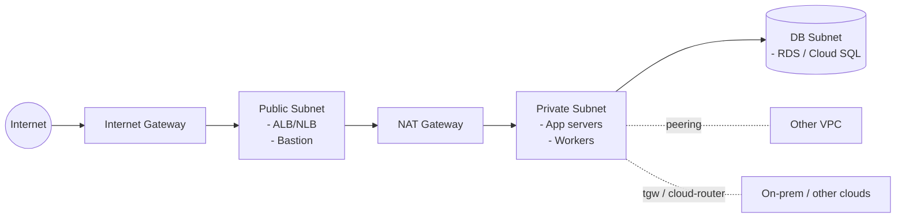
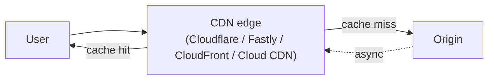
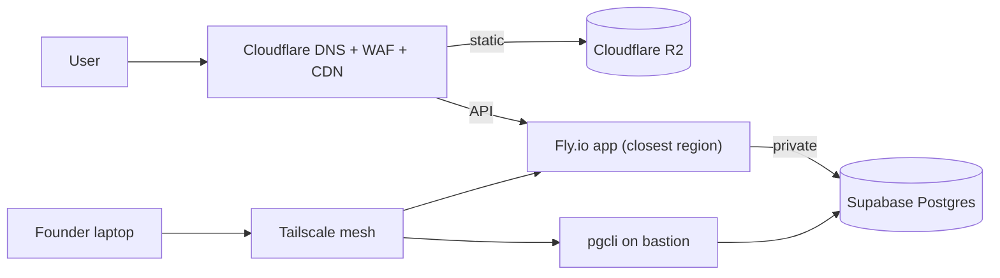

*Back to [Subject_Plan](Subject_Plan) | Part of [00 - 09 - Learning Index](00---09---Learning-Index)*

# 21.4 — Networking, DNS & CDN

> *"Most cloud bugs are network bugs in disguise. Most cloud security incidents are network exposures in disguise. Most surprise cloud bills are egress bills in disguise."*

The network is where compute and storage meet the world. It is also where every cloud bill quietly accumulates, every misconfiguration becomes a security incident, and every wrong assumption produces a midnight outage.

---

## 🎯 Learning Objectives

1. Build a working mental model of a VPC: subnets, route tables, internet gateway, NAT gateway, peering, Transit Gateway / Cloud Router / Azure VNet peering.
2. Decode DNS as it actually works in 2026 — recursive vs authoritative, TTLs, anycast, DNSSEC, ALIAS/ANAME records.
3. Pick a CDN and a DNS provider and wire them so the cache + origin + edge story is coherent (not three uncoordinated layers).
4. Distinguish anycast vs unicast vs DNS-based load balancing and explain why Cloudflare / Fastly / Cloud CDN behave the way they do.
5. Add zero-trust connectivity (Cloudflare Tunnel · Tailscale · Twingate) without exposing inbound ports.
6. Estimate egress / ingress costs across providers and predict where the bill will land.

---

## 🖼️ Visual Anchor

*Figure 21.4.1 — VPC Network Architecture*

> *Picture / video reference (external):*
> - 📖 [AWS VPC concepts](https://docs.aws.amazon.com/vpc/latest/userguide/what-is-amazon-vpc.html)
> - 📺 [Hussein Nasser — DNS, BGP, CDN deep dives](https://www.youtube.com/@hnasr)
> - 📖 [Cloudflare — How Cloudflare's network works](https://developers.cloudflare.com/network/) · [Cloudflare Tunnel](https://developers.cloudflare.com/cloudflare-one/connections/connect-networks/)
> - 📖 [Tailscale — concepts overview](https://tailscale.com/kb/1151/what-is-tailscale)

---

## 📚 1. The VPC Mental Model

| Concept | AWS | GCP | Azure |
|---|---|---|---|
| Network | **VPC** | **VPC** | **VNet** |
| Subnet | Subnet | Subnet | Subnet |
| Default-route to internet | **Internet Gateway** | default-internet-gateway | (auto) |
| Outbound-only NAT | **NAT Gateway** | **Cloud NAT** | **NAT Gateway** |
| Network-private to private routing | **VPC Peering** / **Transit Gateway** | **VPC Network Peering** / **Cloud Router** | **VNet Peering** / **Virtual WAN** |
| Internal DNS | Route 53 private hosted zones | Cloud DNS private zones | Azure Private DNS |

**Three rules that keep VPCs sane:**
1. **Public subnet = anything with a route to the internet gateway.** Lock it down.
2. **Private subnet = no inbound from the internet.** App servers live here.
3. **Database subnet = no inbound from the internet, no outbound to the internet.** DBs live here.

This is the AWS canonical 3-tier pattern; GCP and Azure follow the same shape. Prerequisite reading: [1.11 - Computer Networks Essentials](1.11---Computer-Networks-Essentials).

---

## 🌐 2. DNS in Three Layers

### Authoritative DNS (you publish records)

| Provider | Notable trait |
|---|---|
| **Cloudflare DNS** | Free, anycast, easy CNAME-flattening, ridiculously fast |
| **AWS Route 53** | Health-checks, latency-based routing, ALIAS records to AWS resources |
| **GCP Cloud DNS** | Tight integration with GCP load balancers |
| **Azure DNS** | Tight integration with Azure resources |
| **NS1 / DNSimple / Hurricane Electric** | Independents; HE is free |

### Recursive DNS (resolvers)

`1.1.1.1` (Cloudflare), `8.8.8.8` (Google), `9.9.9.9` (Quad9). Mostly relevant for client-side latency / privacy.

### TTLs and Anycast

A short TTL (60–300 s) is the right default for app records that may move; anycast (used by Cloudflare, Google, AWS GA) lets the same IP terminate at the closest PoP, dramatically cutting tail latency.

---

## 🚀 3. CDN Strategies

**Three things a CDN buys you:**
1. **Latency** — bytes served from a PoP near the user instead of your origin region
2. **Cost** — most CDNs charge less per egress GB than the underlying object store, and Cloudflare's R2 + Workers combination charges $0 for egress on the cache-miss path too
3. **DDoS / WAF** — CDN providers absorb attacks at scale; your origin only sees clean traffic

**CDN options for 2026:**

| CDN | Notable trait |
|---|---|
| **Cloudflare** | Default for indie; DNS + CDN + WAF + Workers + Tunnel as a stack |
| **Fastly** | Premium, programmable, Compute@Edge runtime |
| **AWS CloudFront** | Integrates tightly with S3 / Lambda@Edge |
| **GCP Cloud CDN** | Integrates with Cloud Load Balancing |
| **Azure Front Door / CDN** | Integrates with Azure resources |
| **Bunny.net / KeyCDN** | Indie-friendly, transparent pricing |

**Cache-control discipline:** the difference between a 90% hit rate and a 30% hit rate is almost always cache-control headers. `public, max-age=31536000, immutable` for hashed assets; `public, max-age=60, stale-while-revalidate=600` for HTML; `private, no-store` for authenticated content.

---

## 🛰️ 4. Anycast vs Unicast vs DNS-LB

- **Anycast** — many PoPs advertise the same IP via BGP; the routing table picks the nearest one for each client. This is how Cloudflare, Google's frontend, AWS Global Accelerator work. Sub-millisecond failover.
- **Unicast** — a single IP at a single PoP. The classical model. Failover requires DNS or a load-balancer in front.
- **DNS-based load balancing** — the resolver gets a different A record per region (Route 53 latency, Cloud DNS GTM). Failover bounded by DNS TTL.

For most modern apps, you let the CDN provider handle this with anycast; you don't hand-roll it.

---

## 🔐 5. Zero-Trust Connectivity (the new perimeter)

The 2026 default for connecting offices, dev laptops, and private services is **not** "open inbound port + IP allowlist." It's **identity-based mesh networking**.

| Tool | Use |
|---|---|
| **Cloudflare Tunnel** + **Cloudflare Access** | Outbound-only daemon connects your service to Cloudflare's edge; Access enforces identity. No inbound ports needed. |
| **Tailscale** | WireGuard mesh; 100 devices free; identity from your IdP (Google / Okta / Entra). Great solo-dev / small-team default. |
| **Twingate / Pomerium / Teleport** | Enterprise zero-trust networks |
| **AWS PrivateLink / GCP Private Service Connect / Azure Private Link** | Cross-VPC private endpoints inside one cloud |

For solo / indie work, the combination **Tailscale (laptop + servers) + Cloudflare Tunnel (public ingress) + Cloudflare Access (identity gate)** is the closest thing to a free, production-grade zero-trust setup in 2026.

---

## 💸 6. Egress — the Hidden Cost Centre

| Path | $/GB |
|---|---|
| AWS / GCP / Azure → internet | $0.05–0.12 |
| Hyperscaler → other-region | typically half that |
| Cloudflare R2 → internet | **$0** |
| Hetzner Cloud Server → internet | first 20 TB/server free, then ~€0.001/GB |
| Backblaze B2 → internet | $0.01 (with high free tier when paired with Cloudflare bandwidth alliance) |

**Architectural consequence:** if your read traffic is large and globally distributed, putting the **origin** in a non-egress-charging provider (R2 / Hetzner / B2) saves enough to fund the rest of the stack. This is the architectural seed under [Chapter 21.8](21.8---The-Indie-&-Solo-Cloud-Stack).

---

## 🛠️ 7. Worked Example — Network for a Small SaaS

**Goal:** API hosted on Fly.io · Postgres at Supabase · static assets on R2 · DNS at Cloudflare · zero-trust admin access for the founder.

**Configuration discipline:**
- DNS at Cloudflare with proxy enabled (orange cloud) for HTTPS termination + WAF
- Cache headers on R2 assets: `public, max-age=31536000, immutable`
- HTML at Fly.io: `public, max-age=60, s-maxage=300, stale-while-revalidate=86400`
- Postgres only reachable from Fly.io machines (Supabase IP-allowlist) + Tailscale
- No SSH ports open anywhere — all admin access via Cloudflare Tunnel + Access OR Tailscale

**Monthly bandwidth bill:** ~$0 across the whole stack until you outgrow the free tiers.

---

## 🔗 8. Cross-links & Further Reading

### Internal
- [21.1 - The Cloud Provider Landscape 2026](21.1---The-Cloud-Provider-Landscape-2026) — vendor map
- [21.2 - Compute Primitives](21.2---Compute-Primitives) — what these networks connect
- [21.3 - Storage & Databases](21.3---Storage-&-Databases) — egress is mostly a database/object-store problem
- [21.6 - Cost Optimization](21.6---Cost-Optimization) — egress optimization tactics
- [21.7 - Multi-Cloud, Edge & Vendor Lock-In](21.7---Multi-Cloud,-Edge-&-Vendor-Lock-In) — anycast and edge runtimes
- [1.11 - Computer Networks Essentials](1.11---Computer-Networks-Essentials) — TCP/IP foundation
- [Subject_Plan](Subject_Plan) — perimeter, ZTNA, segmentation (especially 25.7)

### External
- [AWS VPC docs](https://docs.aws.amazon.com/vpc/latest/userguide/what-is-amazon-vpc.html)
- [GCP Networking docs](https://cloud.google.com/networking/docs)
- [Azure Virtual Network docs](https://learn.microsoft.com/en-us/azure/virtual-network/)
- [Cloudflare network architecture](https://developers.cloudflare.com/network/) · [Tunnel docs](https://developers.cloudflare.com/cloudflare-one/connections/connect-networks/)
- [Tailscale docs](https://tailscale.com/kb/)
- [Hurricane Electric BGP toolkit](https://bgp.he.net/)

---

## ⚠️ 9. Common Misconceptions

- **"My VPC is private, so it's secure."** A misconfigured route table or open security group invalidates the whole posture. Network privacy is necessary but not sufficient.
- **"DNS changes are instant."** They are eventually-consistent across the global resolver fleet, bounded by your TTL. Plan deployments accordingly.
- **"A CDN replaces a cache."** A CDN is an HTTP cache; if your responses are uncacheable (no-store, dynamic per-user), you get edge proxying but no cache benefit.
- **"Egress is a small fraction of the bill."** For media-heavy or read-heavy services on hyperscalers, it is frequently the **largest** line. Architect for it before launch.
- **"Tailscale is a VPN."** Mechanically it's a WireGuard mesh, but the identity-based model and ACLs make it a different shape than legacy VPNs. Don't shoehorn old VPN mental models onto it.

---

*Next: [21.5 - Identity, IAM & Org Structure](21.5---Identity,-IAM-&-Org-Structure) — Who can do what, in which account, with which credentials.*
