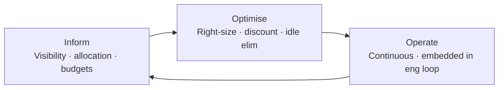

*Back to [Subject_Plan](Subject_Plan) | Part of [00 - 09 - Learning Index](00---09---Learning-Index)*

# 21.6 — Cost Optimization

> *"In the cloud, your bill is your architecture made visible. Every line item is a decision someone made, and most of them were made implicitly."*

The cloud-cost market in 2026 is mature: tooling is good, frameworks are standardized, and the playbook is well-known. **Despite all of that, surveys keep finding ~27–35% of cloud spend is waste even at organizations with formal FinOps programs** ([Sedai — FinOps tools 2026](https://sedai.io/blog/18-essential-finops-platforms-and-tools), [Towards The Cloud — AWS cost optimization 2026](https://towardsthecloud.com/blog/aws-cost-optimization-best-practices), [Usage.ai — best cost-optimization tools](https://www.usage.ai/blogs/finops/tools/best-cloud-cost-optimization-tools-usa/), all paraphrased for compliance).

The waste is not because the levers are hidden. It's because nobody owns pulling them.

---

## 🎯 Learning Objectives

1. Name the four families of cost levers — **discount commitments · spot/preemptible · right-sizing · idle elimination** — and pull each one.
2. Distinguish savings plans, reserved instances, committed-use discounts, and how each binds you.
3. Use spot / preemptible / interruptible instances safely (where it's appropriate, where it isn't).
4. Apply the **FinOps Foundation Crawl / Walk / Run (Inform / Optimise / Operate)** maturity model.
5. Pick and wire cost-visibility tools — **Vantage**, **Infracost**, **OpenCost**, **Kubecost** — into the engineering loop, not the finance loop.
6. Read your bill like a literate engineer: which line items dominate and which knobs move them.

---

## 🖼️ Visual Anchor

> *Picture / video reference (external):*
> - 📖 [FinOps Foundation Framework](https://www.finops.org/framework/)
> - 📺 [FinOps Foundation YouTube](https://www.youtube.com/@FinOpsFoundation)
> - 📖 [AWS Cost Optimization pillar (Well-Architected)](https://docs.aws.amazon.com/wellarchitected/latest/cost-optimization-pillar/welcome.html)
> - 📖 [Infracost docs](https://www.infracost.io/docs/) · [OpenCost docs](https://www.opencost.io/docs/)

---

## 📚 1. The Four Lever Families

### Lever 1 — Commitment-Based Discounts

| Vendor | Mechanisms | Discount range |
|---|---|---|
| **AWS** | Compute Savings Plans · EC2 Instance Savings Plans · Reserved Instances (RIs) | up to ~72% off on-demand |
| **GCP** | Committed-Use Discounts (CUDs) — resource-based and spend-based | up to ~70% off |
| **Azure** | Reserved VM Instances · Savings Plans for Compute | up to ~72% off |

**Discipline:** start with **Compute Savings Plans / spend-based CUDs** (most flexible) before instance-specific RIs (which lock in family + region). Cover roughly **70% of your steady-state baseline** as the rule of thumb — covering 100% removes flexibility, covering 0% is leaving money on the table.

### Lever 2 — Spot / Preemptible / Interruptible

| Vendor | Name | Discount | Constraint |
|---|---|---|---|
| **AWS** | EC2 Spot | up to ~90% off | reclaimed with 2-min notice |
| **GCP** | Spot VMs / Preemptible | up to ~91% off | reclaimed with 30-s notice |
| **Azure** | Spot VMs | up to ~90% off | eviction policy configurable |
| **Hetzner / Scaleway** | usually steady on-demand | already cheap | n/a |

**When to use:** stateless web tier, batch processing, ML training, CI runners. **When not to use:** stateful databases, anything with a session you can't restart, anything with strict SLAs you can't satisfy from a backup pool.

### Lever 3 — Right-Sizing

The boring lever. Most VMs are over-provisioned 2–5×. AWS Compute Optimizer · GCP Recommender · Azure Advisor all surface specific instance-family/size recommendations weekly. Acting on them is free.

### Lever 4 — Idle Elimination

| Pattern | Saving |
|---|---|
| **Scheduled scale-down** of dev / staging environments outside business hours | ~70% on those workloads |
| **Scale-to-zero** serverless runtimes (Lambda · Cloud Run · Workers · Container Apps) | ~100% on idle |
| **Auto-pause** managed databases (Neon · Aurora Serverless v2 · Cosmos DB serverless) | up to ~95% on dev DBs |
| **Delete orphaned resources** (unattached EBS volumes, unused EIPs, idle load balancers, old snapshots) | varies, often 5–10% of the bill |

The "27–35% waste" headline is mostly this lever.

---

## 🪜 2. The FinOps Maturity Model — Crawl / Walk / Run

The [FinOps Foundation framework](https://www.finops.org/framework/) describes a continuous loop with three phases (the framework itself describes them as "Inform · Optimise · Operate"):

| Stage | What "good" looks like |
|---|---|
| **Crawl (Inform)** | You can answer "who spent what" and "what is this team's monthly trend" within minutes |
| **Walk (Optimise)** | Right-sizing, commitment coverage, spot adoption are reviewed monthly; engineers see cost in their PR |
| **Run (Operate)** | Cost is a SLO; dashboards tied to product KPIs (cost per active user, $/GB egress); FinOps embedded in sprints |

Most orgs sit in late Crawl / early Walk. Going from Crawl to Walk is where the 20–30% savings live.

---

## 📊 3. Cost-Visibility Tooling

### Native Cloud Tools (free)

| Cloud | Tools |
|---|---|
| AWS | Cost Explorer · Cost & Usage Report (CUR) · Compute Optimizer · Trusted Advisor · Budgets |
| GCP | Cloud Billing reports · Recommender · Active Assist |
| Azure | Cost Management + Billing · Advisor · Anomaly Detection |

### Third-Party (open-source + SaaS)

| Tool | Use | Notes |
|---|---|---|
| **Infracost** (open-source) | Cost in the PR diff for Terraform / OpenTofu / CloudFormation / Pulumi | CI plug-in, blocks bad commits |
| **OpenCost** (CNCF, open-source) | Real-time Kubernetes cost allocation | The standard for k8s cost transparency |
| **Kubecost** | Productized OpenCost + UI | Easy on-prem deploy |
| **Vantage** | Multi-cloud cost dashboard + savings recs | Free tier; SaaS |
| **CloudZero · Antimetal · Sedai** | Enterprise FinOps platforms | Larger orgs |
| **Spot.io / nOps** | Optimization SaaS specialized in EC2 + spot orchestration | |

For solo / indie work: **Infracost + your cloud's native cost dashboard** is enough. For k8s teams: **OpenCost** is mandatory. For multi-cloud orgs > $50k/mo: a third-party platform pays for itself.

Sources for the 2026 tooling landscape: [Sedai — FinOps platforms 2026](https://sedai.io/blog/18-essential-finops-platforms-and-tools), [Usage.ai — cost-optimization tools](https://www.usage.ai/blogs/finops/tools/best-cloud-cost-optimization-tools-usa/), [Towards The Cloud — AWS cost optimization](https://towardsthecloud.com/blog/aws-cost-optimization-best-practices). All paraphrased.

---

## 🛠️ 4. Worked Example — A 90-Day Cost-Cleanup Sprint

**Setup:** medium-size AWS account, $30k/month spend, no formal FinOps program.

### Week 1–2 — Inform

- Enable Cost & Usage Report → Athena (free).
- Tag every resource by `team`, `env`, `service`. Backfill the worst 80% by spend.
- Set per-team budgets in Budgets with email alerts at 50/80/100%.
- Run AWS Trusted Advisor + Compute Optimizer; export top 50 recommendations.

### Week 3–6 — Optimise (the big lever-pulling)

- **Right-size** the top 20 instance-types based on Compute Optimizer.
- **Buy a Compute Savings Plan** covering 60–70% of steady-state baseline (1-year, no upfront).
- **Move stateless workloads to Spot** (Karpenter / Spot Fleet for k8s, Spot ASGs for non-k8s).
- **Schedule dev/staging shutdown** outside business hours (Instance Scheduler or Lambda + tags).
- **Delete orphaned EBS / snapshots / unattached EIPs / unused NAT Gateways.**
- Move read-heavy assets behind a CDN; or move object storage to **R2 (zero egress)** and bridge with Cloudflare.

### Week 7–12 — Operate

- Add **Infracost** to every Terraform PR; block PRs that increase monthly cost > $100 without an `infracost-approved` label.
- Publish a weekly cost dashboard per service (cost per active user, cost per request).
- Make cost a slide in monthly engineering review.
- Set up Cost Anomaly Detection.

**Typical outcome on a real $30k/mo account:** $9–12k/mo savings in 90 days, then ongoing 5–10% per quarter improvements as the team internalizes the discipline.

---

## 🔗 5. Cross-links & Further Reading

### Internal
- [21.1 - The Cloud Provider Landscape 2026](21.1---The-Cloud-Provider-Landscape-2026) — TCO drivers
- [21.2 - Compute Primitives](21.2---Compute-Primitives) — where right-sizing applies
- [21.3 - Storage & Databases](21.3---Storage-&-Databases) — egress + idle DB are big line items
- [21.4 - Networking, DNS & CDN](21.4---Networking,-DNS-&-CDN) — egress avoidance is a cost lever
- [21.7 - Multi-Cloud, Edge & Vendor Lock-In](21.7---Multi-Cloud,-Edge-&-Vendor-Lock-In) — discount lock-in is real lock-in
- [21.8 - The Indie & Solo Cloud Stack](21.8---The-Indie-&-Solo-Cloud-Stack) — by-design cost discipline
- [Subject_Plan](Subject_Plan) — especially 26.8 cost-as-an-SRE concern

### External
- [FinOps Foundation Framework](https://www.finops.org/framework/)
- [AWS Well-Architected — Cost pillar](https://docs.aws.amazon.com/wellarchitected/latest/cost-optimization-pillar/welcome.html)
- [GCP Cost optimization documentation](https://cloud.google.com/architecture/framework/cost-optimization)
- [Azure Cost Management](https://learn.microsoft.com/en-us/azure/cost-management-billing/)
- [Infracost docs](https://www.infracost.io/docs/)
- [OpenCost docs](https://www.opencost.io/docs/) · [Kubecost](https://www.kubecost.com/)
- [Cloud Pricing Calculator](https://cloudpricecheck.com/)

---

## ⚠️ 6. Common Misconceptions

- **"Reserved Instances are the safest commitment."** Compute Savings Plans / spend-based CUDs are usually safer because they survive instance-family changes. Pure RIs lock you to a family + region.
- **"Spot is too risky for production."** Stateless production tier on diversified spot fleets is mainstream in 2026. The risk is in **stateful** workloads, not spot per se.
- **"Right-sizing is finance's job."** Right-sizing is engineering's job. Finance measures; engineering moves the slider.
- **"FinOps is a tool you buy."** FinOps is a practice you operate. The tools just give you data.
- **"Egress is a fixed cost of doing business."** Egress is one of the most architecturally addressable line items (CDN caching, R2, Hetzner free egress, DirectConnect / Interconnect). Treat it as a design constraint.
- **"Discount commitments are leverage on the vendor."** They are leverage on **you**. They reduce your ability to leave. Cover the steady-state, not the maybe-state.

---

*Next: [21.7 - Multi-Cloud, Edge & Vendor Lock-In](21.7---Multi-Cloud,-Edge-&-Vendor-Lock-In) — When portability is worth the complexity, and when it isn't.*
