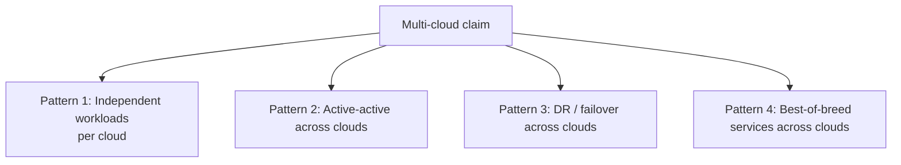
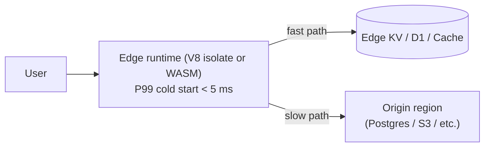

*Back to [Subject_Plan](Subject_Plan) | Part of [00 - 09 - Learning Index](00---09---Learning-Index)*

# 21.7 — Multi-Cloud, Edge & Vendor Lock-In

> *"Multi-cloud is mostly a marketing phrase. Lock-in is mostly a managed-services phrase. Edge is mostly a JavaScript-runtime phrase. Each one has a single sentence of nuance that explains 90% of the rest."*

This is the strategy chapter. The previous six chapters taught the primitives; this one teaches when to deliberately leave a single cloud, when to deliberately stay, and how to keep the door open either way.

---

## 🎯 Learning Objectives

1. Distinguish the four "multi-cloud" patterns and predict which is justified for which workload.
2. Build a working mental model of edge computing in 2026 — runtimes, latencies, portability via WinterCG.
3. Identify your real lock-in surface — almost never raw compute, almost always managed services.
4. Use Kubernetes / containers / OpenTelemetry as portability layers without overpaying for the privilege.
5. Estimate the cost of leaving a cloud, and decide whether it's a strategic problem or a strategic non-issue.
6. Decide for any new project: single-cloud-first, edge-first, or genuinely-multi-cloud.

---

## 🖼️ Visual Anchor

> *Picture / video reference (external):*
> - 📺 [Daily.dev — Edge computing 2026: Cloudflare Workers, Deno Deploy, Vercel](https://daily.dev/blog/edge-computing-frontend-developers-cloudflare-workers-deno-deploy-vercel/)
> - 📖 [WinterCG — Common Minimum API for Web-interoperable runtimes](https://wintercg.org/)
> - 📖 [CNCF Cloud Native Landscape](https://landscape.cncf.io/)
> - 📺 [DevOps Toolkit — multi-cloud realities](https://www.youtube.com/@DevOpsToolkit)

---

## 📚 1. The Four Multi-Cloud Patterns



| Pattern | When it's justified | Reality check |
|---|---|---|
| **1. Independent workloads** (App A on AWS, App B on GCP because acquired) | Common in M&A; rarely a strategic choice | Mostly an accounting problem |
| **2. Active-active across clouds** | Truly global SaaS with strict regional regulatory needs | **Very rare;** complexity tax usually exceeds the resilience gain |
| **3. DR / failover across clouds** | Regulated industries with formal cross-cloud RPO/RTO requirements | **Rare;** most teams are better served by multi-region within one cloud |
| **4. Best-of-breed** (BigQuery for analytics + AWS for the app + Cloudflare for edge) | Common and **often the right answer** | This is "specialized services" not "redundant runtime" |

**The honest answer:** Pattern 4 is what most successful teams actually do, and they rarely call it "multi-cloud" because it's just *using the right service for the job*. Patterns 2 and 3 sound impressive in slides and almost never pay back the operational complexity.

---

## ⚡ 2. Edge Computing in 2026



**The 2026 edge runtime field:**

| Runtime | Provider | Engine |
|---|---|---|
| **Workers** | Cloudflare | V8 isolates |
| **Edge Functions** | Vercel | V8 (subset of Node) |
| **Deno Deploy** | Deno | V8 + Deno API |
| **Compute@Edge** | Fastly | WebAssembly (Lucet/Wasmtime) |
| **Lambda@Edge / CloudFront Functions** | AWS | Node.js |
| **AWS Lambda + Wavelength** | AWS | full Lambda runtime at carrier edge |

All of the major edge runtimes report **P99 cold starts under 5 milliseconds** in 2025–2026 published benchmarks ([Blazing CDN — edge computing 2026](https://blog.blazingcdn.com/en-us/the-role-of-edge-computing-in-software-cdn-optimization), [Daily.dev — edge runtimes](https://daily.dev/blog/edge-computing-frontend-developers-cloudflare-workers-deno-deploy-vercel/), [Safebox Guide — Fly.io edge alternatives](https://safeboxguide.com/5-tools-startups-consider-instead-of-fly-io-for-edge-infrastructure/), all paraphrased). That number is the headline difference vs. region-bound serverless functions, which routinely show cold starts in the 100 ms–1 s range.

### Portability via WinterCG

The **Web-interoperable Runtimes Community Group (WinterCG)** under ECMA TC39 publishes a "Common Minimum API" describing the subset of Web Platform APIs that all modern non-browser JS runtimes should support — `fetch`, `Request`/`Response`, `URL`, `Headers`, `Web Streams`, `WebCrypto`, `EventTarget`, etc. This is the closest thing to a portable edge runtime standard, and it lets you write a Worker that runs without modification on Vercel Edge or Deno Deploy. Reference: [wintercg.org](https://wintercg.org/). Paraphrased.

---

## 🔒 3. Where Lock-In Actually Lives

The popular framing is "AWS lock-in" or "Azure lock-in." That framing is wrong.

```mermaid
graph TD
    LEAST[Least lock-in] --> RAW[Raw VM / container compute<br/>(swap providers in days)]
    RAW --> NETWORK[Networking primitives<br/>(VPC shapes are similar)]
    NETWORK --> DB[Standard databases<br/>Postgres / MySQL / Redis<br/>(swap in weeks)]
    DB --> IAM[IAM model<br/>(re-write policies — weeks)]
    IAM --> PROP[Proprietary managed services<br/>BigQuery · DynamoDB · Cosmos · Snowflake<br/>(rewrite — months)]
    PROP --> MOST[Most lock-in]
```

**Three rules:**
1. **Compute is portable.** Containers run anywhere; swapping EC2 for Hetzner is days of work.
2. **Postgres is portable.** Aurora ↔ Cloud SQL ↔ Supabase ↔ Neon is a `pg_dump` and a config change.
3. **Proprietary managed services are sticky.** DynamoDB single-table designs, BigQuery pipelines, Cosmos partition keys, Snowflake warehouse SQL — these are the migrations that take quarters.

**The actionable conclusion:** keep your **data plane** on portable open standards (Postgres, S3-compatible storage, OpenTelemetry, Kafka) and accept lock-in only on services that earn it (BigQuery for analytics, DynamoDB for IoT-scale KV, etc.).

---

## 🐳 4. Portability Layers That Actually Work

| Layer | Standard | Use |
|---|---|---|
| **Compute** | OCI containers, Kubernetes | k8s on EKS ↔ GKE ↔ AKS is genuinely portable; the *managed services around it* are not |
| **Service mesh** | Istio · Linkerd · Cilium | Same config across clouds |
| **Observability** | **OpenTelemetry** (CNCF) | The single most useful portability win of the last 5 years |
| **Infrastructure as code** | Terraform / OpenTofu / Pulumi | Same tool across clouds; provider-specific code per cloud |
| **Object storage** | S3 API | R2 / GCS (with S3 interop) / B2 / MinIO all speak it |
| **Databases** | PostgreSQL wire protocol | Most managed Postgres providers honor it |

---

## 🚪 5. Exit-Strategy Estimation

For a typical mid-size SaaS to fully leave a hyperscaler, the cost map looks roughly like:

| Cost head | Typical scale |
|---|---|
| **Egress to the destination** | 1× the data volume × $0.05–0.09/GB (one-time spike) |
| **Re-architecting proprietary services** | 3–9 person-months for ~3 critical managed services |
| **Cutover risk** (parallel running) | 2–4 months at ~1.7× the bill |
| **Re-training the team** | 1–2 weeks per engineer |
| **Re-buying commitment discounts** in the new home | 1–3 months of negotiation |

**Total realistic estimate:** 6–12 months and ~10–25% of one year's bill. This is the actual number that determines whether multi-cloud-as-resilience is worth pursuing.

---

## 🛠️ 6. Worked Example — Edge-First Architecture for a Read-Heavy SaaS

**Goal:** P99 latency < 100 ms globally; bill < $200/month at 1k users; portable enough to leave Cloudflare in a weekend.

```mermaid
flowchart LR
    User --> CF[Cloudflare Workers]
    CF -->|"hot reads"| KV[(Workers KV / D1)]
    CF -->|"static"| R2[(R2)]
    CF -->|"cache miss"| ORIGIN[Postgres origin<br/>Supabase or Neon]
    CF -.OTel.- OBS[Observability<br/>(Honeycomb / Better Stack)]
```

**Portability discipline:**
- Origin is **Postgres** (Supabase / Neon) — same wire protocol everywhere.
- Worker code uses only the **WinterCG common subset** (`fetch`, `Request`, `Response`, etc.) — drops onto Vercel Edge or Deno Deploy unchanged.
- D1 is SQLite — exits via `pg_dump`-equivalent → Postgres.
- R2 is S3-API — exits to any S3-compatible store.
- Observability via **OpenTelemetry** — vendor-swappable.

The whole stack is replaceable in **a weekend**, even though it depends on three Cloudflare services. That is the difference between **lock-in to a vendor** and **lock-in to a workflow**.

---

## 🔗 7. Cross-links & Further Reading

### Internal
- [21.1 - The Cloud Provider Landscape 2026](21.1---The-Cloud-Provider-Landscape-2026) — provider map
- [21.2 - Compute Primitives](21.2---Compute-Primitives) — edge runtimes as a compute shape
- [21.6 - Cost Optimization](21.6---Cost-Optimization) — exit-cost modeling overlap
- [21.8 - The Indie & Solo Cloud Stack](21.8---The-Indie-&-Solo-Cloud-Stack) — concrete edge-first recipes
- [Subject_Plan](Subject_Plan) — especially 27.2 edge architecture
- [BUILDING_AT_SCALE](BUILDING_AT_SCALE) — section on edge-first serverless

### External
- [WinterCG common minimum API](https://wintercg.org/) · [GitHub](https://github.com/wintercg)
- [CNCF Cloud Native Landscape](https://landscape.cncf.io/)
- [OpenTelemetry docs](https://opentelemetry.io/docs/)
- [Cloudflare Workers limits](https://developers.cloudflare.com/workers/platform/limits/)
- [Vercel Edge runtime](https://vercel.com/docs/functions/runtimes/edge-runtime)
- [Deno Deploy docs](https://docs.deno.com/deploy/)
- [Fastly Compute@Edge](https://www.fastly.com/products/edge-compute)

---

## ⚠️ 8. Common Misconceptions

- **"Multi-cloud means more reliable."** Often the opposite. Multi-cloud means more vendors to monitor, more skill sets to retain, and more identity systems to harden. The reliability win is real only when you've already exhausted multi-region single-cloud.
- **"Kubernetes makes you cloud-portable."** k8s is portable; the **20+ managed services around it** (load balancer, ingress, secrets manager, registry, identity) are vendor-specific. The escape hatch is real but narrower than the slogan.
- **"Edge replaces origin."** Edge runtimes complement origins for cacheable + low-latency work. Stateful, write-heavy, transactional work still wants a region-bound database.
- **"WinterCG-compliant code runs anywhere."** It runs across *runtimes* that publish WinterCG compliance. The platforms have other differences (KV / DB / queues / auth) that are not part of WinterCG.
- **"We need to be multi-cloud for compliance."** Most regulators ask for **resilience** and **data residency**, not for two clouds. Multi-region within one cloud usually satisfies the requirement.

---

*Next: [21.8 - The Indie & Solo Cloud Stack](21.8---The-Indie-&-Solo-Cloud-Stack) — The BUILDING_AT_SCALE §9 playbook, expanded into deployable recipes.*
