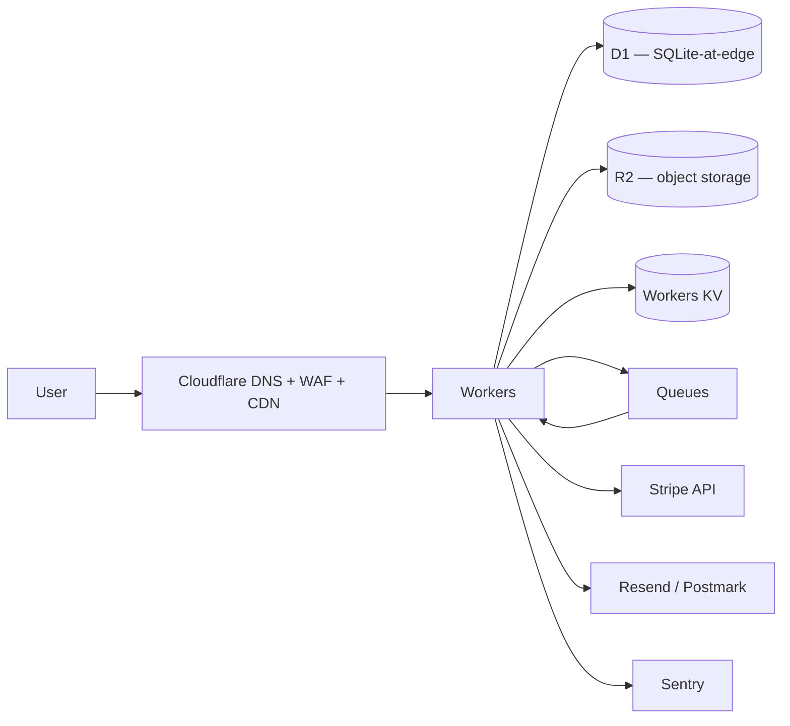
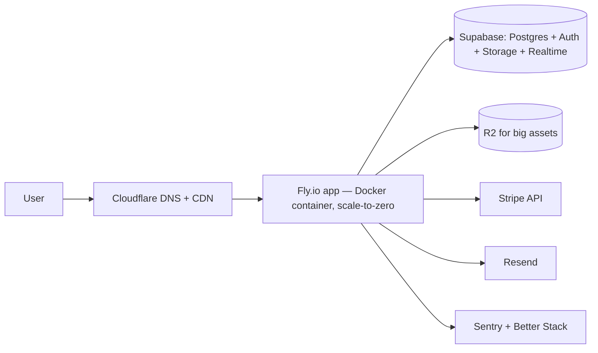
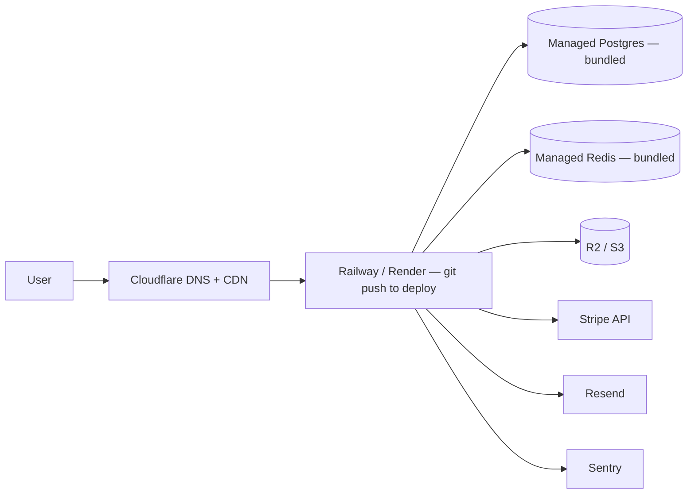

*Back to [Subject_Plan](Subject_Plan) | Part of [00 - 09 - Learning Index](00---09---Learning-Index)*

# 21.8 — The Indie & Solo Cloud Stack

> *"The cheapest, fastest, most defensible solo SaaS stack in 2026 is not a hyperscaler. It's a pile of generous free tiers stitched together by Postgres and Stripe. The bill stays small because the architecture is small."*

This is the capstone. The previous seven chapters taught the cloud landscape, primitives, money, and strategy. This chapter is **the playbook**: three concrete stacks, each deployable today, each under **$200/month** for the first 1,000 users, each with an exit door.

It directly expands [BUILDING_AT_SCALE](BUILDING_AT_SCALE) §9 (paraphrased throughout). Read in conversational tone — this is the "now go ship" chapter.

---

## 🎯 Learning Objectives

1. Pick one of three indie-friendly cloud stacks based on your workload shape.
2. Deploy the chosen stack end-to-end with a real CI/CD pipeline.
3. Wire auth · payments · email · observability without building any of them yourself.
4. Keep the bill under $200/month from launch through 1,000 paying users.
5. Plan the moment you outgrow the stack — what breaks first, and where you go.

---

## 🖼️ Visual Anchor

> *Picture / video reference (external):*
> - 📖 [supermemoryai / cloudflare-saas-stack — reference repo](https://github.com/supermemoryai/cloudflare-saas-stack)
> - 📖 [Supabase — production checklist](https://supabase.com/docs/guides/platform/going-into-prod)
> - 📖 [Fly.io — full-stack quickstart](https://fly.io/docs/launch/) · [Cloudflare Workers full-stack guide](https://developers.cloudflare.com/workers/tutorials/)
> - 📺 [Indie Hackers — solo SaaS interviews](https://www.indiehackers.com/)

---

## 📚 1. The Three Stacks

### Stack A — Edge-First (Cloudflare-native)



**When to choose:** read-heavy apps, globally distributed users, you're comfortable in TypeScript, your data fits SQLite-shape (D1) or you want to push relational data to **Neon** or **Hyperdrive**-fronted Postgres.

**Monthly cost at 1,000 active users:** typically **$0–30** (mostly free tier). Workers Paid is $5/mo and unlocks higher limits; D1 / R2 / KV / Queues each have generous free tiers; egress on R2 is **$0**.

### Stack B — Postgres-First (Supabase + Fly.io)



**When to choose:** you want **real Postgres** (joins, transactions, pgvector for AI features, full-text search), you have long-running connections (websockets, server-sent events), or you ship in Python/Ruby/Go and don't want to rewrite for Workers.

**Monthly cost at 1,000 active users:** Supabase Pro **$25** + Fly.io ~**$5–25** + Cloudflare $0–5 + Stripe (transaction-based) + Resend free → roughly **$35–60/month**.

### Stack C — Heroku-Shaped (Railway or Render)



**When to choose:** zero-ops is non-negotiable, you want Heroku-style git-push DX, you're early enough that the few-extra-dollars price is worth your time.

**Monthly cost at 1,000 active users:** **$20–60** depending on plan and side-services.

---

## 🧩 2. The Universal Side-Service Layer

These plug into all three stacks identically; pick once and reuse:

| Layer | Pick | Why | Free / start cost |
|---|---|---|---|
| Frontend | **Next.js** (or Remix / SvelteKit / Astro) | Defaults that don't fight you; Vercel + Cloudflare Pages both deploy it for free | Free |
| Auth | **Clerk** (or Supabase Auth, or Auth.js) | Don't build your own | Free up to 10k MAU on Clerk |
| Payments | **Stripe** + **Stripe Tax** (or Lemon Squeezy / Paddle as merchant of record) | Standard; LS / Paddle handle EU VAT for you | Per-transaction |
| Email | **Resend** or **Postmark** | Deliverable transactional mail | Generous free tier |
| Observability | **Sentry** + **Better Stack** + **PostHog** (or Plausible) | Errors · logs · product analytics | Free tiers |
| CI/CD | **GitHub Actions** | Free for small repos | Free |
| Secrets | **Doppler** or **1Password Secrets** | Keep `.env` out of git, ever | Free |
| AI / LLM | **OpenAI / Anthropic / Gemini** API · **Replicate** for image/video models · local GPU when ownership matters | Pay-per-token / pay-per-prediction | Pay-as-you-go |
| Background jobs | **Cloudflare Queues** (Stack A) · **Inngest** · **pg-boss** (Stack B) · platform-native (Stack C) | Move heavy work off the request path | Free tiers |
| Domain + DNS | **Cloudflare Registrar** | At-cost domains, free DNS | $9–12/yr per domain |

Sources for the 2026 indie stack thesis: [Superframeworks — solopreneur AI stack 2026](https://superframeworks.com/articles/solopreneur-ai-stack-2026), [Gupta — solo founder AI playbook](https://guptadeepak.com/ebooks/solo-founder-ai-playbook/the-solo-founders-tech-stack/), [BuildWithMatija — Vercel / Docker / Cloudflare 2026](https://www.buildwithmatija.com/payload-cms-hosting), [Indie Hackers — solo SaaS reality post](https://www.indiehackers.com/post/im-a-solo-founder-it-took-me-9-months-and-at-least-3-stack-rewrites-to-ship-my-saas-a66b5fbe33). All paraphrased for compliance.

---

## 🛠️ 3. Worked Recipe — Stack A from Zero

Goal: a real deployable Workers + D1 + R2 + Queues + Stripe SaaS in one afternoon.

### Step 1 — Provision

```bash
# Cloudflare CLI — wrangler
npm install -g wrangler
wrangler login

# New Workers project (TS)
npm create cloudflare@latest my-saas
cd my-saas

# Add D1 (SQLite at edge)
wrangler d1 create my-saas-db

# Add R2 (object storage)
wrangler r2 bucket create my-saas-assets

# Add Queues
wrangler queues create my-saas-jobs
```

Add the resource bindings to `wrangler.toml`:

```toml
[d1_databases](d1_databases)
binding = "DB"
database_name = "my-saas-db"
database_id = "<from-create-output>"

[r2_buckets](r2_buckets)
binding = "ASSETS"
bucket_name = "my-saas-assets"

[queues.producers](queues.producers)
binding = "JOBS"
queue = "my-saas-jobs"

[queues.consumers](queues.consumers)
queue = "my-saas-jobs"
max_batch_size = 10
```

### Step 2 — Auth + Payments

```bash
# Auth via Clerk
npm install @clerk/backend
# Stripe
npm install stripe
```

Wire them into the Worker entry: Clerk validates the session token on every request; Stripe webhooks land at `/webhooks/stripe`, validated against the Stripe signing secret stored in Worker secrets:

```bash
wrangler secret put STRIPE_SECRET_KEY
wrangler secret put STRIPE_WEBHOOK_SECRET
wrangler secret put CLERK_SECRET_KEY
```

### Step 3 — Background Jobs

A Worker writes to the queue; another Worker consumes it. The consumer is also TypeScript, runs on the same edge, and inherits the same secrets. Heavy work (PDF generation, email, third-party API hops) goes here so the request path stays under the 50 ms / 30 s CPU budget.

### Step 4 — CI/CD

`.github/workflows/deploy.yml`:

```yaml
on:
  push:
    branches: [main]
jobs:
  deploy:
    runs-on: ubuntu-latest
    permissions:
      id-token: write
      contents: read
    steps:
      - uses: actions/checkout@v4
      - uses: actions/setup-node@v4
        with: { node-version: 20 }
      - run: npm ci && npm test
      - uses: cloudflare/wrangler-action@v3
        with:
          apiToken: ${{ secrets.CLOUDFLARE_API_TOKEN }}
```

### Step 5 — Observability

- **Sentry** SDK for errors (free tier covers most indie volume).
- **PostHog Cloud free** for product analytics + feature flags + session replay.
- Workers' built-in **Tail Workers** + **Logpush** to a Better Stack drain for logs.

### Step 6 — Custom Domain + WAF + Rate Limiting

In the Cloudflare dashboard: add the domain, set up the Workers route, enable WAF managed rules (free), enable Bot Fight Mode (free), enable Rate Limiting Rules (free tier covers most launches).

**Total elapsed time:** an afternoon for a working v0; a week for a polished launch.
**Total monthly cost** at 1,000 active users: **$5–30**.

---

## 🌱 4. When You Outgrow Each Stack

**Stack A (Cloudflare edge):** the breakpoints are usually CPU per request (push heavy work to Queues consumers; eventually Modal / Lambda for >30 s tasks) or relational data shape (move to **Neon** Postgres via Hyperdrive; D1 stays for the cacheable reads).

**Stack B (Supabase + Fly):** the breakpoints are Supabase's Postgres at >100 GB or hot-write throughput; you migrate the DB to **Crunchy Bridge**, **Aiven**, or self-hosted on Hetzner with replicas. Fly scales horizontally with Machines.

**Stack C (Railway / Render):** the breakpoints are usually price (the convenience tax becomes real around $300–500/mo) — at which point you containerize and move to Fly or directly onto a hyperscaler with a Compute Savings Plan ([Chapter 21.6](21.6---Cost-Optimization)).

**Universal escape hatches:**
- **Clerk → self-hosted auth** is doable but rarely worth it before $1M ARR.
- **Stripe → Stripe** stays. (No good reason to change.)
- **Sentry → Sentry self-hosted** if compliance requires.
- **Cloudflare R2 → MinIO / B2** if you ever need to leave (S3-API portable).

---

## 🪙 5. Bill Sanity Check at 1,000 Users

A worked monthly bill for Stack A SaaS at 1k DAU, ~3 reqs/user/day, ~50 MB egress per user/month:

| Line | Cost |
|---|---|
| Cloudflare Workers Paid (10M req incl., +$0.50/M) | $5 |
| D1 (within free tier of 5M reads / 100k writes per day) | $0 |
| R2 (~50 GB stored, $0.015/GB-mo, **$0 egress**) | $0.75 |
| Queues (within free tier) | $0 |
| Cloudflare DNS + WAF + Rate Limiting | $0 |
| Domain registration | ~$1 amortized |
| Clerk (under 10k MAU) | $0 |
| Stripe (per transaction; not a fixed cost) | n/a |
| Resend (under 3k emails/mo free) | $0 |
| Sentry developer plan | $0 |
| PostHog Cloud free tier | $0 |
| Better Stack starter | $0 |
| GitHub Actions (under 2,000 min/mo free) | $0 |
| **Total** | **~$7/month** |

That is the actual monthly bill. The "$200/month" budget gives ~30× headroom. Most indie SaaSes never push past $50/month on infrastructure even at 5,000 paying users — the architecture is small, on purpose.

---

## 🔗 6. Cross-links & Further Reading

### Internal
- [BUILDING_AT_SCALE](BUILDING_AT_SCALE) — the meta-doc this chapter expands (especially §9)
- [21.1 - The Cloud Provider Landscape 2026](21.1---The-Cloud-Provider-Landscape-2026) — vendor map
- [21.2 - Compute Primitives](21.2---Compute-Primitives) — Workers / Fly / Railway as compute shapes
- [21.3 - Storage & Databases](21.3---Storage-&-Databases) — Supabase / Neon / D1 / R2 in depth
- [21.4 - Networking, DNS & CDN](21.4---Networking,-DNS-&-CDN) — Cloudflare network as the backbone
- [21.5 - Identity, IAM & Org Structure](21.5---Identity,-IAM-&-Org-Structure) — Clerk / Supabase Auth as identity
- [21.6 - Cost Optimization](21.6---Cost-Optimization) — when to finally graduate from indie tier
- [21.7 - Multi-Cloud, Edge & Vendor Lock-In](21.7---Multi-Cloud,-Edge-&-Vendor-Lock-In) — exit doors built into each stack
- [Subject_Plan](Subject_Plan) — operating layer (CI/CD, IaC, observability)
- [1.9 - Docker & Containers](1.9---Docker-&-Containers) — for Stack B / C
- [1.16 - Distributed Systems & Multi-GPU Training](1.16---Distributed-Systems-&-Multi-GPU-Training) — when AI workloads grow

### External
- [BUILDING_AT_SCALE.md §9 (this vault)](../BUILDING_AT_SCALE.md)
- [Cloudflare full-stack tutorials](https://developers.cloudflare.com/workers/tutorials/)
- [Supabase production checklist](https://supabase.com/docs/guides/platform/going-into-prod)
- [Fly.io launch docs](https://fly.io/docs/launch/)
- [Railway templates](https://railway.app/templates) · [Render docs](https://render.com/docs)
- [supermemoryai/cloudflare-saas-stack](https://github.com/supermemoryai/cloudflare-saas-stack) — reference repo
- [Indie Hackers](https://www.indiehackers.com/) · [MicroConf](https://microconf.com/)

---

## ⚠️ 7. Common Misconceptions

- **"Cloudflare-only is too risky."** Risk lives in proprietary services with no open API. Workers are TypeScript/JS over the WinterCG API, R2 is S3-API, D1 is SQLite. The exit doors are real.
- **"Free tiers run out fast."** They genuinely don't for indie volumes. Most teams pay $5–30/month even at thousands of users. The architecture is what keeps it small, not luck.
- **"You should pre-architect for 1M users."** No. You should architect for 1k users in a way that won't trap you at 1M users. That is what this stack does.
- **"Real engineers use AWS."** Real engineers use the smallest tool that ships. Career moves and resume signaling are different optimisation problems.
- **"Solo SaaS is a fast path."** It usually takes [9 months and 3 stack rewrites](https://www.indiehackers.com/post/im-a-solo-founder-it-took-me-9-months-and-at-least-3-stack-rewrites-to-ship-my-saas-a66b5fbe33) before the first Stripe payment (paraphrased). That's normal. Pick one of these stacks and stop rewriting.

---

## 🎓 Track 21 Capstone

You now have:
- A **decision framework** for picking any cloud across hyperscalers, developer clouds, bare-metal-ish, and GPU specialists.
- The **six compute shapes** + **storage tiers** + **networking primitives** + **identity model** + **cost levers** as transferable mental models.
- A real, deployable **indie stack** under $200/month with documented exit strategies.
- The cross-links to [Track 25](Subject_Plan) (security posture), [Track 26](Subject_Plan) (operating layer), [Track 27](Subject_Plan) (architectural layer), and [BUILDING_AT_SCALE](BUILDING_AT_SCALE) (the meta playbook).

The cloud is no longer a black box. It's a small set of decisions you now know how to make.

*Track 21 capstone complete. Continue at the [Master Learning Index](00---09---Learning-Index).*
