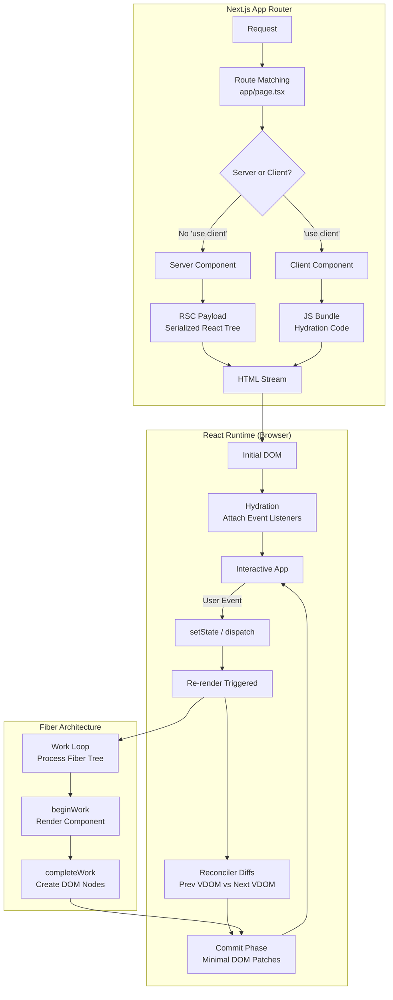

*Back to [Subject_Plan](Subject_Plan) | Part of [09 - Learning Index](09---Learning-Index)*

# 22.1 — React & Next.js: Functional Components & Hooks

> *"We're not making a framework for building UIs. We're making a language for describing UIs at any point in time."*
> — **Dan Abramov**, React Core Team (2019)

React redefined frontend development by treating the UI as a **pure function of application state**. Instead of imperatively mutating DOM nodes, you declare what the screen should look like for any given state snapshot, and React's reconciliation engine figures out the minimal set of DOM mutations required. Next.js extends this model to the server, enabling hybrid rendering strategies (SSR, SSG, ISR) through a file-system-based router and React Server Components.

This chapter builds your architectural literacy from the ground up: how the Virtual DOM works internally, what hooks actually do at the fiber level, and how Next.js App Router orchestrates server and client boundaries.

---

## 🎯 Learning Objectives

1. **Explain the Virtual DOM reconciliation algorithm** — understand how React diffs two tree snapshots and produces a minimal DOM patch set.
2. **Trace the complete lifecycle of a hook call** — from `useState` registration in the fiber linked list through re-render triggering and state resolution.
3. **Distinguish Server Components from Client Components** in Next.js App Router — understand the serialization boundary and when each is appropriate.
4. **Identify and fix common anti-patterns** — stale closures, infinite re-render loops, dependency array lies, and unnecessary effect usage.
5. **Architect a production data-fetching strategy** — choosing between `fetch` in Server Components, `useEffect` + AbortController, React Query/SWR, and Server Actions.
6. **Design a state management topology** — when to use local state, Context, Zustand, or URL state, and the performance implications of each.
7. **Configure a Next.js App Router project** for optimal performance — understanding route segments, layouts, loading states, error boundaries, and streaming SSR.

---

## 🖼️ Visual Anchor — React Reconciliation & Fiber Architecture


---

## 🧩 1. Mental Model

**React's core equation:**

$$
UI = f(state)
$$

Your entire UI is a **pure function** of the current application state. You never imperatively tell React "change this DOM node." Instead, you declare: "given this state, here is what the UI should look like." React handles the imperative DOM mutations for you.

This is a paradigm shift from jQuery/vanilla JS (imperative DOM manipulation) and even from Angular (two-way data binding with mutation tracking). React's model is **unidirectional data flow**:

```
State → Render Function → Virtual DOM → Reconciliation → Real DOM
  ↑                                                          |
  └──────────── Event Handler (setState) ←───────────────────┘
```

**Key architectural insight:** React components are not instances that persist across renders. Each render is a complete snapshot — a photograph of the UI at that moment in time. Hooks give functional components the ability to "remember" values between these snapshots by attaching state to the component's **fiber node** in React's internal tree.

**Next.js extends this model** by splitting the render function across server and client:
- **Server Components** run once on the server, produce HTML, and never ship their JavaScript to the browser.
- **Client Components** hydrate on the browser and can use hooks, event handlers, and browser APIs.

The boundary between them is the `"use client"` directive — a serialization fence that determines what code ships to the browser bundle.

---

## 📊 2. Architecture Map



---

## 📚 3. Core Concepts & Terminology

### Definition 22.1.1 — Virtual DOM (VDOM)

The Virtual DOM is a lightweight JavaScript object tree that mirrors the structure of the real DOM. Each node is a **React Element** — a plain object with `type`, `props`, and `children` fields:

```jsx
// What JSX compiles to:
const element = {
  type: 'div',
  props: {
    className: 'container',
    children: [
      { type: 'h1', props: { children: 'Hello' } },
      { type: Counter, props: { initial: 0 } }
    ]
  }
};
```

The VDOM is not a performance optimization in itself — it is an **abstraction layer** that enables React's declarative programming model. The performance comes from the reconciliation algorithm that diffs two VDOM trees efficiently.

### Definition 22.1.2 — Reconciliation (Diffing Algorithm)

Reconciliation is the process by which React compares the previous VDOM tree with the next VDOM tree and determines the minimal set of DOM operations needed. React uses two heuristics to achieve O(n) complexity (instead of O(n³) for general tree diff):

1. **Different types produce different trees.** If a `<div>` becomes a `<span>`, React destroys the entire subtree and rebuilds it.
2. **Keys identify stable elements across renders.** The `key` prop tells React which children in a list correspond to which previous children, enabling efficient reordering.

### Definition 22.1.3 — Fiber

A Fiber is React's internal unit of work. Each component instance, DOM node, or fragment in your app corresponds to a fiber node. Fibers form a linked-list tree with three pointers:

- `child` — first child fiber
- `sibling` — next sibling fiber  
- `return` — parent fiber

Fibers enable **incremental rendering** (React can pause, abort, or restart rendering work) and **concurrent features** (Suspense, transitions, streaming SSR).

### Definition 22.1.4 — Hooks (Fiber-Attached State)

Hooks are functions that let you "hook into" React's fiber state from functional components. Internally, each hook call appends a node to a **linked list** stored on the component's fiber. This is why hooks must be called in the same order every render — React identifies which hook is which by its position in the list, not by any name or key.

```jsx
// Internally, the fiber stores:
fiber.memoizedState = {
  // First hook: useState(0)
  memoizedState: 0,        // current value
  queue: { pending: null }, // update queue
  next: {
    // Second hook: useEffect(fn, [count])
    memoizedState: { destroy: cleanupFn, deps: [0] },
    next: null
  }
};
```

### Definition 22.1.5 — Server Components (RSC)

React Server Components execute exclusively on the server. They can directly access databases, file systems, and secrets without exposing them to the client. Their output is a **serialized React tree** (RSC Payload) — not HTML, but a JSON-like stream that the client-side React runtime can merge into the existing component tree.

Key constraints:
- Cannot use hooks (`useState`, `useEffect`, etc.)
- Cannot use browser APIs (`window`, `document`)
- Cannot use event handlers (`onClick`, `onChange`)
- CAN `await` async operations directly in the component body
- CAN import and render Client Components (but not vice versa for server-only data)

### Definition 22.1.6 — Hydration

Hydration is the process where client-side React "attaches" event listeners and interactivity to server-rendered HTML. React walks the existing DOM (produced by SSR), matches it against the component tree, and wires up the JavaScript without re-creating DOM nodes. If the server HTML doesn't match what the client would render, React logs a hydration mismatch warning.

---

## 🔑 4. Bare-Bones Boilerplate

### Minimal React App (No Framework)

```jsx
// main.jsx — Entry point
// createRoot is the React 18+ API that enables concurrent features.
// It replaces the legacy ReactDOM.render() which ran in synchronous mode.
import { createRoot } from 'react-dom/client';

// Grab the DOM element where React will mount its tree.
// This <div id="root"> exists in your index.html.
const container = document.getElementById('root');

// createRoot creates a concurrent root — React can now interrupt renders,
// batch state updates automatically, and use Suspense for data fetching.
const root = createRoot(container);

// root.render() kicks off the first render.
// <App /> is a React Element — React will call App() as a function,
// receive the VDOM tree it returns, and commit it to the real DOM.
root.render(<App />);

// ─── The App Component ───────────────────────────────────────────
function App() {
  // This function is called on every render. It must be pure:
  // same props + same state = same returned JSX. No side effects here.
  return (
    <main>
      <h1>Hello React</h1>
      <Counter initial={0} />
    </main>
  );
}
```

### Minimal Stateful Component with Hook

```jsx
// Counter.jsx
import { useState } from 'react';

// Props are the component's input — passed by the parent.
// They are read-only within this component.
function Counter({ initial }) {
  // useState registers a state slot on this component's fiber.
  // It returns [currentValue, setterFunction].
  // On first render: count = initial (0).
  // On subsequent renders: count = whatever was last set.
  const [count, setCount] = useState(initial);

  // Event handler. When called, setCount enqueues a state update
  // on this fiber. React schedules a re-render of this component.
  // The next render will call useState again, which returns the new value.
  function handleClick() {
    // Functional updater form: receives previous state, returns next state.
    // This is safer than setCount(count + 1) because it avoids stale closures
    // when multiple updates are batched in the same event.
    setCount(prev => prev + 1);
  }

  // JSX is syntactic sugar for React.createElement() calls.
  // This returns a VDOM tree describing what the DOM should look like.
  return (
    <div>
      <span>Count: {count}</span>
      <button onClick={handleClick}>Increment</button>
    </div>
  );
}

export default Counter;
```

### Minimal Next.js App Router Structure

```bash
# Next.js 14+ App Router file-system routing
app/
├── layout.tsx        # Root layout (wraps all pages, persists across navigation)
├── page.tsx          # Home route: "/" — this is a Server Component by default
├── loading.tsx       # Suspense fallback shown while page.tsx streams
├── error.tsx         # Error boundary (must be 'use client')
└── dashboard/
    ├── layout.tsx    # Nested layout for /dashboard/*
    └── page.tsx      # Route: "/dashboard"
```

```tsx
// app/layout.tsx — Root Layout (Server Component)
// This file is REQUIRED. It wraps every page in the app.
// It renders once and persists across client-side navigations.
export default function RootLayout({ children }: { children: React.ReactNode }) {
  return (
    <html lang="en">
      <body>
        {/* children is the current page component */}
        {children}
      </body>
    </html>
  );
}
```

```tsx
// app/page.tsx — Server Component (default, no 'use client' directive)
// This function runs on the server. It can await async operations directly.
// Its JavaScript is NEVER sent to the browser.
async function HomePage() {
  // Direct database/API access — no useEffect, no loading states needed.
  // This fetch is automatically deduped and cached by Next.js.
  const posts = await fetch('https://api.example.com/posts', {
    next: { revalidate: 60 } // ISR: revalidate every 60 seconds
  }).then(res => res.json());

  return (
    <main>
      <h1>Blog Posts</h1>
      {/* Render data directly — no loading spinner needed */}
      {posts.map(post => (
        <article key={post.id}>
          <h2>{post.title}</h2>
          <p>{post.excerpt}</p>
        </article>
      ))}
      {/* Client Component for interactivity */}
      <SearchBar />
    </main>
  );
}

export default HomePage;
```

```tsx
// app/components/SearchBar.tsx — Client Component
// The 'use client' directive marks the serialization boundary.
// Everything in this file (and its imports) ships to the browser bundle.
'use client';

import { useState, useEffect } from 'react';

export function SearchBar() {
  const [query, setQuery] = useState('');
  const [results, setResults] = useState([]);

  // useEffect runs AFTER the component mounts (commit phase).
  // It is for side effects that need browser APIs or subscriptions.
  useEffect(() => {
    if (!query) { setResults([]); return; }

    // AbortController lets us cancel the fetch if the component
    // unmounts or if query changes before the response arrives.
    const controller = new AbortController();

    fetch(`/api/search?q=${encodeURIComponent(query)}`, {
      signal: controller.signal
    })
      .then(res => res.json())
      .then(data => setResults(data))
      .catch(err => {
        // AbortError is expected when we cancel — don't treat it as a failure.
        if (err.name !== 'AbortError') console.error(err);
      });

    // Cleanup function: called when deps change or component unmounts.
    // This prevents race conditions and memory leaks.
    return () => controller.abort();
  }, [query]); // Dependency array: re-run effect only when query changes.

  return (
    <div>
      <input
        value={query}
        onChange={e => setQuery(e.target.value)}
        placeholder="Search posts..."
      />
      <ul>
        {results.map(r => <li key={r.id}>{r.title}</li>)}
      </ul>
    </div>
  );
}
```

---


## 🔍 5. Lifecycle & Data Flow Deep Dive

### What Happens When a User Clicks the Increment Button

Let's trace the complete journey from click to pixels, step by step:

**Step 1: Browser Event Dispatch**
The browser fires a native `click` event on the `<button>` DOM node. React's event delegation system (attached to the root container) captures this event.

**Step 2: React Synthetic Event**
React wraps the native event in a `SyntheticEvent` object (for cross-browser normalization) and calls your `handleClick` function.

**Step 3: State Update Enqueued**
`setCount(prev => prev + 1)` does NOT immediately change `count`. It enqueues an update object on the fiber's update queue:
```jsx
// Simplified internal representation
fiber.updateQueue.push({
  action: prev => prev + 1,  // The updater function you passed
  lane: DefaultLane,          // Priority level
});
```

**Step 4: Re-render Scheduled**
React marks this fiber (and its ancestors) as "dirty" and schedules a re-render. In concurrent mode, this may be batched with other updates in the same event handler.

**Step 5: Render Phase Begins (Pure, Interruptible)**
React's work loop processes the fiber tree top-down:
1. Starts at the root fiber, walks down to the dirty fiber.
2. Calls `Counter({ initial: 0 })` — your component function executes again.
3. `useState` is called — React reads the update queue, applies `prev => prev + 1` to get `1`, returns `[1, setCount]`.
4. Your function returns new JSX (a new VDOM snapshot).

**Step 6: Reconciliation (Diffing)**
React compares the previous VDOM output of `Counter` with the new output:
```
Previous: <span>Count: 0</span>
Next:     <span>Count: 1</span>
```
Same element type (`span`), same position → React keeps the DOM node, only updates the text content. The `<button>` is identical → no change needed.

**Step 7: Commit Phase (Synchronous, Non-interruptible)**
React applies the collected mutations to the real DOM in a single synchronous batch:
```javascript
// Internally, something like:
spanElement.textContent = 'Count: 1';
```

**Step 8: Post-Commit Effects**
After DOM mutation:
1. `useLayoutEffect` callbacks run (synchronous, blocks paint — use sparingly).
2. Browser paints the new pixels to screen.
3. `useEffect` callbacks run (asynchronous, after paint — most effects go here).

### The useEffect Lifecycle in Detail

```jsx
useEffect(() => {
  // === SETUP PHASE ===
  // Runs AFTER the DOM has been committed and painted.
  // This is where you subscribe, fetch, or set up timers.
  const subscription = eventBus.subscribe(handler);

  // === CLEANUP PHASE ===
  // Returned function runs:
  //   1. Before the effect re-runs (when deps change)
  //   2. When the component unmounts
  return () => {
    subscription.unsubscribe();
  };
}, [dep1, dep2]);
// Dependency array: React shallow-compares each dep with its previous value.
// Effect re-runs only if Object.is(prevDep, nextDep) returns false for any dep.
```

**Timing diagram:**

```
Mount:    render → commit DOM → paint → useEffect setup
Update:   render → commit DOM → paint → useEffect cleanup (prev) → useEffect setup (next)
Unmount:  useEffect cleanup (final)
```

### Server Component Data Flow (Next.js App Router)

```
1. Request arrives at server
2. Next.js matches route → finds page.tsx (Server Component)
3. Server executes component function (can await DB queries)
4. Server serializes output as RSC Payload (streaming JSON)
5. Client receives stream, React reconstructs component tree
6. Client Components in the tree hydrate (attach JS interactivity)
7. Subsequent navigations: client fetches RSC Payload via fetch, merges into existing tree
```

The critical insight: Server Components **never re-render on the client**. They produce static output that the client treats as immutable. Only Client Components participate in the client-side reconciliation cycle.

---

## ⚠️ 6. Gotchas & Anti-Patterns

### Anti-Pattern 8.1.1 — Infinite Re-render Loop

```jsx
// ❌ BUG: This creates an infinite loop
function BadComponent() {
  const [data, setData] = useState(null);

  // Problem: No dependency array → runs after EVERY render.
  // setData triggers re-render → useEffect runs again → setData → re-render → ...
  useEffect(() => {
    fetch('/api/data').then(r => r.json()).then(setData);
  }); // ← Missing dependency array!

  return <div>{data?.name}</div>;
}

// ✅ FIX: Add empty dependency array (run once on mount)
function GoodComponent() {
  const [data, setData] = useState(null);

  useEffect(() => {
    fetch('/api/data').then(r => r.json()).then(setData);
  }, []); // ← Empty array = run only on mount

  return <div>{data?.name}</div>;
}
```

**Why this happens:** Without a dependency array, `useEffect` runs after every render. If the effect updates state, it triggers another render, which triggers the effect again — an infinite cycle. React will eventually throw a "Maximum update depth exceeded" error.

### Anti-Pattern 8.1.2 — Stale Closure

```jsx
// ❌ BUG: count is captured at the time the interval was created
function StaleCounter() {
  const [count, setCount] = useState(0);

  useEffect(() => {
    const id = setInterval(() => {
      // This closure captures count = 0 forever.
      // It never sees updated values because the effect
      // never re-runs (empty deps).
      console.log(count); // Always 0!
      setCount(count + 1); // Always sets to 1!
    }, 1000);
    return () => clearInterval(id);
  }, []); // ← count is not in deps, so closure is stale

  return <span>{count}</span>;
}

// ✅ FIX: Use functional updater (doesn't need current value in closure)
function FixedCounter() {
  const [count, setCount] = useState(0);

  useEffect(() => {
    const id = setInterval(() => {
      // Functional updater receives the CURRENT state as argument.
      // No closure dependency on count.
      setCount(prev => prev + 1);
    }, 1000);
    return () => clearInterval(id);
  }, []); // ← Safe: we don't read count inside the effect

  return <span>{count}</span>;
}
```

**Why this happens:** JavaScript closures capture variables by reference at the time the closure is created. When `useEffect` runs with `[]` deps, the closure inside `setInterval` permanently captures the `count` value from that initial render (0). It never sees future values.

### Anti-Pattern 8.1.3 — Object/Array in Dependency Array

```jsx
// ❌ BUG: New object reference every render → effect runs every render
function FilteredList({ items }) {
  const [filtered, setFiltered] = useState([]);

  // options is a NEW object on every render (different reference).
  // React sees deps changed → re-runs effect → infinite loop risk.
  const options = { sortBy: 'name', limit: 10 };

  useEffect(() => {
    setFiltered(applyFilter(items, options));
  }, [items, options]); // ← options is new every render!

  return <ul>{filtered.map(i => <li key={i.id}>{i.name}</li>)}</ul>;
}

// ✅ FIX: Memoize the object or move it inside the effect
function FixedFilteredList({ items }) {
  const [filtered, setFiltered] = useState([]);

  // useMemo returns the same object reference unless deps change.
  const options = useMemo(() => ({ sortBy: 'name', limit: 10 }), []);

  useEffect(() => {
    setFiltered(applyFilter(items, options));
  }, [items, options]); // ← options is now stable

  return <ul>{filtered.map(i => <li key={i.id}>{i.name}</li>)}</ul>;
}
```

**Why this happens:** React uses `Object.is()` to compare dependency values. Two objects with identical contents are still different references (`{} !== {}`). Every render creates a new object, so React thinks the dependency changed.

### Anti-Pattern 8.1.4 — Unnecessary useEffect (Derived State)

```jsx
// ❌ BAD: Using effect to compute derived state
function ProductList({ products }) {
  const [total, setTotal] = useState(0);

  // This is an unnecessary render cycle:
  // Render 1: products arrive, total = 0 (wrong)
  // Effect runs: setTotal(sum) → triggers Render 2
  // Render 2: total = correct value
  // User sees a flash of 0 before the correct total.
  useEffect(() => {
    setTotal(products.reduce((sum, p) => sum + p.price, 0));
  }, [products]);

  return <span>Total: ${total}</span>;
}

// ✅ FIX: Compute during render (no effect, no extra state)
function ProductList({ products }) {
  // Derived values should be computed directly during render.
  // No state needed — this recalculates when products changes.
  const total = products.reduce((sum, p) => sum + p.price, 0);

  // If the computation is expensive, wrap in useMemo:
  // const total = useMemo(() => products.reduce(...), [products]);

  return <span>Total: ${total}</span>;
}
```

**The rule:** If you can compute something from existing props/state during render, do it during render. `useEffect` is for **synchronizing with external systems** (APIs, subscriptions, DOM measurements), not for transforming data.

### Anti-Pattern 8.1.5 — Prop Drilling vs. Context Overuse

```jsx
// ❌ Prop drilling: passing theme through 5 levels of components
<App theme={theme}>
  <Layout theme={theme}>
    <Sidebar theme={theme}>
      <NavItem theme={theme}>
        <Icon theme={theme} />  {/* Finally used here */}

// ❌ Context overuse: putting everything in one giant context
const AppContext = createContext();
// Every state change re-renders ALL consumers, even if they only need one field.

// ✅ FIX: Split contexts by update frequency
const ThemeContext = createContext();  // Rarely changes
const UserContext = createContext();   // Changes on login/logout
const CartContext = createContext();   // Changes frequently
// OR use Zustand/Jotai for fine-grained subscriptions (see Section 8)
```

---

## 🧮 7. Worked Patterns

### Pattern 8.1.A — Data Fetching with AbortController & Race Condition Prevention

<details>
<summary>🔍 Complete Implementation</summary>

**Problem:** Fetch data when a component mounts or when a dependency changes. Handle: loading states, errors, race conditions (user navigates away mid-fetch), and component unmount cleanup.

```jsx
import { useState, useEffect } from 'react';

function UserProfile({ userId }) {
  const [user, setUser] = useState(null);
  const [loading, setLoading] = useState(true);
  const [error, setError] = useState(null);

  useEffect(() => {
    // Reset state when userId changes (new fetch starting)
    setLoading(true);
    setError(null);

    // AbortController: Web API that lets us cancel in-flight fetch requests.
    // Each effect invocation gets its own controller.
    const controller = new AbortController();

    async function fetchUser() {
      try {
        const response = await fetch(`/api/users/${userId}`, {
          signal: controller.signal, // Link fetch to this controller
        });

        if (!response.ok) {
          throw new Error(`HTTP ${response.status}: ${response.statusText}`);
        }

        const data = await response.json();

        // Only update state if this fetch wasn't aborted.
        // (If userId changed, the cleanup ran and aborted this fetch,
        //  so we'd hit the catch block instead of reaching here.)
        setUser(data);
        setLoading(false);
      } catch (err) {
        if (err.name === 'AbortError') {
          // Expected: the cleanup function aborted this fetch.
          // Do nothing — a new fetch for the new userId is already running.
          return;
        }
        // Actual error: network failure, server error, etc.
        setError(err.message);
        setLoading(false);
      }
    }

    fetchUser();

    // Cleanup: abort this fetch if userId changes or component unmounts.
    // This prevents:
    //   1. Race conditions (old fetch resolving after new one)
    //   2. Memory leaks (setting state on unmounted component)
    return () => controller.abort();
  }, [userId]); // Re-run when userId changes

  if (loading) return <div>Loading...</div>;
  if (error) return <div>Error: {error}</div>;
  return <div><h1>{user.name}</h1><p>{user.email}</p></div>;
}
```

**Why AbortController matters:** Without it, if `userId` changes rapidly (1 → 2 → 3), three fetches fire. If fetch-for-1 resolves last (network jitter), it overwrites the correct data for userId=3. AbortController ensures only the latest fetch's response is used.

</details>

### Pattern 8.1.B — Debounced Search Input

<details>
<summary>🔍 Complete Implementation</summary>

**Problem:** Search as the user types, but don't fire an API call on every keystroke. Wait until the user pauses typing for 300ms.

```jsx
import { useState, useEffect, useMemo } from 'react';

// Custom hook: encapsulates the debounce logic for reuse.
function useDebounce(value, delay) {
  const [debouncedValue, setDebouncedValue] = useState(value);

  useEffect(() => {
    // Set a timer to update the debounced value after `delay` ms.
    const timer = setTimeout(() => {
      setDebouncedValue(value);
    }, delay);

    // Cleanup: if `value` changes before the timer fires,
    // clear the old timer. This resets the countdown.
    return () => clearTimeout(timer);
  }, [value, delay]);

  return debouncedValue;
}

function SearchPage() {
  const [query, setQuery] = useState('');
  const [results, setResults] = useState([]);
  const [loading, setLoading] = useState(false);

  // query updates on every keystroke.
  // debouncedQuery only updates 300ms after the user stops typing.
  const debouncedQuery = useDebounce(query, 300);

  useEffect(() => {
    if (!debouncedQuery.trim()) {
      setResults([]);
      return;
    }

    const controller = new AbortController();
    setLoading(true);

    fetch(`/api/search?q=${encodeURIComponent(debouncedQuery)}`, {
      signal: controller.signal,
    })
      .then(res => res.json())
      .then(data => { setResults(data); setLoading(false); })
      .catch(err => {
        if (err.name !== 'AbortError') { setLoading(false); }
      });

    return () => controller.abort();
  }, [debouncedQuery]); // Only fires when debounced value settles

  return (
    <div>
      <input
        value={query}
        onChange={e => setQuery(e.target.value)}
        placeholder="Search..."
      />
      {loading && <p>Searching...</p>}
      <ul>
        {results.map(r => <li key={r.id}>{r.title}</li>)}
      </ul>
    </div>
  );
}
```

**Timing trace:**
```
User types: "r" → "re" → "rea" → "reac" → "react"
                                                    ↓ (300ms pause)
                                              debouncedQuery = "react"
                                              → fetch fires once
```

</details>

### Pattern 8.1.C — SSR vs CSR vs SSG Decision Tree

<details>
<summary>🔍 Decision Framework</summary>

**When to use each rendering strategy in Next.js App Router:**

```
┌─ Does the page need user-specific data (auth, preferences)?
│  ├─ YES → Does it need to be SEO-indexed?
│  │  ├─ YES → SSR (Server-Side Rendering)
│  │  │         Use: async Server Component with cookies()/headers()
│  │  │         Example: User dashboard that search engines should index
│  │  └─ NO  → CSR (Client-Side Rendering)
│  │            Use: 'use client' + useEffect or React Query
│  │            Example: Admin panel, internal tools
│  └─ NO  → Is the data updated frequently (< 1 hour)?
│     ├─ YES → ISR (Incremental Static Regeneration)
│     │         Use: fetch with { next: { revalidate: 3600 } }
│     │         Example: Product pages, blog posts
│     └─ NO  → SSG (Static Site Generation)
│              Use: No dynamic functions, all data fetched at build time
│              Example: Marketing pages, documentation
```

**Implementation examples:**

```tsx
// SSG — Generated at build time, served as static HTML
// No dynamic functions (cookies, headers, searchParams) used
export default async function AboutPage() {
  const content = await fetchCMS('/about'); // Fetched at build time
  return <article>{content.body}</article>;
}

// ISR — Static but revalidates periodically
export default async function ProductPage({ params }) {
  const product = await fetch(`https://api.store.com/products/${params.id}`, {
    next: { revalidate: 3600 } // Regenerate every hour
  }).then(r => r.json());
  return <ProductDisplay product={product} />;
}

// SSR — Fresh on every request (opt-in via dynamic functions)
import { cookies } from 'next/headers';
export default async function DashboardPage() {
  const session = cookies().get('session'); // Forces SSR
  const userData = await fetchUserData(session.value);
  return <Dashboard user={userData} />;
}

// CSR — Rendered entirely on the client
'use client';
export default function AdminPanel() {
  const { data, isLoading } = useSWR('/api/admin/stats', fetcher);
  if (isLoading) return <Skeleton />;
  return <StatsGrid data={data} />;
}
```

</details>

### Pattern 8.1.D — Zustand Store with Selectors (Avoiding Re-renders)

<details>
<summary>🔍 Complete Implementation</summary>

**Problem:** Global state that multiple components subscribe to, but each component should only re-render when the specific slice it uses changes.

```jsx
// store.js — Zustand store definition
import { create } from 'zustand';

// create() returns a hook. The function you pass receives `set` and `get`.
// `set` merges partial state (like setState in class components).
// `get` reads current state without subscribing.
const useStore = create((set, get) => ({
  // State
  count: 0,
  user: null,
  items: [],

  // Actions (functions that call set to update state)
  increment: () => set(state => ({ count: state.count + 1 })),
  decrement: () => set(state => ({ count: state.count - 1 })),
  setUser: (user) => set({ user }),
  addItem: (item) => set(state => ({ items: [...state.items, item] })),

  // Async action
  fetchUser: async (id) => {
    const res = await fetch(`/api/users/${id}`);
    const user = await res.json();
    set({ user });
  },
}));

// ─── Component Usage with Selectors ─────────────────────────────

// ✅ GOOD: Selector extracts only what this component needs.
// This component re-renders ONLY when count changes.
function CountDisplay() {
  const count = useStore(state => state.count);
  return <span>{count}</span>;
}

// ✅ GOOD: Different selector, different subscription.
// This component re-renders ONLY when user changes.
function UserGreeting() {
  const user = useStore(state => state.user);
  return <h1>Hello, {user?.name ?? 'Guest'}</h1>;
}

// ❌ BAD: No selector → subscribes to entire store.
// Re-renders on ANY state change (count, user, items, anything).
function BadComponent() {
  const store = useStore(); // Don't do this
  return <span>{store.count}</span>;
}

// ✅ Multiple values: use shallow comparison for object selectors
import { shallow } from 'zustand/shallow';

function CartSummary() {
  const { items, count } = useStore(
    state => ({ items: state.items, count: state.count }),
    shallow // Prevents re-render if the selected object is shallowly equal
  );
  return <div>{items.length} items, count: {count}</div>;
}

export default useStore;
```

**Why Zustand over Context:** React Context re-renders ALL consumers when the provider value changes, even if a consumer only uses one field. Zustand uses external subscriptions with selectors — each component subscribes to exactly the state slice it needs.

</details>

### Pattern 8.1.E — React.memo + useCallback for Expensive Child Components

<details>
<summary>🔍 Complete Implementation</summary>

**Problem:** A parent re-renders frequently (e.g., typing in an input), but a child component is expensive to render and its props haven't actually changed.

```jsx
import { useState, useCallback, memo } from 'react';

// memo() wraps a component to skip re-rendering if props haven't changed.
// It performs a shallow comparison of all props.
const ExpensiveChart = memo(function ExpensiveChart({ data, onPointClick }) {
  console.log('ExpensiveChart rendered'); // Should only log when data/onPointClick changes
  // Imagine this does heavy SVG/Canvas rendering
  return (
    
  );
});

function Dashboard() {
  const [filter, setFilter] = useState('');
  const [chartData] = useState(() => generateChartData()); // Expensive init, runs once

  // useCallback memoizes the function reference.
  // Without it, a new function is created every render,
  // which would defeat memo() on ExpensiveChart (new prop reference = re-render).
  const handlePointClick = useCallback((point) => {
    console.log('Clicked:', point);
  }, []); // Empty deps: function never changes

  return (
    <div>
      {/* This input causes Dashboard to re-render on every keystroke */}
      <input value={filter} onChange={e => setFilter(e.target.value)} />

      {/* But ExpensiveChart won't re-render because:
          1. chartData reference is stable (useState)
          2. handlePointClick reference is stable (useCallback)
          3. memo() sees same props → skips render */}
      <ExpensiveChart data={chartData} onPointClick={handlePointClick} />
    </div>
  );
}
```

**When NOT to use memo:** Don't wrap every component in `memo()`. The shallow comparison itself has a cost. Only use it when:
1. The component renders often with the same props, AND
2. The component's render is expensive (complex DOM, heavy computation).

</details>

---


## 💻 8. Production-Grade Stack Checklist

### State Management

| Need | Solution | Why |
|------|----------|-----|
| Local UI state (form inputs, toggles) | `useState` / `useReducer` | Simplest; co-located with component |
| Shared state across siblings | Lift state up to common parent | React's built-in composition model |
| Global app state (auth, theme) | Zustand or Jotai | Fine-grained subscriptions, no provider nesting |
| Server cache (API data) | TanStack Query (React Query) or SWR | Handles caching, deduplication, revalidation, optimistic updates |
| URL state (filters, pagination) | `useSearchParams` (Next.js) or `nuqs` | Shareable, bookmarkable, SSR-compatible |
| Complex state machines | XState or `useReducer` | Explicit states/transitions prevent impossible states |

### Testing Strategy

```bash
# Unit tests: individual hooks and utility functions
vitest + @testing-library/react

# Component tests: render components, simulate user interaction
@testing-library/react + user-event

# Integration tests: full page renders with mocked API
MSW (Mock Service Worker) + @testing-library/react

# E2E tests: real browser, real (or staged) backend
Playwright (preferred over Cypress for speed and reliability)
```

```tsx
// Example: Testing a hook with @testing-library/react
import { renderHook, act } from '@testing-library/react';
import { useDebounce } from './useDebounce';

test('debounces value updates', async () => {
  jest.useFakeTimers();
  const { result, rerender } = renderHook(
    ({ value }) => useDebounce(value, 300),
    { initialProps: { value: 'hello' } }
  );

  // Initially returns the value immediately
  expect(result.current).toBe('hello');

  // Update the value
  rerender({ value: 'world' });

  // Before delay: still old value
  expect(result.current).toBe('hello');

  // After delay: updated
  act(() => jest.advanceTimersByTime(300));
  expect(result.current).toBe('world');
});
```

### Build Pipeline

```bash
# Next.js production build
next build          # Analyzes routes, generates static pages, bundles client JS
next start          # Starts production server (Node.js)

# Key optimizations (automatic in Next.js 14+):
# - Tree shaking: dead code elimination via ESM imports
# - Code splitting: each route gets its own JS bundle
# - Image optimization: next/image with automatic WebP/AVIF
# - Font optimization: next/font eliminates layout shift
# - Bundle analysis: ANALYZE=true next build (with @next/bundle-analyzer)
```

### Observability

| Layer | Tool | What It Captures |
|-------|------|-----------------|
| Error tracking | Sentry | Runtime exceptions, component stack traces, replay |
| Performance | Vercel Analytics or Web Vitals | LCP, FID, CLS, TTFB per route |
| Logging | Pino (server) + structured JSON | Request traces, API latency, error context |
| Feature flags | LaunchDarkly or Statsig | A/B tests, gradual rollouts, kill switches |

### Deployment Checklist

- [ ] `next.config.js`: Enable `output: 'standalone'` for Docker deployments
- [ ] Environment variables: Use `.env.local` (gitignored) + platform env vars
- [ ] CSP headers: Configure `Content-Security-Policy` in `next.config.js` headers
- [ ] Rate limiting: Middleware-based rate limiting for API routes
- [ ] Cache headers: Set `Cache-Control` for static assets and ISR pages
- [ ] Error boundaries: Every route segment has an `error.tsx`
- [ ] Loading states: Every async route has a `loading.tsx` or Suspense boundary

---

## 🔗 9. Cross-links & Further Reading

### Internal Vault Links

- [22.2 - Angular - Class-based Architecture & RxJS](22.2---Angular---Class-based-Architecture-&-RxJS) — Compare React's unidirectional flow with Angular's two-way binding and zone-based change detection.
- [22.3 - Vite & Modern Build Tools](22.3---Vite-&-Modern-Build-Tools) — Understand the bundler that powers React development (Vite replaces Create React App).
- [22.5 - Flutter & Dart - Widget Tree, Isolates & Custom Painters](22.5---Flutter-&-Dart---Widget-Tree,-Isolates-&-Custom-Painters) — Flutter's widget tree is conceptually similar to React's component tree, but with a three-layer architecture (Widget → Element → RenderObject).
- [23.5 - Transformer Architectures & LLMs](23.5---Transformer-Architectures-&-LLMs) — AI-frontend integration: streaming LLM responses into React components via Server-Sent Events.

### Official Documentation

- **React docs:** https://react.dev — The new interactive docs with sandboxes for every concept.
- **Next.js docs:** https://nextjs.org/docs — App Router, Server Components, data fetching patterns.
- **Zustand:** https://github.com/pmndrs/zustand — Minimal state management with selectors.
- **TanStack Query:** https://tanstack.com/query — Server state management (caching, deduplication, background refetching).

### Conference Talks & Deep Dives

- Dan Abramov, *"A Complete Guide to useEffect"* (overreacted.io, 2019) — The definitive mental model for effects.
- Andrew Clark, *"React Fiber Architecture"* (GitHub gist) — Internal architecture of the fiber reconciler.
- React Conf 2024, *"React Server Components"* — Official RSC architecture talk.
- Lee Robinson, *"Next.js App Router: Routing, Data Fetching, Caching"* (Vercel YouTube, 2023).

### Key Mental Models to Remember

1. **Each render is a snapshot.** Props, state, and event handlers all belong to a particular render. They don't "change" — you get new ones on the next render.
2. **Effects synchronize with external systems.** They are not "lifecycle methods." They are not "componentDidMount." They are synchronization points between your React tree and something outside it.
3. **The dependency array is not an optimization.** It tells React the semantic meaning of your effect: "this effect depends on these values." Lying about dependencies creates bugs.
4. **Server Components are not SSR.** SSR renders Client Components to HTML on the server. Server Components never ship their code to the client at all — they are a fundamentally different execution model.

---

*Next: [22.2 - Angular - Class-based Architecture & RxJS](22.2---Angular---Class-based-Architecture-&-RxJS) →*
