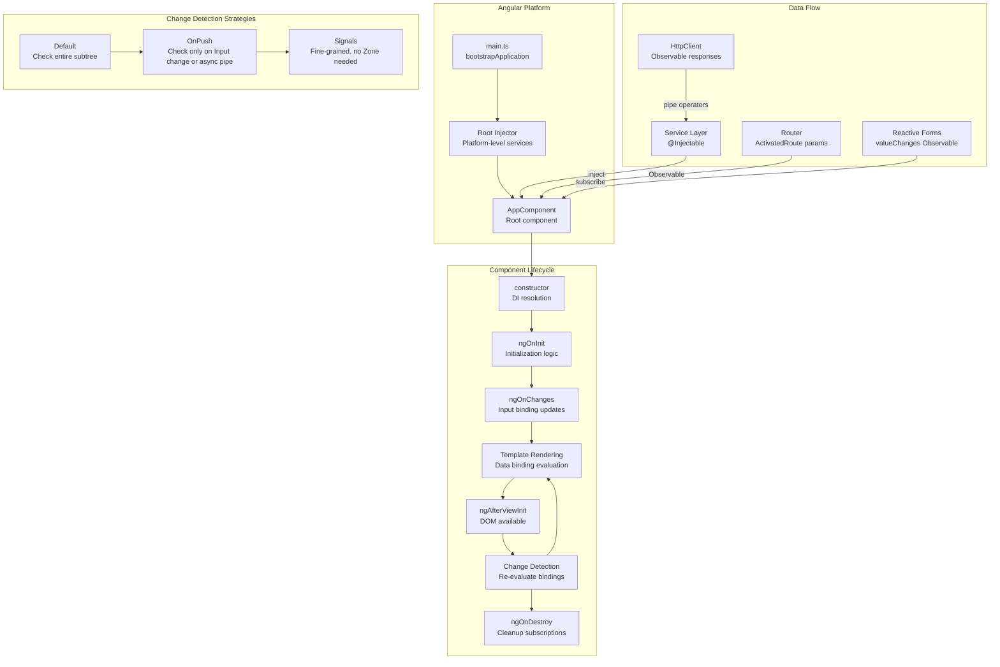

*Back to [Subject_Plan](Subject_Plan) | Part of [09 - Learning Index](09---Learning-Index)*

# 22.2 — Angular: Class-based Architecture & RxJS

> *"Angular is not just a framework — it's a platform. It gives you everything you need to build large-scale applications with confidence: dependency injection, routing, forms, HTTP, testing, and internationalization — all designed to work together."*
> — **Misko Hevery**, Creator of Angular (2016)

Angular is a **heavyweight, opinionated platform** for building enterprise-scale web applications. Where React gives you a view library and lets you choose everything else, Angular provides a complete, integrated solution: a module system, dependency injection container, reactive forms, HTTP client, router, animation system, and testing utilities — all maintained by a single team at Google.

The architectural philosophy is fundamentally different from React: Angular uses **classes with decorators** (not functions with hooks), **two-way data binding** (not unidirectional flow), **RxJS Observables** (not promises/async-await as primary), and **zone-based change detection** (not explicit setState calls). Understanding these differences is essential for architectural literacy.

---

## 🎯 Learning Objectives

1. **Explain Angular's dependency injection hierarchy** — understand how the injector tree mirrors the component tree and how `providedIn` scoping works.
2. **Trace the change detection cycle** — from Zone.js monkey-patching async APIs through dirty-checking the component tree to DOM updates.
3. **Architect reactive data flows with RxJS** — compose Observables using operators (`switchMap`, `combineLatest`, `takeUntilDestroyed`) without creating memory leaks.
4. **Implement Angular Signals** — the new reactive primitive that enables fine-grained reactivity without Zone.js overhead.
5. **Design standalone components** — the modern Angular pattern that eliminates NgModules for simpler, tree-shakeable applications.
6. **Identify and prevent common Angular anti-patterns** — subscription leaks, change detection performance traps, circular DI dependencies, and over-engineered service layers.
7. **Configure a production Angular application** — lazy-loaded routes, preloading strategies, SSR with Angular Universal, and build optimization.

---

## 🖼️ Visual Anchor — Angular Runtime Architecture


---

## 🧩 1. Mental Model

**Angular's core metaphor: Heavyweight MVC Platform with Zone-based Reactivity**

Angular is an **opinionated, batteries-included platform** that enforces structure through:

1. **Decorators + Classes** — Components, services, pipes, and directives are TypeScript classes annotated with metadata decorators (`@Component`, `@Injectable`, `@Pipe`).
2. **Dependency Injection (DI)** — A hierarchical injector tree provides services to components. You never `new` a service — you declare it as a constructor parameter and Angular resolves it.
3. **Zone.js Change Detection** — Angular monkey-patches every async browser API (`setTimeout`, `Promise.then`, `addEventListener`, `XHR`). When any async operation completes, Angular knows "something might have changed" and runs change detection top-down through the entire component tree.
4. **RxJS as First-Class Citizen** — The HTTP client returns Observables. The router emits Observables. Forms emit Observables. Angular is deeply integrated with reactive streams.
5. **Signals (Angular 16+)** — A new fine-grained reactivity primitive that enables targeted updates without Zone.js overhead, moving Angular toward a React-like "only re-render what changed" model.

```
User Event → Zone.js intercepts → Triggers Change Detection →
  Root Component checked → Child components checked (top-down) →
    Template bindings re-evaluated → DOM updated where values differ
```

**Contrast with React:**
| Aspect | React | Angular |
|--------|-------|---------|
| Reactivity trigger | Explicit `setState` | Implicit (Zone.js detects async completion) |
| Component model | Functions + hooks | Classes + decorators (or standalone functions) |
| Data flow | Unidirectional (props down, events up) | Two-way binding available (`[(ngModel)]`) |
| State management | External (Zustand, Redux) | Built-in (Services + RxJS + Signals) |
| Template language | JSX (JavaScript expressions) | HTML templates with Angular-specific syntax |
| Bundle | You choose everything | Platform provides everything |

---

## 📊 2. Architecture Map



---

## 📚 3. Core Concepts & Terminology

### Definition 22.2.1 — Zone.js and NgZone

Zone.js is a library that **monkey-patches all asynchronous browser APIs** (setTimeout, Promise, addEventListener, XHR, fetch, requestAnimationFrame, WebSocket, MutationObserver). It wraps each async operation in a "zone" — an execution context that Angular uses to know when async work completes.

```typescript
// What Zone.js does conceptually (simplified):
const originalSetTimeout = window.setTimeout;
window.setTimeout = function(callback, delay) {
  return originalSetTimeout(() => {
    callback();
    // After ANY async callback completes, notify Angular:
    ngZone.onMicrotaskEmpty.emit(); // → triggers change detection
  }, delay);
};
```

**NgZone** is Angular's wrapper around Zone.js. It provides:
- `NgZone.run(fn)` — Execute code inside Angular's zone (triggers CD after).
- `NgZone.runOutsideAngular(fn)` — Execute code outside the zone (no CD triggered). Use this for performance-critical animations or frequent events (mousemove, scroll) that don't affect the UI.

### Definition 22.2.2 — Change Detection (CD)

Change detection is Angular's process of checking whether component template bindings have changed and updating the DOM accordingly. It runs **synchronously, top-down** through the entire component tree:

1. Start at the root component.
2. For each component, evaluate all template expressions (`{{ value }}`, `[prop]="expr"`, `(event)="handler()"`).
3. Compare current values with previous values (dirty checking).
4. If different, update the DOM.
5. Move to child components and repeat.

**Two strategies:**
- `ChangeDetectionStrategy.Default` — Check this component whenever CD runs (every async event in the app).
- `ChangeDetectionStrategy.OnPush` — Only check this component when: (a) an `@Input()` reference changes, (b) an event handler in this component fires, (c) an Observable piped through `| async` emits, or (d) `markForCheck()` is called manually.

### Definition 22.2.3 — Dependency Injection (DI) Hierarchy

Angular's DI system is a **hierarchical tree of injectors** that mirrors the component tree. When a component requests a service via its constructor, Angular walks up the injector tree until it finds a provider:

```typescript
// Service declaration — providedIn: 'root' means singleton across the app
@Injectable({ providedIn: 'root' })
export class AuthService {
  private currentUser = signal<User | null>(null);
  // ...
}

// Component requests the service — Angular resolves it from the injector tree
@Component({ /* ... */ })
export class ProfileComponent {
  // Angular sees AuthService in the constructor and looks up the injector tree.
  // Since AuthService is providedIn: 'root', it finds the singleton instance.
  constructor(private auth: AuthService) {}
}
```

**Injector levels:**
1. **Platform Injector** — Shared across multiple Angular apps on the same page.
2. **Root Injector** — App-wide singletons (`providedIn: 'root'`).
3. **Component Injector** — Per-component instances (declared in `providers: []` on the component).

### Definition 22.2.4 — RxJS Observable

An Observable is a **lazy, push-based collection** that can emit zero or more values over time, and may or may not complete. Unlike Promises (which resolve once), Observables can emit multiple values (streams).

```typescript
// Observable creation and subscription
import { Observable, interval, of, from } from 'rxjs';
import { map, filter, switchMap, takeUntil } from 'rxjs/operators';

// interval emits 0, 1, 2, 3, ... every 1000ms (never completes)
const counter$ = interval(1000);

// Operators transform the stream (functional composition)
const evenDoubled$ = counter$.pipe(
  filter(n => n % 2 === 0),  // Only pass even numbers
  map(n => n * 2),            // Double each value
);

// subscribe() starts the stream (Observables are lazy — nothing happens until subscribed)
const subscription = evenDoubled$.subscribe({
  next: value => console.log(value),  // Called for each emitted value
  error: err => console.error(err),   // Called if stream errors
  complete: () => console.log('Done'), // Called when stream completes
});

// CRITICAL: Unsubscribe to prevent memory leaks
subscription.unsubscribe();
```

### Definition 22.2.5 — Angular Signals (v16+)

Signals are Angular's new **fine-grained reactivity primitive**. A signal is a wrapper around a value that notifies consumers when it changes — without Zone.js, without dirty-checking the entire tree.

```typescript
import { signal, computed, effect } from '@angular/core';

// signal() creates a reactive value. Reading it returns the current value.
const count = signal(0);
console.log(count()); // 0 — call it like a function to read

// Mutate with .set(), .update(), or .mutate()
count.set(5);
count.update(prev => prev + 1); // 6

// computed() derives a value that auto-updates when dependencies change
const doubled = computed(() => count() * 2); // 12

// effect() runs side effects when signals it reads change
effect(() => {
  console.log(`Count is now: ${count()}`);
  // Automatically re-runs whenever count changes
  // No dependency array needed — Angular tracks which signals were read
});
```

### Definition 22.2.6 — Standalone Components (Angular 14+)

Standalone components eliminate the need for `NgModule` declarations. They are self-contained units that declare their own imports:

```typescript
@Component({
  selector: 'app-user-card',
  standalone: true, // No NgModule needed
  imports: [CommonModule, RouterLink], // Declare dependencies directly
  template: `
    <div class="card">
      <h2>{{ user().name }}</h2>
      <a [routerLink]="['/users', user().id]">View Profile</a>
    </div>
  `,
})
export class UserCardComponent {
  user = input.required<User>(); // Signal-based input (Angular 17+)
}
```

---

## 🔑 4. Bare-Bones Boilerplate

### Minimal Angular Application (Standalone, No NgModule)

```typescript
// main.ts — Application entry point
// bootstrapApplication replaces the old NgModule-based bootstrapping.
// It creates the root injector and renders the root component.
import { bootstrapApplication } from '@angular/platform-browser';
import { AppComponent } from './app/app.component';
import { provideRouter } from '@angular/router';
import { provideHttpClient } from '@angular/common/http';
import { routes } from './app/app.routes';

// Application-level providers are passed here (replaces AppModule providers array)
bootstrapApplication(AppComponent, {
  providers: [
    provideRouter(routes),      // Configures the Angular Router
    provideHttpClient(),        // Makes HttpClient available for injection
  ],
}).catch(err => console.error(err));
```

```typescript
// app/app.component.ts — Root Component
import { Component } from '@angular/core';
import { RouterOutlet } from '@angular/router';

@Component({
  selector: 'app-root',        // CSS selector that matches <app-root> in index.html
  standalone: true,             // Self-contained, no NgModule
  imports: [RouterOutlet],      // Declares which directives/components this template uses
  template: `
    <header>
      <h1>My Angular App</h1>
      <nav>
        <a routerLink="/">Home</a>
        <a routerLink="/dashboard">Dashboard</a>
      </nav>
    </header>
    <!-- RouterOutlet renders the component for the current route -->
    <router-outlet />
  `,
})
export class AppComponent {}
// The class body is empty because this component has no state or logic.
// It serves purely as a layout shell.
```

```typescript
// app/app.routes.ts — Route configuration
import { Routes } from '@angular/router';

export const routes: Routes = [
  {
    path: '',
    // loadComponent: lazy-loads the component (code-splitting at route level)
    loadComponent: () => import('./home/home.component').then(m => m.HomeComponent),
  },
  {
    path: 'dashboard',
    loadComponent: () => import('./dashboard/dashboard.component').then(m => m.DashboardComponent),
    // canActivate: route guard (see examples file for implementation)
  },
];
```

```typescript
// app/home/home.component.ts — A page component with signals
import { Component, signal, computed } from '@angular/core';

@Component({
  selector: 'app-home',
  standalone: true,
  template: `
    <main>
      <h2>Counter: {{ count() }}</h2>
      <p>Doubled: {{ doubled() }}</p>
      <button (click)="increment()">+1</button>
      <button (click)="decrement()">-1</button>
    </main>
  `,
})
export class HomeComponent {
  // signal() creates a reactive state container.
  // In the template, count() is called as a function to read the value.
  count = signal(0);

  // computed() automatically tracks which signals it reads.
  // It re-evaluates only when count changes.
  doubled = computed(() => this.count() * 2);

  increment() {
    // update() receives the current value and returns the new value.
    this.count.update(n => n + 1);
  }

  decrement() {
    this.count.update(n => n - 1);
  }
}
```

---


## 🔍 5. Lifecycle & Data Flow Deep Dive

### What Happens When a User Clicks a Button in Angular

**Step 1: Native Event Fires**
The browser dispatches a `click` event on the `<button>` DOM element.

**Step 2: Zone.js Intercepts**
Zone.js patched `addEventListener` during bootstrap. The event handler runs inside Angular's zone. After the handler completes, Zone.js notifies NgZone that a microtask completed.

**Step 3: Event Handler Executes**
Angular calls your `(click)="increment()"` handler. Inside, `this.count.update(n => n + 1)` updates the signal's value from 0 to 1.

**Step 4: Change Detection Triggered**
NgZone emits `onMicrotaskEmpty`. Angular's `ApplicationRef` subscribes to this and calls `tick()` — which triggers a full change detection cycle.

**Step 5: Top-Down Tree Check**
Angular starts at the root component and walks down:
```
AppComponent → check template bindings → no changes
  └─ HomeComponent → check template bindings:
       {{ count() }} → was "0", now "1" → DIRTY
       {{ doubled() }} → was "0", now "2" → DIRTY
       button text → unchanged
```

**Step 6: DOM Update**
Angular updates only the text nodes that changed:
```typescript
// Internally (simplified):
textNode1.textContent = '1';  // count display
textNode2.textContent = '2';  // doubled display
```

**Step 7: Lifecycle Hooks Fire**
- `ngAfterViewChecked()` fires on HomeComponent (view was checked).
- If any `@Input()` values changed on child components, `ngOnChanges()` would fire on those children.

### Change Detection with OnPush Strategy

```typescript
@Component({
  changeDetection: ChangeDetectionStrategy.OnPush,
  // ...
})
export class OptimizedComponent {
  @Input() data!: DataItem[];
  // With OnPush, this component is SKIPPED during CD unless:
  // 1. An @Input() reference changes (not mutation — new array/object reference)
  // 2. An event handler in THIS component fires
  // 3. An Observable with | async pipe emits
  // 4. markForCheck() is called explicitly
}
```

**OnPush trace:**
```
Zone.js triggers CD → Root checked → AppComponent checked →
  OptimizedComponent: OnPush strategy →
    Did @Input() reference change? NO → SKIP entire subtree
    (Saves checking all children of this component)
```

### RxJS Data Flow: HTTP Request to Template

```typescript
@Component({
  template: `
    <!-- async pipe subscribes, unsubscribes on destroy, and triggers CD -->
    @for (user of users$ | async; track user.id) {
      <app-user-card [user]="user" />
    }
  `,
})
export class UserListComponent implements OnInit {
  users$!: Observable<User[]>;

  constructor(private http: HttpClient) {}

  ngOnInit() {
    // HttpClient.get() returns a cold Observable.
    // Cold = nothing happens until subscribed.
    // The async pipe in the template subscribes.
    this.users$ = this.http.get<User[]>('/api/users').pipe(
      // retry: if the request fails, retry up to 3 times
      retry(3),
      // catchError: if all retries fail, emit empty array instead of erroring
      catchError(() => of([])),
      // shareReplay: cache the result so multiple subscribers don't trigger multiple HTTP calls
      shareReplay(1),
    );
  }
}
```

**Flow:**
```
1. Component initializes → users$ assigned (Observable created, NOT subscribed)
2. Template renders → async pipe subscribes to users$
3. HttpClient sends GET /api/users
4. Server responds → Observable emits User[]
5. async pipe receives value → stores it → calls markForCheck()
6. Change detection runs → template re-evaluates → @for renders user cards
7. Component destroyed → async pipe unsubscribes automatically (no memory leak)
```

---

## ⚠️ 6. Gotchas & Anti-Patterns

### Anti-Pattern 8.2.1 — Subscription Memory Leaks

```typescript
// ❌ BUG: Manual subscribe without unsubscribe = memory leak
@Component({ /* ... */ })
export class LeakyComponent implements OnInit {
  ngOnInit() {
    // This subscription lives FOREVER, even after the component is destroyed.
    // If this component is created/destroyed repeatedly (e.g., in a route),
    // each instance adds another subscription — they accumulate.
    this.dataService.getData().subscribe(data => {
      this.items = data;
    });

    // This interval NEVER stops:
    interval(1000).subscribe(n => {
      this.counter = n;
    });
  }
}

// ✅ FIX Option A: takeUntilDestroyed (Angular 16+ — cleanest approach)
import { takeUntilDestroyed } from '@angular/core/rxjs-interop';

@Component({ /* ... */ })
export class FixedComponent {
  private destroyRef = inject(DestroyRef);

  constructor() {
    // takeUntilDestroyed() automatically completes the Observable
    // when the component's DestroyRef fires (component destroyed).
    this.dataService.getData().pipe(
      takeUntilDestroyed(this.destroyRef)
    ).subscribe(data => {
      this.items = data;
    });
  }
}

// ✅ FIX Option B: async pipe (no manual subscribe at all)
@Component({
  template: `
    @for (item of items$ | async; track item.id) {
      <div>{{ item.name }}</div>
    }
  `,
})
export class AsyncPipeComponent {
  items$ = this.dataService.getData(); // Never subscribe manually
  constructor(private dataService: DataService) {}
}

// ✅ FIX Option C: toSignal (Angular 16+ — converts Observable to Signal)
import { toSignal } from '@angular/core/rxjs-interop';

@Component({
  template: `
    @for (item of items(); track item.id) {
      <div>{{ item.name }}</div>
    }
  `,
})
export class SignalComponent {
  private dataService = inject(DataService);
  // toSignal subscribes and auto-unsubscribes on destroy.
  // Returns a Signal<T | undefined> (undefined until first emission).
  items = toSignal(this.dataService.getData(), { initialValue: [] });
}
```

### Anti-Pattern 8.2.2 — Change Detection Performance Trap

```typescript
// ❌ BAD: Method call in template — re-evaluated on EVERY change detection cycle
@Component({
  template: `
    <!-- getFullName() is called every time CD runs (potentially 100s of times/second) -->
    <h1>{{ getFullName() }}</h1>
    <!-- getFilteredItems() creates a new array every CD cycle -->
    @for (item of getFilteredItems(); track item.id) {
      <div>{{ item.name }}</div>
    }
  `,
})
export class SlowComponent {
  getFullName() {
    // Called on every CD cycle — even if firstName/lastName haven't changed
    return `${this.firstName} ${this.lastName}`;
  }

  getFilteredItems() {
    // Creates a new array reference every time → child components with OnPush
    // see a "new" input and re-render unnecessarily
    return this.items.filter(i => i.active);
  }
}

// ✅ FIX: Use computed signals or pipes
@Component({
  template: `
    <h1>{{ fullName() }}</h1>
    @for (item of filteredItems(); track item.id) {
      <div>{{ item.name }}</div>
    }
  `,
})
export class FastComponent {
  firstName = signal('John');
  lastName = signal('Doe');
  items = signal<Item[]>([]);
  filter = signal('active');

  // computed: only re-evaluates when firstName or lastName signal changes
  fullName = computed(() => `${this.firstName()} ${this.lastName()}`);

  // computed: only re-evaluates when items or filter signal changes
  filteredItems = computed(() =>
    this.items().filter(i => i.status === this.filter())
  );
}
```

### Anti-Pattern 8.2.3 — switchMap vs mergeMap Confusion

```typescript
// ❌ BUG: mergeMap for search — previous results arrive AFTER newer results
searchControl.valueChanges.pipe(
  debounceTime(300),
  // mergeMap does NOT cancel previous inner Observables.
  // If user types "re" then "react", both requests fire.
  // If "react" response arrives first, then "re" response arrives second,
  // the UI shows results for "re" (stale!) instead of "react".
  mergeMap(query => this.http.get(`/api/search?q=${query}`))
).subscribe(results => this.results = results);

// ✅ FIX: switchMap cancels previous inner Observable when a new one starts
searchControl.valueChanges.pipe(
  debounceTime(300),
  distinctUntilChanged(), // Don't re-fetch if query hasn't actually changed
  // switchMap: when a new value arrives, UNSUBSCRIBE from the previous
  // inner Observable (cancels the HTTP request) and subscribe to the new one.
  switchMap(query =>
    query.length < 2
      ? of([]) // Don't search for very short queries
      : this.http.get<SearchResult[]>(`/api/search?q=${query}`)
  )
).subscribe(results => this.results = results);
```

**Operator decision guide:**
- `switchMap` — Use for **search/autocomplete** (only latest matters, cancel previous).
- `mergeMap` — Use for **fire-and-forget** actions (all should complete, order doesn't matter).
- `concatMap` — Use for **sequential operations** (order matters, queue them).
- `exhaustMap` — Use for **login/submit** (ignore new requests while one is in-flight).

### Anti-Pattern 8.2.4 — Circular Dependency Injection

```typescript
// ❌ BUG: ServiceA depends on ServiceB, ServiceB depends on ServiceA
@Injectable({ providedIn: 'root' })
export class AuthService {
  constructor(private userService: UserService) {} // Needs UserService
}

@Injectable({ providedIn: 'root' })
export class UserService {
  constructor(private authService: AuthService) {} // Needs AuthService → CIRCULAR!
}
// Angular throws: "Circular dependency in DI detected for AuthService"

// ✅ FIX: Extract shared logic into a third service, or use lazy injection
@Injectable({ providedIn: 'root' })
export class UserService {
  private authService = inject(AuthService, { optional: true });
  // OR: break the cycle by extracting shared state into a separate service
}
```

---

## 🧮 7. Worked Patterns

### Pattern 8.2.A — Reactive Search with Debounce, Loading State, and Error Handling

<details>
<summary>🔍 Complete Implementation</summary>

```typescript
import { Component, signal, inject } from '@angular/core';
import { FormControl, ReactiveFormsModule } from '@angular/forms';
import { HttpClient } from '@angular/common/http';
import { toSignal } from '@angular/core/rxjs-interop';
import { debounceTime, distinctUntilChanged, switchMap, startWith, catchError, map } from 'rxjs/operators';
import { of } from 'rxjs';

interface SearchState {
  results: SearchResult[];
  loading: boolean;
  error: string | null;
}

@Component({
  selector: 'app-search',
  standalone: true,
  imports: [ReactiveFormsModule],
  template: `
    <input [formControl]="searchControl" placeholder="Search..." />

    @if (state().loading) {
      <p class="loading">Searching...</p>
    }

    @if (state().error; as error) {
      <p class="error">{{ error }}</p>
    }

    @for (result of state().results; track result.id) {
      <div class="result">
        <h3>{{ result.title }}</h3>
        <p>{{ result.description }}</p>
      </div>
    }
  `,
})
export class SearchComponent {
  private http = inject(HttpClient);

  // Reactive form control — emits valueChanges Observable on every keystroke
  searchControl = new FormControl('');

  // Convert the Observable pipeline into a Signal for template consumption
  state = toSignal(
    this.searchControl.valueChanges.pipe(
      startWith(''),                    // Emit initial value immediately
      debounceTime(300),                // Wait 300ms after last keystroke
      distinctUntilChanged(),           // Skip if value hasn't changed
      switchMap(query => {
        if (!query || query.length < 2) {
          return of<SearchState>({ results: [], loading: false, error: null });
        }
        // Return an Observable that emits loading state, then results
        return this.http.get<SearchResult[]>(`/api/search?q=${query}`).pipe(
          map(results => ({ results, loading: false, error: null } as SearchState)),
          startWith({ results: [], loading: true, error: null } as SearchState),
          catchError(err => of<SearchState>({
            results: [],
            loading: false,
            error: `Search failed: ${err.message}`,
          })),
        );
      }),
    ),
    { initialValue: { results: [], loading: false, error: null } as SearchState }
  );
}
```

</details>

### Pattern 8.2.B — Route Guard with Authentication Check

<details>
<summary>🔍 Complete Implementation</summary>

```typescript
// guards/auth.guard.ts
import { inject } from '@angular/core';
import { CanActivateFn, Router } from '@angular/router';
import { AuthService } from '../services/auth.service';

// Functional route guard (Angular 15+ — replaces class-based guards)
export const authGuard: CanActivateFn = (route, state) => {
  const authService = inject(AuthService);
  const router = inject(Router);

  // Check if user is authenticated
  if (authService.isAuthenticated()) {
    return true; // Allow navigation
  }

  // Redirect to login with return URL
  return router.createUrlTree(['/login'], {
    queryParams: { returnUrl: state.url },
  });
};

// Role-based guard factory
export function roleGuard(requiredRole: string): CanActivateFn {
  return () => {
    const authService = inject(AuthService);
    const router = inject(Router);

    if (authService.hasRole(requiredRole)) {
      return true;
    }

    return router.createUrlTree(['/unauthorized']);
  };
}

// Usage in routes:
export const routes: Routes = [
  {
    path: 'dashboard',
    loadComponent: () => import('./dashboard.component'),
    canActivate: [authGuard], // Must be logged in
  },
  {
    path: 'admin',
    loadComponent: () => import('./admin.component'),
    canActivate: [authGuard, roleGuard('admin')], // Must be admin
  },
];
```

```typescript
// services/auth.service.ts
import { Injectable, signal, computed } from '@angular/core';
import { HttpClient } from '@angular/common/http';
import { Router } from '@angular/router';

interface User {
  id: string;
  email: string;
  roles: string[];
}

@Injectable({ providedIn: 'root' })
export class AuthService {
  private http = inject(HttpClient);
  private router = inject(Router);

  // Signal-based state
  private currentUser = signal<User | null>(null);

  // Public computed signals (read-only outside this service)
  user = this.currentUser.asReadonly();
  isAuthenticated = computed(() => this.currentUser() !== null);

  hasRole(role: string): boolean {
    return this.currentUser()?.roles.includes(role) ?? false;
  }

  async login(email: string, password: string): Promise<boolean> {
    try {
      const response = await firstValueFrom(
        this.http.post<{ user: User; token: string }>('/api/auth/login', { email, password })
      );
      localStorage.setItem('token', response.token);
      this.currentUser.set(response.user);
      return true;
    } catch {
      return false;
    }
  }

  logout(): void {
    localStorage.removeItem('token');
    this.currentUser.set(null);
    this.router.navigate(['/login']);
  }
}
```

</details>

### Pattern 8.2.C — Smart/Dumb Component Architecture with OnPush

<details>
<summary>🔍 Complete Implementation</summary>

**Architecture:** Separate components into "smart" (container) components that manage data and "dumb" (presentational) components that only receive inputs and emit outputs.

```typescript
// Smart component: manages data, talks to services
@Component({
  selector: 'app-user-list-page',
  standalone: true,
  imports: [UserListComponent, UserFilterComponent],
  template: `
    <app-user-filter
      [currentFilter]="filter()"
      (filterChange)="onFilterChange($event)"
    />
    <app-user-list
      [users]="filteredUsers()"
      [loading]="loading()"
      (userSelected)="onUserSelect($event)"
    />
  `,
})
export class UserListPageComponent {
  private userService = inject(UserService);

  // State managed via signals
  filter = signal<string>('all');
  loading = signal(false);
  users = signal<User[]>([]);

  filteredUsers = computed(() => {
    const f = this.filter();
    return f === 'all' ? this.users() : this.users().filter(u => u.role === f);
  });

  constructor() {
    // Load users on init
    this.loadUsers();
  }

  async loadUsers() {
    this.loading.set(true);
    const data = await firstValueFrom(this.userService.getAll());
    this.users.set(data);
    this.loading.set(false);
  }

  onFilterChange(filter: string) { this.filter.set(filter); }
  onUserSelect(user: User) { /* navigate to detail */ }
}

// Dumb component: pure presentation, OnPush for performance
@Component({
  selector: 'app-user-list',
  standalone: true,
  changeDetection: ChangeDetectionStrategy.OnPush,
  template: `
    @if (loading()) {
      <div class="skeleton" *ngFor="let i of [1,2,3]"></div>
    } @else {
      @for (user of users(); track user.id) {
        <div class="user-card" (click)="userSelected.emit(user)">
          <h3>{{ user.name }}</h3>
          <span class="badge">{{ user.role }}</span>
        </div>
      }
    }
  `,
})
export class UserListComponent {
  // Signal-based inputs (Angular 17+)
  users = input.required<User[]>();
  loading = input<boolean>(false);

  // Output: emits events to parent
  userSelected = output<User>();
}
```

**Why this pattern matters:**
- Dumb components with `OnPush` are skipped during CD unless their inputs change.
- Smart components handle all service interaction — dumb components are easily testable (just pass inputs, assert outputs).
- Signal inputs enable even finer-grained reactivity than `@Input()` with OnPush.

</details>

### Pattern 8.2.D — HTTP Interceptor for Auth Token & Error Handling

<details>
<summary>🔍 Complete Implementation</summary>

```typescript
// interceptors/auth.interceptor.ts
import { HttpInterceptorFn, HttpErrorResponse } from '@angular/common/http';
import { inject } from '@angular/core';
import { Router } from '@angular/router';
import { catchError, throwError } from 'rxjs';

// Functional interceptor (Angular 15+ — replaces class-based interceptors)
export const authInterceptor: HttpInterceptorFn = (req, next) => {
  const router = inject(Router);

  // Attach auth token to every outgoing request
  const token = localStorage.getItem('token');
  const authReq = token
    ? req.clone({ setHeaders: { Authorization: `Bearer ${token}` } })
    : req;

  return next(authReq).pipe(
    catchError((error: HttpErrorResponse) => {
      if (error.status === 401) {
        // Token expired or invalid — redirect to login
        localStorage.removeItem('token');
        router.navigate(['/login']);
      }
      if (error.status === 403) {
        router.navigate(['/unauthorized']);
      }
      // Re-throw so individual components can also handle the error
      return throwError(() => error);
    })
  );
};

// Register in main.ts:
// provideHttpClient(withInterceptors([authInterceptor]))
```

</details>

---


## 💻 8. Production-Grade Stack Checklist

### State Management

| Need | Solution | Why |
|------|----------|-----|
| Component-local state | Signals (`signal()`, `computed()`) | Fine-grained, no boilerplate |
| Shared service state | Injectable service with signals | Singleton via DI, reactive |
| Complex async flows | RxJS + `toSignal()` | Compose operators for HTTP, WebSocket, timers |
| Global store (large apps) | NgRx SignalStore or NGXS | Redux-like patterns with devtools |
| Form state | Reactive Forms (`FormGroup`, `FormControl`) | Built-in validation, async validators |
| URL state | Router params + `ActivatedRoute` | Shareable, bookmarkable |

### Testing Strategy

```bash
# Unit tests: services, pipes, guards (fast, no DOM)
ng test  # Karma + Jasmine (default) or Jest (via @angular-builders/jest)

# Component tests: render component, check template output
TestBed.configureTestingModule + ComponentFixture

# Integration tests: multiple components + services with mocked HTTP
HttpClientTestingModule + HttpTestingController

# E2E tests: full browser automation
Playwright (recommended) or Cypress
```

```typescript
// Example: Testing a service with HttpClientTestingModule
import { TestBed } from '@angular/core/testing';
import { HttpClientTestingModule, HttpTestingController } from '@angular/common/http/testing';
import { UserService } from './user.service';

describe('UserService', () => {
  let service: UserService;
  let httpMock: HttpTestingController;

  beforeEach(() => {
    TestBed.configureTestingModule({
      imports: [HttpClientTestingModule],
      providers: [UserService],
    });
    service = TestBed.inject(UserService);
    httpMock = TestBed.inject(HttpTestingController);
  });

  afterEach(() => {
    httpMock.verify(); // Ensure no outstanding requests
  });

  it('should fetch users', () => {
    const mockUsers = [{ id: '1', name: 'Alice' }];

    service.getAll().subscribe(users => {
      expect(users).toEqual(mockUsers);
    });

    const req = httpMock.expectOne('/api/users');
    expect(req.request.method).toBe('GET');
    req.flush(mockUsers); // Simulate server response
  });
});
```

### Build Pipeline

```bash
# Production build with AOT compilation and tree-shaking
ng build --configuration=production

# Key optimizations (automatic):
# - Ahead-of-Time (AOT) compilation: templates compiled at build time, not runtime
# - Tree shaking: unused code eliminated via ESM static analysis
# - Code splitting: lazy-loaded routes get separate chunks
# - Differential loading: modern ES2022 + legacy ES5 bundles
# - CSS purging: unused styles removed (with Tailwind integration)

# Bundle analysis
ng build --stats-json
npx webpack-bundle-analyzer dist/app/stats.json
```

### Observability

| Layer | Tool | What It Captures |
|-------|------|-----------------|
| Error tracking | Sentry (`@sentry/angular`) | Runtime errors, zone context, component tree |
| Performance | Angular DevTools (Chrome extension) | Change detection cycles, component render time |
| Logging | Custom `ErrorHandler` + structured logging | Unhandled errors, HTTP failures |
| State debugging | NgRx DevTools or Angular DevTools | Signal values, store actions/state |

---

## 🔗 9. Cross-links & Further Reading

### Internal Vault Links

- [22.1 - React & Next.js - Functional Components & Hooks](22.1---React-&-Next.js---Functional-Components-&-Hooks) — Compare Angular's DI + Zone.js approach with React's hooks + explicit setState.
- [22.3 - Vite & Modern Build Tools](22.3---Vite-&-Modern-Build-Tools) — Angular CLI uses esbuild (since v17) internally; understand the build tool layer.
- [22.4 - PyQt6 & PySide6 - Signals, Slots & Event Loops](22.4---PyQt6-&-PySide6---Signals,-Slots-&-Event-Loops) — Qt's signals/slots pattern directly inspired Angular's new Signals API. Compare the event loop models.
- [23.5 - Transformer Architectures & LLMs](23.5---Transformer-Architectures-&-LLMs) — Streaming LLM responses via RxJS WebSocket Observables in Angular.

### Official Documentation

- **Angular docs:** https://angular.dev — The new interactive documentation (replaces angular.io).
- **RxJS docs:** https://rxjs.dev — Operator decision trees, marble diagrams.
- **Angular Signals RFC:** https://github.com/angular/angular/discussions/49685 — Design rationale for signals.
- **NgRx SignalStore:** https://ngrx.io/guide/signals — Modern state management for Angular.

### Conference Talks

- Misko Hevery, *"Angular v17: The Renaissance"* (ng-conf 2023) — New control flow, signals, and deferrable views.
- Alex Rickabaugh, *"Angular Signals: A New Reactive Primitive"* (Angular Connect 2023).
- Deborah Kurata, *"RxJS Best Practices"* (ng-conf) — Operator selection and subscription management.
- Minko Gechev, *"The Future of Angular"* (Google I/O 2024) — Zoneless Angular, signal-based components.

### Key Mental Models to Remember

1. **Zone.js is the invisible trigger.** Every async operation (click, HTTP response, timer) triggers change detection across the entire app. This is why OnPush and signals matter for performance.
2. **DI is Angular's superpower.** Services are singletons by default, testable via injection, and hierarchically scoped. Never `new` a service.
3. **RxJS is for streams, signals are for state.** Use RxJS when you need time-based composition (debounce, retry, combine). Use signals for synchronous reactive state.
4. **The async pipe is your best friend.** It subscribes, unsubscribes, and triggers change detection — eliminating the #1 source of Angular bugs (subscription leaks).

---

*Next: [22.3 - Vite & Modern Build Tools](22.3---Vite-&-Modern-Build-Tools) →*
