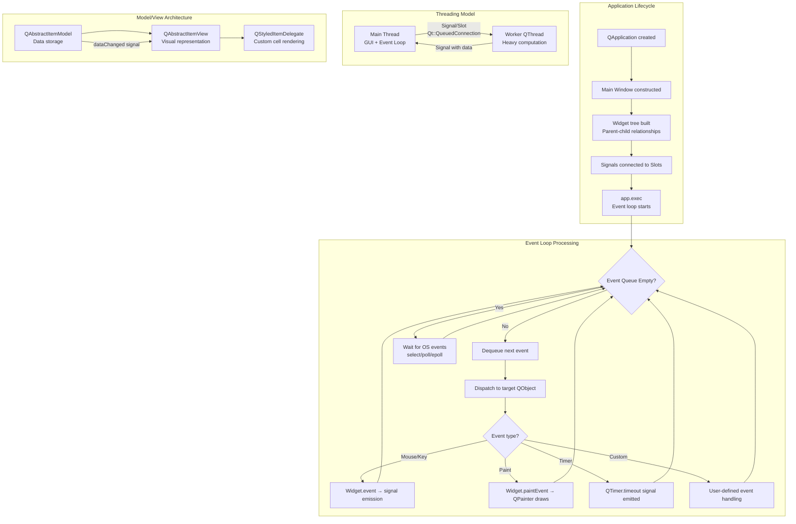

*Back to [Subject_Plan](Subject_Plan) | Part of [09 - Learning Index](09---Learning-Index)*

# 22.4 — PyQt6 & PySide6: Signals, Slots & Event Loops

> *"Qt is not just a GUI toolkit. It's a complete application development framework — event loops, networking, threading, databases, multimedia — all with a consistent, signal-driven architecture."*
> — **Riccardo Tramma**, Qt Company (2020)

Qt is the dominant cross-platform framework for building **native desktop applications**. Unlike web frameworks that render to a browser DOM, Qt renders directly to the operating system's native graphics APIs (Win32, Cocoa, X11/Wayland). PySide6 (official Qt for Python) and PyQt6 (third-party binding) provide Python access to this C++ framework.

The architectural paradigm is fundamentally different from web frameworks: instead of declarative rendering and virtual DOMs, Qt uses an **event-driven architecture** with a central event loop, a **signal/slot communication system** (type-safe publish/subscribe), and **widget hierarchies** with parent-child ownership semantics. Understanding this paradigm is essential for building responsive desktop applications that don't freeze during heavy computation.

---

## 🎯 Learning Objectives

1. **Explain the Qt event loop architecture** — understand how `QApplication.exec()` processes events, timers, and I/O notifications in a single thread.
2. **Implement the signal/slot pattern** — connect signals to slots across objects, understand connection types (direct, queued, auto), and create custom signals.
3. **Architect multi-threaded applications with QThread** — move heavy computation off the main thread without violating Qt's thread-affinity rules.
4. **Build custom widgets with QPainter** — understand the paint event system, coordinate transforms, and anti-aliased rendering.
5. **Apply the Model/View/Delegate pattern** — separate data (model) from presentation (view) for scalable list/table/tree displays.
6. **Identify and prevent Qt-specific anti-patterns** — GUI updates from worker threads, blocking the event loop, memory leaks from missing parent ownership.
7. **Choose between PySide6 and PyQt6** — understand licensing (LGPL vs GPL), API differences, and tooling implications.

---

## 🖼️ Visual Anchor — Qt Event Loop & Signal/Slot Architecture


---

## 🧩 1. Mental Model

**Qt's core paradigm: Event-Driven Object Communication via Signals & Slots**

Qt applications are built around three architectural pillars:

1. **The Event Loop** — A single-threaded infinite loop (`QApplication.exec()`) that processes events from the OS (mouse clicks, key presses, window resizes, timer expirations, network data) one at a time, in order.

2. **Signals & Slots** — A type-safe, decoupled communication mechanism. Objects emit **signals** when something happens (button clicked, data received, timer fired). Other objects connect **slots** (handler functions) to those signals. The emitter doesn't know or care who is listening.

3. **Widget Ownership Tree** — Every QObject has a parent. When a parent is destroyed, it automatically destroys all its children. This eliminates manual memory management for UI hierarchies.

```
OS Event (mouse click on button)
  → Event Loop receives QMouseEvent
    → Dispatches to QPushButton.event()
      → QPushButton recognizes click → emits clicked() signal
        → Connected slot(s) execute
          → Slot updates QLabel text
            → QLabel.update() posts a QPaintEvent
              → Event loop processes paint event
                → QLabel.paintEvent() redraws the text
```

**Contrast with web frameworks:**
| Aspect | React/Angular | Qt (PySide6/PyQt6) |
|--------|--------------|-------------------|
| Rendering | Virtual DOM → browser DOM | QPainter → OS native graphics |
| Reactivity | setState / signals / Zone.js | Signal/Slot connections |
| Threading | Single-threaded (Web Workers for compute) | Main thread + QThread workers |
| Layout | CSS Flexbox/Grid | QLayout managers (QVBoxLayout, QHBoxLayout, QGridLayout) |
| Memory | Garbage collected | Parent-child ownership (deterministic destruction) |
| Distribution | URL (browser) | Executable (PyInstaller, Nuitka) |

---

## 📊 2. Architecture Map



---

## 📚 3. Core Concepts & Terminology

### Definition 22.4.1 — QApplication and the Event Loop

`QApplication` is the singleton that manages the application's control flow and main settings. Calling `app.exec()` starts the **event loop** — an infinite loop that:

1. Waits for events from the operating system (blocking when idle — no CPU usage).
2. Dispatches each event to the appropriate `QObject` target.
3. Continues until `app.quit()` is called or the last window closes.

```python
import sys
from PySide6.QtWidgets import QApplication, QMainWindow

# QApplication MUST be created before any QWidget.
# sys.argv passes command-line arguments to Qt (e.g., -style, -platform).
app = QApplication(sys.argv)

# Create the main window (a QWidget subclass)
window = QMainWindow()
window.setWindowTitle("My App")
window.show()  # Makes the window visible (posts a show event)

# app.exec() enters the event loop. This call BLOCKS until the app exits.
# Everything after this line runs only after the user closes the application.
sys.exit(app.exec())
```

**Critical rule:** The event loop runs on the **main thread**. All GUI operations (creating widgets, updating text, drawing) MUST happen on the main thread. Violating this causes crashes or undefined behavior.

### Definition 22.4.2 — Signals and Slots

Signals and slots are Qt's mechanism for inter-object communication. A **signal** is emitted when a particular event occurs. A **slot** is a function that is called in response to a signal. Objects are connected via `connect()`:

```python
from PySide6.QtWidgets import QPushButton, QLabel
from PySide6.QtCore import Signal, Slot

# Built-in signal: QPushButton.clicked is emitted when the button is pressed
button = QPushButton("Click Me")
label = QLabel("Waiting...")

# Connect signal to slot: when button emits clicked(), call label.setText
button.clicked.connect(lambda: label.setText("Button was clicked!"))

# Custom signals in your own classes:
from PySide6.QtCore import QObject, Signal

class DataProcessor(QObject):
    # Define custom signals as class attributes
    # Signal(type) specifies the data type emitted with the signal
    progress_updated = Signal(int)       # Emits an integer (0-100)
    processing_done = Signal(str, list)  # Emits a string and a list
    error_occurred = Signal(str)         # Emits an error message

    def process(self):
        for i in range(100):
            # do_work()
            self.progress_updated.emit(i)  # Emit signal with current progress
        self.processing_done.emit("success", [1, 2, 3])
```

**Connection types:**
- `Qt.AutoConnection` (default) — Direct call if same thread, queued if cross-thread.
- `Qt.DirectConnection` — Slot executes immediately in the emitter's thread.
- `Qt.QueuedConnection` — Slot execution is posted to the receiver's event loop (thread-safe).

### Definition 22.4.3 — Widget Ownership and Memory Management

Every `QObject` can have a parent. When you pass a parent to a constructor, the child is added to the parent's children list. When the parent is destroyed, it automatically destroys all children:

```python
# parent takes ownership of child — no manual cleanup needed
main_window = QMainWindow()
central = QWidget(parent=main_window)  # Owned by main_window
layout = QVBoxLayout(central)          # Owned by central
button = QPushButton("Click", parent=central)  # Owned by central

# When main_window is closed and destroyed:
# → central is destroyed (child of main_window)
#   → layout is destroyed (child of central)
#   → button is destroyed (child of central)
# No memory leaks, no manual delete calls needed.
```

**Danger:** If you create a QObject without a parent and don't store a reference to it, Python's garbage collector may destroy it while Qt still expects it to exist → crash.

### Definition 22.4.4 — QPainter and the Paint System

Qt's rendering is based on a **paint event** system. Widgets don't draw themselves continuously — they draw only when the system requests it (window exposed, widget resized, `update()` called):

```python
from PySide6.QtWidgets import QWidget
from PySide6.QtGui import QPainter, QPen, QBrush, QColor
from PySide6.QtCore import Qt

class CustomWidget(QWidget):
    def paintEvent(self, event):
        # QPainter is created for each paint event.
        # It provides the drawing API (lines, rectangles, text, paths, images).
        painter = QPainter(self)
        painter.setRenderHint(QPainter.RenderHint.Antialiasing)

        # Draw a filled circle
        painter.setBrush(QBrush(QColor(66, 135, 245)))
        painter.setPen(QPen(Qt.PenStyle.NoPen))
        painter.drawEllipse(50, 50, 100, 100)

        painter.end()  # Always end the painter
```

### Definition 22.4.5 — QThread and Thread Affinity

Every `QObject` has **thread affinity** — it "lives in" a particular thread. Signals connected across threads use `QueuedConnection` automatically, posting the slot call to the receiver's event loop. This is how you safely communicate between worker threads and the GUI:

```python
from PySide6.QtCore import QThread, Signal, QObject

class Worker(QObject):
    """Worker that runs in a separate thread."""
    finished = Signal()
    progress = Signal(int)
    result = Signal(object)

    def run(self):
        """Heavy computation — runs in worker thread."""
        for i in range(100):
            # Simulate work
            import time; time.sleep(0.05)
            self.progress.emit(i + 1)  # Signal crosses thread boundary safely
        self.result.emit({"status": "done"})
        self.finished.emit()
```

### Definition 22.4.6 — Model/View/Delegate Architecture

Qt separates data from presentation using the Model/View pattern (similar to MVC but without a separate Controller — the View handles user interaction):

- **Model** (`QAbstractItemModel`) — Stores and provides data. Emits signals when data changes.
- **View** (`QListView`, `QTableView`, `QTreeView`) — Displays model data. Requests data via model's `data()` method.
- **Delegate** (`QStyledItemDelegate`) — Controls how individual cells are rendered and edited.

---

## 🔑 4. Bare-Bones Boilerplate

### Minimal PySide6 Application

```python
"""Minimal PySide6 application: window with a button that updates a label."""
import sys
from PySide6.QtWidgets import (
    QApplication,    # The application singleton (manages event loop)
    QMainWindow,     # Top-level window with menu bar, status bar, toolbars
    QWidget,         # Base class for all UI objects
    QVBoxLayout,     # Vertical box layout manager
    QLabel,          # Text/image display widget
    QPushButton,     # Clickable button widget
)
from PySide6.QtCore import Qt  # Enums and constants


class MainWindow(QMainWindow):
    """Main application window."""

    def __init__(self):
        # super().__init__() initializes the QMainWindow.
        # No parent = top-level window (OS manages its lifecycle).
        super().__init__()
        self.setWindowTitle("PySide6 Minimal App")
        self.setMinimumSize(400, 200)

        # QMainWindow requires a "central widget" — the main content area.
        # All other widgets are children of this central widget.
        central = QWidget()
        self.setCentralWidget(central)

        # Layout managers handle widget positioning and resizing.
        # QVBoxLayout stacks children vertically.
        layout = QVBoxLayout(central)

        # Create widgets
        self.label = QLabel("Click count: 0")
        self.label.setAlignment(Qt.AlignmentFlag.AlignCenter)

        self.button = QPushButton("Click Me")

        # Add widgets to layout (order = top to bottom)
        layout.addWidget(self.label)
        layout.addWidget(self.button)

        # Connect signal to slot:
        # When button emits clicked(), call self.on_button_clicked
        self.button.clicked.connect(self.on_button_clicked)

        # Instance variable to track state
        self.click_count = 0

    def on_button_clicked(self):
        """Slot: called when button is clicked."""
        self.click_count += 1
        self.label.setText(f"Click count: {self.click_count}")


# ─── Application Entry Point ─────────────────────────────────────
if __name__ == "__main__":
    # QApplication must be created FIRST, before any widgets.
    # It initializes the platform plugin, event loop, and global settings.
    app = QApplication(sys.argv)

    # Create and show the main window
    window = MainWindow()
    window.show()

    # Enter the event loop. This blocks until app.quit() is called.
    # sys.exit() ensures proper cleanup and returns the exit code to the OS.
    sys.exit(app.exec())
```

---


## 🔍 5. Lifecycle & Data Flow Deep Dive

### What Happens When a User Clicks a Button

**Step 1: OS Event Generation**
The operating system detects a mouse click at screen coordinates (x, y). It sends a platform-specific event to the application's window handle.

**Step 2: Qt Platform Abstraction**
Qt's platform plugin (QPA) receives the native event and converts it to a `QMouseEvent` with widget-relative coordinates. This event is posted to the application's event queue.

**Step 3: Event Loop Dequeues**
`QApplication.exec()` is running its infinite loop. It calls `processEvents()`, which dequeues the `QMouseEvent`.

**Step 4: Event Dispatch**
Qt determines which widget is under the mouse coordinates (hit testing). The event is sent to that widget's `event()` method:

```python
# Internally (simplified):
def event(self, event):
    if event.type() == QEvent.Type.MouseButtonPress:
        self.mousePressEvent(event)  # Virtual method you can override
    elif event.type() == QEvent.Type.MouseButtonRelease:
        self.mouseReleaseEvent(event)
    # ... etc
```

**Step 5: QPushButton Recognizes a Click**
`QPushButton.mouseReleaseEvent()` determines that a press+release within the button bounds constitutes a "click." It emits the `clicked()` signal.

**Step 6: Signal Emission**
Qt's meta-object system looks up all connections to `clicked()`. For each connected slot:
- **Same thread (DirectConnection):** Call the slot function immediately.
- **Cross-thread (QueuedConnection):** Post a `QMetaCallEvent` to the receiver's thread's event queue.

**Step 7: Slot Execution**
Your `on_button_clicked()` method executes. It modifies `self.label`'s text via `setText()`.

**Step 8: Paint Event Scheduling**
`QLabel.setText()` internally calls `update()`, which posts a `QPaintEvent` to the event queue. It does NOT repaint immediately — it schedules a repaint for the next event loop iteration.

**Step 9: Paint Event Processing**
On the next loop iteration, the `QPaintEvent` is dequeued. `QLabel.paintEvent()` is called, which uses `QPainter` to draw the new text to the widget's backing store.

**Step 10: Compositor Flush**
The backing store (off-screen buffer) is flushed to the screen via the OS compositor. The user sees the updated text.

### QThread Worker Pattern (Complete Flow)

```python
# The correct pattern for background work in Qt:
# 1. Create a QObject subclass with your work logic
# 2. Create a QThread
# 3. Move the worker to the thread
# 4. Connect signals for communication
# 5. Start the thread

class Worker(QObject):
    progress = Signal(int)
    finished = Signal(str)

    @Slot()
    def do_work(self):
        """This runs in the worker thread."""
        for i in range(100):
            time.sleep(0.1)  # Simulate heavy work
            self.progress.emit(i + 1)  # Thread-safe: uses QueuedConnection
        self.finished.emit("Complete!")

class MainWindow(QMainWindow):
    def start_work(self):
        # Create thread and worker
        self.thread = QThread()
        self.worker = Worker()

        # Move worker to thread (changes its thread affinity)
        self.worker.moveToThread(self.thread)

        # Connect signals:
        # thread.started → worker.do_work (starts work when thread begins)
        self.thread.started.connect(self.worker.do_work)
        # worker.progress → update UI (crosses thread boundary safely)
        self.worker.progress.connect(self.update_progress_bar)
        # worker.finished → cleanup
        self.worker.finished.connect(self.on_work_done)
        self.worker.finished.connect(self.thread.quit)
        self.worker.finished.connect(self.worker.deleteLater)
        self.thread.finished.connect(self.thread.deleteLater)

        # Start the thread (triggers thread.started signal)
        self.thread.start()
```

**Thread communication flow:**
```
Main Thread                          Worker Thread
─────────────                        ─────────────
thread.start()
  → started signal ──────────────→ worker.do_work() begins
                                     progress.emit(1)
  ← QueuedConnection ←──────────── (posted to main thread queue)
update_progress_bar(1) called
                                     progress.emit(2)
  ← QueuedConnection ←──────────── 
update_progress_bar(2) called
  ...
                                     finished.emit("Complete!")
  ← QueuedConnection ←──────────── 
on_work_done("Complete!") called
thread.quit() called
```

---

## ⚠️ 6. Gotchas & Anti-Patterns

### Anti-Pattern 8.4.1 — GUI Updates from Worker Thread

```python
# ❌ CRASH: Modifying GUI widgets from a non-main thread
class Worker(QThread):
    def run(self):
        for i in range(100):
            time.sleep(0.1)
            # WRONG: self.label lives in the main thread.
            # Accessing it from this thread causes race conditions or segfaults.
            self.label.setText(f"Progress: {i}%")  # 💥 CRASH

# ✅ FIX: Use signals to communicate back to the main thread
class Worker(QObject):
    progress = Signal(str)  # Emit data, don't touch widgets

    @Slot()
    def run(self):
        for i in range(100):
            time.sleep(0.1)
            self.progress.emit(f"Progress: {i}%")  # Safe: signal crosses thread

# In main window:
# self.worker.progress.connect(self.label.setText)  # Slot runs on main thread
```

**Why this crashes:** Qt widgets are not thread-safe. They use internal state (paint buffers, geometry caches) that assumes single-threaded access. Concurrent modification from two threads corrupts this state.

### Anti-Pattern 8.4.2 — Blocking the Event Loop

```python
# ❌ BAD: Blocking the event loop freezes the entire GUI
class MainWindow(QMainWindow):
    def on_button_clicked(self):
        # This blocks for 10 seconds. During this time:
        # - No paint events processed (window appears frozen)
        # - No mouse/keyboard events processed (unresponsive)
        # - OS may show "Not Responding" dialog
        import time
        time.sleep(10)  # 💀 GUI frozen for 10 seconds
        self.label.setText("Done!")

# ✅ FIX: Move blocking work to a QThread (see Pattern 8.4.A)
# OR use QTimer for periodic work:
class MainWindow(QMainWindow):
    def on_button_clicked(self):
        self.counter = 0
        # QTimer.singleShot: calls the slot after delay WITHOUT blocking
        self.timer = QTimer()
        self.timer.timeout.connect(self.do_step)
        self.timer.start(100)  # Call do_step every 100ms

    def do_step(self):
        self.counter += 1
        self.label.setText(f"Step: {self.counter}")
        if self.counter >= 100:
            self.timer.stop()
```

**The rule:** Never call `time.sleep()`, `requests.get()`, or any blocking I/O in the main thread. The event loop must return to processing events within ~16ms (60fps) to maintain a responsive GUI.

### Anti-Pattern 8.4.3 — Orphaned QObjects (Memory Leak / Crash)

```python
# ❌ BUG: Widget created without parent and without storing reference
class MainWindow(QMainWindow):
    def create_popup(self):
        # This QLabel has no parent and no Python reference stored.
        # Python's garbage collector may destroy it at any time.
        # If Qt still references it internally → crash (dangling pointer).
        popup = QLabel("I might disappear!")
        popup.show()
        # popup goes out of scope → Python may GC it → crash

# ✅ FIX: Either give it a parent OR store a reference
class MainWindow(QMainWindow):
    def create_popup(self):
        # Option A: Store as instance attribute (prevents GC)
        self.popup = QLabel("I'm safe!")
        self.popup.show()

        # Option B: Give it a parent (parent owns its lifecycle)
        popup = QLabel("I'm also safe!", parent=self)
        popup.show()
```

### Anti-Pattern 8.4.4 — Connecting Signals in Loops Without Disconnecting

```python
# ❌ BUG: Each call to setup_connections adds ANOTHER connection
# If called 5 times, clicking the button triggers the slot 5 times.
class MyWidget(QWidget):
    def setup_connections(self):
        self.button.clicked.connect(self.on_click)  # Accumulates!

# ✅ FIX: Disconnect before reconnecting, or connect only once (in __init__)
class MyWidget(QWidget):
    def __init__(self):
        super().__init__()
        # Connect once in constructor
        self.button.clicked.connect(self.on_click)

    # OR if you must reconnect dynamically:
    def update_connection(self, new_slot):
        try:
            self.button.clicked.disconnect()  # Remove all connections
        except RuntimeError:
            pass  # No connections to disconnect
        self.button.clicked.connect(new_slot)
```

### Anti-Pattern 8.4.5 — Subclassing QThread Instead of Using Worker Pattern

```python
# ❌ PROBLEMATIC: Subclassing QThread and overriding run()
# The QThread object itself lives in the MAIN thread.
# Only the code inside run() executes in the new thread.
# Slots defined on this class execute in the MAIN thread (confusing!).
class BadWorker(QThread):
    def run(self):
        # This runs in the new thread ✓
        self.do_heavy_work()

    def some_slot(self):
        # This runs in the MAIN thread ✗ (QThread's affinity is main thread)
        pass

# ✅ CORRECT: Worker QObject + moveToThread pattern
# (See Definition 22.4.5 and the lifecycle section above)
```

---

## 🧮 7. Worked Patterns

### Pattern 8.4.A — Responsive File Processing with QThread Worker

<details>
<summary>🔍 Complete Implementation</summary>

**Problem:** Process a large file (CSV parsing, image conversion) without freezing the GUI. Show progress and allow cancellation.

```python
import sys
import csv
from pathlib import Path
from PySide6.QtWidgets import (
    QApplication, QMainWindow, QWidget, QVBoxLayout,
    QPushButton, QProgressBar, QLabel, QFileDialog,
)
from PySide6.QtCore import QObject, QThread, Signal, Slot, Qt


class FileProcessor(QObject):
    """Worker that processes a CSV file row by row."""
    progress = Signal(int, int)  # (current_row, total_rows)
    row_processed = Signal(dict)  # Emits each processed row
    finished = Signal(int)  # Total rows processed
    error = Signal(str)  # Error message

    def __init__(self, file_path: str):
        super().__init__()
        self.file_path = file_path
        self._cancelled = False  # Flag for cancellation

    @Slot()
    def process(self):
        """Main work method — runs in worker thread."""
        try:
            path = Path(self.file_path)
            # Count total lines for progress calculation
            total = sum(1 for _ in open(path)) - 1  # Subtract header

            with open(path, newline='', encoding='utf-8') as f:
                reader = csv.DictReader(f)
                for i, row in enumerate(reader):
                    # Check cancellation flag (set from main thread)
                    if self._cancelled:
                        self.finished.emit(i)
                        return

                    # Simulate processing (replace with real logic)
                    processed = {k: v.strip().upper() for k, v in row.items()}
                    self.row_processed.emit(processed)
                    self.progress.emit(i + 1, total)

            self.finished.emit(total)
        except Exception as e:
            self.error.emit(str(e))

    @Slot()
    def cancel(self):
        """Called from main thread to request cancellation."""
        self._cancelled = True


class MainWindow(QMainWindow):
    # Signal to trigger worker start (connected across threads)
    request_cancel = Signal()

    def __init__(self):
        super().__init__()
        self.setWindowTitle("File Processor")
        self.setMinimumSize(400, 200)

        central = QWidget()
        self.setCentralWidget(central)
        layout = QVBoxLayout(central)

        self.status_label = QLabel("Select a CSV file to process")
        self.progress_bar = QProgressBar()
        self.progress_bar.setRange(0, 100)
        self.start_btn = QPushButton("Select File & Start")
        self.cancel_btn = QPushButton("Cancel")
        self.cancel_btn.setEnabled(False)

        layout.addWidget(self.status_label)
        layout.addWidget(self.progress_bar)
        layout.addWidget(self.start_btn)
        layout.addWidget(self.cancel_btn)

        self.start_btn.clicked.connect(self.start_processing)
        self.cancel_btn.clicked.connect(self.cancel_processing)

        self.thread = None
        self.worker = None

    def start_processing(self):
        file_path, _ = QFileDialog.getOpenFileName(
            self, "Select CSV", "", "CSV Files (*.csv)"
        )
        if not file_path:
            return

        # Create thread and worker
        self.thread = QThread()
        self.worker = FileProcessor(file_path)
        self.worker.moveToThread(self.thread)

        # Connect signals
        self.thread.started.connect(self.worker.process)
        self.worker.progress.connect(self.update_progress)
        self.worker.finished.connect(self.on_finished)
        self.worker.error.connect(self.on_error)
        self.request_cancel.connect(self.worker.cancel)

        # Cleanup connections
        self.worker.finished.connect(self.thread.quit)
        self.worker.finished.connect(self.worker.deleteLater)
        self.thread.finished.connect(self.thread.deleteLater)

        # Update UI state
        self.start_btn.setEnabled(False)
        self.cancel_btn.setEnabled(True)
        self.status_label.setText("Processing...")

        # Start
        self.thread.start()

    def cancel_processing(self):
        self.request_cancel.emit()
        self.status_label.setText("Cancelling...")

    @Slot(int, int)
    def update_progress(self, current, total):
        percent = int((current / total) * 100) if total > 0 else 0
        self.progress_bar.setValue(percent)
        self.status_label.setText(f"Processing row {current}/{total}")

    @Slot(int)
    def on_finished(self, total):
        self.status_label.setText(f"Done! Processed {total} rows.")
        self.start_btn.setEnabled(True)
        self.cancel_btn.setEnabled(False)

    @Slot(str)
    def on_error(self, message):
        self.status_label.setText(f"Error: {message}")
        self.start_btn.setEnabled(True)
        self.cancel_btn.setEnabled(False)


if __name__ == "__main__":
    app = QApplication(sys.argv)
    window = MainWindow()
    window.show()
    sys.exit(app.exec())
```

</details>

### Pattern 8.4.B — Custom QPainter Widget (Animated Gauge)

<details>
<summary>🔍 Complete Implementation</summary>

```python
import sys
import math
from PySide6.QtWidgets import QApplication, QWidget, QVBoxLayout, QSlider
from PySide6.QtGui import QPainter, QPen, QBrush, QColor, QFont, QConicalGradient
from PySide6.QtCore import Qt, QRectF, QPointF


class GaugeWidget(QWidget):
    """Custom-painted circular gauge widget."""

    def __init__(self, parent=None):
        super().__init__(parent)
        self._value = 0        # Current value (0-100)
        self._min_value = 0
        self._max_value = 100
        self.setMinimumSize(200, 200)

    @property
    def value(self):
        return self._value

    @value.setter
    def value(self, val):
        self._value = max(self._min_value, min(self._max_value, val))
        # update() schedules a repaint — does NOT paint immediately.
        # This is efficient: multiple value changes between paint events
        # result in only one repaint.
        self.update()

    def paintEvent(self, event):
        """Called by Qt when the widget needs to be redrawn."""
        painter = QPainter(self)
        painter.setRenderHint(QPainter.RenderHint.Antialiasing)

        # Calculate dimensions (responsive to widget size)
        side = min(self.width(), self.height())
        margin = side * 0.1
        rect = QRectF(margin, margin, side - 2 * margin, side - 2 * margin)
        center = rect.center()
        radius = rect.width() / 2

        # ─── Draw background arc (track) ─────────────────────────
        track_pen = QPen(QColor(60, 60, 60), side * 0.04, Qt.PenStyle.SolidLine, Qt.PenCapStyle.RoundCap)
        painter.setPen(track_pen)
        painter.drawArc(rect, 225 * 16, -270 * 16)  # Qt uses 1/16th degree units

        # ─── Draw value arc (filled portion) ──────────────────────
        # Map value to angle: 0% = 225°, 100% = -45° (270° sweep)
        fraction = (self._value - self._min_value) / (self._max_value - self._min_value)
        sweep_angle = int(-270 * fraction * 16)

        # Color gradient based on value
        if fraction < 0.5:
            color = QColor(76, 175, 80)   # Green
        elif fraction < 0.8:
            color = QColor(255, 193, 7)   # Yellow
        else:
            color = QColor(244, 67, 54)   # Red

        value_pen = QPen(color, side * 0.04, Qt.PenStyle.SolidLine, Qt.PenCapStyle.RoundCap)
        painter.setPen(value_pen)
        painter.drawArc(rect, 225 * 16, sweep_angle)

        # ─── Draw center text ─────────────────────────────────────
        painter.setPen(QPen(QColor(220, 220, 220)))
        font = QFont("Inter", int(side * 0.12), QFont.Weight.Bold)
        painter.setFont(font)
        painter.drawText(rect, Qt.AlignmentFlag.AlignCenter, f"{self._value}%")

        # ─── Draw needle ──────────────────────────────────────────
        angle_rad = math.radians(225 - 270 * fraction)
        needle_length = radius * 0.7
        needle_end = QPointF(
            center.x() + needle_length * math.cos(angle_rad),
            center.y() - needle_length * math.sin(angle_rad),
        )
        needle_pen = QPen(QColor(255, 255, 255), 2, Qt.PenStyle.SolidLine, Qt.PenCapStyle.RoundCap)
        painter.setPen(needle_pen)
        painter.drawLine(center, needle_end)

        # Center dot
        painter.setBrush(QBrush(QColor(255, 255, 255)))
        painter.setPen(Qt.PenStyle.NoPen)
        painter.drawEllipse(center, 5, 5)

        painter.end()


# ─── Demo Application ─────────────────────────────────────────────
if __name__ == "__main__":
    app = QApplication(sys.argv)
    window = QWidget()
    window.setWindowTitle("Custom Gauge")
    layout = QVBoxLayout(window)

    gauge = GaugeWidget()
    slider = QSlider(Qt.Orientation.Horizontal)
    slider.setRange(0, 100)

    # Connect slider value to gauge (signal → property update → repaint)
    slider.valueChanged.connect(lambda v: setattr(gauge, 'value', v))

    layout.addWidget(gauge)
    layout.addWidget(slider)
    window.show()
    sys.exit(app.exec())
```

</details>

### Pattern 8.4.C — Model/View with Custom Delegate

<details>
<summary>🔍 Complete Implementation</summary>

```python
import sys
from PySide6.QtWidgets import (
    QApplication, QMainWindow, QTableView, QStyledItemDelegate,
    QWidget, QVBoxLayout, QProgressBar,
)
from PySide6.QtCore import Qt, QAbstractTableModel, QModelIndex
from PySide6.QtGui import QColor


class TaskModel(QAbstractTableModel):
    """Custom model storing task data."""

    HEADERS = ["Task", "Assignee", "Progress", "Status"]

    def __init__(self, tasks=None):
        super().__init__()
        self._tasks = tasks or []

    def rowCount(self, parent=QModelIndex()):
        return len(self._tasks)

    def columnCount(self, parent=QModelIndex()):
        return len(self.HEADERS)

    def headerData(self, section, orientation, role):
        if role == Qt.ItemDataRole.DisplayRole and orientation == Qt.Orientation.Horizontal:
            return self.HEADERS[section]
        return None

    def data(self, index, role=Qt.ItemDataRole.DisplayRole):
        if not index.isValid():
            return None

        task = self._tasks[index.row()]
        col = index.column()

        if role == Qt.ItemDataRole.DisplayRole:
            return [task["name"], task["assignee"], task["progress"], task["status"]][col]
        elif role == Qt.ItemDataRole.BackgroundRole:
            if col == 3:  # Status column coloring
                status = task["status"]
                if status == "Done":
                    return QColor(76, 175, 80, 50)
                elif status == "In Progress":
                    return QColor(33, 150, 243, 50)
        return None

    def add_task(self, task):
        """Add a task and notify the view."""
        row = len(self._tasks)
        self.beginInsertRows(QModelIndex(), row, row)
        self._tasks.append(task)
        self.endInsertRows()

    def update_progress(self, row, progress):
        """Update progress and notify the view."""
        self._tasks[row]["progress"] = progress
        index = self.index(row, 2)  # Column 2 = Progress
        self.dataChanged.emit(index, index)  # Tell view to repaint this cell


class ProgressDelegate(QStyledItemDelegate):
    """Custom delegate that renders progress column as a progress bar."""

    def paint(self, painter, option, index):
        if index.column() == 2:  # Progress column
            progress = index.data()
            # Draw a progress bar in the cell
            bar = QProgressBar()
            bar.setRange(0, 100)
            bar.setValue(progress)
            bar.setTextVisible(True)
            bar.resize(option.rect.size())
            painter.save()
            painter.translate(option.rect.topLeft())
            bar.render(painter)
            painter.restore()
        else:
            super().paint(painter, option, index)


class MainWindow(QMainWindow):
    def __init__(self):
        super().__init__()
        self.setWindowTitle("Task Manager (Model/View)")
        self.setMinimumSize(600, 400)

        # Create model with sample data
        self.model = TaskModel([
            {"name": "Design UI", "assignee": "Alice", "progress": 100, "status": "Done"},
            {"name": "Build API", "assignee": "Bob", "progress": 75, "status": "In Progress"},
            {"name": "Write Tests", "assignee": "Charlie", "progress": 30, "status": "In Progress"},
            {"name": "Deploy", "assignee": "Diana", "progress": 0, "status": "Pending"},
        ])

        # Create view
        self.table = QTableView()
        self.table.setModel(self.model)
        self.table.setItemDelegate(ProgressDelegate())
        self.table.horizontalHeader().setStretchLastSection(True)

        self.setCentralWidget(self.table)


if __name__ == "__main__":
    app = QApplication(sys.argv)
    window = MainWindow()
    window.show()
    sys.exit(app.exec())
```

</details>

---

## 💻 8. Production-Grade Stack Checklist

### PySide6 vs PyQt6 Decision

| Factor | PySide6 | PyQt6 |
|--------|---------|-------|
| License | LGPL (commercial-friendly) | GPL (or commercial license from Riverbank) |
| Maintainer | Qt Company (official) | Riverbank Computing (third-party) |
| API | Nearly identical | Nearly identical |
| Tooling | `pyside6-uic`, `pyside6-rcc` | `pyuic6`, `pyrcc6` |
| Recommendation | **Use PySide6** for new projects | Only if already invested in PyQt ecosystem |

### Application Architecture

```
my_app/
├── main.py              # Entry point: QApplication + MainWindow
├── ui/
│   ├── main_window.py   # QMainWindow subclass
│   ├── widgets/          # Custom QWidget subclasses
│   └── dialogs/          # QDialog subclasses
├── models/              # QAbstractItemModel subclasses
├── workers/             # QObject workers for background tasks
├── services/            # Business logic (no Qt dependency)
├── resources/           # Icons, images, stylesheets
│   ├── icons/
│   └── styles/
└── tests/               # pytest + pytest-qt
```

### Testing

```bash
# pytest-qt: provides qtbot fixture for simulating user interaction
pip install pytest pytest-qt

# Example test:
def test_button_click(qtbot):
    window = MainWindow()
    qtbot.addWidget(window)  # Ensures cleanup

    # Simulate click
    qtbot.mouseClick(window.button, Qt.MouseButton.LeftButton)

    assert window.label.text() == "Click count: 1"
```

### Distribution

```bash
# PyInstaller: package as standalone executable
pip install pyinstaller
pyinstaller --onefile --windowed --name="MyApp" main.py

# Nuitka: compile to C for better performance and smaller size
pip install nuitka
nuitka --standalone --enable-plugin=pyside6 --windows-disable-console main.py
```

---

## 🔗 9. Cross-links & Further Reading

### Internal Vault Links

- [22.1 - React & Next.js - Functional Components & Hooks](22.1---React-&-Next.js---Functional-Components-&-Hooks) — Compare Qt's signal/slot with React's event handlers and state updates.
- [22.5 - Flutter & Dart - Widget Tree, Isolates & Custom Painters](22.5---Flutter-&-Dart---Widget-Tree,-Isolates-&-Custom-Painters) — Flutter's CustomPainter is conceptually similar to QPainter; compare the rendering models.
- [2.6 - Eigenvalues Eigenvectors & Diagonalization](2.6---Eigenvalues-Eigenvectors-&-Diagonalization) — Matrix math relevant to QPainter coordinate transforms (rotation, scaling, shearing).
- [28.1 - 3D Math Fundamentals](28.1---3D-Math-Fundamentals) — 3D transforms in QOpenGLWidget for hardware-accelerated rendering.

### Official Documentation

- **PySide6 docs:** https://doc.qt.io/qtforpython-6/ — Official Qt for Python documentation.
- **Qt C++ docs:** https://doc.qt.io/qt-6/ — The authoritative reference (PySide6 mirrors this API).
- **Qt Signals & Slots:** https://doc.qt.io/qt-6/signalsandslots.html — Deep dive into the mechanism.
- **Qt Threading:** https://doc.qt.io/qt-6/threads-technologies.html — Threading patterns and best practices.

### Key Mental Models to Remember

1. **The event loop is sacred.** Never block it. Every `time.sleep()`, `requests.get()`, or heavy computation in the main thread freezes your entire GUI.
2. **Signals cross thread boundaries safely.** This is Qt's killer feature for threading. Emit a signal from any thread; the connected slot runs in the receiver's thread.
3. **Parent owns child.** If you set a parent, you don't need to worry about memory management. If you don't set a parent, you must store a Python reference.
4. **update() ≠ repaint().** `update()` schedules a paint event (efficient, coalesced). `repaint()` forces immediate painting (rarely needed, can cause flicker).

---

*Next: [22.5 - Flutter & Dart - Widget Tree, Isolates & Custom Painters](22.5---Flutter-&-Dart---Widget-Tree,-Isolates-&-Custom-Painters) →*
