*Back to [Subject_Plan](Subject_Plan) | Part of [09 - Learning Index](09---Learning-Index)*

# 22.5 — Flutter & Dart: Widget Tree, Isolates & Custom Painters

> *"Flutter is fundamentally different from most other options for building mobile apps because it doesn't use WebView or the OEM widgets that ship with the device. Instead, Flutter uses its own high-performance rendering engine to draw every pixel."*
> — **Eric Seidel**, Founder of Flutter (2018)

> *"Dart is designed to be familiar, productive, and fast. It compiles to native ARM code, to JavaScript, and to WebAssembly — all from the same source."*
> — **Lars Bak**, Co-creator of Dart & V8 (2011)

Flutter is Google's UI toolkit for building **natively compiled applications** for mobile, web, and desktop from a single codebase. Unlike React Native (which bridges to native widgets) or web frameworks (which render to a browser), Flutter owns the entire rendering pipeline: it draws every pixel using its own engine (Skia/Impeller), giving it complete control over appearance and performance across platforms.

The architecture is built on three trees (Widget → Element → RenderObject), Dart's single-threaded event loop with Isolates for parallelism, and a reactive rebuild model where the framework decides what to repaint based on which widgets declared new configurations.

---

## 🎯 Learning Objectives

1. **Explain Flutter's three-tree architecture** — understand how Widget, Element, and RenderObject trees interact and why this separation exists.
2. **Trace a widget rebuild cycle** — from `setState()` through element reconciliation to RenderObject layout and paint.
3. **Implement Dart Isolates for heavy computation** — understand Dart's concurrency model (no shared memory, message passing) and when to use `compute()` vs full Isolates.
4. **Build custom rendering with CustomPainter** — use the Canvas API for charts, animations, and game-like graphics.
5. **Architect state management with Riverpod or BLoC** — understand the tradeoffs between provider-based and stream-based state management.
6. **Identify Flutter-specific anti-patterns** — unnecessary rebuilds, widget tree depth explosions, improper key usage, and blocking the main isolate.
7. **Integrate native platform code via FFI and Platform Channels** — call C/C++ libraries directly from Dart or communicate with platform-specific APIs.

---

## 🖼️ Visual Anchor — Flutter Three-Tree Architecture


---

## 🧩 1. Mental Model

**Flutter's core equation: Everything is a Widget, but Widgets are just configuration.**

```
Widget (immutable config) → Element (mutable lifecycle) → RenderObject (layout + paint)
```

A **Widget** is a lightweight, immutable description of a piece of UI. It's a blueprint, not the actual rendered object. Widgets are cheap to create and destroy — Flutter creates thousands per frame during rebuilds.

An **Element** is the instantiation of a Widget in the tree. It holds the widget's identity and lifecycle state. When a widget rebuilds, Flutter compares the new widget with the element's current widget. If the type and key match, the element is **updated** (not recreated) — preserving state.

A **RenderObject** handles the expensive work: layout (calculating sizes and positions) and painting (issuing draw commands to the GPU). RenderObjects persist across rebuilds and are only recreated when the element type changes.

**Why three trees?**
- Widgets rebuild frequently (every `setState`). They must be cheap → immutable value objects.
- Elements persist across rebuilds. They track identity and manage state → mutable, long-lived.
- RenderObjects do expensive layout/paint. They update incrementally → only relayout/repaint what changed.

**Dart's concurrency model:**
Dart is **single-threaded** within an Isolate. There is no shared memory between Isolates — they communicate via message passing (like Erlang/Elixir actors). The main Isolate runs the event loop (UI rendering, gesture handling, async I/O). Heavy computation must be offloaded to separate Isolates to avoid janking the UI.

---

## 📊 2. Architecture Map

```mermaid
graph TD
    subgraph "Flutter Framework Layers"
        A[Your App Code<br/>Widgets] --> B[Material / Cupertino<br/>Design system widgets]
        B --> C[Widgets Layer<br/>Composition primitives]
        C --> D[Rendering Layer<br/>RenderObject tree, layout, paint]
        D --> E[dart:ui<br/>Low-level Canvas, Scene]
        E --> F[Impeller / Skia<br/>GPU rendering engine]
        F --> G[Platform<br/>iOS / Android / Web / Desktop]
    end

    subgraph "Widget Rebuild Cycle"
        H[setState called] --> I[Mark Element dirty]
        I --> J[Next frame: rebuild dirty elements]
        J --> K[Call build method<br/>Returns new Widget tree]
        K --> L[Reconciliation<br/>Compare new vs old widgets]
        L -->|Same type + key| M[Update existing Element<br/>Preserve State]
        L -->|Different type| N[Unmount old Element<br/>Create new Element + RenderObject]
        M --> O[Update RenderObject properties]
        O --> P[Layout pass<br/>Constraints down, sizes up]
        P --> Q[Paint pass<br/>Canvas commands to layer tree]
    end

    subgraph "Dart Concurrency"
        R[Main Isolate<br/>UI + Event Loop] -->|spawn| S[Worker Isolate<br/>Heavy computation]
        S -->|SendPort message| R
        R -->|compute function| T[Single-use Isolate<br/>Returns result]
    end
```



---

## 📚 3. Core Concepts & Terminology

### Definition 22.5.1 — Widget (Immutable Configuration)

A Widget is an **immutable description** of part of the UI. It declares what the UI should look like given its current configuration. Widgets are divided into:

- **StatelessWidget** — Configuration that never changes internally. Rebuilt only when parent rebuilds with new parameters.
- **StatefulWidget** — Has an associated `State` object that persists across rebuilds and can trigger rebuilds via `setState()`.
- **InheritedWidget** — Provides data to descendants efficiently (the basis for `Theme`, `MediaQuery`, and state management solutions).

```dart
// StatelessWidget: pure function of its inputs (like a React functional component without hooks)
class Greeting extends StatelessWidget {
  final String name; // Immutable field — set once in constructor

  const Greeting({super.key, required this.name});

  @override
  Widget build(BuildContext context) {
    // build() is called whenever this widget needs to render.
    // It returns a NEW widget tree (widgets are cheap to create).
    return Text('Hello, $name!', style: Theme.of(context).textTheme.headlineMedium);
  }
}
```

### Definition 22.5.2 — Element (Lifecycle Manager)

An Element is the **instantiation** of a Widget at a particular location in the tree. It:
- Holds a reference to its current Widget configuration.
- Manages the widget's lifecycle (`mount`, `update`, `unmount`).
- For StatefulWidgets, holds the `State` object.
- Decides whether to create a new RenderObject or update the existing one.

When `setState()` is called, the Element is marked dirty. On the next frame, Flutter calls `build()` on the dirty element's widget, gets a new widget tree, and **reconciles** it with the existing element tree (similar to React's reconciliation, but using `runtimeType` and `key` instead of JSX type).

### Definition 22.5.3 — RenderObject (Layout & Paint)

A RenderObject is responsible for:
1. **Layout** — Receiving constraints from its parent, determining its own size, and positioning children.
2. **Paint** — Drawing itself to a Canvas (issuing GPU draw commands).
3. **Hit testing** — Determining which RenderObject is under a touch/click point.

The layout protocol is **constraints go down, sizes go up**:
```
Parent passes constraints: "You must be between 100-300px wide, 50-200px tall"
  → Child calculates its size: "I'll be 200px × 100px"
    → Parent positions child at offset (x, y)
```

### Definition 22.5.4 — Isolates (Dart Concurrency)

Dart Isolates are independent execution contexts with their own memory heap. They cannot share mutable state — communication happens via message passing through `SendPort`/`ReceivePort`:

```dart
// Simple: compute() spawns an isolate, runs a function, returns the result
final result = await compute(expensiveFunction, inputData);
// expensiveFunction runs in a separate isolate — main isolate stays responsive

// Full control: spawn a long-lived isolate
final receivePort = ReceivePort();
await Isolate.spawn(workerEntryPoint, receivePort.sendPort);
receivePort.listen((message) {
  print('Received from worker: $message');
});
```

### Definition 22.5.5 — CustomPainter

`CustomPainter` gives you direct access to the Canvas API for drawing arbitrary graphics (charts, games, custom animations):

```dart
class MyPainter extends CustomPainter {
  @override
  void paint(Canvas canvas, Size size) {
    final paint = Paint()
      ..color = Colors.blue
      ..strokeWidth = 3
      ..style = PaintingStyle.stroke;

    // Draw a circle at the center
    canvas.drawCircle(Offset(size.width / 2, size.height / 2), 50, paint);
  }

  @override
  bool shouldRepaint(covariant CustomPainter oldDelegate) => false;
  // Return true if the painting depends on data that changed
}

// Usage in widget tree:
CustomPaint(painter: MyPainter(), size: Size(200, 200))
```

### Definition 22.5.6 — Keys (Identity Preservation)

Keys tell Flutter's reconciliation algorithm which elements correspond to which widgets across rebuilds. Without keys, Flutter matches by position (index). With keys, it matches by identity:

```dart
// Without key: reordering items causes state loss (elements matched by index)
// With key: Flutter preserves element identity across reorders
ListView(
  children: items.map((item) => ListTile(
    key: ValueKey(item.id), // Unique identifier for this item
    title: Text(item.name),
  )).toList(),
)
```

---

## 🔑 4. Bare-Bones Boilerplate

### Minimal Flutter Application

```dart
// main.dart — Application entry point
import 'package:flutter/material.dart';

// main() is the Dart entry point. runApp() inflates the widget tree
// and attaches it to the screen.
void main() {
  runApp(const MyApp());
}

// Root widget: typically a MaterialApp or CupertinoApp
// const constructor: Flutter can skip rebuilding this widget entirely
// because it's compile-time constant (immutable, no runtime state).
class MyApp extends StatelessWidget {
  const MyApp({super.key});

  @override
  Widget build(BuildContext context) {
    return MaterialApp(
      title: 'Flutter Minimal',
      theme: ThemeData(
        colorScheme: ColorScheme.fromSeed(seedColor: Colors.deepPurple),
        useMaterial3: true,
      ),
      home: const CounterPage(),
    );
  }
}

// StatefulWidget: has mutable state that can trigger rebuilds
class CounterPage extends StatefulWidget {
  const CounterPage({super.key});

  // createState() is called once when the Element is first mounted.
  // The State object persists across rebuilds of the widget.
  @override
  State<CounterPage> createState() => _CounterPageState();
}

// State class: holds mutable state and the build method.
// Naming convention: _WidgetNameState (private, prefixed with underscore).
class _CounterPageState extends State<CounterPage> {
  // Mutable state variable
  int _count = 0;

  // build() is called whenever setState() marks this element dirty.
  // It must be a pure function of the current state + widget config.
  @override
  Widget build(BuildContext context) {
    return Scaffold(
      appBar: AppBar(
        title: const Text('Counter'),
        backgroundColor: Theme.of(context).colorScheme.inversePrimary,
      ),
      body: Center(
        child: Column(
          mainAxisAlignment: MainAxisAlignment.center,
          children: [
            const Text('You have pushed the button this many times:'),
            Text(
              '$_count',
              style: Theme.of(context).textTheme.headlineMedium,
            ),
          ],
        ),
      ),
      floatingActionButton: FloatingActionButton(
        // setState: marks this State as dirty, schedules a rebuild.
        // The callback mutates state BEFORE the rebuild.
        onPressed: () => setState(() => _count++),
        tooltip: 'Increment',
        child: const Icon(Icons.add),
      ),
    );
  }
}
```

---


## 🔍 5. Lifecycle & Data Flow Deep Dive

### What Happens When the User Taps the FAB (Floating Action Button)

**Step 1: Gesture Recognition**
The Impeller/Skia engine receives a touch event from the platform. Flutter's gesture system performs hit testing on the RenderObject tree to find which RenderObject is under the touch point. It identifies the `FloatingActionButton`'s `RenderObject`.

**Step 2: GestureDetector Fires**
The `InkWell` inside `FloatingActionButton` recognizes a tap gesture and calls the `onPressed` callback.

**Step 3: setState() Called**
```dart
onPressed: () => setState(() => _count++)
```
`setState()` does two things:
1. Executes the callback (`_count++`) — mutating state.
2. Marks this `State`'s `Element` as **dirty** in the framework's dirty elements list.

**Step 4: Frame Scheduled**
Flutter's `SchedulerBinding` schedules a new frame (if one isn't already scheduled). On the next vsync signal (~16ms at 60fps), the build phase begins.

**Step 5: Build Phase (Rebuild Dirty Elements)**
The framework iterates through dirty elements in depth-first order:
1. Calls `_CounterPageState.build(context)`.
2. `build()` returns a new `Scaffold` widget tree with `Text('$_count')` now showing "1" instead of "0".

**Step 6: Reconciliation (Element Update)**
Flutter compares the new widget tree with the existing element tree:
```
Old: Scaffold → ... → Text('0')
New: Scaffold → ... → Text('1')

Scaffold: same type, same key → UPDATE element (don't recreate)
  Column: same type → UPDATE
    Text('0') vs Text('1'): same type → UPDATE
      → RenderParagraph.text = '1' (property update)
```

Only the `RenderParagraph` for the counter text needs to repaint. The `AppBar`, `FloatingActionButton`, and all other unchanged widgets are **not rebuilt** (their elements are clean).

**Step 7: Layout Phase**
The framework checks if any RenderObjects need relayout. Since only text content changed (not size constraints), layout may be skipped or minimal.

**Step 8: Paint Phase**
The dirty `RenderParagraph` repaints itself to its layer. Flutter composites the layer tree and submits it to the Impeller/Skia engine.

**Step 9: Rasterization**
Impeller converts the layer tree into GPU commands. The GPU renders the frame. The platform compositor displays it on screen.

### The Constraint Protocol (Layout)

```dart
// Flutter's layout is a single-pass algorithm:
// 1. Constraints flow DOWN from parent to child
// 2. Sizes flow UP from child to parent
// 3. Parent positions child (sets offset)

// Example: a Column with two children
// Column receives: BoxConstraints(0 ≤ w ≤ 400, 0 ≤ h ≤ 800)
// Column passes to Child1: BoxConstraints(0 ≤ w ≤ 400, 0 ≤ h ≤ 800)
//   Child1 returns size: Size(200, 50)
// Column passes to Child2: BoxConstraints(0 ≤ w ≤ 400, 0 ≤ h ≤ 750) // remaining space
//   Child2 returns size: Size(300, 100)
// Column's own size: Size(300, 150) // max width, sum of heights
// Column positions: Child1 at Offset(0, 0), Child2 at Offset(0, 50)
```

**Key insight:** A widget cannot choose its own size independently. It must respect the constraints given by its parent. This is why `Container(width: 500)` inside a `SizedBox(width: 100)` results in a 100px-wide container — the parent's constraints win.

### Isolate Communication Pattern

```dart
// Main Isolate                          Worker Isolate
// ─────────────                          ──────────────
// Isolate.spawn(worker, sendPort)
//   → Worker starts
//                                        Receives SendPort
//                                        Sends back its own ReceivePort
// Receives worker's SendPort
// Sends work request ──────────────────→ Receives request
//                                        Processes data (no UI access!)
//                                        Sends result ←──────────────── Receives result
// Updates UI via setState()
```

---

## ⚠️ 6. Gotchas & Anti-Patterns

### Anti-Pattern 8.5.1 — Rebuilding the Entire Tree on Every setState

```dart
// ❌ BAD: setState at the top of a deep widget tree rebuilds EVERYTHING
class _MyAppState extends State<MyApp> {
  int _counter = 0;

  @override
  Widget build(BuildContext context) {
    return MaterialApp(
      home: Scaffold(
        body: Column(
          children: [
            // These 50 widgets ALL rebuild when _counter changes,
            // even though only the Text widget needs the counter value.
            ExpensiveWidget1(),
            ExpensiveWidget2(),
            // ... 48 more widgets ...
            Text('$_counter'), // Only this needs _counter
          ],
        ),
        floatingActionButton: FloatingActionButton(
          onPressed: () => setState(() => _counter++),
        ),
      ),
    );
  }
}

// ✅ FIX: Push state down to the smallest widget that needs it
class CounterDisplay extends StatefulWidget {
  @override
  State<CounterDisplay> createState() => _CounterDisplayState();
}

class _CounterDisplayState extends State<CounterDisplay> {
  int _counter = 0;

  @override
  Widget build(BuildContext context) {
    // Only this small widget rebuilds when counter changes
    return Column(
      children: [
        Text('$_counter'),
        ElevatedButton(
          onPressed: () => setState(() => _counter++),
          child: const Text('Increment'),
        ),
      ],
    );
  }
}

// Parent widget: ExpensiveWidget1, ExpensiveWidget2, etc. are NOT rebuilt
```

### Anti-Pattern 8.5.2 — Creating Objects Inside build()

```dart
// ❌ BAD: Creating controllers/animations inside build()
class _MyWidgetState extends State<MyWidget> {
  @override
  Widget build(BuildContext context) {
    // This creates a NEW controller on every rebuild!
    // Previous controller is leaked (never disposed).
    final controller = TextEditingController(); // 💀 Memory leak + state loss

    return TextField(controller: controller);
  }
}

// ✅ FIX: Create in initState, dispose in dispose
class _MyWidgetState extends State<MyWidget> {
  late final TextEditingController _controller;

  @override
  void initState() {
    super.initState();
    _controller = TextEditingController(); // Created once
  }

  @override
  void dispose() {
    _controller.dispose(); // Cleanup when widget is removed from tree
    super.dispose();
  }

  @override
  Widget build(BuildContext context) {
    return TextField(controller: _controller); // Reused across rebuilds
  }
}
```

### Anti-Pattern 8.5.3 — Blocking the Main Isolate

```dart
// ❌ BAD: Heavy computation on the main isolate freezes the UI
class _DataPageState extends State<DataPage> {
  List<ProcessedItem> _items = [];

  void _processData() {
    // This blocks the main isolate for seconds.
    // No frames are rendered during this time → UI freezes.
    final rawData = loadLargeDataset(); // 10MB JSON parse
    _items = rawData.map((item) => heavyTransform(item)).toList(); // CPU-intensive
    setState(() {});
  }
}

// ✅ FIX: Use compute() to offload to a separate isolate
class _DataPageState extends State<DataPage> {
  List<ProcessedItem> _items = [];
  bool _loading = false;

  Future<void> _processData() async {
    setState(() => _loading = true);

    // compute() spawns a new isolate, runs the function, returns the result.
    // The main isolate stays responsive (UI keeps rendering at 60fps).
    final result = await compute(_processInBackground, rawDataPath);

    setState(() {
      _items = result;
      _loading = false;
    });
  }
}

// Top-level function (required for compute — can't be a closure or method)
List<ProcessedItem> _processInBackground(String path) {
  final rawData = File(path).readAsStringSync();
  final parsed = jsonDecode(rawData) as List;
  return parsed.map((item) => heavyTransform(item)).toList();
}
```

### Anti-Pattern 8.5.4 — Missing Keys in Dynamic Lists

```dart
// ❌ BUG: Without keys, reordering items causes state corruption
ListView(
  children: items.map((item) => CheckboxListTile(
    // No key! Flutter matches by INDEX, not identity.
    // If items reorder, checkbox states stay at their old positions.
    title: Text(item.name),
    value: item.checked,
    onChanged: (v) => toggleItem(item.id),
  )).toList(),
)

// ✅ FIX: Add ValueKey to preserve element identity across reorders
ListView(
  children: items.map((item) => CheckboxListTile(
    key: ValueKey(item.id), // Flutter matches by key, not index
    title: Text(item.name),
    value: item.checked,
    onChanged: (v) => toggleItem(item.id),
  )).toList(),
)
```

### Anti-Pattern 8.5.5 — Improper use of const

```dart
// ❌ MISSED OPTIMIZATION: Widgets that could be const but aren't
Widget build(BuildContext context) {
  return Column(
    children: [
      Text('Static Title'),           // Rebuilt every time (not const)
      Icon(Icons.star),               // Rebuilt every time (not const)
      Text('Count: $_count'),         // Must rebuild (uses state) ✓
    ],
  );
}

// ✅ FIX: Mark static widgets as const — Flutter skips rebuilding them entirely
Widget build(BuildContext context) {
  return Column(
    children: [
      const Text('Static Title'),     // NEVER rebuilt — same instance reused
      const Icon(Icons.star),         // NEVER rebuilt
      Text('Count: $_count'),         // Rebuilt when _count changes ✓
    ],
  );
}
// const widgets are compile-time constants. Flutter's reconciler sees
// the same instance and skips the entire subtree comparison.
```

---

## 🧮 7. Worked Patterns

### Pattern 8.5.A — Riverpod State Management (Modern Provider Pattern)

<details>
<summary>🔍 Complete Implementation</summary>

```dart
// Using Riverpod 2.0+ with code generation
import 'package:flutter/material.dart';
import 'package:flutter_riverpod/flutter_riverpod.dart';
import 'package:riverpod_annotation/riverpod_annotation.dart';

part 'counter_page.g.dart'; // Generated by build_runner

// @riverpod annotation generates a provider automatically.
// This is a "Notifier" — holds state and exposes methods to modify it.
@riverpod
class Counter extends _$Counter {
  @override
  int build() => 0; // Initial state

  void increment() => state++;
  void decrement() => state--;
  void reset() => state = 0;
}

// Async provider: fetches data from an API
@riverpod
Future<List<User>> userList(UserListRef ref) async {
  final response = await http.get(Uri.parse('/api/users'));
  final data = jsonDecode(response.body) as List;
  return data.map((json) => User.fromJson(json)).toList();
}

// ─── UI Layer ────────────────────────────────────────────────────

// ConsumerWidget: Riverpod's equivalent of StatelessWidget
// It provides a `ref` parameter to read/watch providers.
class CounterPage extends ConsumerWidget {
  const CounterPage({super.key});

  @override
  Widget build(BuildContext context, WidgetRef ref) {
    // ref.watch: rebuilds this widget when the provider's state changes.
    // Only this widget rebuilds — not the entire tree.
    final count = ref.watch(counterProvider);

    return Scaffold(
      appBar: AppBar(title: const Text('Riverpod Counter')),
      body: Center(
        child: Text('Count: $count', style: Theme.of(context).textTheme.headlineLarge),
      ),
      floatingActionButton: Column(
        mainAxisSize: MainAxisSize.min,
        children: [
          FloatingActionButton(
            heroTag: 'increment',
            // ref.read: access provider without subscribing (for event handlers)
            onPressed: () => ref.read(counterProvider.notifier).increment(),
            child: const Icon(Icons.add),
          ),
          const SizedBox(height: 8),
          FloatingActionButton(
            heroTag: 'decrement',
            onPressed: () => ref.read(counterProvider.notifier).decrement(),
            child: const Icon(Icons.remove),
          ),
        ],
      ),
    );
  }
}

// Async data display with loading/error states
class UserListPage extends ConsumerWidget {
  const UserListPage({super.key});

  @override
  Widget build(BuildContext context, WidgetRef ref) {
    // AsyncValue: Riverpod's tri-state (loading, data, error)
    final usersAsync = ref.watch(userListProvider);

    return usersAsync.when(
      loading: () => const Center(child: CircularProgressIndicator()),
      error: (err, stack) => Center(child: Text('Error: $err')),
      data: (users) => ListView.builder(
        itemCount: users.length,
        itemBuilder: (context, index) => ListTile(
          title: Text(users[index].name),
          subtitle: Text(users[index].email),
        ),
      ),
    );
  }
}

// App entry point: wrap with ProviderScope
void main() {
  runApp(const ProviderScope(child: MyApp()));
}
```

</details>

### Pattern 8.5.B — BLoC Pattern (Business Logic Component)

<details>
<summary>🔍 Complete Implementation</summary>

```dart
// BLoC separates business logic from UI using Streams (events in, states out)
import 'package:flutter/material.dart';
import 'package:flutter_bloc/flutter_bloc.dart';
import 'package:equatable/equatable.dart';

// ─── Events (inputs to the BLoC) ────────────────────────────────
sealed class CounterEvent extends Equatable {
  @override
  List<Object?> get props => [];
}

class IncrementPressed extends CounterEvent {}
class DecrementPressed extends CounterEvent {}
class ResetPressed extends CounterEvent {}

// ─── State (output from the BLoC) ───────────────────────────────
class CounterState extends Equatable {
  final int count;
  final bool isEven;

  const CounterState({required this.count, required this.isEven});

  factory CounterState.initial() => const CounterState(count: 0, isEven: true);

  @override
  List<Object?> get props => [count, isEven];
}

// ─── BLoC (transforms events into states) ────────────────────────
class CounterBloc extends Bloc<CounterEvent, CounterState> {
  CounterBloc() : super(CounterState.initial()) {
    // Register event handlers
    on<IncrementPressed>(_onIncrement);
    on<DecrementPressed>(_onDecrement);
    on<ResetPressed>(_onReset);
  }

  void _onIncrement(IncrementPressed event, Emitter<CounterState> emit) {
    final newCount = state.count + 1;
    emit(CounterState(count: newCount, isEven: newCount.isEven));
  }

  void _onDecrement(DecrementPressed event, Emitter<CounterState> emit) {
    final newCount = state.count - 1;
    emit(CounterState(count: newCount, isEven: newCount.isEven));
  }

  void _onReset(ResetPressed event, Emitter<CounterState> emit) {
    emit(CounterState.initial());
  }
}

// ─── UI Layer ────────────────────────────────────────────────────
class CounterPage extends StatelessWidget {
  const CounterPage({super.key});

  @override
  Widget build(BuildContext context) {
    return BlocProvider(
      create: (_) => CounterBloc(),
      child: const CounterView(),
    );
  }
}

class CounterView extends StatelessWidget {
  const CounterView({super.key});

  @override
  Widget build(BuildContext context) {
    return Scaffold(
      appBar: AppBar(title: const Text('BLoC Counter')),
      body: Center(
        child: BlocBuilder<CounterBloc, CounterState>(
          // BlocBuilder rebuilds only when state changes (uses Equatable for comparison)
          builder: (context, state) {
            return Column(
              mainAxisAlignment: MainAxisAlignment.center,
              children: [
                Text('${state.count}', style: Theme.of(context).textTheme.displayLarge),
                Text(state.isEven ? 'Even' : 'Odd'),
              ],
            );
          },
        ),
      ),
      floatingActionButton: Column(
        mainAxisSize: MainAxisSize.min,
        children: [
          FloatingActionButton(
            heroTag: 'inc',
            // Add event to BLoC (don't call methods directly — events are the API)
            onPressed: () => context.read<CounterBloc>().add(IncrementPressed()),
            child: const Icon(Icons.add),
          ),
          const SizedBox(height: 8),
          FloatingActionButton(
            heroTag: 'dec',
            onPressed: () => context.read<CounterBloc>().add(DecrementPressed()),
            child: const Icon(Icons.remove),
          ),
        ],
      ),
    );
  }
}
```

</details>

### Pattern 8.5.C — CustomPainter with Animation

<details>
<summary>🔍 Complete Implementation</summary>

```dart
import 'dart:math';
import 'package:flutter/material.dart';

class AnimatedWaveWidget extends StatefulWidget {
  const AnimatedWaveWidget({super.key});

  @override
  State<AnimatedWaveWidget> createState() => _AnimatedWaveWidgetState();
}

class _AnimatedWaveWidgetState extends State<AnimatedWaveWidget>
    with SingleTickerProviderStateMixin {
  late final AnimationController _controller;

  @override
  void initState() {
    super.initState();
    // AnimationController drives the animation.
    // vsync: this (SingleTickerProviderStateMixin) prevents off-screen animations.
    _controller = AnimationController(
      vsync: this,
      duration: const Duration(seconds: 2),
    )..repeat(); // Loop forever
  }

  @override
  void dispose() {
    _controller.dispose(); // CRITICAL: prevent memory leak
    super.dispose();
  }

  @override
  Widget build(BuildContext context) {
    return AnimatedBuilder(
      animation: _controller, // Rebuilds on every animation tick
      builder: (context, child) {
        return CustomPaint(
          painter: WavePainter(
            animationValue: _controller.value, // 0.0 to 1.0
            color: Theme.of(context).colorScheme.primary,
          ),
          size: const Size(double.infinity, 200),
        );
      },
    );
  }
}

class WavePainter extends CustomPainter {
  final double animationValue;
  final Color color;

  WavePainter({required this.animationValue, required this.color});

  @override
  void paint(Canvas canvas, Size size) {
    final paint = Paint()
      ..color = color.withOpacity(0.6)
      ..style = PaintingStyle.fill;

    final path = Path();
    path.moveTo(0, size.height);

    // Draw a sine wave that shifts with animation
    for (double x = 0; x <= size.width; x++) {
      final normalizedX = x / size.width;
      // Phase shift creates the animation movement
      final y = size.height * 0.5 +
          sin((normalizedX * 2 * pi) + (animationValue * 2 * pi)) * 30 +
          sin((normalizedX * 4 * pi) + (animationValue * 3 * pi)) * 15;
      path.lineTo(x, y);
    }

    path.lineTo(size.width, size.height);
    path.close();
    canvas.drawPath(path, paint);

    // Second wave layer (different phase for depth effect)
    final paint2 = Paint()
      ..color = color.withOpacity(0.3)
      ..style = PaintingStyle.fill;

    final path2 = Path();
    path2.moveTo(0, size.height);

    for (double x = 0; x <= size.width; x++) {
      final normalizedX = x / size.width;
      final y = size.height * 0.6 +
          sin((normalizedX * 3 * pi) + (animationValue * 4 * pi) + 1) * 20;
      path2.lineTo(x, y);
    }

    path2.lineTo(size.width, size.height);
    path2.close();
    canvas.drawPath(path2, paint2);
  }

  @override
  bool shouldRepaint(WavePainter oldDelegate) {
    // Repaint when animation value changes (every frame)
    return oldDelegate.animationValue != animationValue;
  }
}
```

</details>

### Pattern 8.5.D — Isolate for Heavy Computation

<details>
<summary>🔍 Complete Implementation</summary>

```dart
import 'dart:isolate';
import 'package:flutter/foundation.dart'; // for compute()
import 'package:flutter/material.dart';

// ─── Simple: compute() for one-shot work ─────────────────────────
class ImageProcessingPage extends StatefulWidget {
  const ImageProcessingPage({super.key});

  @override
  State<ImageProcessingPage> createState() => _ImageProcessingPageState();
}

class _ImageProcessingPageState extends State<ImageProcessingPage> {
  String _status = 'Ready';
  List<int>? _result;

  Future<void> _processImage() async {
    setState(() => _status = 'Processing...');

    // compute() spawns an isolate, runs the function, returns the result.
    // The function MUST be a top-level or static function (not a closure).
    final result = await compute(_applyFilter, _generateSampleData());

    setState(() {
      _result = result;
      _status = 'Done! Processed ${result.length} pixels';
    });
  }

  @override
  Widget build(BuildContext context) {
    return Scaffold(
      appBar: AppBar(title: const Text('Isolate Demo')),
      body: Center(
        child: Column(
          mainAxisAlignment: MainAxisAlignment.center,
          children: [
            Text(_status),
            const SizedBox(height: 20),
            // This animation keeps running smoothly even during processing
            // because the heavy work is on a separate isolate.
            const CircularProgressIndicator(),
            const SizedBox(height: 20),
            ElevatedButton(
              onPressed: _processImage,
              child: const Text('Process (Isolate)'),
            ),
          ],
        ),
      ),
    );
  }
}

// Top-level function: runs in the worker isolate
// Cannot access any instance state or UI widgets.
List<int> _applyFilter(List<int> pixels) {
  // Simulate heavy image processing (e.g., blur, edge detection)
  return pixels.map((pixel) {
    // Expensive per-pixel computation
    var result = pixel;
    for (var i = 0; i < 1000; i++) {
      result = (result * 31 + 17) % 256;
    }
    return result;
  }).toList();
}

List<int> _generateSampleData() => List.generate(100000, (i) => i % 256);

// ─── Advanced: Long-lived isolate with bidirectional communication ─
class LongLivedWorker {
  late final Isolate _isolate;
  late final SendPort _sendPort;
  final ReceivePort _receivePort = ReceivePort();
  final void Function(dynamic) onMessage;

  LongLivedWorker({required this.onMessage});

  Future<void> start() async {
    _isolate = await Isolate.spawn(
      _workerEntryPoint,
      _receivePort.sendPort,
    );

    // First message from worker is its SendPort (for us to send work to it)
    _sendPort = await _receivePort.first as SendPort;

    // Listen for subsequent messages
    _receivePort.listen(onMessage);
  }

  void sendWork(dynamic message) {
    _sendPort.send(message);
  }

  void dispose() {
    _isolate.kill();
    _receivePort.close();
  }

  static void _workerEntryPoint(SendPort mainSendPort) {
    final workerReceivePort = ReceivePort();
    // Send our port back to main isolate
    mainSendPort.send(workerReceivePort.sendPort);

    // Listen for work requests
    workerReceivePort.listen((message) {
      // Process and send result back
      final result = _heavyComputation(message);
      mainSendPort.send(result);
    });
  }

  static dynamic _heavyComputation(dynamic input) {
    // Heavy work here...
    return 'Processed: $input';
  }
}
```

</details>

---


## 💻 8. Production-Grade Stack Checklist

### State Management Decision

| Need | Solution | Why |
|------|----------|-----|
| Simple local state | `setState` + `StatefulWidget` | Built-in, no dependencies |
| Shared state (small app) | `InheritedWidget` / `InheritedNotifier` | Built-in, no packages needed |
| Shared state (medium-large) | **Riverpod** | Type-safe, testable, compile-time errors, auto-dispose |
| Complex event-driven flows | **BLoC** (flutter_bloc) | Explicit events/states, great for teams, excellent devtools |
| Simple reactive state | `ValueNotifier` + `ValueListenableBuilder` | Lightweight, no packages |
| Form state | `flutter_form_builder` or manual `TextEditingController` | Validation, multi-step forms |

### Testing Strategy

```bash
# Unit tests: pure Dart logic, BLoC/Riverpod providers
flutter test test/unit/

# Widget tests: render widgets in isolation, simulate taps
flutter test test/widget/

# Integration tests: full app on device/emulator
flutter test integration_test/

# Golden tests: pixel-perfect screenshot comparison
flutter test --update-goldens test/golden/
```

```dart
// Widget test example
import 'package:flutter_test/flutter_test.dart';

void main() {
  testWidgets('Counter increments on tap', (WidgetTester tester) async {
    // Render the widget
    await tester.pumpWidget(const MaterialApp(home: CounterPage()));

    // Verify initial state
    expect(find.text('0'), findsOneWidget);
    expect(find.text('1'), findsNothing);

    // Simulate tap
    await tester.tap(find.byIcon(Icons.add));
    await tester.pump(); // Trigger rebuild

    // Verify updated state
    expect(find.text('0'), findsNothing);
    expect(find.text('1'), findsOneWidget);
  });
}
```

### Build & Release Pipeline

```bash
# Android release build (APK or App Bundle)
flutter build appbundle --release  # Preferred for Play Store
flutter build apk --release --split-per-abi  # Separate APKs per architecture

# iOS release build
flutter build ipa --release  # Generates .ipa for App Store

# Web build
flutter build web --release --web-renderer canvaskit  # Full fidelity
flutter build web --release --web-renderer html       # Smaller, less fidelity

# Desktop builds
flutter build windows --release
flutter build macos --release
flutter build linux --release

# Key optimizations:
# - Tree shaking: unused code eliminated at compile time
# - AOT compilation: Dart compiled to native ARM/x64 (no JIT in release)
# - Deferred loading: split large features into separate download units
# - Obfuscation: --obfuscate --split-debug-info=symbols/
```

### Performance Profiling

| Tool | Purpose |
|------|---------|
| Flutter DevTools | Widget rebuild tracking, memory profiling, network inspector |
| `flutter run --profile` | Profile mode (release performance + debugging tools) |
| Timeline view | Frame-by-frame analysis (build, layout, paint, raster) |
| `RepaintBoundary` | Isolate expensive paint operations to their own layer |
| `const` constructors | Prevent unnecessary widget rebuilds |

### Architecture Patterns

```
lib/
├── main.dart                 # Entry point, ProviderScope/BlocProvider setup
├── app/
│   ├── app.dart             # MaterialApp configuration
│   └── router.dart          # GoRouter or auto_route configuration
├── features/
│   ├── auth/
│   │   ├── data/            # Repository implementations, API clients
│   │   ├── domain/          # Entities, repository interfaces, use cases
│   │   └── presentation/    # Widgets, pages, BLoCs/providers
│   └── home/
│       ├── data/
│       ├── domain/
│       └── presentation/
├── core/
│   ├── theme/               # ThemeData, colors, typography
│   ├── utils/               # Extensions, helpers
│   └── widgets/             # Shared reusable widgets
└── l10n/                    # Localization (ARB files)
```

---

## 🔗 9. Cross-links & Further Reading

### Internal Vault Links

- [22.1 - React & Next.js - Functional Components & Hooks](22.1---React-&-Next.js---Functional-Components-&-Hooks) — Compare Flutter's widget rebuild with React's VDOM reconciliation. Both use tree diffing, but Flutter has three trees vs React's two.
- [22.4 - PyQt6 & PySide6 - Signals, Slots & Event Loops](22.4---PyQt6-&-PySide6---Signals,-Slots-&-Event-Loops) — Compare CustomPainter with QPainter. Both provide immediate-mode 2D drawing APIs with similar primitives (paths, arcs, transforms).
- [28.1 - 3D Math Fundamentals](28.1---3D-Math-Fundamentals) — Matrix transforms in CustomPainter: `canvas.transform()` accepts a Float64List representing a 4×4 matrix.
- [23.5 - Transformer Architectures & LLMs](23.5---Transformer-Architectures-&-LLMs) — Running ML models in Flutter via `tflite_flutter` or Dart FFI to ONNX Runtime.

### Official Documentation

- **Flutter docs:** https://docs.flutter.dev — Widget catalog, cookbook, architecture guides.
- **Dart docs:** https://dart.dev — Language tour, effective Dart, concurrency guide.
- **Riverpod docs:** https://riverpod.dev — Provider types, code generation, testing.
- **flutter_bloc docs:** https://bloclibrary.dev — BLoC pattern, tutorials, best practices.
- **Impeller:** https://docs.flutter.dev/perf/impeller — Flutter's new rendering engine.

### Conference Talks

- Eric Seidel, *"Flutter: The First Five Years"* (Flutter Forward 2023) — Architecture evolution and future direction.
- Remi Rousselet, *"Riverpod 2.0: The Complete Guide"* (FlutterCon 2023) — Modern state management patterns.
- Filip Hráček, *"Pragmatic State Management in Flutter"* (Google I/O 2019) — When to use which approach.
- Flutter team, *"Impeller: Flutter's New Rendering Engine"* (Flutter Forward 2023) — Why Skia was replaced.

### Key Mental Models to Remember

1. **Widgets are cheap, Elements are expensive.** Rebuild widgets freely (they're just config objects). Flutter's reconciler preserves Elements (and their State) across rebuilds when types match.
2. **Constraints go down, sizes go up, parent sets position.** This is the entire layout algorithm. If your widget isn't sizing correctly, trace the constraints from the root.
3. **const is your performance superpower.** A `const` widget is a compile-time constant — Flutter reuses the exact same instance and skips all reconciliation for that subtree.
4. **Isolates don't share memory.** You cannot pass a reference to a widget, a BuildContext, or any mutable object to an Isolate. Only serializable data crosses the boundary.
5. **shouldRepaint controls CustomPainter performance.** Return `false` when nothing changed — this prevents the entire paint method from running.

---

*← Previous: [22.4 - PyQt6 & PySide6 - Signals, Slots & Event Loops](22.4---PyQt6-&-PySide6---Signals,-Slots-&-Event-Loops) | Back to [Subject_Plan](Subject_Plan)*
