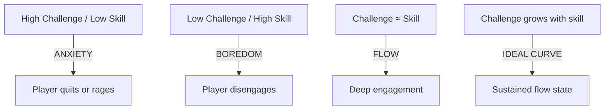
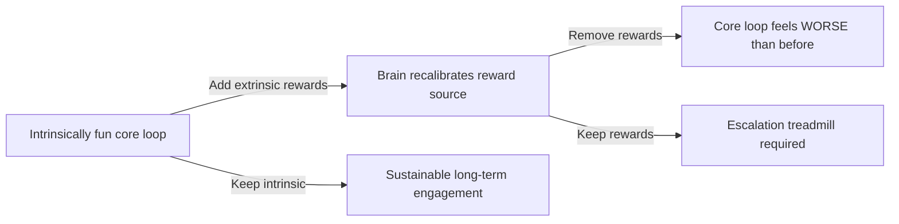

*Back to [Subject_Plan](Subject_Plan) | Part of [09 - Learning Index](09---Learning-Index)*

# 25.1 — Player Psychology & Motivation: The MDA Framework

> *"Fun is just another word for learning."*
> — **Raph Koster**, *A Theory of Fun for Game Design*

> *"The game designer does not create the experience. The game designer creates the *structure* from which the experience will emerge."*
> — **Robin Hunicke, Marc LeBlanc, Robert Zubek**, *MDA: A Formal Approach to Game Design and Game Research* (2004)

Why do people play games? Not because they're told to. Not because they're paid. They play because games satisfy deep psychological needs — mastery, autonomy, relatedness, curiosity, and the primal pleasure of pattern recognition. This chapter gives you the theoretical toolkit to understand *why* players engage, *what* they're actually experiencing, and *how* to design systems that create the emotional responses you intend.

---

## 🎯 Learning Objectives

By the end of this chapter you will be able to:

1. Decompose any game into its **Mechanics → Dynamics → Aesthetics** layers using the MDA framework.
2. Identify which of the **8 kinds of fun** a game targets and how its mechanics produce them.
3. Apply **Csikszentmihalyi's Flow model** to diagnose difficulty curve problems.
4. Map **Self-Determination Theory** (autonomy, competence, relatedness) to specific design decisions.
5. Recognize **reinforcement schedules** in game reward systems and predict their psychological effects.
6. Connect player motivation models to the underlying neuroscience (dopamine RPE, variable-ratio conditioning).
7. Design reward systems that create engagement without exploitation.

---

## 🖼️ Visual Anchor — The MDA Framework


---


## 📚 1. Concepts & Frameworks

### 1.1 — The MDA Framework (Hunicke, LeBlanc, Zubek, 2004)

MDA is the foundational analytical lens for game design. It decomposes games into three layers:

**Mechanics** — The rules, algorithms, and data structures that constitute the game system. These are what the designer builds: "the player can jump," "enemies deal 10 damage," "resources regenerate at 1/second."

**Dynamics** — The emergent behavior that arises when players interact with mechanics. These are what *happens*: "players hoard resources before boss fights," "speedrunners exploit wall-jump physics," "alliances form and betray in multiplayer."

**Aesthetics** — The emotional responses evoked in the player. These are what players *feel*: tension, triumph, curiosity, camaraderie, wonder.

#### The Dual Perspective

The critical insight of MDA: **designers and players approach the game from opposite directions.**

- **Designer's view:** Mechanics → Dynamics → Aesthetics (I build rules, hope behavior emerges, pray players feel something)
- **Player's view:** Aesthetics → Dynamics → Mechanics (I feel something, notice patterns, eventually understand rules)

This asymmetry explains why so many games fail: designers obsess over mechanics without tracing the causal chain to the emotional endpoint. MDA forces you to work backward from the feeling you want to create.

#### The 8 Kinds of Fun (Aesthetic Taxonomy)

LeBlanc's taxonomy of aesthetic goals — every game targets a subset:

| # | Aesthetic | Description | Example Games |
|---|-----------|-------------|---------------|
| 1 | **Sensation** | Game as sense-pleasure | Beat Saber, Flower, Rez |
| 2 | **Fantasy** | Game as make-believe | Skyrim, D&D, Animal Crossing |
| 3 | **Narrative** | Game as drama | Last of Us, Disco Elysium |
| 4 | **Challenge** | Game as obstacle course | Dark Souls, Celeste, Trials |
| 5 | **Fellowship** | Game as social framework | Among Us, MMOs, party games |
| 6 | **Discovery** | Game as uncharted territory | Outer Wilds, Zelda BotW, Minecraft |
| 7 | **Expression** | Game as self-discovery | Minecraft creative, Tony Hawk, BMX games |
| 8 | **Submission** | Game as pastime (zen) | Stardew Valley, idle games, Tetris |

**Design implication:** Before designing mechanics, decide which 2–3 aesthetics you're targeting. Then ask: "What dynamics would produce this feeling? What mechanics would produce those dynamics?"

#### MDA Applied: BMX Game Analysis

Consider *Mat Hoffman's Pro BMX* through MDA:
- **Target aesthetics:** Expression (#7) + Challenge (#4) + Sensation (#1)
- **Required dynamics:** Players chain tricks creatively, risk big combos for high scores, feel the speed and impact
- **Supporting mechanics:** Trick input system (button combos), multiplier chains, bail physics, time pressure, score thresholds

If you removed the multiplier chain mechanic, you'd lose the *dynamics* of risk-taking (why go for a dangerous trick when a safe one scores the same?), which would kill the *aesthetic* of challenge and expression.

---

### 1.2 — Csikszentmihalyi's Flow Theory

**Flow** is the psychological state of complete absorption in an activity — time disappears, self-consciousness fades, performance peaks. Mihaly Csikszentmihalyi identified it in 1975 and it remains the gold standard for "optimal experience."

#### The Flow Channel

Flow exists in a narrow band between two failure states:

```
High ┌─────────────────────────────┐
     │         ANXIETY             │
     │    (challenge > skill)      │
     │                             │
S    │    ╔═══════════════╗        │
k    │    ║  FLOW CHANNEL ║        │
i    │    ╚═══════════════╝        │
l    │                             │
l    │         BOREDOM             │
     │    (skill > challenge)      │
Low  └─────────────────────────────┘
      Low      Challenge       High
```

#### The 8 Conditions of Flow

1. **Clear goals** — The player always knows what to do next
2. **Immediate feedback** — Every action has a visible/audible result
3. **Challenge-skill balance** — Not too hard, not too easy
4. **Concentration** — The task demands full attention
5. **Loss of self-consciousness** — No room for self-doubt
6. **Sense of control** — Player feels agency over outcomes
7. **Altered sense of time** — Hours feel like minutes
8. **Autotelic experience** — The activity is intrinsically rewarding

#### Flow in Game Design

Every condition maps to a design decision:

| Flow Condition | Design Implementation |
|---------------|----------------------|
| Clear goals | Quest markers, objective UI, level structure |
| Immediate feedback | Juice, hit effects, score popups, audio cues |
| Challenge-skill balance | Dynamic difficulty, difficulty selection, skill-based matchmaking |
| Concentration demand | Remove distractions, maintain pacing, avoid dead time |
| Control | Responsive inputs (<100ms), predictable physics, fair rules |
| Time distortion | Seamless sessions, no forced interruptions |
| Intrinsic reward | Mastery curves, discovery, expression |

**The designer's job is to keep the player in the flow channel** — continuously escalating challenge to match growing skill, with rest beats to prevent exhaustion.

---

### 1.3 — Self-Determination Theory (Deci & Ryan, 2000)

SDT identifies three innate psychological needs that drive intrinsic motivation:

**Autonomy** — The need to feel that your actions are self-chosen, not coerced.
- *In games:* Open worlds, multiple solutions, player-driven goals, sandbox freedom
- *Violated by:* Unskippable tutorials, forced linear paths, "you must do X to continue"

**Competence** — The need to feel effective and masterful.
- *In games:* Skill progression, difficulty curves, mastery feedback, "you died" → "you won"
- *Violated by:* Unfair difficulty spikes, pay-to-win, RNG-dependent outcomes

**Relatedness** — The need to feel connected to others.
- *In games:* Co-op, guilds, shared experiences, leaderboards, community events
- *Violated by:* Toxic communities, forced solo play, no social features

#### SDT × MDA Mapping

| SDT Need | MDA Aesthetics Served | Design Patterns |
|----------|----------------------|-----------------|
| Autonomy | Discovery, Expression, Fantasy | Open worlds, build systems, character creation |
| Competence | Challenge, Sensation | Difficulty curves, combo systems, speedrun timers |
| Relatedness | Fellowship, Narrative | Co-op, guilds, shared stories, emotes |

---

### 1.4 — Bartle's Player Types (1996)

Richard Bartle's taxonomy of MUD players, still useful as a rough heuristic:

| Type | Motivation | Acts on... | Example Behavior |
|------|-----------|------------|-----------------|
| **Achiever** | Mastery, completion | World | 100% completion, all achievements |
| **Explorer** | Discovery, understanding | World | Finding secrets, testing boundaries |
| **Socializer** | Connection, community | Players | Chatting, helping, roleplaying |
| **Killer** | Dominance, competition | Players | PvP, griefing, leaderboard climbing |

**Modern refinement:** Bartle's types are better understood as *motivational axes* than fixed categories. Most players blend types depending on context. Quantic Foundry's research (Nick Yee) identifies 6 motivation clusters with 12 sub-motivations — more nuanced but harder to design for.

---

### 1.5 — Koster's Theory of Fun

Raph Koster's central thesis: **Fun is the emotional response to learning patterns.**

The brain is a pattern-recognition machine. When it encounters a new pattern (a game mechanic, a puzzle structure, a skill challenge), it experiences pleasure in the process of mastering it. Once the pattern is fully internalized, the game becomes boring — the brain has "consumed" it.

**Implications:**
- Games must continuously introduce new patterns (or deepen existing ones)
- "Too easy" = patterns are trivial to recognize (boredom)
- "Too hard" = patterns are unrecognizable (frustration/anxiety)
- "Fun" = patterns at the edge of comprehension (flow)
- Replayability comes from pattern *depth* (chess) or pattern *variety* (roguelikes)

**Koster's Corollary:** A game that can be fully mastered is a game that will eventually be abandoned. The deepest games have patterns that take years to exhaust (Go, competitive fighting games, Minecraft redstone).


---

## 🧠 2. Player Psychology Underneath

This section connects game design theory to the neuroscience and behavioral psychology covered in Tracks 11 and 12. Understanding *why* these frameworks work at the biological level makes you a more precise designer.

### 2.1 — Dopamine and the Reward Prediction Error

The neurotransmitter dopamine does **not** signal pleasure. It signals **surprise** — specifically, the difference between expected and received reward. This is the Reward Prediction Error (RPE):

$$
\delta_t = r_t + \gamma V(s_{t+1}) - V(s_t)
$$

(Full derivation: [06.2 - Dopamine & Reward Prediction Error](06.2---Dopamine-&-Reward-Prediction-Error))

**For game designers, this means:**

- **Expected rewards feel like nothing.** If the player knows they'll get 100 gold for killing a goblin, the 100th goblin produces zero dopamine. The reward is fully predicted.
- **Unexpected rewards feel amazing.** A random legendary drop, an unexpected shortcut, a surprise boss — these produce massive positive RPE (dopamine burst).
- **Missing expected rewards feels terrible.** If a chest *usually* has loot but this one is empty, the player experiences negative RPE (dopamine dip) — disappointment disproportionate to the actual loss.

**Design principle:** The most engaging reward systems are **partially predictable**. The player knows *something* good will happen, but not exactly *what* or *when*. This is why variable-ratio reinforcement schedules are so powerful.

### 2.2 — Reinforcement Schedules in Game Design

From behavioral psychology ([06.1 - Classical & Operant Conditioning](06.1---Classical-&-Operant-Conditioning)), four reinforcement schedules:

| Schedule | Definition | Game Example | Engagement Pattern |
|----------|-----------|--------------|-------------------|
| **Fixed-Ratio (FR)** | Reward every N actions | "Kill 10 boars for XP" | Steady but boring; post-reward pause |
| **Variable-Ratio (VR)** | Reward after random N actions | Loot drops, gacha pulls | Highest engagement; resistant to extinction |
| **Fixed-Interval (FI)** | Reward every N seconds | Daily login bonus | Scalloping (ignore until timer near) |
| **Variable-Interval (VI)** | Reward at random times | Random events, invasions | Steady moderate engagement |

**Variable-ratio is the most powerful** because the player can never predict exactly when the next reward arrives. Each action *might* be the one that pays off. This creates persistent engagement — and is also the mechanism behind gambling addiction.

**Ethical design question:** Variable-ratio schedules are not inherently evil. Diablo's loot system and Stardew Valley's fishing both use VR schedules. The ethical line is whether the player is spending *time* (acceptable) or *money* (exploitative) on each "pull."

### 2.3 — Flow as Neurochemical State

Flow isn't just a psychological concept — it has a specific neurochemical signature:

| Neurochemical | Role in Flow | Design Lever |
|--------------|-------------|--------------|
| **Dopamine** | Motivation, reward anticipation | Clear goals with uncertain outcomes |
| **Norepinephrine** | Focus, arousal | Time pressure, stakes, consequences |
| **Endorphins** | Pain masking, persistence | Difficulty that pushes limits |
| **Anandamide** | Lateral thinking, pattern recognition | Creative problem-solving |
| **Serotonin** | Satisfaction, completion | Achievement, progress bars, mastery |

(Deep dive: [05.6 - Neuromodulators - Dopamine, Serotonin, Acetylcholine](05.6---Neuromodulators---Dopamine,-Serotonin,-Acetylcholine))

**The flow trigger stack for games:**
1. **Clear goals** → prefrontal cortex can focus (reduces DMN activity)
2. **Immediate feedback** → dopamine RPE loop stays active
3. **Challenge-skill balance** → norepinephrine at optimal arousal (Yerkes-Dodson)
4. **Rich environment** → pattern recognition circuits engaged (Koster's "fun")

### 2.4 — Intrinsic vs. Extrinsic Motivation (The Overjustification Effect)

**Intrinsic motivation:** Playing because the activity itself is rewarding (curiosity, mastery, expression).
**Extrinsic motivation:** Playing for external rewards (achievements, leaderboards, unlocks).

**The overjustification effect** (Deci, 1971): Adding extrinsic rewards to an intrinsically motivating activity can *reduce* intrinsic motivation. Once the external reward is removed, engagement drops below the original baseline.

**Game design implication:**
- Don't reward players for things they'd do anyway (exploring, experimenting)
- Use extrinsic rewards to *introduce* behaviors, then fade them as intrinsic motivation develops
- Achievement systems work best when they *acknowledge* mastery rather than *incentivize* grinding

**Example:** Zelda BotW gives you Korok seeds for exploring — but exploration was already intrinsically fun. The seeds are acknowledgment ("you found something!"), not the reason to explore. Compare to a game that locks content behind collectible counts — now exploration becomes a chore.

### 2.5 — Loss Aversion and Prospect Theory

Kahneman & Tversky's prospect theory: **losses feel ~2× worse than equivalent gains feel good.**

$$
\text{Psychological impact of loss} \approx 2 \times \text{Psychological impact of equivalent gain}
$$

**In game design:**
- Losing progress (death, item loss) is psychologically devastating
- "Souls-like" corpse runs work because the potential loss creates tension, but recovery is possible
- Roguelikes must offer *something* persistent (meta-progression) or the loss feels pointless
- Stardew Valley never takes things away — only gives. This is why it feels so relaxing.

**Dark Souls' genius:** You *can* lose your souls permanently, but only through your own failure to retrieve them. The loss feels fair because you had agency. Compare to a game that randomly deletes your inventory — same mechanical loss, completely different emotional response.

### 2.6 — The Zeigarnik Effect and Incomplete Patterns

The **Zeigarnik Effect**: Incomplete tasks occupy more mental space than completed ones. The brain *wants* to close open loops.

**In game design:**
- Quest logs create dozens of open loops → players feel compelled to return
- "Just one more turn" (Civilization) = each turn opens new loops while closing old ones
- Progress bars at 90% are almost irresistible
- Cliffhanger narrative beats keep players engaged between sessions

**Neuroscience:** Open loops maintain tonic dopamine elevation (anticipation state), keeping the reward system primed. Closing a loop produces a phasic burst (satisfaction) but also removes the tonic drive. The best games close loops while simultaneously opening new ones.


---

## 🔬 3. Design Mechanics

How to actually *apply* these psychological principles in your designs.

### 3.1 — Designing for Flow: The Difficulty Curve

**The sawtooth pattern:** Alternate between tension (challenge) and release (rest/reward). Never maintain constant intensity.

```
Intensity
    │    /\      /\        /\
    │   /  \    /  \      /  \     /\
    │  /    \  /    \    /    \   /  \
    │ /      \/      \  /      \ /    \___
    │/                \/        V
    └──────────────────────────────────── Time
     Tutorial  Early    Mid     Late   Denouement
```

**Rules of thumb:**
- Each peak should be slightly higher than the last (rising baseline)
- Rest beats should never drop below the player's current skill floor (boredom)
- The final peak should be the highest (climax)
- After climax, provide a brief denouement (emotional cooldown)

### 3.2 — Reward Timing Patterns

| Pattern | When to Use | Example |
|---------|------------|---------|
| **Immediate** | Teaching new mechanics | Coin appears instantly when block is hit |
| **Delayed (known)** | Building anticipation | "Complete 3 dungeons to unlock the master sword" |
| **Delayed (unknown)** | Creating mystery | "Something will happen when you collect all the runes..." |
| **Intermittent** | Sustaining long-term engagement | Random rare drops from enemies |
| **Cascading** | Creating "jackpot" moments | Kill combo → XP multiplier → level up → new ability → use ability to kill more |

### 3.3 — The Motivation Onion (Layered Motivation Design)

Design motivation in concentric layers so players always have a reason to continue:

1. **Moment-to-moment** (seconds): The action itself feels good (game feel, juice)
2. **Short-term** (minutes): Complete this encounter/puzzle/race
3. **Medium-term** (hours): Finish this quest/level/chapter
4. **Long-term** (days/weeks): Beat the game, reach max level, complete collection
5. **Meta** (months/years): Master the system, compete at high level, create content

**Each layer should be independently satisfying.** If your moment-to-moment gameplay isn't fun, no amount of long-term progression will save it. Conversely, if there's no long-term goal, even great moment-to-moment play eventually feels pointless.

### 3.4 — Autonomy-Supportive Design Patterns

| Pattern | Implementation | Why It Works (SDT) |
|---------|---------------|-------------------|
| **Multiple solutions** | 3+ ways to solve every challenge | Autonomy: player chose their approach |
| **Optional difficulty** | Player selects challenge level | Competence: matched to actual skill |
| **Meaningful customization** | Builds, loadouts, playstyles | Autonomy + Expression |
| **Skippable content** | Let players bypass what bores them | Autonomy: respect player's time |
| **Emergent goals** | Systems that let players set own objectives | Autonomy: self-directed play |

### 3.5 — The "One More" Hook Design

Why players say "just one more turn/run/match":

1. **Short session length** — Each unit of play is completable in 5–20 minutes
2. **Variable outcomes** — Each session could go differently (roguelikes, procedural generation)
3. **Near-miss psychology** — "I almost beat that boss / almost got the rare drop"
4. **Sunk cost momentum** — "I'm already 80% through this run..."
5. **New information** — Each session reveals something that changes your next approach

**Design template:** End each session with (a) a clear near-miss or (b) new knowledge that makes the player want to immediately apply it.

### 3.6 — Schell's Lenses (Selected)

From Jesse Schell's *Art of Game Design*, relevant lenses for player psychology:

- **Lens #1 (Emotion):** What emotions do I want my player to experience?
- **Lens #2 (Essential Experience):** What experience is essential to my game?
- **Lens #5 (Fun):** What parts are fun? Why? Can I make other parts more like them?
- **Lens #9 (Unification):** Does every element serve the central theme?
- **Lens #34 (Skill):** Does my game demand skills that players enjoy using?
- **Lens #42 (Transparency):** Can players see how their actions lead to outcomes?
- **Lens #47 (Reward):** Are rewards meaningful, well-timed, and varied?
- **Lens #68 (Flow):** Is the challenge always matched to the player's skill?


---

## 🎮 4. Case Studies

### Case Study 4.1 — Stardew Valley: The Submission-Expression Machine

**Target aesthetics:** Submission (#8), Expression (#7), Discovery (#6)

**MDA Analysis:**
- **Mechanics:** Farming grid, crop growth timers, relationship point system, seasonal calendar, energy meter
- **Dynamics:** Players develop daily routines, optimize farm layouts, pursue relationships at their own pace, discover secrets over months of play
- **Aesthetics:** Relaxation (submission), creative farm design (expression), finding hidden areas and events (discovery)

**Why it works psychologically:**
- **No fail state** → removes anxiety, enables pure flow
- **Fixed-interval rewards** (daily crops, seasonal events) → creates pleasant routine without pressure
- **Autonomy maximized** → no forced objectives, play at your own pace
- **Competence through optimization** → min-maxers can optimize; casuals can ignore it
- **Zeigarnik loops** → community center bundles, relationship milestones, mine floors

**Key insight:** Stardew never *punishes*. It only *rewards*. This is why it's therapeutic — the RPE is always ≥ 0.

---

### Case Study 4.2 — Dark Souls: Challenge as Core Aesthetic

**Target aesthetics:** Challenge (#4), Discovery (#6), Narrative (#3)

**MDA Analysis:**
- **Mechanics:** Stamina system, i-frames on dodge, bonfire checkpoints, soul currency (lost on death, recoverable once), interconnected world with shortcuts
- **Dynamics:** Players learn enemy patterns through death, develop risk-assessment skills, feel genuine triumph on boss kills, discover shortcuts that recontextualize the world
- **Aesthetics:** Intense challenge satisfaction, environmental storytelling discovery, shared community knowledge

**Why it works psychologically:**
- **High RPE on success** → because failure is common, success is genuinely surprising (massive dopamine burst)
- **Loss aversion as tension** → souls at risk create stakes without being unfair (you can always retrieve them)
- **Competence growth is visible** → the boss that killed you 30 times eventually dies in one attempt. YOU changed, not the game.
- **Flow through mastery** → difficulty is constant; your skill rises to meet it

**The Dark Souls paradox:** It's one of the most "fun" games ever made despite being one of the most punishing. This makes perfect sense through Koster's lens — the patterns are deep, learnable, and rewarding to master. The punishment makes the learning *matter*.

---

### Case Study 4.3 — Zelda: Breath of the Wild — Autonomy Perfected

**Target aesthetics:** Discovery (#6), Expression (#7), Challenge (#4)

**MDA Analysis:**
- **Mechanics:** Physics engine, chemistry system (fire spreads, metal conducts electricity, wind affects arrows), stamina-gated climbing, breakable weapons, Sheikah Slate abilities
- **Dynamics:** Players discover emergent solutions (stasis-launch boulders at enemies, surf on shields, use Magnesis to build bridges), create their own challenges, approach any problem from multiple angles
- **Aesthetics:** Constant "aha!" discovery moments, creative expression through emergent play, self-directed challenge

**Why it works psychologically:**
- **Autonomy maximized** → go anywhere, do anything, in any order (after the plateau)
- **Variable-ratio discovery** → Korok seeds, shrines, and emergent interactions are everywhere but unpredictable
- **Competence through creativity** → there's no "correct" solution, so every solution feels like YOUR invention
- **Intrinsic motivation preserved** → rewards are acknowledgment (Korok seed = "you noticed!"), not the reason to explore

**Key design lesson:** BotW's physics system creates *infinite* dynamics from *finite* mechanics. This is the holy grail of systems design — a small rule set that produces endless emergent behavior.

---

### Case Study 4.4 — Beat Saber: Flow State Machine (VR)

**Target aesthetics:** Sensation (#1), Challenge (#4), Submission (#8)

**MDA Analysis:**
- **Mechanics:** Blocks approach on beat, directional slicing, obstacle dodging, combo multiplier, haptic feedback
- **Dynamics:** Players enter rhythm-induced flow, physical movement creates embodied engagement, difficulty scales with song BPM and pattern complexity
- **Aesthetics:** Pure sensory pleasure, physical challenge satisfaction, meditative submission to rhythm

**Why it works psychologically:**
- **Immediate feedback** → haptic + visual + audio on every slice (triple-channel confirmation)
- **Flow conditions perfectly met** → clear goals (hit blocks), immediate feedback (score/haptics), challenge-skill match (difficulty levels)
- **Embodied cognition** → physical movement activates motor cortex, creating deeper engagement than button-pressing
- **Rhythm as flow trigger** → musical beat provides external pacing that prevents both rushing and hesitation

**VR-specific insight:** Beat Saber proves that VR's killer app isn't visual fidelity — it's *embodied game feel*. The haptic feedback of slicing through a block satisfies at a primal motor level that flat games cannot replicate.

---

### Case Study 4.5 — Mat Hoffman's Pro BMX: Expression Through Constraint

**Target aesthetics:** Expression (#7), Challenge (#4), Sensation (#1)

**MDA Analysis:**
- **Mechanics:** Trick input combos (direction + button), grind rails, air time multiplier, combo chain system, time limit per run, score thresholds for progression
- **Dynamics:** Players develop personal trick vocabularies, chain grinds into air tricks for multipliers, compete for high scores, develop "lines" through levels
- **Aesthetics:** Creative self-expression through trick selection, challenge of maintaining combos, visceral sensation of speed and height

**Why it works psychologically:**
- **Expression through constraint** → limited trick inputs create a "vocabulary" that players combine creatively (like language)
- **Risk/reward via combo system** → longer chains = higher score but higher bail risk (loss aversion creates tension)
- **Competence ladder** → clear progression from basic tricks to complex chains
- **Autonomy in approach** → same level, infinite "lines" — your path is your signature

**BMX design insight:** The trick system works because it mirrors real BMX riding — you develop a personal style within physical constraints. The game's mechanics respect the *culture* of the sport (style > difficulty).


---

## ✏️ 5. Worked Design Exercises

### Exercise 5.1 — MDA Decomposition

**Prompt:** Pick a game you played this week. Decompose it into Mechanics → Dynamics → Aesthetics. Identify which of the 8 aesthetics it targets. Then identify one mechanic that, if removed, would break the aesthetic chain.

<details>
<summary>Example Solution: Hades</summary>

**Mechanics:** Roguelite structure (permadeath + meta-progression), boon selection (random god offerings), weapon variety (6 weapons × aspects), relationship system (gifts between runs), heat system (voluntary difficulty modifiers)

**Dynamics:** Each run feels different (boon combos), players develop weapon preferences, narrative advances through death (NPCs react to your failures), heat system lets skilled players self-challenge

**Aesthetics:** Challenge (#4) — each run is a skill test. Narrative (#3) — story progresses through failure. Discovery (#6) — new boon combos and dialogue. Expression (#7) — weapon/build choices.

**Critical mechanic:** If you removed the boon selection system, runs would feel identical (no Discovery), builds wouldn't vary (no Expression), and the game would become pure execution (losing Narrative pacing through variety). The random boon offerings are the keystone mechanic.

</details>

---

### Exercise 5.2 — Fix the Motivation Gap

**Prompt:** A farming sim has a problem: players engage heavily for the first 10 hours (planting, harvesting, upgrading) but quit around hour 15. The mid-game feels like "more of the same." Using the motivation frameworks from this chapter, diagnose the problem and propose 3 solutions.

<details>
<summary>Solution</summary>

**Diagnosis:** The game has strong short-term motivation (plant → harvest → sell → upgrade) but the medium-term loop hasn't evolved. By hour 15, the player has mastered the core pattern (Koster: pattern consumed → boredom). The flow channel has been violated — skill has grown but challenge hasn't.

**Solution 1 — Introduce new patterns (Koster):**
At hour 10, unlock a fundamentally new system: animal husbandry, crafting, or a dungeon. This gives the brain new patterns to learn, restarting the fun cycle.

**Solution 2 — Add social/narrative hooks (SDT: Relatedness):**
Introduce NPC relationships that deepen over time. The Stardew Valley approach — characters with multi-stage storylines that only unlock after sustained play. This adds a medium-term Zeigarnik loop.

**Solution 3 — Escalate challenge (Flow):**
Introduce seasonal challenges, weather disasters, or market fluctuations that force the player to adapt their optimized strategy. The patterns they learned in hours 1–10 become insufficient — they must learn *new* patterns built on the old ones (skill stacking).

**Meta-principle:** The mid-game gap almost always means the game taught its core patterns too quickly and didn't have a second act of complexity waiting.

</details>

---

### Exercise 5.3 — Design a Reward Schedule

**Prompt:** You're designing a BMX trick game. The player earns "style points" for tricks. Design a reward schedule that: (a) teaches new players which tricks are valuable, (b) keeps experienced players engaged long-term, and (c) doesn't feel exploitative.

<details>
<summary>Solution</summary>

**Layer 1 — Fixed-ratio (teaching):**
First 20 tricks: every trick earns a flat bonus + a "NEW TRICK UNLOCKED" popup. This teaches the input system and provides immediate competence feedback.

**Layer 2 — Variable-ratio (engagement):**
After basics are learned: introduce a "Style Meter" that fills based on variety and difficulty. When full, it triggers a random "Style Bonus" (2×, 3×, or 5× multiplier on next trick). The variable magnitude creates RPE spikes.

**Layer 3 — Skill-based escalation (mastery):**
Combo chains multiply exponentially: 2 tricks = 1.5×, 3 = 2×, 5 = 4×, 10 = 10×. This creates a natural risk/reward curve — longer chains are more rewarding but riskier (one bail = lose everything). Experienced players chase longer chains for the thrill.

**Layer 4 — Social acknowledgment (relatedness):**
Weekly "Best Line" community challenges. Players submit their best combo video. Top lines get featured. This is extrinsic but non-exploitative — it acknowledges mastery rather than incentivizing spending.

**Why this isn't exploitative:** All rewards are earned through skill and time, never purchased. The variable-ratio element (Style Meter) uses *time* as the currency, not money. The player always knows what they're working toward.

</details>

---

### Exercise 5.4 — Flow Channel Repair

**Prompt:** Players report that your action-RPG boss fights are "unfair" even though testing shows they're beatable. The bosses have complex multi-phase patterns. Diagnose the flow problem and propose fixes without making bosses easier.

<details>
<summary>Solution</summary>

**Diagnosis:** The issue isn't difficulty — it's *readability*. Players can't recognize the patterns fast enough to learn them. The flow channel is violated not because challenge > skill, but because the feedback loop is broken: players die without understanding *why*.

**Fix 1 — Telegraph attacks clearly:**
Every boss attack should have a 0.5–1s wind-up animation that visually communicates the attack type and danger zone. Players need to *see* the pattern before they can learn it.

**Fix 2 — Reduce phase complexity:**
Instead of 5 attack types in phase 1, use 2–3. Introduce new attacks in later phases. This creates a learning ladder within the fight itself.

**Fix 3 — Add "near-miss" feedback:**
When a player barely dodges an attack, play a distinct audio cue and slow-mo flash. This teaches them "that was the correct response" without reducing difficulty. It's positive RPE for the dodge itself.

**Fix 4 — Shorten the punishment loop:**
If the boss fight is 5 minutes and the player dies at minute 4, they must replay 4 minutes of mastered content to attempt the hard part again. Solution: mid-fight checkpoint or faster run-back. The *challenge* stays the same; the *tedium* is removed.

**Principle:** "Unfair" usually means "I can't learn from my deaths." Make the learning loop tighter and the patterns more readable, and the same difficulty will feel fair.

</details>

---

### Exercise 5.5 — Ethical Engagement Audit

**Prompt:** A mobile game uses these engagement mechanics: (1) daily login streak with escalating rewards, (2) energy system that refills over 4 hours or can be purchased, (3) limited-time events that disappear after 48 hours, (4) loot boxes for cosmetics. Evaluate each through the lens of player psychology and SDT. Which are ethical? Which are exploitative?

<details>
<summary>Solution</summary>

**(1) Daily login streak — BORDERLINE:**
- Mechanism: Loss aversion (breaking streak = losing accumulated bonus)
- SDT violation: Undermines autonomy (player feels *obligated* to log in, not *wanting* to)
- Ethical if: Streak rewards are minor bonuses, not essential content. Missing a day doesn't reset everything.
- Exploitative if: Missing one day resets a 30-day streak (manufactured loss aversion)

**(2) Energy system — EXPLOITATIVE:**
- Mechanism: Artificial scarcity creating purchase pressure
- SDT violation: Destroys autonomy ("you can't play when you want unless you pay")
- The energy system exists solely to monetize impatience. It adds no gameplay value.
- Exception: If energy is generous enough that paying is never necessary (rare)

**(3) Limited-time events (48hr) — EXPLOITATIVE:**
- Mechanism: FOMO (fear of missing out) + scarcity principle
- SDT violation: Autonomy destroyed (play NOW or lose forever)
- Creates anxiety rather than enjoyment. Players feel punished for having a life.
- Ethical alternative: Events return on rotation; exclusive items are cosmetic only

**(4) Loot boxes for cosmetics — BORDERLINE:**
- Mechanism: Variable-ratio reinforcement (gambling psychology)
- SDT: Doesn't violate competence (no gameplay advantage) but exploits the dopamine system
- Ethical if: Drop rates are transparent, items are tradeable, and there's a pity system
- Exploitative if: Rates are hidden, items are untradeable, and whales are targeted

**Summary:** The energy system and FOMO events are clearly exploitative (they manufacture negative emotions to drive spending). Login streaks and cosmetic loot boxes exist in a gray zone depending on implementation details.

</details>


---

## ⚠️ 6. Common Pitfalls & Anti-Patterns

### Anti-Pattern 25.1 — "Mechanics-First" Design Without Aesthetic Target

**The mistake:** Building cool mechanics without asking "what should the player *feel*?"
**The result:** A technically impressive game that nobody enjoys. The mechanics don't serve a coherent emotional experience.
**The fix:** Always start with MDA from the right: "I want players to feel X. What dynamics would create that? What mechanics would produce those dynamics?"

### Anti-Pattern 25.2 — Confusing Difficulty with Depth

**The mistake:** Making a game harder to make it "more engaging."
**The result:** Players in the anxiety zone. Frustration, not flow.
**The fix:** Depth comes from *meaningful choices*, not from punishment. Chess is infinitely deep but has simple rules. Dark Souls is hard but *fair* — every death teaches something.

### Anti-Pattern 25.3 — Reward Inflation

**The mistake:** Giving bigger and bigger rewards to maintain engagement (level 1: 10 gold; level 50: 10,000,000 gold).
**The result:** Numbers become meaningless. The player adapts to the new baseline (hedonic treadmill). You're in an arms race against their dopamine system.
**The fix:** Reward *variety* rather than *magnitude*. A new ability is more exciting than a bigger number. A surprise event is more engaging than a predictable escalation.

### Anti-Pattern 25.4 — Extrinsic Reward Addiction

**The mistake:** Layering so many achievements, dailies, and progression systems that players only engage for the rewards, not the gameplay.
**The result:** Players "play" but don't enjoy it. They feel obligated. When rewards stop, they quit entirely (overjustification effect).
**The fix:** Ensure the core loop is intrinsically fun *without* any progression system. Then add progression as seasoning, not the main course.

### Anti-Pattern 25.5 — One-Size-Fits-All Motivation

**The mistake:** Designing only for Achievers (or only for Explorers, etc.).
**The result:** You capture one player type and alienate the rest.
**The fix:** Layer multiple motivation systems. Stardew Valley serves Achievers (completion), Explorers (secrets), Socializers (relationships), and Submitters (routine) simultaneously — each player engages with the systems that match their type.

### Anti-Pattern 25.6 — The "Skinner Box" Trap

**The mistake:** Designing a game that's *only* a reinforcement schedule with no intrinsic value.
**The result:** Players engage compulsively but feel empty. They describe the game as "addictive but not fun." Eventually they quit with resentment.
**The fix:** Variable-ratio schedules should *enhance* intrinsically fun gameplay, not replace it. If you remove all rewards and the game isn't fun, you've built a Skinner box, not a game.

---

## 🔗 7. Cross-links & Further Reading

### Internal Vault Links
- [25.2 - Core Mechanics & Systems Design](25.2---Core-Mechanics-&-Systems-Design) — Next: building the mechanics that serve these psychological goals
- [25.3 - Dynamics, Balance & Feedback Loops](25.3---Dynamics,-Balance-&-Feedback-Loops) — How mechanics interact to create emergent dynamics
- [25.6 - Aesthetics, Juice & Game Feel](25.6---Aesthetics,-Juice-&-Game-Feel) — The moment-to-moment "sensation" aesthetic in depth
- [06.2 - Dopamine & Reward Prediction Error](06.2---Dopamine-&-Reward-Prediction-Error) — Full neuroscience of reward prediction
- [06.1 - Classical & Operant Conditioning](06.1---Classical-&-Operant-Conditioning) — Reinforcement schedules in depth
- [05.6 - Neuromodulators - Dopamine, Serotonin, Acetylcholine](05.6---Neuromodulators---Dopamine,-Serotonin,-Acetylcholine) — Neurochemistry of flow and motivation
- [23.7 - Reinforcement Learning & RLHF](23.7---Reinforcement-Learning-&-RLHF) — The math behind reward signals

### Authoritative Sources
1. **Hunicke, R., LeBlanc, M., & Zubek, R.** (2004). MDA: A Formal Approach to Game Design and Game Research. *AAAI Workshop on Challenges in Game AI*.
2. **Csikszentmihalyi, M.** (1990). *Flow: The Psychology of Optimal Experience*. Harper & Row.
3. **Koster, R.** (2013). *A Theory of Fun for Game Design* (2nd ed.). O'Reilly Media.
4. **Deci, E. L. & Ryan, R. M.** (2000). The "What" and "Why" of Goal Pursuits: Human Needs and the Self-Determination of Behavior. *Psychological Inquiry*, 11(4), 227–268.
5. **Schell, J.** (2019). *The Art of Game Design: A Book of Lenses* (3rd ed.). CRC Press.
6. **Bartle, R.** (1996). Hearts, Clubs, Diamonds, Spades: Players Who Suit MUDs. *Journal of MUD Research*, 1(1).
7. **Kahneman, D. & Tversky, A.** (1979). Prospect Theory: An Analysis of Decision under Risk. *Econometrica*, 47(2), 263–291.

### Video Resources
- **GMTK** — "What Makes a Good Game?" (overview of fun)
- **GMTK** — "How Game Designers Protect Players From Themselves"
- **Extra Credits** — "Aesthetics of Play" (MDA series)
- **Masahiro Sakurai** — "Grab the Player's Attention" (reward timing)
- **GDC Vault** — Raph Koster, "A Theory of Fun: 10 Years Later"

---

## 🧪 8. Extended Design Exercises & Case Studies

### Exercise 8.1 — Bartle Taxonomy Critique & Reconstruction

Richard Bartle's 1996 taxonomy (Achievers, Explorers, Socializers, Killers) was groundbreaking for MUD design but has significant limitations when applied to modern games. This exercise asks you to stress-test it.

**Part A — Taxonomy Failure Cases**

For each game below, identify a player behavior that *doesn't fit* cleanly into any Bartle type:

1. **Minecraft creative mode** — A player who builds elaborate pixel art for no audience and no achievement system.
2. **Dark Souls** — A player who invades others not to "kill" but to role-play as a helpful phantom who drops items.
3. **Animal Crossing** — A player who time-travels to manipulate the stalk market, treating it as a spreadsheet optimization problem.
4. **EVE Online** — A player who runs a corporation's logistics (spreadsheets, supply chains) without ever engaging in combat or exploration.

<details>
<summary>🔍 Analysis</summary>

1. **Minecraft pixel artist** — Not an Achiever (no system rewards), not an Explorer (not discovering), not a Socializer (alone), not a Killer. This is **self-expression** — a motivation Bartle's model doesn't capture. Yee's model calls this "Customization."

2. **Helpful Dark Souls invader** — Uses the Killer mechanic (invasion) for Socializer goals (helping). Bartle's types assume the *system affordance* maps to the *motivation*, but players subvert systems constantly.

3. **Animal Crossing time-traveler** — Uses an Explorer mechanic (time manipulation) for Achiever goals (wealth optimization). The player's *relationship to the system* is adversarial/analytical — closer to a "Scientist" type that Bartle doesn't model.

4. **EVE logistics player** — Not killing, not exploring, not socializing for its own sake, not achieving in-game goals. This is **systems mastery** and **organizational competence** — the pleasure of making complex systems run smoothly. Yee calls this "Mechanics" motivation.

**Conclusion:** Bartle's taxonomy conflates *what players do* (behavior) with *why they do it* (motivation). A player can use any mechanic for any psychological goal. Modern frameworks must separate behavior from motivation.

</details>

**Part B — Yee's Motivation Model (2006)**

Nick Yee's empirical factor analysis of 3,000+ MMO players identified three primary motivation components, each with sub-components:

```yaml
Achievement:
  - Advancement: Progress, power, accumulation, status
  - Mechanics: Numbers, optimization, min-maxing, theorycrafting
  - Competition: Challenging others, provocation, domination

Social:
  - Socializing: Casual chat, helping others, making friends
  - Relationship: Personal, self-disclosure, find/give support
  - Teamwork: Collaboration, groups, group achievements

Immersion:
  - Discovery: Exploration, lore, finding hidden things
  - Role-Playing: Story line, character history, roles, fantasy
  - Customization: Appearances, accessories, style, color schemes
  - Escapism: Relaxation, escape from real life, avoid real problems
```

**Design Exercise:** Take a game you're designing (or a game you play heavily). Score yourself 1-5 on each of Yee's 10 sub-components. Then ask: does the game serve your top 3 motivations well? What's missing?

**Part C — Self-Determination Theory (SDT) Mapping**

Deci & Ryan's SDT identifies three innate psychological needs:

| Need | Definition | Game Design Lever |
|------|-----------|-------------------|
| **Autonomy** | Feeling of choice and self-direction | Multiple valid strategies; open worlds; player-driven goals |
| **Competence** | Feeling of mastery and effectiveness | Clear feedback; appropriate challenge; visible skill growth |
| **Relatedness** | Feeling of connection to others | Co-op; guilds; shared experiences; meaningful NPCs |

**Exercise:** For each need, identify ONE game that satisfies it exceptionally and ONE that fails at it. Explain the specific design decisions responsible.

<details>
<summary>🔍 Example Analysis</summary>

**Autonomy — Success: Breath of the Wild**
- No prescribed order. See a mountain? Climb it now.
- Multiple solutions to every puzzle (physics sandbox)
- Player sets their own goals (shrines, Korok seeds, story, or just wandering)
- Design decision: removed linear progression gates

**Autonomy — Failure: Final Fantasy XIII (first 20 hours)**
- Literal corridor. One path forward.
- Party composition locked. No meaningful choices.
- "Press forward and watch cutscenes" for hours
- Design decision: prioritized cinematic pacing over player agency

**Competence — Success: Celeste**
- Instant respawn (failure cost is near-zero)
- Each screen teaches exactly one skill
- Death counter shows progress ("I died 400 times but I DID IT")
- Assist mode available without shame
- Design decision: separated difficulty from punishment

**Competence — Failure: Early Destiny 2 PvP**
- Time-to-kill so fast that new players die before understanding what happened
- No clear feedback on WHY you died
- Matchmaking put new players against veterans
- Design decision: prioritized veteran satisfaction over onboarding

**Relatedness — Success: Journey (thatgamecompany)**
- Anonymous co-op with strangers
- Only communication: musical chirps
- Shared struggle creates emotional bond
- Players report crying at the end — with a stranger
- Design decision: removed all competitive/toxic affordances

**Relatedness — Failure: Most single-player mobile games**
- "Social" features are just leaderboards (comparison, not connection)
- "Guilds" require no actual interaction
- Other players are numbers, not people
- Design decision: social features as retention metrics, not genuine connection

</details>

---

### Exercise 8.2 — Flow Channel Calibration Workshop

Csikszentmihalyi's flow model predicts engagement based on the relationship between challenge and skill. This exercise teaches you to *diagnose* and *fix* flow problems.

**The Flow Channel:**



**Case Study: Dark Souls vs. Candy Crush — Two Flow Philosophies**

**Dark Souls** maintains flow through:
- **Fixed challenge, growing skill** — The boss doesn't get easier; YOU get better
- **Mastery feedback** — You can feel yourself improving (fewer hits taken, faster kills)
- **Voluntary difficulty** — Players choose to attempt harder areas early
- **Recovery from anxiety** — Grinding souls/levels provides a "lower the challenge" escape valve

**Candy Crush** maintains flow through:
- **Adaptive challenge** — Levels get harder, but power-ups/lives provide relief
- **Artificial difficulty spikes** — Force players into the anxiety zone to sell solutions
- **Random variance** — Sometimes you win easily (dopamine hit), sometimes you can't (frustration → purchase)
- **Session length control** — Lives system prevents boredom from overplay

**Exercise:** Map the flow channel for YOUR game's first 30 minutes. For each 5-minute segment:
1. What new skill is the player learning?
2. What challenge tests that skill?
3. Is the player likely in flow, anxiety, or boredom?
4. What's your recovery mechanism if they hit anxiety?

<details>
<summary>🔍 Diagnostic Framework</summary>

**Signs of Anxiety Zone:**
- Players attempt the same section 5+ times without progress
- Players look up guides/walkthroughs
- Players lower difficulty settings
- Players quit and don't return
- Biometric: elevated heart rate, tense posture, verbal frustration

**Signs of Boredom Zone:**
- Players check their phone during gameplay
- Players skip dialogue/cutscenes
- Players ask "when does it get good?"
- Session lengths decrease over time
- Biometric: low arousal, distracted gaze, yawning

**Signs of Flow:**
- Players lose track of time ("wait, it's 3 AM?")
- Players say "one more try" or "one more level"
- Players lean forward, focused gaze
- Players describe the experience as "fun" without being able to articulate why
- Biometric: moderate arousal, focused attention, micro-expressions of satisfaction

**Recovery Mechanisms (Anxiety → Flow):**
- Dynamic difficulty adjustment (rubber-banding)
- Optional hints/assists (Celeste assist mode)
- Grinding/leveling (RPG safety valve)
- Alternative paths (skip this challenge, try another)
- Social help (co-op summons in Souls games)

**Engagement Mechanisms (Boredom → Flow):**
- Introduce new mechanics/verbs
- Increase enemy variety/complexity
- Add time pressure or resource scarcity
- Narrative hooks (cliffhangers, mysteries)
- Skill-expression opportunities (style points, combos)

</details>

---

### Exercise 8.3 — Reinforcement Schedule Audit

Audit a game's reward systems by identifying every reinforcement schedule in operation.

**Target Game: Hades (Supergiant Games)**

| Reward | Schedule Type | Interval/Ratio | Psychological Effect |
|--------|--------------|----------------|---------------------|
| Boon selection | Fixed-ratio (every room clear) | Every 1-3 rooms | Competence + anticipation |
| Darkness currency | Continuous | Every enemy kill | Accumulation satisfaction |
| Titan Blood | Variable-ratio | Boss kills (variable difficulty) | Achievement + surprise |
| Story dialogue | Variable-interval | Between runs (not every run) | Curiosity + relatedness |
| New weapon aspects | Fixed-ratio (Titan Blood count) | Every 1-3 bloods | Long-term goal pursuit |
| Relationship milestones | Variable-ratio | Gift + run count | Emotional investment |
| Mirror upgrades | Fixed-ratio (Darkness threshold) | Predictable | Competence scaffolding |
| Prophecy completion | Variable-ratio | Emergent from play | Discovery + mastery |

**Exercise:** Perform this audit on YOUR game or a game you're studying. Then answer:
1. Which schedule creates the strongest "one more run" compulsion?
2. Which reward has the longest delay between action and payoff?
3. Is any reward on a continuous schedule that should be variable? (Continuous = boring over time)
4. Are there any rewards that feel *exploitative* rather than *engaging*?

---

### Case Study 8.4 — The Overjustification Effect in Pokémon GO

**The Problem:** Pokémon GO launched with massive intrinsic motivation — the fantasy of catching Pokémon in the real world. Players walked miles voluntarily.

**The Intervention:** Niantic added daily streaks, weekly research tasks, and community day FOMO events.

**The Result:** Players who previously walked for fun now walked for streaks. When they missed a day, they felt *punished* rather than simply *not playing*. The extrinsic reward system *replaced* intrinsic motivation rather than supplementing it.

**The Neuroscience (cross-link [06.2 - Dopamine & Reward Prediction Error](06.2---Dopamine-&-Reward-Prediction-Error)):**

When an activity is intrinsically rewarding, dopamine fires during the activity itself (the doing IS the reward). When extrinsic rewards are layered on top:

1. Dopamine shifts from the activity to the reward anticipation
2. The activity becomes a *means* to the reward, not an end
3. Remove the reward → negative RPE (δ < 0) → the activity now feels *worse* than before any reward existed

This is the **overjustification effect** — extrinsic rewards can *destroy* intrinsic motivation.

**Design Lesson:** If your core loop is intrinsically fun, be VERY careful about adding extrinsic reward systems. They should enhance, not replace. Test by removing all rewards — is the game still fun? If not, you've built a Skinner box.

---

### Case Study 8.5 — Autonomy Illusion in The Stanley Parable

**Design Question:** Can a game about *lack of choice* satisfy the autonomy need?

**Analysis:** The Stanley Parable gives players the *feeling* of rebellion and choice while being entirely scripted. Every "disobedient" action is anticipated and narrated. The game satisfies autonomy not through *actual* freedom but through:

1. **Acknowledged agency** — The narrator reacts to your choices, making you feel seen
2. **Subversion as choice** — Choosing to disobey IS a meaningful choice (even if scripted)
3. **Meta-autonomy** — You choose which ending to pursue, which path to explore
4. **Intellectual autonomy** — The game respects your intelligence; you're a co-creator of meaning

**SDT Insight:** Autonomy isn't about *unlimited options* — it's about feeling that your choices *matter*. A game with 2 meaningful choices can feel more autonomous than a game with 100 meaningless ones.

---

### Exercise 8.6 — Motivation Decay Analysis

All motivation systems decay over time. This exercise teaches you to predict and counteract decay.

**The Decay Curve:**

| Time Period | Primary Motivation | Decay Risk | Countermeasure |
|-------------|-------------------|------------|----------------|
| First 5 min | Novelty + curiosity | None (honeymoon) | Don't waste it — teach core loop |
| 30 min - 2 hr | Competence (learning) | Confusion → quit | Clear tutorials, immediate feedback |
| 2-10 hr | Mastery + progression | Plateau → boredom | New mechanics, difficulty ramp |
| 10-50 hr | Social + achievement | Grind → fatigue | Variety, community events |
| 50-200 hr | Sunk cost + social | Obligation → resentment | Respect player time, allow breaks |
| 200+ hr | Identity + community | Life changes → drift | Seasonal content, nostalgia hooks |

**Exercise:** For a game you're designing, map the motivation decay curve. At each stage:
1. What's the player's primary reason to continue?
2. What would make them stop?
3. What design intervention extends engagement *without* exploitation?

---

## 📎 9. Appendix: Theoretical Foundations & Cross-disciplinary Bridges

### 9.1 — Dopamine RPE in Core Gameplay Loops

> **Cross-link:** [06.2 - Dopamine & Reward Prediction Error](06.2---Dopamine-&-Reward-Prediction-Error) for full neuroscience derivation.

The reward prediction error (RPE) is the fundamental learning signal in both biological brains and artificial RL agents:

$$
\delta_t = r_t + \gamma V(s_{t+1}) - V(s_t)
$$

**How this maps to game design:**

| RPE State | Neural Response | Player Experience | Design Implication |
|-----------|----------------|-------------------|-------------------|
| δ > 0 (positive surprise) | Dopamine burst | Delight, excitement | Unexpected rewards, lucky drops |
| δ = 0 (expected outcome) | Baseline firing | Satisfaction, flow | Predictable progression |
| δ < 0 (disappointment) | Dopamine dip | Frustration, loss aversion | Unexpected failure, nerfs |

**The Variable-Ratio Schedule Exploit:**

Variable-ratio reinforcement (slot machines, loot boxes, random drops) creates the strongest behavioral persistence because:

1. The brain cannot form an accurate prediction (V(s) is uncertain)
2. Every trial could be the "big one" (δ > 0 potential always exists)
3. The prediction error never fully resolves to zero
4. Dopamine remains elevated during *anticipation*, not just reward delivery

**Cross-link to [05.6 - Neuromodulators - Dopamine, Serotonin, Acetylcholine](05.6---Neuromodulators---Dopamine,-Serotonin,-Acetylcholine):** Dopamine's role in *wanting* (incentive salience) vs. *liking* (hedonic pleasure) explains why players can be compulsively engaged without actually enjoying themselves — the hallmark of exploitative design.

### 9.2 — Flow Channel Calibration: The Neuroscience

Csikszentmihalyi's flow state has measurable neural correlates:

**Transient Hypofrontality Hypothesis (Dietrich, 2003):**
- During flow, the prefrontal cortex (responsible for self-monitoring, time perception, inner critic) shows *reduced* activity
- This explains: loss of time perception, reduced self-consciousness, absence of anxiety
- The dorsolateral PFC (planning, working memory) remains active — you're still thinking, just not *about* thinking

**Neurochemical Cocktail of Flow:**
- **Dopamine** — Sustained moderate release (not burst, not dip) → engagement without addiction
- **Norepinephrine** — Heightened focus and arousal → attention locked on task
- **Endorphins** — Pain/discomfort suppression → marathon sessions without fatigue awareness
- **Anandamide** — Lateral thinking enhancement → creative problem-solving
- **Serotonin** — Post-flow satisfaction → "that was great" afterglow

**Design Implication:** Flow requires a *specific* neurochemical balance. Too much challenge → cortisol (stress) dominates. Too little → no norepinephrine (boredom). The designer's job is to maintain the narrow band where all five neurochemicals are in their optimal range.

### 9.3 — Prospect Theory & Loss Aversion in Game Design

Kahneman & Tversky's Prospect Theory (1979) reveals that humans don't evaluate outcomes rationally:

**Key Findings:**
1. **Loss aversion** — Losses feel ~2.5× worse than equivalent gains feel good
2. **Reference dependence** — Outcomes are evaluated relative to a reference point, not absolutely
3. **Diminishing sensitivity** — The difference between $0 and $100 feels larger than $900 and $1000

**Game Design Applications:**

| Prospect Theory Principle | Game Design Application |
|--------------------------|------------------------|
| Loss aversion (2.5× multiplier) | Losing items/progress feels devastating → use sparingly |
| Reference dependence | Players compare to their *peak*, not their start → never take away what you've given |
| Diminishing sensitivity | Level 1→2 feels bigger than level 99→100 → front-load meaningful rewards |
| Certainty effect | Players overvalue guaranteed outcomes → "100% drop rate" feels better than "99%" |
| Endowment effect | Players overvalue what they already own → trading systems exploit this |

**The "Nerf Rage" Phenomenon:**
When a game patches a character to be weaker, players experience this as a *loss* (reference point = pre-nerf power). Even if the character is still strong in absolute terms, the *relative* loss triggers loss aversion. This is why nerfs generate 2.5× more community outrage than equivalent buffs generate praise.

### 9.4 — Intrinsic Motivation & The Undermining Effect

**The Undermining Effect (Deci, 1971):**

In Deci's classic experiment:
- Group A: Solved puzzles for fun (intrinsic motivation)
- Group B: Solved puzzles for $1 per puzzle (extrinsic reward)
- After rewards removed: Group B solved FEWER puzzles than Group A

**Mechanism (via RPE):**
1. Before reward: Activity → intrinsic dopamine (δ = 0, activity IS the expected reward)
2. During reward: Activity → extrinsic dopamine (brain recalibrates: reward is now the EXTERNAL signal)
3. After reward removal: Activity → no external reward → negative RPE (δ < 0) → activity feels *punishing*

**Game Design Translation:**



**Safe Reward Design Principles:**
1. **Informational rewards** (feedback on skill) enhance intrinsic motivation
2. **Controlling rewards** (do X to get Y) undermine intrinsic motivation
3. **Unexpected rewards** don't undermine (brain doesn't recalibrate for unpredictable events)
4. **Competence-affirming rewards** ("you did great!") enhance motivation
5. **Autonomy-supporting rewards** (choose your reward) preserve intrinsic drive

### 9.5 — Evolutionary Psychology of Play

Why do humans (and many animals) play? The evolutionary perspective:

**Play as Skill Rehearsal (Groos, 1898):**
- Young animals play-fight to develop combat skills without lethal risk
- Human children play house/doctor/school to rehearse social roles
- Games are *safe failure spaces* for developing real-world competencies

**Play as Cognitive Flexibility Training (Pellis & Pellis, 2009):**
- Play requires rapid context-switching (this is pretend, this is real)
- Play develops theory of mind (understanding others' intentions)
- Play builds stress resilience (controlled exposure to uncertainty)

**Implications for Game Design:**
- Games that teach *transferable skills* feel more meaningful (strategy → planning; puzzles → problem-solving)
- The "magic circle" (Huizinga) — the boundary between play and reality — must be maintained for play to feel safe
- Breaking the magic circle (real money, real social consequences) transforms play into work

### 9.6 — Cross-disciplinary Bridge: Behavioral Economics & Game Economies

**Connection to [06.1 - Classical & Operant Conditioning](06.1---Classical-&-Operant-Conditioning):**

Every game economy is a behavioral conditioning system:

| Economic Mechanic | Conditioning Principle | Neural Substrate |
|-------------------|----------------------|------------------|
| Daily login rewards | Fixed-interval schedule | Anticipatory dopamine at interval boundary |
| Random loot drops | Variable-ratio schedule | Sustained dopamine during uncertainty |
| Achievement unlocks | Fixed-ratio schedule | Predictable reward → habit formation |
| Limited-time events | Scarcity + FOMO | Cortisol (anxiety) + dopamine (urgency) |
| Streak systems | Negative reinforcement (avoid loss) | Loss aversion via amygdala activation |

**The Ethical Line:**
- **Engagement** = Satisfying psychological needs (autonomy, competence, relatedness)
- **Exploitation** = Hijacking psychological vulnerabilities (loss aversion, sunk cost, social pressure)

The difference is whether the player would *thank you* for the design if they fully understood it. Engagement designs pass this test. Exploitative designs do not.

---

*Next: [25.2 - Core Mechanics & Systems Design](25.2---Core-Mechanics-&-Systems-Design) →*
