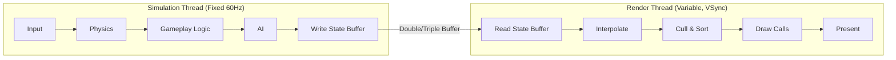

*Back to [Subject_Plan](Subject_Plan) | Part of [09 - Learning Index](09---Learning-Index)*

# 26.1 — Game Loop & Architecture

> *"In the information age, the barriers just aren't there. The barriers are self-imposed. If you want to set off and go develop some grand new thing, you don't need millions of dollars of capitalization. You need enough pizza and Diet Coke to stick in your refrigerator, a cheap PC to work on, and the dedication to go through with it."* — John Carmack

Every game — from Pong to Elden Ring — executes the same fundamental pattern: read input, update state, render frame, repeat. The sophistication lies in *how* you orchestrate that loop, how you decouple subsystems, and how you manage time. This chapter dissects the game loop from bare-metal implementations to engine-managed lifecycles, covering fixed vs. variable timesteps, Entity Component Systems, and the subsystem architecture of production engines.

---

## 🎯 Learning Objectives

By the end of this chapter you will be able to:

1. Implement a **frame-rate-independent game loop** with delta time.
2. Implement a **fixed-timestep accumulator** for deterministic physics.
3. Explain the difference between **MonoBehaviour lifecycle** (Unity), **Actor Tick** (Unreal), and **raw loop** (custom engine).
4. Compare **inheritance-based**, **component-based**, and **ECS** architectures with concrete trade-offs.
5. Design a **subsystem architecture** that decouples rendering, physics, audio, and gameplay.
6. Calculate **frame budgets** for 30/60/90/120 Hz targets.
7. Implement the **game loop** in Python (prototype), C# (Unity), and C++ (Unreal/custom).

---

## 🖼️ Visual Anchor — The Game Loop


---

## 📚 1. Concepts & Definitions

### Definition 26.1.1 — The Game Loop

The **game loop** is the central execution cycle of any real-time application:

```
while (game.isRunning) {
    processInput();
    update(deltaTime);
    render();
}
```

Unlike event-driven applications (GUIs, web servers) that sleep until input arrives, a game loop runs continuously, producing frames as fast as possible (uncapped) or at a target rate (capped/vsync'd).

### Definition 26.1.2 — Delta Time (Δt)

**Delta time** is the elapsed real time between the start of the previous frame and the start of the current frame:

$$
\Delta t = t_{\text{current}} - t_{\text{previous}}
$$

All movement and time-dependent logic must be multiplied by Δt to achieve frame-rate independence:

$$
\text{position} \mathrel{+}= \text{velocity} \times \Delta t
$$

Without Δt, a game running at 120 FPS moves twice as fast as one at 60 FPS.

### Definition 26.1.3 — Fixed Timestep

A **fixed timestep** decouples physics/simulation updates from the render frame rate. The simulation always advances by a constant Δt (e.g., 1/50 second = 20ms), regardless of how fast frames render:

```
accumulator += frameTime;
while (accumulator >= fixedDt) {
    physicsUpdate(fixedDt);
    accumulator -= fixedDt;
}
float alpha = accumulator / fixedDt;  // interpolation factor
render(lerp(previousState, currentState, alpha));
```

**Why:** Deterministic physics (same inputs → same outputs), stable numerical integration, reproducible bugs, and network synchronization all require fixed timestep.

### Definition 26.1.4 — Frame Budget

The **frame budget** is the maximum time allowed per frame to maintain a target frame rate:

| Target FPS | Frame Budget | Use Case |
|-----------|-------------|----------|
| 30 Hz | 33.33 ms | Mobile, last-gen console |
| 60 Hz | 16.67 ms | Standard PC/console |
| 90 Hz | 11.11 ms | VR (Quest, PCVR) |
| 120 Hz | 8.33 ms | Competitive/high-refresh |
| 144 Hz | 6.94 ms | Esports monitors |

### Definition 26.1.5 — Entity Component System (ECS)

**ECS** is a data-oriented architecture that separates identity, data, and behavior:

- **Entity:** A unique ID (integer). No data, no behavior.
- **Component:** Pure data struct attached to an entity (e.g., `Position { x, y, z }`).
- **System:** Logic that iterates over all entities possessing a specific set of components.

ECS achieves cache-optimal memory layout by storing components in contiguous arrays (Struct of Arrays), enabling SIMD vectorization and trivial parallelization.

### Definition 26.1.6 — Subsystem

A **subsystem** is a self-contained module responsible for one domain of engine functionality (rendering, physics, audio, input, networking). Subsystems communicate through well-defined interfaces, not direct coupling. This enables:
- Independent update rates (physics at 50 Hz, rendering at 60 Hz, audio at 48 kHz)
- Hot-swapping implementations (swap PhysX for Jolt)
- Parallel execution on separate threads

---

## 🧩 2. Mental Models / Architecture

### Model 2.1 — The Three Architectures

| Architecture | Data | Behavior | Example |
|-------------|------|----------|---------|
| **Inheritance (OOP)** | In class hierarchy | Virtual methods | Unreal `AActor` tree |
| **Component-based** | In components on a container | Components update themselves | Unity `GameObject` + `MonoBehaviour` |
| **ECS (Data-oriented)** | Contiguous arrays by type | External systems iterate data | Unity DOTS, Bevy, Flecs |

**When to use each:**
- **Inheritance:** Small projects, clear "is-a" relationships, < 1000 entities
- **Component:** Medium projects, flexible composition, Unity's sweet spot
- **ECS:** Large entity counts (10k+), performance-critical, multiplayer state sync

### Model 2.2 — Engine Subsystem Layering

```
┌─────────────────────────────────────────────┐
│              Platform Layer                   │
│  (OS, Window, Input HID, File I/O, Time)    │
├─────────────────────────────────────────────┤
│              Core Systems                    │
│  (Memory Allocators, Job System, Events)    │
├─────────────────────────────────────────────┤
│           Simulation Layer                   │
│  (Physics, AI, Animation, Gameplay Logic)   │
├─────────────────────────────────────────────┤
│            Rendering Layer                   │
│  (Scene Graph, Culling, Draw Calls, GPU)    │
├─────────────────────────────────────────────┤
│             Audio Layer                      │
│  (Mixer, Spatial Audio, DSP)                │
├─────────────────────────────────────────────┤
│           Application Layer                  │
│  (Game Mode, UI, Save/Load, Networking)     │
└─────────────────────────────────────────────┘
```

### Model 2.3 — Update Order Matters

Within a single frame, subsystems must execute in a specific order to avoid stale data:

1. **Input** — poll hardware, buffer events
2. **Gameplay Logic** — process input, update state machines, AI decisions
3. **Physics** — simulate world (fixed timestep, may run 0–N times)
4. **Animation** — blend poses based on new state
5. **Late Update** — camera follow, IK, post-logic adjustments
6. **Render** — cull, sort, submit draw calls
7. **Present** — swap buffers, vsync

---

## 🔑 3. Mechanics

### Mechanic 3.1 — The Accumulator Pattern (Fixed Timestep)

The accumulator pattern ensures physics runs at a fixed rate regardless of frame rate:

```
previousTime = getCurrentTime();
accumulator = 0.0;

while (running) {
    currentTime = getCurrentTime();
    frameTime = currentTime - previousTime;
    previousTime = currentTime;
    
    // Clamp to prevent spiral of death
    if (frameTime > 0.25) frameTime = 0.25;
    
    accumulator += frameTime;
    
    while (accumulator >= FIXED_DT) {
        previousState = currentState;
        integrate(currentState, FIXED_DT);
        accumulator -= FIXED_DT;
    }
    
    // Interpolate for smooth rendering between physics steps
    float alpha = accumulator / FIXED_DT;
    State renderState = lerp(previousState, currentState, alpha);
    render(renderState);
}
```

**Spiral of death:** If physics takes longer than `FIXED_DT` to compute, the accumulator grows unboundedly. The clamp (`0.25s`) prevents this by dropping simulation time — the game slows down rather than freezing.

### Mechanic 3.2 — Component Messaging Patterns

Components need to communicate without tight coupling:

| Pattern | Mechanism | Latency | Use Case |
|---------|-----------|---------|----------|
| Direct reference | `GetComponent<T>()` | Immediate | Camera → Player position |
| Event bus | Publish/Subscribe | 0–1 frame | Damage dealt → UI update |
| Blackboard | Shared data store | Immediate | AI reads world state |
| Command buffer | Deferred execution | 1 frame | Structural changes (spawn/destroy) |

### Mechanic 3.3 — Memory Allocation Strategies

Games avoid per-frame heap allocations (GC pressure in C#, fragmentation in C++):

| Strategy | How | When |
|----------|-----|------|
| **Object Pool** | Pre-allocate N objects, recycle | Bullets, particles, enemies |
| **Arena/Linear** | Bump pointer, free all at once | Per-frame temp data |
| **Stack allocator** | LIFO, fast alloc/free | Scoped temp buffers |
| **Free list** | Linked list of freed blocks | Variable-size allocations |

---

## 💻 4. Code Patterns & Examples

### 26.1 Python — Minimal Game Loop (Pygame)

```python
import pygame
import time

pygame.init()
screen = pygame.display.set_mode((800, 600))
clock = pygame.time.Clock()

# Game state
player_x, player_y = 400.0, 300.0
speed = 200.0  # pixels per second

running = True
while running:
    # Delta time in seconds
    dt = clock.tick(60) / 1000.0
    
    # Process input
    for event in pygame.event.get():
        if event.type == pygame.QUIT:
            running = False
    
    keys = pygame.key.get_pressed()
    dx = (keys[pygame.K_d] - keys[pygame.K_a]) * speed * dt
    dy = (keys[pygame.K_s] - keys[pygame.K_w]) * speed * dt
    player_x += dx
    player_y += dy
    
    # Render
    screen.fill((20, 20, 30))
    pygame.draw.rect(screen, (100, 200, 255), (player_x - 16, player_y - 16, 32, 32))
    pygame.display.flip()

pygame.quit()
```

### 26.2 C# — Unity MonoBehaviour Lifecycle

```csharp
using UnityEngine;

public class GameManager : MonoBehaviour
{
    // Singleton pattern for game-wide state
    public static GameManager Instance { get; private set; }
    
    [SerializeField] private float fixedTimestep = 0.02f; // 50 Hz
    
    private void Awake()
    {
        // First lifecycle call. Self-init only.
        if (Instance != null) { Destroy(gameObject); return; }
        Instance = this;
        DontDestroyOnLoad(gameObject);
        
        Time.fixedDeltaTime = fixedTimestep;
    }
    
    private void Start()
    {
        // Cross-references safe here. All Awake() calls complete.
        Debug.Log($"Game started. Fixed timestep: {Time.fixedDeltaTime}s");
    }
    
    private void Update()
    {
        // Called every frame. Use Time.deltaTime for frame-rate independence.
        // Input polling, UI updates, non-physics game logic.
        HandleInput();
        UpdateGameState(Time.deltaTime);
    }
    
    private void FixedUpdate()
    {
        // Called at fixed intervals (Time.fixedDeltaTime).
        // Physics, deterministic simulation.
        // Unity's accumulator handles this automatically.
    }
    
    private void LateUpdate()
    {
        // After all Update() calls. Camera, post-processing.
        UpdateCamera();
    }
    
    private void HandleInput() { /* ... */ }
    private void UpdateGameState(float dt) { /* ... */ }
    private void UpdateCamera() { /* ... */ }
}
```

### 26.3 C++ — Custom Engine Loop with Fixed Timestep

```cpp
#include <chrono>
#include <thread>

using Clock = std::chrono::high_resolution_clock;
using Duration = std::chrono::duration<double>;

constexpr double FIXED_DT = 1.0 / 50.0;  // 50 Hz physics
constexpr double MAX_FRAME_TIME = 0.25;    // Spiral of death guard

struct GameState {
    double posX = 0.0, posY = 0.0;
    double velX = 0.0, velY = 0.0;
};

GameState lerp(const GameState& a, const GameState& b, double alpha) {
    return {
        a.posX + (b.posX - a.posX) * alpha,
        a.posY + (b.posY - a.posY) * alpha,
        b.velX, b.velY
    };
}

int main() {
    auto previousTime = Clock::now();
    double accumulator = 0.0;
    
    GameState previousState{}, currentState{};
    bool running = true;
    
    while (running) {
        auto currentTime = Clock::now();
        double frameTime = Duration(currentTime - previousTime).count();
        previousTime = currentTime;
        
        if (frameTime > MAX_FRAME_TIME)
            frameTime = MAX_FRAME_TIME;
        
        accumulator += frameTime;
        
        // Fixed-rate physics updates
        while (accumulator >= FIXED_DT) {
            previousState = currentState;
            // Integrate physics
            currentState.posX += currentState.velX * FIXED_DT;
            currentState.posY += currentState.velY * FIXED_DT;
            accumulator -= FIXED_DT;
        }
        
        // Interpolate for smooth rendering
        double alpha = accumulator / FIXED_DT;
        GameState renderState = lerp(previousState, currentState, alpha);
        
        // render(renderState);
        // processInput(&currentState, &running);
    }
    return 0;
}
```

### 26.4 Rust (Bevy) — ECS Game Loop

```rust
use bevy::prelude::*;

// Components are pure data
#[derive(Component)]
struct Position { x: f32, y: f32 }

#[derive(Component)]
struct Velocity { x: f32, y: f32 }

#[derive(Component)]
struct Player;

// Systems are functions that query components
fn movement_system(mut query: Query<(&mut Position, &Velocity)>, time: Res<Time>) {
    for (mut pos, vel) in &mut query {
        pos.x += vel.x * time.delta_secs();
        pos.y += vel.y * time.delta_secs();
    }
}

fn input_system(
    keyboard: Res<ButtonInput<KeyCode>>,
    mut query: Query<&mut Velocity, With<Player>>,
) {
    let speed = 200.0;
    for mut vel in &mut query {
        vel.x = 0.0;
        vel.y = 0.0;
        if keyboard.pressed(KeyCode::KeyD) { vel.x += speed; }
        if keyboard.pressed(KeyCode::KeyA) { vel.x -= speed; }
        if keyboard.pressed(KeyCode::KeyW) { vel.y -= speed; }
        if keyboard.pressed(KeyCode::KeyS) { vel.y += speed; }
    }
}

fn main() {
    App::new()
        .add_plugins(DefaultPlugins)
        .add_systems(Update, (input_system, movement_system).chain())
        .run();
}
```

---

## 🧮 5. Worked Examples

### Example 26.1.1 — Calculate Frame Budget for VR

**Problem:** You're building a Quest 3 VR game targeting 90 Hz. Your physics runs at 50 Hz. How many physics steps execute per frame? What's your per-frame CPU budget if GPU takes 7ms?

<details>
<summary>🔍 View Step-by-Step Solution</summary>

**Frame budget at 90 Hz:**

$$
t_{\text{frame}} = \frac{1000}{90} = 11.11 \text{ ms}
$$

**Physics steps per frame:**

Physics runs at 50 Hz → one step every 20ms. At 90 FPS, each frame is 11.11ms. The accumulator pattern means:
- Most frames: 0 physics steps (accumulator < 20ms)
- Every ~2nd frame: 1 physics step (accumulator crosses 20ms threshold)
- Average: $\frac{50}{90} = 0.556$ physics steps per frame

**CPU budget:**

Since CPU and GPU run in parallel (double-buffered):

$$
t_{\text{frame}} = \max(t_{\text{CPU}}, t_{\text{GPU}}) \leq 11.11 \text{ ms}
$$

GPU takes 7ms → GPU is not the bottleneck.
CPU budget = 11.11ms total.

Breakdown:
- Input + game logic: ~2ms
- Physics (when it runs): ~2ms × 0.556 = ~1.1ms amortized
- Animation: ~1.5ms
- Draw call submission: ~2ms
- **Remaining headroom:** ~4.5ms

</details>

### Example 26.1.2 — Implement Object Pool in C#

**Problem:** Your bullet-hell game spawns 500 bullets/second. Each bullet lives 2 seconds. Design an object pool that avoids GC allocations.

<details>
<summary>🔍 View Step-by-Step Solution</summary>

**Pool size calculation:**

$$
\text{max active} = \text{spawn rate} \times \text{lifetime} = 500 \times 2 = 1000 \text{ bullets}
$$

Add 20% headroom: pool size = 1200.

```csharp
public class BulletPool : MonoBehaviour
{
    [SerializeField] private GameObject bulletPrefab;
    [SerializeField] private int poolSize = 1200;
    
    private Queue<GameObject> available = new();
    private HashSet<GameObject> active = new();
    
    private void Awake()
    {
        for (int i = 0; i < poolSize; i++)
        {
            var bullet = Instantiate(bulletPrefab, transform);
            bullet.SetActive(false);
            available.Enqueue(bullet);
        }
    }
    
    public GameObject Spawn(Vector3 position, Quaternion rotation)
    {
        if (available.Count == 0)
        {
            // Pool exhausted — recycle oldest active or expand
            Debug.LogWarning("Pool exhausted!");
            return null;
        }
        
        var bullet = available.Dequeue();
        bullet.transform.SetPositionAndRotation(position, rotation);
        bullet.SetActive(true);
        active.Add(bullet);
        return bullet;
    }
    
    public void Return(GameObject bullet)
    {
        bullet.SetActive(false);
        active.Remove(bullet);
        available.Enqueue(bullet);
    }
}
```

**Key points:**
- Zero allocations during gameplay (all `Instantiate` calls happen in `Awake`)
- `SetActive(false)` disables rendering and physics without destroying
- Queue gives FIFO ordering — oldest returned bullets are reused first (cache warm)

</details>

### Example 26.1.3 — ECS vs MonoBehaviour Performance

**Problem:** You have 50,000 entities with Position and Velocity. Compare iteration cost between Unity MonoBehaviour and Unity DOTS ECS.

<details>
<summary>🔍 View Step-by-Step Solution</summary>

**MonoBehaviour approach:**

Each entity is a `GameObject` with a `MoveScript : MonoBehaviour`. Unity calls `Update()` on each via virtual dispatch:

- Virtual call overhead: ~50ns per entity (vtable lookup + cache miss)
- Component access: `transform.position` crosses managed→native boundary (~100ns)
- Total per entity: ~150ns
- 50,000 entities: $50000 \times 150\text{ns} = 7.5\text{ms}$

**ECS (DOTS) approach:**

Position and Velocity stored in contiguous `NativeArray<float3>`:

```csharp
[BurstCompile]
public partial struct MoveJob : IJobEntity
{
    public float DeltaTime;
    
    void Execute(ref LocalTransform transform, in Velocity vel)
    {
        transform.Position += vel.Value * DeltaTime;
    }
}
```

- No virtual dispatch (Burst-compiled native code)
- Linear memory access (prefetcher predicts pattern)
- SIMD vectorization (4 entities per instruction)
- Per entity: ~2ns
- 50,000 entities: $50000 \times 2\text{ns} = 0.1\text{ms}$

**Speedup:** $\frac{7.5}{0.1} = 75\times$

This is why ECS matters for large entity counts.

</details>

### Example 26.1.4 — Fixed Timestep Interpolation

**Problem:** Physics runs at 50 Hz. Rendering runs at 144 Hz. Without interpolation, objects appear to "stutter" because they only move every ~3 render frames. Implement smooth interpolation.

<details>
<summary>🔍 View Step-by-Step Solution</summary>

**The problem visualized:**

At 144 FPS with 50 Hz physics:
- Frame 1: accumulator = 6.94ms (< 20ms) → no physics step → render old position
- Frame 2: accumulator = 13.89ms (< 20ms) → no physics step → render old position  
- Frame 3: accumulator = 20.83ms (≥ 20ms) → physics step! → render new position

Without interpolation: object is stationary for 2 frames, then jumps. Visible stutter.

**Solution — render interpolated state:**

```cpp
// After physics loop, accumulator holds leftover time
double alpha = accumulator / FIXED_DT;  // 0.0 to 1.0

// Interpolate between last two physics states
Vector3 renderPos = Vector3::Lerp(previousPos, currentPos, alpha);
```

Frame-by-frame with interpolation:
- Frame 1: alpha = 6.94/20 = 0.347 → render at 34.7% between prev and current
- Frame 2: alpha = 13.89/20 = 0.694 → render at 69.4%
- Frame 3: physics runs, resets → alpha = 0.83/20 = 0.042 → render at 4.2% of new interval

Result: perfectly smooth motion at any frame rate.

</details>

---

## ⚠️ 6. Gotchas & Anti-Patterns

### ❌ Anti-Pattern: Frame-Rate-Dependent Logic

```csharp
// BAD: moves 5 units per frame regardless of frame rate
transform.position += Vector3.forward * 5f;

// GOOD: moves 5 units per second, frame-rate independent
transform.position += Vector3.forward * 5f * Time.deltaTime;
```

### ❌ Anti-Pattern: Physics in Update()

Never put physics calculations in variable-timestep `Update()`. Results become non-deterministic and frame-rate-dependent. Always use `FixedUpdate()` (Unity) or a fixed-timestep accumulator.

### ❌ Anti-Pattern: Spiral of Death

If your physics step takes longer than `FIXED_DT`, the accumulator grows every frame. The game tries to "catch up" by running more physics steps, which takes even longer, creating a death spiral. **Always clamp `frameTime`.**

### ❌ Anti-Pattern: God Object GameManager

A single `GameManager` class that handles input, spawning, scoring, UI, audio, and save/load. This becomes unmaintainable. Split into focused subsystems with clear interfaces.

### ❌ Anti-Pattern: Allocating in the Hot Loop

```csharp
// BAD: allocates a new List every frame → GC pressure
void Update() {
    var nearbyEnemies = new List<Enemy>();  // ALLOCATION!
    // ...
}

// GOOD: reuse pre-allocated collection
private List<Enemy> nearbyEnemies = new(64);
void Update() {
    nearbyEnemies.Clear();  // No allocation
    // ...
}
```

---

## 🔗 7. Cross-links & Further Reading

### Internal Links
- **Next:** [26.2 - Gameplay Programming - Input, State, AI](26.2---Gameplay-Programming---Input,-State,-AI)
- **Engine deep-dive:** [28.5 - Game Engine Architectures - Unity & Unreal](28.5---Game-Engine-Architectures---Unity-&-Unreal) — Unity/Unreal lifecycle details
- **Performance math:** [08.12 - Computer Architecture - Performance Intuition](08.12---Computer-Architecture---Performance-Intuition) — cache lines, memory hierarchy
- **Data structures for ECS:** [08.13 - Algorithms & Data Structures in Python](08.13---Algorithms-&-Data-Structures-in-Python) — hash maps, spatial partitioning

### External Resources
- **Game Programming Patterns** — Robert Nystrom (gameprogrammingpatterns.com) — Game Loop, Update Method, Component chapters
- **Fix Your Timestep!** — Glenn Fiedler (gafferongames.com/post/fix_your_timestep/) — the definitive article
- **Handmade Hero** — Casey Muratori — building a game loop from scratch in C
- **GDC: "Overwatch Gameplay Architecture and Netcode"** — ECS in production AAA
- **Bevy Engine** (bevyengine.org) — modern Rust ECS, excellent learning resource

### Practice
- `_practice/scripts/4.1_game_loop.py` — frame budget calculator and timestep simulator


---

## 🔬 8. Advanced Topics — Fixed Timestep, ECS Deep Dive & Messaging Architectures

### 8.1 — Fixed Timestep with Interpolation: Complete Implementation

The canonical "Fix Your Timestep" pattern separates simulation from rendering entirely. The simulation advances in fixed increments (deterministic), while rendering interpolates between the two most recent simulation states to produce smooth visuals at any frame rate.

#### The Problem

Variable timestep (`deltaTime` passed directly to physics) causes:
- **Non-determinism:** Different frame rates produce different outcomes
- **Instability:** Large `dt` spikes cause objects to tunnel through walls
- **Irreproducibility:** Replays and netcode break

#### The Solution: Semi-Fixed Timestep with Accumulator

```csharp
public class FixedTimestepLoop : MonoBehaviour
{
    private const float FIXED_DT = 1f / 60f;  // 60 Hz simulation
    private const int MAX_STEPS_PER_FRAME = 5; // Spiral-of-death guard
    
    private float accumulator = 0f;
    private GameState previousState;
    private GameState currentState;
    
    void Update()
    {
        float frameTime = Time.deltaTime;
        
        // Clamp to prevent spiral of death
        // If the game freezes for 1 second, we don't simulate 60 steps
        if (frameTime > FIXED_DT * MAX_STEPS_PER_FRAME)
            frameTime = FIXED_DT * MAX_STEPS_PER_FRAME;
        
        accumulator += frameTime;
        
        while (accumulator >= FIXED_DT)
        {
            previousState = currentState.DeepCopy();
            Simulate(ref currentState, FIXED_DT);
            accumulator -= FIXED_DT;
        }
        
        // Alpha = how far between previous and current state we are
        float alpha = accumulator / FIXED_DT;
        
        // Interpolate for rendering (does NOT affect simulation)
        RenderState interpolated = Interpolate(previousState, currentState, alpha);
        ApplyToVisuals(interpolated);
    }
    
    private void Simulate(ref GameState state, float dt)
    {
        // All physics, AI, gameplay logic here
        // Uses ONLY the fixed dt — never Time.deltaTime
        state.playerPosition += state.playerVelocity * dt;
        state.playerVelocity += state.gravity * dt;
        
        // Collision detection and response
        ResolveCollisions(ref state);
        
        // Increment simulation tick counter
        state.tick++;
    }
    
    private RenderState Interpolate(GameState prev, GameState curr, float alpha)
    {
        return new RenderState
        {
            // Linear interpolation between two simulation frames
            playerVisualPos = Vector3.Lerp(prev.playerPosition, curr.playerPosition, alpha),
            
            // For rotations, use Slerp
            playerVisualRot = Quaternion.Slerp(prev.playerRotation, curr.playerRotation, alpha),
            
            // Some things shouldn't interpolate (health bar, score)
            health = curr.health,
            score = curr.score
        };
    }
}
```

#### C++ Equivalent (Engine-Agnostic)

```cpp
struct SimulationState {
    Vec3 position;
    Vec3 velocity;
    Quat rotation;
    uint64_t tick;
    
    SimulationState lerp(const SimulationState& other, float alpha) const {
        return {
            .position = Vec3::lerp(position, other.position, alpha),
            .velocity = Vec3::lerp(velocity, other.velocity, alpha),
            .rotation = Quat::slerp(rotation, other.rotation, alpha),
            .tick = other.tick
        };
    }
};

class GameLoop {
    static constexpr double FIXED_DT = 1.0 / 60.0;
    static constexpr int MAX_STEPS = 5;
    
    double accumulator = 0.0;
    SimulationState prevState{};
    SimulationState currState{};
    
    std::chrono::high_resolution_clock::time_point lastTime;
    
public:
    void run() {
        lastTime = std::chrono::high_resolution_clock::now();
        
        while (running) {
            auto now = std::chrono::high_resolution_clock::now();
            double frameTime = std::chrono::duration<double>(now - lastTime).count();
            lastTime = now;
            
            // Clamp frame time
            if (frameTime > FIXED_DT * MAX_STEPS)
                frameTime = FIXED_DT * MAX_STEPS;
            
            accumulator += frameTime;
            
            // Process input once per frame (not per simulation step)
            InputSnapshot input = pollInput();
            
            while (accumulator >= FIXED_DT) {
                prevState = currState;
                simulate(currState, input, FIXED_DT);
                accumulator -= FIXED_DT;
            }
            
            float alpha = static_cast<float>(accumulator / FIXED_DT);
            SimulationState renderState = prevState.lerp(currState, alpha);
            render(renderState);
        }
    }
    
private:
    void simulate(SimulationState& state, const InputSnapshot& input, double dt) {
        // Apply input forces
        Vec3 inputForce = computeInputForce(input);
        state.velocity += (inputForce + GRAVITY) * static_cast<float>(dt);
        state.position += state.velocity * static_cast<float>(dt);
        
        // Collision detection at fixed rate
        resolveCollisions(state);
        state.tick++;
    }
};
```

#### Why Interpolation, Not Extrapolation?

**Interpolation** renders between two *known* states — always correct, one frame of visual latency.

**Extrapolation** predicts *forward* from the current state — zero latency but produces visual artifacts when prediction is wrong (overshooting, snapping back).

For single-player games, the one-frame latency of interpolation (16.6ms at 60Hz) is imperceptible. For competitive multiplayer, extrapolation may be combined with server reconciliation (see [26.6 - Multiplayer & Networking](26.6---Multiplayer-&-Networking)).

---

### 8.2 — ECS Deep Dive: Archetype-Based vs. Sparse-Set Storage

Entity Component System architectures differ primarily in how they store and query component data. The two dominant strategies are **archetype-based** (Unity DOTS, Flecs) and **sparse-set** (EnTT, Shipyard).

#### Archetype-Based Storage (Unity DOTS / Flecs)

An **archetype** is a unique combination of component types. All entities with the same set of components are stored together in contiguous memory chunks.

```
Archetype A: [Position, Velocity, Health]
  → Chunk 0: [Entity 1, Entity 5, Entity 12, ...]  (16KB aligned)
  → Chunk 1: [Entity 44, Entity 67, ...]

Archetype B: [Position, Velocity, Health, Shield]
  → Chunk 0: [Entity 3, Entity 8, ...]
```

**Memory Layout (Struct of Arrays within each chunk):**

```
Chunk memory layout for Archetype [Position, Velocity, Health]:
┌─────────────────────────────────────────────────────────────┐
│ [Pos0][Pos1][Pos2]...[PosN] │ [Vel0][Vel1]...[VelN] │ [H0][H1]...[HN] │
└─────────────────────────────────────────────────────────────┘
     ← contiguous Position →     ← contiguous Velocity →
```

```csharp
// Unity DOTS: System iterating over an archetype query
[BurstCompile]
public partial struct MovementSystem : ISystem
{
    [BurstCompile]
    public void OnUpdate(ref SystemState state)
    {
        float dt = SystemAPI.Time.DeltaTime;
        
        // This query matches ALL archetypes containing both Position and Velocity
        foreach (var (position, velocity) in 
                 SystemAPI.Query<RefRW<LocalTransform>, RefRO<Velocity>>())
        {
            position.ValueRW.Position += velocity.ValueRO.Value * dt;
        }
    }
}
```

**Advantages:**
- Cache-perfect iteration (sequential memory access)
- Trivial SIMD vectorization (Burst compiler)
- Chunk-level operations (enable/disable entire chunks)
- O(1) component access within a chunk (array index)

**Disadvantages:**
- Adding/removing components moves the entity to a different archetype (structural change)
- Structural changes are expensive — must copy all component data to new chunk
- "Archetype explosion" if many optional components exist (2^N possible archetypes)

#### Sparse-Set Storage (EnTT)

Each component type has its own **dense array** + **sparse lookup table**. Entities are just integer IDs.

```
Component<Position>:
  dense:  [Pos_A, Pos_B, Pos_C, Pos_D]  (packed, no gaps)
  sparse: [_, 0, _, 2, 1, _, 3, _]       (entity_id → dense_index)
  
Component<Velocity>:
  dense:  [Vel_B, Vel_C, Vel_D]
  sparse: [_, _, _, 1, 0, _, 2, _]
```

```cpp
// EnTT: iterating entities with Position and Velocity
auto view = registry.view<Position, Velocity>();
view.each([dt](auto entity, Position& pos, Velocity& vel) {
    pos.value += vel.value * dt;
});

// Adding a component is O(1) — no structural change
registry.emplace<Shield>(entity, ShieldData{100.0f});

// Removing is O(1) — swap-and-pop from dense array
registry.remove<Shield>(entity);
```

**Advantages:**
- Adding/removing components is O(1) — no data movement for other components
- No archetype explosion
- Simpler implementation
- Better for dynamic compositions (entities frequently gaining/losing components)

**Disadvantages:**
- Multi-component iteration requires intersection of sparse sets (slower than archetype chunk iteration)
- Less cache-friendly for multi-component queries (components in separate arrays)
- Cannot trivially vectorize across component boundaries

#### Decision Matrix

| Criterion | Archetype (DOTS/Flecs) | Sparse-Set (EnTT) |
|-----------|----------------------|-------------------|
| Iteration speed (single component) | ★★★★★ | ★★★★☆ |
| Iteration speed (multi-component) | ★★★★★ | ★★★☆☆ |
| Add/remove component cost | ★★☆☆☆ (structural change) | ★★★★★ (O(1)) |
| Memory efficiency | ★★★★☆ (chunk padding) | ★★★★★ (packed) |
| SIMD/Burst compatibility | ★★★★★ | ★★★☆☆ |
| Implementation complexity | ★★☆☆☆ | ★★★★☆ |
| Best for | Thousands of similar entities (bullets, particles) | Dynamic entity compositions (RPG items, modding) |

---

### 8.3 — Event Bus vs. Pub/Sub vs. Message Queue

Game systems need to communicate without tight coupling. Three patterns dominate:

#### Pattern 1: Event Bus (Synchronous, In-Process)

A central dispatcher that immediately invokes all registered handlers when an event is fired.

```csharp
// Minimal event bus implementation
public static class EventBus
{
    private static readonly Dictionary<Type, List<Delegate>> listeners = new();
    
    public static void Subscribe<T>(Action<T> handler) where T : struct
    {
        var type = typeof(T);
        if (!listeners.ContainsKey(type))
            listeners[type] = new List<Delegate>();
        listeners[type].Add(handler);
    }
    
    public static void Unsubscribe<T>(Action<T> handler) where T : struct
    {
        if (listeners.TryGetValue(typeof(T), out var list))
            list.Remove(handler);
    }
    
    public static void Publish<T>(T evt) where T : struct
    {
        if (listeners.TryGetValue(typeof(T), out var list))
        {
            // Synchronous: all handlers execute NOW
            foreach (var handler in list)
                ((Action<T>)handler)(evt);
        }
    }
}

// Usage
public struct EnemyDiedEvent { public int enemyId; public Vector3 position; }

// Subscriber (e.g., score system)
EventBus.Subscribe<EnemyDiedEvent>(e => score += 100);

// Publisher (e.g., health system)
EventBus.Publish(new EnemyDiedEvent { enemyId = 42, position = transform.position });
```

**Characteristics:**
- Synchronous execution (handlers run in publish call stack)
- Zero latency
- Debugging difficulty: stack traces cross system boundaries
- Risk: handler exceptions propagate to publisher
- Risk: infinite loops if handler publishes same event

#### Pattern 2: Pub/Sub with Deferred Dispatch

Events are queued and dispatched at a controlled point in the frame (e.g., end of Update phase).

```csharp
public class DeferredEventSystem
{
    private readonly Queue<Action> pendingEvents = new();
    
    public void Enqueue<T>(T evt) where T : struct
    {
        // Capture handlers at enqueue time, dispatch later
        var handlers = GetHandlers<T>();
        foreach (var h in handlers)
        {
            var captured = h; // Closure capture
            pendingEvents.Enqueue(() => captured(evt));
        }
    }
    
    // Called once per frame at a controlled point
    public void FlushEvents()
    {
        int safety = 1000; // Prevent infinite event chains
        while (pendingEvents.Count > 0 && safety-- > 0)
        {
            pendingEvents.Dequeue().Invoke();
        }
        
        if (safety <= 0)
            Debug.LogError("Event cascade limit reached — possible infinite loop");
    }
}
```

**Characteristics:**
- Deterministic ordering (FIFO within a frame)
- One-frame latency (acceptable for most gameplay events)
- Safer: publisher stack is clean when handlers execute
- Easier to debug: all events process at known point

#### Pattern 3: Message Queue (Async, Cross-Thread/Process)

For systems that run on different threads (audio, networking, AI) or different processes (dedicated server).

```cpp
// Lock-free single-producer single-consumer ring buffer
template<typename T, size_t Capacity>
class SPSCQueue {
    std::array<T, Capacity> buffer;
    std::atomic<size_t> head{0};  // Written by producer
    std::atomic<size_t> tail{0};  // Written by consumer
    
public:
    bool tryPush(const T& item) {
        size_t h = head.load(std::memory_order_relaxed);
        size_t next = (h + 1) % Capacity;
        if (next == tail.load(std::memory_order_acquire))
            return false; // Full
        buffer[h] = item;
        head.store(next, std::memory_order_release);
        return true;
    }
    
    bool tryPop(T& item) {
        size_t t = tail.load(std::memory_order_relaxed);
        if (t == head.load(std::memory_order_acquire))
            return false; // Empty
        item = buffer[t];
        tail.store((t + 1) % Capacity, std::memory_order_release);
        return true;
    }
};

// Usage: Audio thread receives commands from game thread
SPSCQueue<AudioCommand, 256> audioCommandQueue;

// Game thread (producer)
audioCommandQueue.tryPush(AudioCommand::PlaySFX(soundId, position));

// Audio thread (consumer) — runs at its own rate
AudioCommand cmd;
while (audioCommandQueue.tryPop(cmd)) {
    processAudioCommand(cmd);
}
```

**Characteristics:**
- Thread-safe (lock-free for SPSC)
- Decouples producer/consumer timing
- Bounded buffer prevents memory growth
- Latency = time until consumer polls
- Essential for audio, networking, file I/O threads

#### Comparison Table

| Aspect | Event Bus | Deferred Pub/Sub | Message Queue |
|--------|-----------|-----------------|---------------|
| Latency | Zero | 1 frame | Variable (poll rate) |
| Thread safety | ❌ Single-thread only | ❌ Single-thread only | ✅ Cross-thread |
| Ordering | Call-stack order | FIFO | FIFO |
| Debugging | Hard (deep stacks) | Medium | Easy (inspect queue) |
| Use case | UI events, triggers | Gameplay events | Audio, networking, I/O |
| Allocation | Zero (struct events) | Queue entry | Ring buffer (pre-allocated) |

---

### 8.4 — Render-vs-Simulation Decoupling

In production engines, the simulation and rendering often run at different rates and potentially on different threads:



**Double-Buffering State:**

```cpp
struct WorldState {
    std::vector<TransformData> transforms;
    std::vector<AnimationFrame> animations;
    uint64_t simulationTick;
    double simulationTime;
};

class DoubleBufferedState {
    WorldState buffers[2];
    std::atomic<int> readIndex{0};
    
public:
    // Called by simulation thread
    WorldState& getWriteBuffer() {
        return buffers[1 - readIndex.load(std::memory_order_acquire)];
    }
    
    // Called by simulation thread after writing is complete
    void swap() {
        readIndex.store(1 - readIndex.load(std::memory_order_relaxed), 
                       std::memory_order_release);
    }
    
    // Called by render thread
    const WorldState& getReadBuffer() const {
        return buffers[readIndex.load(std::memory_order_acquire)];
    }
};
```

This pattern is used by Unreal Engine (Game Thread vs. Render Thread), Naughty Dog's engine (fiber-based job system), and most AAA engines targeting 60+ FPS.

---

## 📎 9. Appendix — Mathematical Foundations

### Appendix 9.A — Deterministic Lockstep Loop Mathematics

In lockstep multiplayer (RTS games like StarCraft, Age of Empires), all clients simulate the same game state by processing the same inputs at the same simulation ticks. The math governing timing is critical.

#### Tick Synchronization

Let $T$ be the fixed simulation timestep, $N$ the number of players, and $L_i$ the one-way latency to player $i$.

The **input delay** $D$ (in ticks) must satisfy:

$$
D \geq \left\lceil \frac{2 \cdot \max(L_i)}{T} \right\rceil
$$

This ensures that by the time tick $k$ needs to simulate, all players' inputs for tick $k$ have arrived at all other players.

**Example:** With $T = 1/15$ s (15 Hz simulation), and worst-case RTT of 200ms:

$$
D \geq \left\lceil \frac{0.200}{1/15} \right\rceil = \lceil 3.0 \rceil = 3 \text{ ticks}
$$

So inputs entered at tick $k$ take effect at tick $k + 3$. The player experiences 200ms of input lag (3 ticks × 66.7ms).

#### Determinism Requirements

For lockstep to work, the simulation function $S$ must be **purely deterministic**:

$$
S(state_k, inputs_k) = state_{k+1} \quad \forall \text{ machines}
$$

This requires:
1. **Fixed-point or integer math** (IEEE 754 floating-point is NOT deterministic across compilers/platforms)
2. **Deterministic iteration order** (no hash maps with pointer-based hashing)
3. **No undefined behavior** (signed overflow, uninitialized reads)
4. **Same RNG seed** (synchronized pseudo-random number generator)

#### Fixed-Point Arithmetic for Determinism

```csharp
// 16.16 fixed-point number (32-bit: 16 integer bits, 16 fractional bits)
public readonly struct Fixed32
{
    private readonly int raw;
    
    public const int FRACTIONAL_BITS = 16;
    public const int ONE = 1 << FRACTIONAL_BITS; // 65536
    
    private Fixed32(int raw) => this.raw = raw;
    
    public static Fixed32 FromInt(int value) => new(value << FRACTIONAL_BITS);
    public static Fixed32 FromFloat(float value) => new((int)(value * ONE));
    
    public float ToFloat() => raw / (float)ONE;
    public int ToInt() => raw >> FRACTIONAL_BITS;
    
    public static Fixed32 operator +(Fixed32 a, Fixed32 b) => new(a.raw + b.raw);
    public static Fixed32 operator -(Fixed32 a, Fixed32 b) => new(a.raw - b.raw);
    
    // Multiplication: (a * b) >> 16 to maintain scale
    public static Fixed32 operator *(Fixed32 a, Fixed32 b) => 
        new((int)(((long)a.raw * b.raw) >> FRACTIONAL_BITS));
    
    // Division: (a << 16) / b to maintain scale
    public static Fixed32 operator /(Fixed32 a, Fixed32 b) => 
        new((int)(((long)a.raw << FRACTIONAL_BITS) / b.raw));
}
```

#### Checksum Verification

To detect desynchronization early, clients periodically exchange state checksums:

$$
H_k = \text{hash}(state_k) \quad \text{(e.g., CRC32 of all entity positions)}
$$

If $H_k^{(A)} \neq H_k^{(B)}$, a desync has occurred. The game must either:
1. Resynchronize (one client sends full state)
2. Disconnect with error

### Appendix 9.B — Render-vs-Simulation Timing Analysis

Given simulation rate $f_s$ (Hz) and render rate $f_r$ (Hz), the maximum visual error from interpolation is:

$$
\epsilon_{max} = v_{max} \cdot \frac{1}{f_s}
$$

where $v_{max}$ is the maximum velocity of any object. This is because interpolation always renders between two known states separated by $1/f_s$ seconds.

**Example:** A bullet traveling at 500 m/s with 60 Hz simulation:

$$
\epsilon_{max} = 500 \cdot \frac{1}{60} = 8.33 \text{ meters between states}
$$

This is why fast-moving objects need either:
- Higher simulation rate (120 Hz, 240 Hz)
- Continuous collision detection (swept shapes)
- Visual-only extrapolation (trail effects that mask the discrete positions)

#### Frame Time Budget Breakdown

For a 60 FPS target ($16.67$ ms per frame):

| Phase | Budget | Notes |
|-------|--------|-------|
| Input polling | 0.1 ms | Platform-specific, negligible |
| Simulation (0-1 steps) | 2-4 ms | Fixed timestep, may skip frames |
| AI / Pathfinding | 1-2 ms | Amortized across frames |
| Animation update | 1-2 ms | Blend trees, IK |
| Render submission | 2-4 ms | Culling, sorting, draw calls |
| GPU rendering | 8-10 ms | Overlaps with next frame's CPU work |
| **Total CPU** | **~10 ms** | Leaves headroom for spikes |

The GPU typically works on frame $N-1$ while the CPU prepares frame $N$ (pipelining). This means total latency from input to photons is 2-3 frames (33-50ms at 60 FPS).

---

