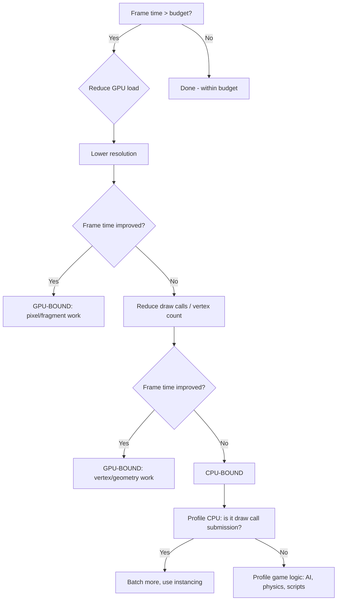
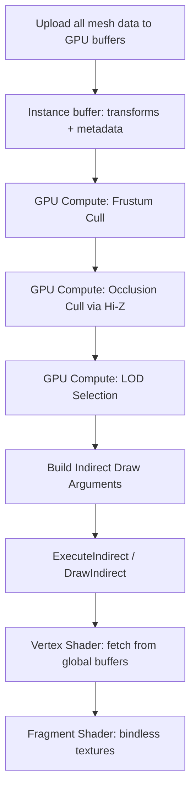

*Back to [Subject_Plan](Subject_Plan) | Part of [09 - Learning Index](09---Learning-Index)*

# 26.7 — Performance & Optimization

> *"Premature optimization is the root of all evil — but so is premature pessimization. Know your budgets, measure before you cut, and never optimize what you haven't profiled."* — Adapted from Donald Knuth

Performance optimization in games is unique: you have a hard real-time deadline (16.67ms at 60 FPS) and the player *feels* every missed frame. This chapter covers the complete optimization workflow: profiling to find bottlenecks, CPU optimization (memory layout, algorithms, threading), GPU optimization (draw calls, overdraw, shader complexity), and the specific tools each engine provides.

---

## 🎯 Learning Objectives

By the end of this chapter you will be able to:

1. Use **profiling tools** (Unity Profiler, Unreal Insights, RenderDoc, Tracy) to identify bottlenecks.
2. Determine whether a game is **CPU-bound or GPU-bound** and act accordingly.
3. Optimize **memory layout** for cache efficiency (SoA, pooling, contiguous allocation).
4. Reduce **draw calls** through batching, instancing, and atlasing.
5. Implement **Level of Detail (LOD)** systems for geometry and behavior.
6. Optimize **physics** with spatial partitioning and sleep states.
7. Apply **Amdahl's Law** to prioritize optimization efforts.

---

## 🖼️ Visual Anchor — Frame Budget & Memory Layout


---

## 📚 1. Concepts & Definitions

### Definition 26.7.1 — CPU-Bound vs GPU-Bound

A game is **CPU-bound** when the CPU finishes its work after the GPU, meaning the GPU idles waiting for draw commands. It's **GPU-bound** when the GPU takes longer than the CPU.

**Diagnosis:**
- CPU-bound: reducing render quality doesn't improve FPS; reducing game logic does
- GPU-bound: lowering resolution/quality improves FPS; simplifying logic doesn't help

### Definition 26.7.2 — Draw Call

A **draw call** is a command from CPU to GPU: "render this mesh with this material." Each draw call has overhead (~0.1ms on mobile, ~0.01ms on PC) due to:
- Driver validation
- GPU state changes (shader, texture, render target)
- Command buffer submission

**Rule of thumb:** Mobile: < 200 draw calls. PC: < 2000. VR: < 500 per eye.

### Definition 26.7.3 — Amdahl's Law (Applied to Games)

If a system takes fraction $p$ of total frame time, optimizing it by factor $s$ gives speedup:

$$
S = \frac{1}{(1-p) + \frac{p}{s}}
$$

**Example:** Physics takes 30% of frame time. Making physics 2× faster:

$$
S = \frac{1}{0.7 + 0.15} = 1.176 \quad (17.6\% \text{ improvement})
$$

Making physics infinitely fast: $S = \frac{1}{0.7} = 1.43$ (43% max improvement). The other 70% is the ceiling.

### Definition 26.7.4 — Cache Line

A **cache line** is the minimum unit of data transferred between RAM and CPU cache (typically 64 bytes). Accessing one byte loads the entire 64-byte line. Sequential access patterns exploit this by using all loaded data before eviction.

### Definition 26.7.5 — Overdraw

**Overdraw** occurs when the same pixel is rendered multiple times per frame (overlapping transparent objects, inefficient draw order). Overdraw factor of 3× means each pixel is shaded 3 times on average — tripling fragment shader cost.

---

## 🧩 2. Mental Models / Architecture

### Model 2.1 — The Optimization Workflow

```
1. SET TARGET    → "60 FPS on Quest 3" = 11.11ms budget
2. MEASURE       → Profile: where is time actually spent?
3. IDENTIFY      → What's the #1 bottleneck? CPU or GPU?
4. HYPOTHESIZE   → "Reducing draw calls from 800 to 200 should save 3ms"
5. IMPLEMENT     → Make the change
6. VERIFY        → Re-profile. Did it actually help? Any regressions?
7. REPEAT        → Next bottleneck (if still over budget)
```

**Never skip step 2.** Intuition about performance is wrong more often than right.

### Model 2.2 — Frame Time Breakdown (Typical)

```
16.67ms total budget (60 FPS):
├── Input + Game Logic:     2-4ms
├── Physics:                1-3ms
├── Animation:              1-2ms
├── AI / Pathfinding:       0.5-2ms
├── Culling + Sorting:      0.5-1ms
├── Draw Call Submission:   1-3ms  ← CPU-side rendering
├── GPU Vertex Processing:  1-3ms
├── GPU Fragment Processing: 3-6ms
└── Post-Processing:        1-2ms
```

### Model 2.3 — Memory Hierarchy Costs

| Level | Size | Latency | Bandwidth |
|-------|------|---------|-----------|
| L1 Cache | 32-64 KB | 1 ns (4 cycles) | ~1 TB/s |
| L2 Cache | 256 KB-1 MB | 3-5 ns | ~500 GB/s |
| L3 Cache | 4-32 MB | 10-20 ns | ~200 GB/s |
| RAM | 8-64 GB | 50-100 ns | ~50 GB/s |
| SSD | 256 GB-4 TB | 10-100 μs | ~5 GB/s |

**Key insight:** An L1 cache hit is 100× faster than a RAM access. Data layout determines whether your game runs at 60 FPS or 15 FPS for the same algorithm.

---

## 🔑 3. Mechanics

### Mechanic 3.1 — Batching and Instancing

**Static Batching:** Combine meshes that never move into one large mesh at build time. One draw call for an entire room of furniture.

**Dynamic Batching:** Combine small meshes (< 300 vertices) at runtime. Automatic in Unity for qualifying objects.

**GPU Instancing:** Draw the same mesh many times with different transforms in a single draw call. Perfect for: trees, grass, bullets, particles.

```csharp
// Unity: enable GPU instancing on material
material.enableInstancing = true;

// Draw 1000 trees with one call
Graphics.DrawMeshInstanced(treeMesh, 0, treeMaterial, treeMatrices);
```

### Mechanic 3.2 — Object Pooling (Revisited for Performance)

Beyond avoiding GC (Chapter 26.1), pools improve cache performance:
- Pool objects are contiguous in memory (allocated together)
- Active objects form a dense array (swap-remove dead objects to end)
- Iteration touches only active objects in cache-friendly order

### Mechanic 3.3 — Level of Detail (LOD)

Reduce work for distant/unimportant objects:

| Distance | Geometry LOD | Physics LOD | AI LOD |
|----------|-------------|-------------|--------|
| Near (< 10m) | Full mesh | Full simulation | Full behavior tree |
| Medium (10-50m) | 50% triangles | Simplified collider | Reduced tick rate |
| Far (50-200m) | 10% triangles | No physics | Simple FSM |
| Very far (> 200m) | Billboard/impostor | None | Frozen state |

### Mechanic 3.4 — Culling

**Frustum Culling:** Don't render objects outside the camera's view pyramid. Automatic in engines but custom implementations needed for custom renderers.

**Occlusion Culling:** Don't render objects hidden behind other objects. Expensive to compute but saves massive GPU time in indoor scenes.

**Distance Culling:** Don't render objects beyond a maximum distance. Simple and effective.

---

## 💻 4. Code Patterns & Examples

### 26.1 C# — Unity Profiler Markers

```csharp
using Unity.Profiling;

public class GameSimulation : MonoBehaviour
{
    // Custom profiler markers for detailed breakdown
    static readonly ProfilerMarker s_PhysicsMarker = new("GameSim.Physics");
    static readonly ProfilerMarker s_AIMarker = new("GameSim.AI");
    static readonly ProfilerMarker s_AnimMarker = new("GameSim.Animation");
    
    void Update()
    {
        using (s_PhysicsMarker.Auto())
        {
            SimulatePhysics(Time.fixedDeltaTime);
        }
        
        using (s_AIMarker.Auto())
        {
            UpdateAllAI(Time.deltaTime);
        }
        
        using (s_AnimMarker.Auto())
        {
            UpdateAnimations(Time.deltaTime);
        }
    }
}
```

### 26.2 C++ — Cache-Friendly Entity Update

```cpp
// BAD: Array of Structs (AoS) — pointer chasing, cache misses
struct Entity {
    Vector3 position;    // 12 bytes
    Vector3 velocity;    // 12 bytes
    float health;        // 4 bytes
    std::string name;    // 32 bytes (pointer + size + capacity)
    Mesh* mesh;          // 8 bytes (pointer → cache miss on access)
    // ... 60+ bytes per entity, scattered heap allocations
};
std::vector<Entity*> entities; // Array of POINTERS — worst case

// GOOD: Struct of Arrays (SoA) — contiguous, SIMD-friendly
struct EntityArrays {
    std::vector<Vector3> positions;   // contiguous float3[]
    std::vector<Vector3> velocities;  // contiguous float3[]
    std::vector<float> healths;       // contiguous float[]
    size_t count;
};

void UpdatePositions(EntityArrays& data, float dt) {
    // Linear memory access — prefetcher loves this
    // Auto-vectorizes to SIMD (4 entities per instruction)
    for (size_t i = 0; i < data.count; ++i) {
        data.positions[i].x += data.velocities[i].x * dt;
        data.positions[i].y += data.velocities[i].y * dt;
        data.positions[i].z += data.velocities[i].z * dt;
    }
}
```

### 26.3 Python — Profiling Game Systems

```python
import time
from contextlib import contextmanager
from collections import defaultdict

class FrameProfiler:
    """Lightweight profiler for identifying bottlenecks."""
    
    def __init__(self):
        self.timings: dict[str, list[float]] = defaultdict(list)
        self.frame_count = 0
    
    @contextmanager
    def measure(self, name: str):
        start = time.perf_counter_ns()
        yield
        elapsed_ms = (time.perf_counter_ns() - start) / 1_000_000
        self.timings[name].append(elapsed_ms)
    
    def end_frame(self):
        self.frame_count += 1
    
    def report(self) -> str:
        lines = [f"Profile Report ({self.frame_count} frames):"]
        lines.append(f"{'System':<20} {'Avg ms':>8} {'Max ms':>8} {'% Frame':>8}")
        lines.append("-" * 50)
        
        total_avg = sum(
            sum(t) / len(t) for t in self.timings.values()
        )
        
        for name, times in sorted(
            self.timings.items(), 
            key=lambda x: sum(x[1]) / len(x[1]), 
            reverse=True
        ):
            avg = sum(times) / len(times)
            peak = max(times)
            pct = (avg / total_avg * 100) if total_avg > 0 else 0
            lines.append(f"{name:<20} {avg:>8.2f} {peak:>8.2f} {pct:>7.1f}%")
        
        lines.append(f"{'TOTAL':<20} {total_avg:>8.2f}")
        return "\n".join(lines)

# Usage in game loop
profiler = FrameProfiler()

for frame in range(1000):
    with profiler.measure("input"):
        process_input()
    with profiler.measure("physics"):
        update_physics(dt)
    with profiler.measure("ai"):
        update_ai(dt)
    with profiler.measure("render"):
        render_frame()
    profiler.end_frame()

print(profiler.report())
```

---

## 🧮 5. Worked Examples

### Example 26.7.1 — Diagnose and Fix a Frame Rate Drop

**Problem:** Your Unity game runs at 45 FPS (22.2ms/frame) instead of target 60 FPS (16.67ms). The profiler shows: Physics 3ms, Scripts 8ms, Rendering 11ms. Identify the bottleneck and propose fixes.

<details>
<summary>🔍 View Step-by-Step Solution</summary>

**Analysis:**

Total: 3 + 8 + 11 = 22ms (matches observed frame time).

The game is **both CPU and GPU bound**:
- Scripts (8ms) + Physics (3ms) = 11ms CPU
- Rendering (11ms) GPU

Even if we fix GPU to 0ms, CPU alone takes 11ms (still under 16.67ms budget ✓).
Even if we fix CPU to 0ms, GPU alone takes 11ms (under budget ✓).

But together they exceed budget because they're **sequential** in this case (not pipelined). Actually in Unity, CPU and GPU overlap. The real constraint:

$$
\text{frame time} = \max(\text{CPU}, \text{GPU}) + \text{sync overhead}
$$

If CPU=11ms and GPU=11ms with proper pipelining, frame time should be ~11ms. The 22ms suggests they're running **sequentially** (likely due to `WaitForGPU` or `VSync` misconfiguration).

**Fix 1: Enable GPU pipelining** (Project Settings → Quality → VSync = Don't Sync, use Application.targetFrameRate instead).

**Fix 2: Reduce Scripts (8ms → 4ms):**
- Profile deeper: which scripts? (likely Update() on many objects)
- Move hot loops to Jobs/Burst (10-50× speedup)
- Reduce per-frame allocations (check GC.Alloc in profiler)

**Fix 3: Reduce Rendering (11ms → 8ms):**
- Check draw call count (Frame Debugger)
- Enable SRP Batcher / GPU Instancing
- Reduce overdraw (check with Scene view overdraw mode)
- LOD for distant objects

**Expected result after fixes:** max(4+3, 8) = 8ms → 125 FPS (well above target).

</details>

### Example 26.7.2 — Calculate Memory Savings from SoA Conversion

**Problem:** You have 10,000 enemies. Current AoS struct is 128 bytes. Your hot loop only reads position (12 bytes) and health (4 bytes). Calculate cache efficiency improvement from SoA.

<details>
<summary>🔍 View Step-by-Step Solution</summary>

**AoS (current):**

Cache line = 64 bytes. Each entity = 128 bytes = 2 cache lines.
Hot loop reads 16 bytes (position + health) from each 128-byte struct.

$$
\text{utilization} = \frac{16}{128} = 12.5\%
$$

Cache lines loaded: 10,000 × 2 = 20,000 cache lines = 1.28 MB from RAM.
Useful data: 10,000 × 16 = 160 KB.
**Wasted bandwidth: 1.12 MB (87.5%)**

**SoA (optimized):**

Separate arrays: `float3 positions[10000]` and `float health[10000]`.

Position array: 10,000 × 12 = 120,000 bytes = 1,875 cache lines.
Health array: 10,000 × 4 = 40,000 bytes = 625 cache lines.
Total: 2,500 cache lines = 160 KB.

$$
\text{utilization} = \frac{160\text{KB}}{160\text{KB}} = 100\%
$$

**Speedup:** $\frac{20000}{2500} = 8\times$ fewer cache line fetches.

In practice: 5-10× speedup for iteration-heavy systems due to:
- Perfect prefetcher prediction (linear access)
- SIMD vectorization (process 4 positions per instruction)
- No pointer chasing

</details>

---

## ⚠️ 6. Gotchas & Anti-Patterns

### ❌ Anti-Pattern: Optimizing Without Profiling

"I think the AI is slow" → spends 2 days optimizing AI → AI was 2% of frame time. Profile first. Always.

### ❌ Anti-Pattern: Micro-Optimizing Cold Code

Code that runs once per frame (menu logic, save system) doesn't need SIMD optimization. Focus on hot loops: physics iteration, rendering submission, particle updates.

### ❌ Anti-Pattern: Death by a Thousand Cuts

No single system is slow, but 50 systems each taking 0.3ms = 15ms. Solutions:
- Stagger updates (not everything needs to run every frame)
- LOD for behavior (distant NPCs update at 10 Hz, not 60 Hz)
- Amortize expensive work across frames

### ❌ Anti-Pattern: Allocating in Hot Loops

```csharp
// BAD: allocates every frame → GC spike every few seconds
void Update() {
    var results = Physics.OverlapSphereNonAlloc(pos, radius, new Collider[64]);
}

// GOOD: pre-allocated buffer
private Collider[] overlapBuffer = new Collider[64];
void Update() {
    int count = Physics.OverlapSphereNonAlloc(pos, radius, overlapBuffer);
}
```

---

## 🔗 7. Cross-links & Further Reading

### Internal Links
- **Previous:** [26.6 - Multiplayer & Networking](26.6---Multiplayer-&-Networking)
- **Next:** [26.8 - Building, Packaging & Distribution](26.8---Building,-Packaging-&-Distribution)
- **Cache architecture:** [08.12 - Computer Architecture - Performance Intuition](08.12---Computer-Architecture---Performance-Intuition)
- **Data structures:** [08.13 - Algorithms & Data Structures in Python](08.13---Algorithms-&-Data-Structures-in-Python) — algorithmic complexity
- **ECS performance:** [26.1 - Game Loop & Architecture](26.1---Game-Loop-&-Architecture) — SoA layout, DOTS
- **Engine profiling:** [28.5 - Game Engine Architectures - Unity & Unreal](28.5---Game-Engine-Architectures---Unity-&-Unreal) — profiler tools

### External Resources
- **"Data-Oriented Design"** (Richard Fabian) — free online book
- **Casey Muratori: "Performance-Aware Programming"** — course on hardware-sympathetic code
- **GDC: "Parallelizing the Naughty Dog Engine Using Fibers"** — job system architecture
- **RenderDoc** (renderdoc.org) — GPU frame debugger
- **Tracy Profiler** (github.com/wolfpld/tracy) — real-time C++ profiler

### Practice
- `_practice/scripts/4.7_profiling.py` — benchmark AoS vs SoA, measure cache effects


---

## 🔬 8. Advanced Topics — Profiling, Bottleneck Diagnosis, LOD & Occlusion Culling

### 8.1 — Profiling with Unity, Unreal & RenderDoc

Profiling is the act of measuring where time is spent. **Never optimize without profiling first** — intuition about performance bottlenecks is wrong more often than right.

#### Unity Profiler

```csharp
// Manual profiler markers for custom code sections
using Unity.Profiling;

public class GameplaySystem : MonoBehaviour
{
    // Define profiler markers (zero-cost when profiler is not recording)
    static readonly ProfilerMarker s_AIUpdate = new("GameplaySystem.AIUpdate");
    static readonly ProfilerMarker s_Physics = new("GameplaySystem.PhysicsStep");
    static readonly ProfilerMarker s_Rendering = new("GameplaySystem.PrepareRender");
    
    void Update()
    {
        using (s_AIUpdate.Auto())
        {
            // AI logic here — profiler shows exact time spent
            UpdateAllAI();
        }
        
        using (s_Physics.Auto())
        {
            StepPhysics(Time.fixedDeltaTime);
        }
        
        using (s_Rendering.Auto())
        {
            PrepareRenderData();
        }
    }
}

// Deep profiling: instrument DOTS/Burst jobs
[BurstCompile]
public partial struct ExpensiveJob : IJobEntity
{
    // Burst-compiled jobs appear in the profiler timeline automatically
    // Look for them under "Job System" in the profiler
    void Execute(ref LocalTransform transform, in Velocity vel)
    {
        transform.Position += vel.Value * deltaTime;
    }
}
```

**Key Unity Profiler Views:**
- **CPU Usage:** Frame-by-frame breakdown of all systems
- **GPU Usage:** Draw calls, shader time, fill rate
- **Memory:** Managed heap, native allocations, GC pressure
- **Rendering:** Batches, triangles, set-pass calls
- **Physics:** Contacts, broadphase, solver iterations

**Common Unity Performance Killers:**
1. GC allocations in Update (strings, LINQ, boxing)
2. Too many draw calls (not batching, too many materials)
3. Expensive shaders on mobile (overdraw + complex fragment shaders)
4. Physics queries every frame without caching
5. Animator with too many layers/blend trees

#### Unreal Insights (UE5 Profiler)

```cpp
// Unreal: Scoped cycle counters
DECLARE_CYCLE_STAT(TEXT("AI Decision"), STAT_AIDecision, STATGROUP_Game);
DECLARE_CYCLE_STAT(TEXT("Physics Tick"), STAT_PhysicsTick, STATGROUP_Game);

void AGameMode::Tick(float DeltaTime)
{
    {
        SCOPE_CYCLE_COUNTER(STAT_AIDecision);
        UpdateAIDecisions();
    }
    
    {
        SCOPE_CYCLE_COUNTER(STAT_PhysicsTick);
        StepPhysics(DeltaTime);
    }
}

// Unreal Insights: trace events for detailed timeline
// Launch with: -trace=cpu,gpu,frame,bookmark
// View in: UnrealInsights.exe (standalone profiler)
```

**Unreal Console Commands for Quick Profiling:**
```
stat fps          -- Frame rate and frame time
stat unit         -- Game thread, render thread, GPU time breakdown
stat scenerendering -- Draw calls, triangles, lights
stat memory       -- Memory usage by category
stat slow         -- Highlight frames exceeding budget
profilegpu        -- GPU profiler (per-pass breakdown)
```

#### RenderDoc (GPU Frame Debugger)

RenderDoc captures a single frame and lets you inspect every draw call, shader, texture, and buffer.

**Workflow:**
1. Launch game through RenderDoc (or inject into running process)
2. Press F12 (or PrintScreen) to capture a frame
3. Inspect the **Event Browser** — every draw call in order
4. Click any draw call to see:
   - Input geometry (vertices, indices)
   - Shader source (HLSL/GLSL)
   - All bound textures and buffers
   - Output (what pixels were written)
   - Pipeline state (blend, depth, stencil)
5. Use **Texture Viewer** to inspect render targets at any point
6. Use **Mesh Viewer** to see geometry before/after vertex shader

**What to look for in RenderDoc:**
- **Overdraw:** Same pixel written multiple times (transparent objects, bad sorting)
- **Redundant state changes:** Same texture/shader bound repeatedly
- **Large draw calls with few visible pixels:** Objects behind camera or occluded
- **Expensive shaders:** High instruction count in pixel shader
- **Bandwidth waste:** Large textures bound but only small portion sampled

---

### 8.2 — CPU vs. GPU Bottleneck Diagnosis

The rendering pipeline is a pipeline — the slowest stage determines frame time. Identifying whether you're CPU-bound or GPU-bound is the first step.

#### Diagnosis Method



**Quick Tests:**

| Test | How | If frame time drops → |
|------|-----|----------------------|
| Lower render resolution | Set to 50% | GPU fragment-bound |
| Simplify shaders | Replace with unlit | GPU shader-bound |
| Reduce draw calls | Disable most objects | CPU draw-call-bound |
| Disable game logic | Comment out Update | CPU logic-bound |
| Disable physics | Turn off physics sim | CPU physics-bound |

#### CPU-Bound Indicators
- GPU utilization < 90% (GPU is idle, waiting for CPU)
- Frame time doesn't change when lowering resolution
- Profiler shows long "WaitForGPU" or "Present" is instant
- Many small draw calls (> 2000 per frame on mobile, > 5000 on PC)

#### GPU-Bound Indicators
- GPU utilization ~100%
- Frame time drops when lowering resolution (fill-rate bound)
- Frame time drops when simplifying shaders (ALU-bound)
- Frame time drops when reducing triangle count (geometry-bound)
- CPU profiler shows time spent in "WaitForPresent" or "WaitForGPU"

---

### 8.3 — Level of Detail (LOD) Systems

LOD reduces geometric complexity for distant objects where detail is imperceptible.

```csharp
public class LODSystem
{
    // LOD selection based on screen-space size
    public struct LODLevel
    {
        public Mesh mesh;
        public float maxScreenPercentage; // Switch to next LOD below this threshold
        public int triangleCount;
    }
    
    public int SelectLOD(LODLevel[] levels, Bounds objectBounds, Camera camera)
    {
        // Calculate screen-space size of the object
        float distance = Vector3.Distance(camera.transform.position, objectBounds.center);
        float objectSize = objectBounds.extents.magnitude * 2f;
        
        // Screen percentage = object angular size / camera FOV
        float angularSize = Mathf.Atan2(objectSize, distance) * Mathf.Rad2Deg;
        float screenPercentage = angularSize / camera.fieldOfView;
        
        // Find appropriate LOD level
        for (int i = 0; i < levels.Length; i++)
        {
            if (screenPercentage >= levels[i].maxScreenPercentage)
                return i;
        }
        
        return levels.Length - 1; // Lowest LOD (or cull entirely)
    }
}
```

#### LOD Transition Strategies

| Strategy | Visual Quality | Performance Cost | Implementation |
|----------|---------------|-----------------|----------------|
| **Hard switch** | Pop visible | Zero | Swap mesh instantly |
| **Cross-fade (dither)** | Good | Renders both briefly | Alpha dither pattern |
| **Geomorphing** | Excellent | Vertex shader cost | Blend vertex positions |
| **Nanite (UE5)** | Perfect | GPU-driven | Automatic cluster LOD |

**Cross-Fade Implementation:**

```csharp
// Dither-based LOD cross-fade (renders both LODs during transition)
// Shader keyword: _LOD_FADE_CROSSFADE
// Unity's LOD Group supports this natively with "Cross Fade" mode

// In shader:
// float ditherPattern = InterleavedGradientNoise(screenPos);
// clip(lodFade - ditherPattern); // Gradually reveals/hides pixels
```

#### Impostor LODs (Billboard)

For very distant objects, replace 3D mesh with a pre-rendered 2D image:

```csharp
// Generate impostor atlas: render object from multiple angles
public class ImpostorGenerator
{
    public Texture2D GenerateImpostorAtlas(GameObject prefab, int atlasSize = 2048, int angles = 16)
    {
        // Render the object from 16 horizontal angles × 4 vertical angles
        // Store in atlas: each cell is one view angle
        // At runtime, select the cell closest to current view angle
        // Result: 3D object replaced by a single quad with correct perspective
        
        // Octahedral impostor mapping (Amplify Impostors, UE5):
        // Maps all view directions to a 2D atlas using octahedral projection
        // Provides smooth interpolation between captured angles
    }
}
```

---

### 8.4 — Occlusion Culling

Occlusion culling skips rendering objects that are completely hidden behind other objects (occluders).

#### Approaches

**1. Precomputed (Unity Umbra):**
- Bake visibility data offline
- Divide world into cells
- For each cell, store which objects are potentially visible (PVS — Potentially Visible Set)
- Runtime: look up current cell → only render objects in PVS
- Pros: Zero runtime cost, works for static scenes
- Cons: Doesn't handle dynamic occluders, large memory for open worlds

**2. GPU Occlusion Queries:**

```cpp
// OpenGL/Vulkan: render bounding box with color writes disabled
// Query: "did any pixels pass the depth test?"
GLuint query;
glGenQueries(1, &query);

// Render bounding box of potentially occluded object
glBeginQuery(GL_ANY_SAMPLES_PASSED, query);
glColorMask(GL_FALSE, GL_FALSE, GL_FALSE, GL_FALSE); // Don't write color
RenderBoundingBox(object);
glColorMask(GL_TRUE, GL_TRUE, GL_TRUE, GL_TRUE);
glEndQuery(GL_ANY_SAMPLES_PASSED);

// Check result (next frame to avoid stall)
GLuint visible;
glGetQueryObjectuiv(query, GL_QUERY_RESULT, &visible);
if (visible > 0) {
    RenderFullObject(object); // Object is visible — render it
}
```

**Problem:** GPU queries have 1-2 frame latency (result available next frame). Objects may pop in for one frame. Solution: use conservative bounding boxes (slightly larger than actual object).

**3. Hierarchical Z-Buffer (Hi-Z):**

```cpp
// GPU-driven occlusion culling using hierarchical depth buffer
// 1. Render occluders to depth buffer
// 2. Generate mip chain of depth buffer (each level = max depth of 2x2 block)
// 3. For each object's bounding box:
//    - Project to screen space
//    - Sample Hi-Z at appropriate mip level (covers the bbox)
//    - If bbox's nearest depth > Hi-Z sample → occluded, skip rendering

// This is the basis of GPU-driven rendering (UE5 Nanite, modern engines)
```

**4. Software Rasterization (Masked Occlusion Culling):**

Used by: Frostbite (Battlefield), some AAA engines.

Rasterize simplified occluder meshes on CPU using SIMD. Test occludees against the resulting depth buffer. Avoids GPU query latency entirely.

```cpp
// Intel's Masked Occlusion Culling library
// Rasterizes triangles using AVX2/SSE, produces a hierarchical depth buffer
// Test bounding boxes against it — all on CPU, no GPU round-trip

MaskedOcclusionCulling* moc = MaskedOcclusionCulling::Create();
moc->SetResolution(256, 144); // Low-res is sufficient for culling

// Render occluders (walls, large buildings)
for (auto& occluder : largeOccluders) {
    moc->RenderTriangles(occluder.vertices, occluder.indices, 
                          occluder.numTriangles, modelViewProj);
}

// Test occludees
for (auto& object : allObjects) {
    auto result = moc->TestRect(object.screenMin.x, object.screenMin.y,
                                 object.screenMax.x, object.screenMax.y,
                                 object.nearestDepth);
    if (result == MaskedOcclusionCulling::VISIBLE) {
        renderList.push_back(object);
    }
}
```

---

## 📎 9. Appendix — Mathematical Foundations

### Appendix 9.A — GPU-Driven Rendering Pipeline

Traditional rendering: CPU decides what to draw, submits draw calls to GPU.
GPU-driven rendering: GPU decides what to draw, CPU just uploads data.

#### The Problem with CPU-Driven Rendering

Each draw call has CPU overhead (~5-10μs on modern APIs). For a scene with 100,000 objects:
- Traditional: 100,000 draw calls × 5μs = 500ms (impossible)
- Instancing: Group identical meshes → fewer calls, but limited
- GPU-driven: 1 indirect draw call, GPU culls and draws everything

#### GPU-Driven Pipeline (Nanite-Style)



**Key Technologies:**

1. **Indirect Drawing:** GPU fills a buffer with draw arguments; CPU issues one `DrawIndirect` call.

```cpp
// Vulkan/D3D12: GPU fills this buffer via compute shader
struct DrawIndexedIndirectCommand {
    uint32_t indexCount;
    uint32_t instanceCount;  // Set to 0 for culled objects
    uint32_t firstIndex;
    int32_t  vertexOffset;
    uint32_t firstInstance;
};

// CPU submits ONE call:
vkCmdDrawIndexedIndirect(cmdBuffer, indirectBuffer, 0, maxDrawCount, stride);
```

2. **Bindless Resources:** Instead of binding textures per-draw-call, all textures are in a descriptor array. Shaders index into it using a material ID.

```cpp
// HLSL: Bindless texture access
Texture2D textures[] : register(t0, space1); // Unbounded array
SamplerState sampler : register(s0);

float4 PS_Main(PSInput input) : SV_Target
{
    uint materialId = input.materialId; // From instance data
    return textures[materialId].Sample(sampler, input.uv);
}
```

3. **Mesh Shaders (DirectX 12 Ultimate / Vulkan):**

Replace the traditional vertex/geometry pipeline with programmable mesh generation:

```cpp
// Mesh shader: replaces vertex + geometry stages
// Outputs meshlets (small groups of triangles, typically 64-128)
[numthreads(128, 1, 1)]
[outputtopology("triangle")]
void MS_Main(
    uint gtid : SV_GroupThreadID,
    uint gid : SV_GroupID,
    out vertices VertexOutput verts[64],
    out indices uint3 tris[126])
{
    // Load meshlet data
    Meshlet meshlet = meshlets[gid];
    
    // Each thread processes one vertex
    if (gtid < meshlet.vertexCount)
    {
        uint vertexIndex = meshletVertices[meshlet.vertexOffset + gtid];
        verts[gtid] = TransformVertex(vertices[vertexIndex]);
    }
    
    // Output triangles
    if (gtid < meshlet.triangleCount)
    {
        uint3 tri = LoadTriangle(meshlet.triangleOffset + gtid);
        tris[gtid] = tri;
    }
    
    SetMeshOutputCounts(meshlet.vertexCount, meshlet.triangleCount);
}
```

**Advantages of mesh shaders:**
- GPU-driven culling at meshlet granularity (cull individual 64-triangle clusters)
- No fixed-function input assembly overhead
- Can generate geometry procedurally (terrain, particles)
- Enables Nanite-style virtualized geometry

---

### Appendix 9.B — Performance Mathematics: Roofline Model

The **Roofline Model** helps identify whether code is compute-bound or memory-bound.

**Operational Intensity** ($I$): ratio of compute operations to bytes loaded from memory:

$$
I = \frac{\text{FLOPs}}{\text{Bytes transferred}}
$$

**Peak Performance** ($P_{peak}$): maximum FLOP/s the hardware can sustain.

**Peak Bandwidth** ($B_{peak}$): maximum bytes/s from memory.

**Attainable Performance:**

$$
P_{attainable} = \min(P_{peak},\ B_{peak} \cdot I)
$$

The **ridge point** where compute and memory limits intersect:

$$
I_{ridge} = \frac{P_{peak}}{B_{peak}}
$$

**Example — Particle System Update:**

Updating 1 million particles: each particle reads position + velocity (24 bytes), computes new position (6 FLOPs: 3 multiply + 3 add), writes new position (12 bytes).

$$
I = \frac{6 \text{ FLOPs}}{36 \text{ bytes}} = 0.167 \text{ FLOP/byte}
$$

For a modern GPU with $P_{peak} = 10$ TFLOP/s and $B_{peak} = 500$ GB/s:

$$
I_{ridge} = \frac{10 \times 10^{12}}{500 \times 10^9} = 20 \text{ FLOP/byte}
$$

Since $I = 0.167 \ll I_{ridge} = 20$, this workload is **memory-bound**. Optimization should focus on reducing memory traffic (smaller data types, better cache usage), not reducing computation.

**Practical Implications for Game Dev:**

| Workload | Typical $I$ | Bound | Optimization Strategy |
|----------|------------|-------|----------------------|
| Particle update | 0.1-0.5 | Memory | Compress data, SoA layout |
| Skinning | 1-5 | Memory | Reduce bone count, LOD |
| Physics broadphase | 0.5-2 | Memory | Spatial hashing, cache-friendly |
| Fragment shading | 10-100 | Compute | Simplify shaders, reduce overdraw |
| Ray tracing | 5-50 | Mixed | BVH quality, coherent rays |
| AI pathfinding | 2-10 | Mixed | Hierarchical search, caching |

---

