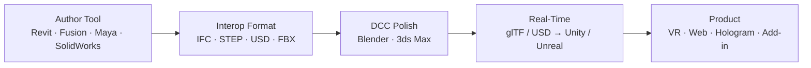

*Back to [Subject_Plan](Subject_Plan) | Part of [00 - 09 - Learning Index](00---09---Learning-Index)*

# 27.1 — 3D Modelling Foundations & Coordinate Systems

> *"Before you choose a tool, choose a representation. Before you choose a representation, choose a coordinate system. Get those two right and every tool becomes learnable."*

This chapter is the **universal layer** under all of [Revit](27.2---Autodesk-Revit-Fundamentals), [Fusion](27.4---Autodesk-Fusion-360---Parametric-Modelling-&-CAM), [Maya/Max](27.5---Maya-&-3ds-Max---DCC,-Animation-&-Arch-Viz-Rendering), [Blender](27.6---Blender---Open-Source-Modelling,-Geometry-Nodes-&-Sculpting), and [SolidWorks](27.7---SolidWorks---Mechanical-CAD,-Assemblies-&-Simulation). Every tool you'll touch is a particular **opinion** about coordinate systems, geometry representations, and how transforms compose. Once you know the universal mental model, every tool becomes a dialect.

---

## 🎯 Learning Objectives

By the end of this chapter you will be able to:

1. Define the canonical coordinate spaces in a 3D pipeline (object → world → view → clip → screen).
2. Compute a TRS (translate · rotate · scale) matrix by hand and explain why order matters.
3. Compare the four major geometry representations — **B-rep**, **polygon mesh**, **NURBS**, **SDF / implicit** — and predict which a given tool prefers.
4. Reason about the up-axis difference between tools (Y-up vs Z-up) and write the conversion matrix.
5. Sketch the universal author → interop → DCC → real-time → product pipeline.
6. Recognize where each tool in this track sits on that pipeline.

---

## 🖼️ Visual Anchor

---

## 📚 1. Definitions

### Definition 27.1.1 — Coordinate Space

A coordinate space is a frame in which positions are expressed. The canonical 3D pipeline uses five:

| Space | Origin | Used by |
|---|---|---|
| **Object / Local** | The object's own pivot | Modelling, rigging |
| **World** | The scene origin | Composition, physics |
| **View / Camera** | The camera's pivot | Lighting, culling |
| **Clip** | Perspective-divided NDC | Rasterization input |
| **Screen** | Viewport pixels | Final display |

### Definition 27.1.2 — TRS Transform

A rigid + scale transform composed as:

$$
M = T \cdot R \cdot S
$$

Reading right-to-left as applied to a point: scale first, then rotate, then translate. Order matters because matrix multiplication is non-commutative. See [2.4 - Linear Maps & Matrix Algebra](2.4---Linear-Maps-&-Matrix-Algebra) and [28.1 - 3D Math Fundamentals](28.1---3D-Math-Fundamentals) for the math.

### Definition 27.1.3 — Geometry Representations

- **B-rep (boundary representation)** — solids stored as topology of vertices, edges, faces, with parametric surfaces. Used by Revit, Fusion 360, SolidWorks, FreeCAD. Backed by kernels: **Parasolid** (SolidWorks/NX), **ACIS** (Inventor pre-2024), **OpenCASCADE** (FreeCAD, open-source).
- **Polygon mesh** — discrete triangles or quads. Used by Maya, 3ds Max, Blender, every game engine.
- **NURBS (Non-Uniform Rational B-Splines)** — smooth parametric surfaces driven by control points + weights + knot vectors. Used by Rhino, Alias, automotive class-A surfacing.
- **SDF / implicit** — signed distance fields; surfaces defined as zero level set of $f(\mathbf{x}) = 0$. Used by nTopology, parts of ZBrush, modern procedural / generative tooling.

### Definition 27.1.4 — Up-Axis Convention

Tools disagree on which axis points "up":

| Convention | Tools |
|---|---|
| **Y-up** | Maya, Unity, glTF, three.js |
| **Z-up** | Revit, Blender, AutoCAD, Unreal Engine, USD (default), 3ds Max |

Conversion is a 90° rotation about X:

$$
M_{Y\to Z} = \begin{pmatrix} 1 & 0 & 0 & 0 \\ 0 & 0 & -1 & 0 \\ 0 & 1 & 0 & 0 \\ 0 & 0 & 0 & 1 \end{pmatrix}
$$

---

## 📐 2. The Pipeline

The track follows this exact arc — chapters 20.2/20.3 own **Author**, 20.4/20.7 own **mechanical Author**, 20.5/20.6 own **DCC + real-time**, and 27.8 stitches the whole thing into a **business**.

---

## 🛠️ 3. Worked Example — Revit (Z-up, mm) to Unity (Y-up, m)

**Problem:** A Revit family at world position $(10000, 0, 3000)$ (mm, Z-up) needs to land in Unity world.

**Step 1 — Unit conversion:** $1$ unit (Unity) $= 1\,\text{m} = 1000\,\text{mm}$. So divide by $1000$:

$$
(10000, 0, 3000)_{\text{mm}} \to (10, 0, 3)_{\text{m}}
$$

**Step 2 — Axis swap (Z-up → Y-up):** swap Y ↔ Z, negate the new Z to preserve handedness:

$$
(x, y, z)_{\text{Z-up}} \to (x, z, -y)_{\text{Y-up}}
$$

So $(10, 0, 3) \to (10, 3, 0)$ in Unity world.

**Step 3 — Verify handedness:** Revit/Blender are right-handed; Unity is left-handed. The negation in Step 2 takes care of that. (Unreal Engine is left-handed Z-up — different conversion.)

This single example explains 80% of "why my model looks rotated/mirrored when I import it" frustration.

---

## 🔗 4. Cross-links & Further Reading

### Internal
- [2.4 - Linear Maps & Matrix Algebra](2.4---Linear-Maps-&-Matrix-Algebra) — matrix multiplication mechanics
- [28.1 - 3D Math Fundamentals](28.1---3D-Math-Fundamentals) — TRS in depth, projection matrices
- [28.2 - Quaternions & Rotations](28.2---Quaternions-&-Rotations) — rotation without gimbal lock
- [27.8 - Pipelines, Interop & Productization - From Architecture to Business](27.8---Pipelines,-Interop-&-Productization---From-Architecture-to-Business) — where this all lands as product

### External
- [Real-Time Rendering, 4th ed. (free chapters)](https://www.realtimerendering.com/) — Akenine-Möller et al.
- [OpenUSD Introduction (Pixar)](https://openusd.org/release/intro.html) — composition + layering
- [glTF 2.0 Specification (Khronos)](https://github.com/KhronosGroup/glTF) — runtime asset format
- [IFC 4.3 (buildingSMART)](https://ifc43-docs.standards.buildingsmart.org/) — open BIM exchange
- [OpenCASCADE Overview](https://dev.opencascade.org/doc/overview/html/index.html) — open-source B-rep kernel

---

## ⚠️ 5. Common Misconceptions

- **"FBX is good enough."** FBX is closed, Autodesk-controlled, lossy on metadata. Prefer USD or glTF for new pipelines.
- **"All meshes are the same."** Triangle vs quad topology drastically affects subdivision, animation, and downstream sculpting. Game engines want triangles; subdivision and animation want quads.
- **"Up-axis is cosmetic."** Wrong axis breaks normals, lightmaps, physics, and IK chains.
- **"B-rep is always better than mesh."** B-rep is precise but heavy; for real-time rendering you must tessellate to mesh anyway. The skill is choosing the right representation per stage.

---

*Next: [27.2 - Autodesk Revit Fundamentals](27.2---Autodesk-Revit-Fundamentals) — Where your architecture training becomes a production tool.*
