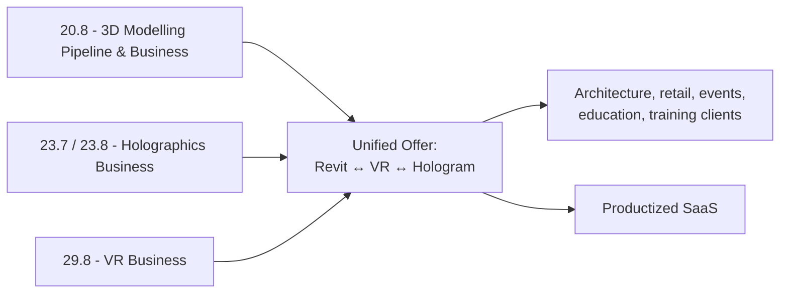

*Back to [Subject_Plan](Subject_Plan) | Part of [00 - 09 - Learning Index](00---09---Learning-Index)*

# 29.8 — VR as a Business: Productization, Distribution, Monetization

> *"Hardware is cheap. Headsets are commoditizing. The defensible asset in 2026 VR is the **content pipeline + distribution + recurring revenue** layer."*

---

## 🎯 Learning Objectives

1. Pick a **vertical** (arch-viz / training / education / events / retail / surgical / fitness) and persona.
2. Pick a **distribution channel**: Quest Store, App Lab, SideQuest, Vision Pro App Store, Web (direct), B2B direct, enterprise contract.
3. Pick a **monetization model**: one-time purchase, subscription, B2B service, robot-as-a-service-style "VR-as-a-service", consulting + tooling combo.
4. Build a **product-thesis worksheet** + 24-month plan.
5. Integrate with the parallel chapters in 20.8 and 23.7 / 23.8 to form **one coherent offer** rather than three separate ones.

---

## 🖼️ Visual Anchor

> *Picture / video reference (external):*
> - 📺 [Meta Horizon — Submission & Quest Store guidelines](https://developers.meta.com/horizon/resources/publish-quest-content/)
> - 📺 [Apple — Vision Pro App Store distribution](https://developer.apple.com/visionos/distribute/)
> - 📺 [SideQuest](https://sidequestvr.com/)
> - 📖 [framesixty — VR Development Guide 2026](https://framesixty.com/virtual-reality-development-guide/)

---

## 📚 1. Vertical → Persona Map

| Vertical | Persona | Pain | Sellable artifact |
|---|---|---|---|
| Arch-viz | Architect, real-estate dev | "Clients can't read drawings" | VR walkthrough deliverable per project |
| Training (industrial / medical) | Ops director | "Hands-on training is expensive" | Per-seat licensed simulator |
| Education | School / district | "Engagement is dropping" | Subscription per classroom |
| Events / retail | Brand activation | "Booth fatigue" | Branded experience as a service |
| Surgical / medical | Hospital admin | "Pre-op planning is 2D" | DICOM-to-VR planner |
| Fitness | Consumer / gym | "Treadmills are boring" | Subscription content |
| Social / collaboration | Distributed team lead | "Zoom fatigue" | Persistent space + subscription |

---

## 🛍️ 2. Distribution Channels

| Channel | Pros | Cons | Take rate |
|---|---|---|---|
| **Quest Store (curated)** | Reach, credibility | Hard to get accepted; takes 30% | 30% |
| **Quest Store (App Lab)** | Easier to publish, full Quest distribution | Discoverability harder | 30% |
| **SideQuest** | Indie-friendly | Smaller audience | Variable |
| **Vision Pro App Store** | Premium audience, USDZ-friendly | Apple cut + review | 30% (15% small biz tier) |
| **Steam (PC VR)** | High-value audience | Index / Vive bias | 30% |
| **Web (WebXR direct)** | No install, full margin, direct sales | Smaller audience | ~0% (just hosting) |
| **B2B direct** | Highest margin | Long sales cycles | ~0% (your sales effort) |
| **Enterprise platform deals (Mesh, Spatial)** | Scale | Platform-locked | platform terms |

---

## 💰 3. Monetization Models

| Model | When | Example |
|---|---|---|
| One-time purchase | Mature consumer game | Beat Saber |
| Subscription | Continuously updated content | Supernatural fitness |
| Per-project service | Bespoke arch-viz / training | Custom dev studio |
| **Productized service** | Standardized offer | "Standard VR walkthrough package: $X per project" |
| Per-seat enterprise license | Training, simulators | $X / seat / month |
| RaaS (everything-as-a-service) | Hardware + content lease | Headset + content + support |
| Consulting + tooling combo | Consulting margin + software upsell | "We integrate VR into your sales process + license our pipeline" |

For your background: **productized service** + **per-seat enterprise license** is the highest-leverage start.

---

## 🏗️ 4. The 24-Month Plan (Template)

**Months 0–3**: Build the pipeline (this curriculum). Ship 1 free demo to validate.
**Months 3–6**: Land 3 paying clients (free or discounted to build case studies + reel).
**Months 6–12**: Standardize offer; raise prices; deliver 1 client/week.
**Months 12–18**: Identify the repeating part; productize as SaaS / Quest Store / Vision Pro App Store app.
**Months 18–24**: Hire (designer + developer); double services + grow SaaS.

---

## 🔗 5. Integration with the Larger Curriculum

**Don't run three businesses.** Run one — "Spatial Computing for Architects" — and pick whichever tech mix the client needs.

---

## 🛠️ 6. Worked Example (skeleton) — Spatial Computing for Architects MVP

1. Service offer: "Standard package — Vision Pro walkthrough + Quest 3 multi-user + Looking Glass desktop + 2D renders, $5K add-on per project."
2. Pipeline: Revit → Speckle → Blender → USD → Reality Composer Pro / Unity / Looking Glass Bridge.
3. Hardware capex: Vision Pro ($3,499) + Quest 3 ($499) + Looking Glass Portrait ($499) + workstation.
4. Marketing: 1 demo reel; 5 LinkedIn cold outreaches per week to local architecture studios.
5. First 3 clients at discount; raise prices 25% per next 3 clients.

---

## 🔗 7. Cross-links & Further Reading

### Internal
- All previous chapters 24.1–29.7
- [20.8 - Pipelines, Interop & Productization - From Architecture to Business](20.8---Pipelines,-Interop-&-Productization---From-Architecture-to-Business)
- [23.7 - Holography in Architecture & Engineering Visualization](23.7---Holography-in-Architecture-&-Engineering-Visualization)
- [23.8 - The Systems Stack - From Photons to Pixels to Products](23.8---The-Systems-Stack---From-Photons-to-Pixels-to-Products)
- [22.8 - Humanoids, Drones & The Future of Robotics](22.8---Humanoids,-Drones-&-The-Future-of-Robotics) — sister-business pattern

### External
- [Meta Horizon publishing](https://developers.meta.com/horizon/resources/publish-quest-content/)
- [Apple Vision Pro distribution](https://developer.apple.com/visionos/distribute/)
- [Steam Direct](https://store.steampowered.com/steamworks/learnabout)
- [SideQuest](https://sidequestvr.com/)
- [framesixty 2026 VR Development Guide](https://framesixty.com/virtual-reality-development-guide/)

---

## ⚠️ 8. Common Misconceptions

- **"VR is a niche."** It was; in 2026, with millions of Quest 3 + growing Vision Pro userbase, vertical SaaS / B2B is mainstream-viable.
- **"Build it and they will come."** Distribution + sales effort is **half** the work.
- **"Charge for the headset."** Don't. Charge for the **content + outcome**; let the client buy the hardware separately.
- **"Wait for the perfect hardware."** Don't. Today's hardware is good enough for the verticals listed; the gap is content + pipelines.

---

*Track 29 capstone complete. You now have a curriculum spanning math → physics → AI → 3D → robotics → holographics → VR. The integration is the product. Continue at the [Master Learning Index](00---09---Learning-Index).*
