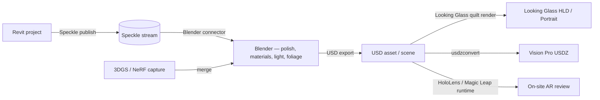

*Back to [Subject_Plan](Subject_Plan) | Part of [00 - 09 - Learning Index](00---09---Learning-Index)*

# 31.7 — Holography in Architecture & Engineering Visualization

> *"Most arch-viz studios sell PNGs. A few sell VR walkthroughs. Almost none sell light-field or holographic deliverables. That gap is your wedge."*

---

## 🎯 Learning Objectives

1. Build an end-to-end pipeline: **Revit → Speckle → Blender / Unity → quilt → Looking Glass / Sony SR**.
2. Build the **Vision Pro USDZ** path for the same model.
3. Use **3DGS / NeRF** to capture *existing* sites for holographic before-after deliverables.
4. Author MEP / structural coordination scenes for **HoloLens 2 / Magic Leap 2** on-site review.
5. Productize: pick a target persona (residential boutique, retail brand, surgical, automotive, museum) and outline the offer.
6. Map this chapter directly to [20.8 productization](20.8---Pipelines,-Interop-&-Productization---From-Architecture-to-Business).

---

## 🖼️ Visual Anchor

> *Picture / video reference (external):*
> - 📺 [Speckle — Revit-to-Blender tutorial](https://speckle.systems/tutorials/how-to-transfer-revit-models-to-blender-via-speckle)
> - 📺 [Looking Glass — case studies](https://lookingglassfactory.com/case-studies)
> - 📖 [AECMag — Speckle (open-source AEC data platform)](https://aecmag.com/data-management/speckle-the-open-source-cloud-data-platform/)

---

## 🧱 1. The Reference Pipeline



Every block is doable today with mostly-free / low-cost tools.

---

## 🏛️ 2. The Six Sellable Deliverables

| Deliverable | Hardware | Use case |
|---|---|---|
| **Looking Glass desktop hologram** | $499 Portrait or $899 Go | Sales-office centerpiece |
| **Vision Pro walkthrough (USDZ)** | $3,499 device, app on side | Concierge client demo |
| **Quest 3 immersive walkthrough** | $299 device | Cost-sensitive client demo |
| **HoloLens 2 / Magic Leap 2 on-site MEP review** | enterprise headset | Coordination meetings |
| **Volumetric capture (3DGS) of existing site** | phone + cloud | Before-after deliverable |
| **Hololuminescent retail / event display (HLD)** | leased | Brand activation, retail |

---

## 🔧 3. Practical Recipes

### 3.1 Revit → Looking Glass quilt (45 views, 9×5)
```python
# Pseudocode in Blender Python
import bpy, math
for j in range(5):
    for i in range(9):
        cam.location = base_pos + lerp_offset(i/8, j/4)  # within view cone
        bpy.ops.render.render(write_still=True, filepath=f"/tmp/quilt_{j*9+i:02}.png")
# Then use Looking Glass Bridge / Studio to assemble the quilt
```

### 3.2 Revit → USDZ for Vision Pro
1. Speckle publish from Revit → Speckle Blender → bake materials.
2. Blender USD export.
3. `usdzconvert input.usd output.usdz` (Apple's tool).
4. Drop into Reality Composer Pro for tweaks; build Vision Pro app in Xcode + RealityKit.

### 3.3 3DGS capture of an existing house (rehab project)
1. Phone-walk the interior, ~300 photos.
2. COLMAP camera-pose recovery.
3. Train 3DGS via Nerfstudio or gsplat.
4. Export PLY / SPZ.
5. Combine with Revit-modelled proposed renovation in same Blender scene.
6. Render before/after quilts → Looking Glass.

---

## 💼 4. Product Persona Worksheet

Pick **one**:

| Persona | Pain | Sellable artifact |
|---|---|---|
| Boutique residential architect | "Clients can't read drawings" | Looking Glass + Vision Pro deliverables per project |
| Real-estate developer | "Pre-sales need impact" | Sales-office holographic centerpiece + Vision Pro app |
| Retail brand | "Activations need wow" | HLD installation as a service |
| Hospital facilities | "MEP coordination meetings drag" | HoloLens 2 on-site review service |
| Automotive design | "Reviews need 3D depth" | Sony Spatial Reality / Looking Glass review setup |
| Museum / exhibit | "Static + flat" | Volumetric capture + holographic display deliverable |

---

## 🛠️ 5. Worked Example (skeleton) — A Boutique Residential Pitch

Goal: differentiate from competitors by including a Vision Pro walkthrough + Looking Glass desktop hologram in the standard package, at +15% project fee.

1. Standardize the Revit → Speckle → Blender → USD pipeline (one weekend; from [20.8](20.8---Pipelines,-Interop-&-Productization---From-Architecture-to-Business)).
2. Buy a $499 Looking Glass Portrait + $3,499 Vision Pro (one-time capex; bake into hourly rate over a year).
3. Deliverable per project:
   - 5–8 PNG hero renders (existing).
   - Vision Pro walkthrough USDZ.
   - Looking Glass dialog asset.
   - Optional: 3DGS of existing site for renovation projects.
4. Marketing — record one demo reel; show in every client meeting.

Outcome: 3 clients × +15% fee × 6-figure projects = pays the capex in 1 month.

---

## 🔗 6. Cross-links & Further Reading

### Internal
- [31.5 - Light-Field Displays & Volumetric Capture - Looking Glass, NeRF, 3D Gaussian Splatting](31.5---Light-Field-Displays-&-Volumetric-Capture---Looking-Glass,-NeRF,-3D-Gaussian-Splatting)
- [31.6 - Holographic AR - HoloLens, Magic Leap, Waveguides & the Marketing-vs-Physics Gap](31.6---Holographic-AR---HoloLens,-Magic-Leap,-Waveguides-&-the-Marketing-vs-Physics-Gap)
- [20.8 - Pipelines, Interop & Productization - From Architecture to Business](20.8---Pipelines,-Interop-&-Productization---From-Architecture-to-Business)
- [Subject_Plan](Subject_Plan)

### External
- [Speckle tutorials](https://speckle.systems/tutorials)
- [Looking Glass case studies](https://lookingglassfactory.com/case-studies)
- [Vision Pro Reality Composer Pro docs](https://developer.apple.com/documentation/realitykit)
- [Apple usdzconvert](https://developer.apple.com/augmented-reality/tools/)

---

## ⚠️ 7. Common Misconceptions

- **"Clients won't pay for holographic deliverables."** Many will pay a premium for differentiation. The sale is "you can't get this anywhere else in our market," not "this looks better."
- **"This needs a custom renderer."** It doesn't. Stock pipelines (Blender + USD) cover most of it; Looking Glass Bridge does the rest.
- **"3DGS is research-only."** In 2026 it's shipping in production tools; treat it as a regular asset format.
- **"Vision Pro will dominate."** Maybe. Bet on the format (USD/USDZ) more than the device.
