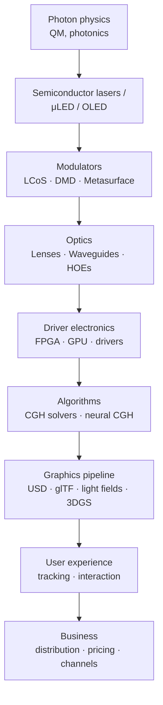

*Back to [Subject_Plan](Subject_Plan) | Part of [00 - 09 - Learning Index](00---09---Learning-Index)*

# 31.8 — The Systems Stack: From Photons to Pixels to Products

> *"A holographic display is the most stack-violating piece of consumer hardware in the world. Quantum mechanics → photonics → semiconductors → optics → algorithms → graphics → UX → business model. You'll touch every layer."*

---

## 🎯 Learning Objectives

1. Sketch the **full stack** from photon emission → display optics → user perception → revenue.
2. Identify the **rate-limited layer** in any holographic product (it's almost never the algorithm).
3. Survey **2026 frontier** research and translate it into 5–10-year product theses.
4. Build a **product-thesis worksheet** for one chosen vertical (arch-viz / events / medical / education / retail).
5. Connect the chapter back to the curriculum: which existing tracks (math/phys, AI, electronics, 3D, VR) feed the holographics product roadmap.

---

## 🖼️ Visual Anchor

> *Picture / video reference (external):*
> - 📺 [Stanford Wetzstein Lab — annual research talks](https://www.computationalimaging.org/)
> - 📺 [Looking Glass Factory keynotes (HLD launch)](https://lookingglassfactory.com/)
> - 📖 [Phys.org — Metasurface-based SLM 2026](https://phys.org/news/2026-02-metasurface-based-slm-ar-vr.html)
> - 📖 [Nature 2026 — sub-second holographic 3D printing](https://www.nature.com/articles/s41586-026-10114-5)

---

## 📚 1. The Full Stack

Reading top-down: each layer constrains the next. Reading bottom-up: each layer multiplies the value of layers below.

---

## 🚧 2. The Real Bottleneck

For most holographic products in 2026:

| Layer | Bottleneck severity |
|---|---|
| Photon physics | Solved (quantum-limited); not a product issue |
| Lasers / μLED | Cost + integration |
| Modulators | **Pixel pitch + frame rate** — the hardest |
| Optics / waveguides | FoV vs eyebox vs brightness tradeoff |
| Driver electronics | Bandwidth (8K @ 240 Hz is a lot) |
| Algorithms | Largely solved (neural CGH) |
| Graphics pipeline | Asset-format fragmentation |
| UX | Stronger but still jarring; VAC, calibration |
| Business | Distribution + content + pricing |

The unpopular truth: **content + distribution** are usually harder than the optics. Hardware founders learn this the hard way.

---

## 🔮 3. 2026 Frontier — What's Real, What's Soon

| Frontier | State (May 2026) | Likely 2027–2030 |
|---|---|---|
| Metasurface SLMs | Lab demos (Nature Nanotech 2026) | Niche commercial in AR/LiDAR |
| Tensor / neural CGH | Real-time on consumer GPU (MIT 2021+) | Standard inside any holographic display |
| 3D Gaussian Splatting + Looking Glass | Working today | Replaces NeRF for most volumetric capture |
| Holographic-light-field 3D printing | Sub-second print (Nature 2026) | Manufacturing technique for custom optics, organs |
| Femtosecond aerial volumetric | Lab only | Stays research; safety + power barriers |
| True-holographic AR glasses | Research (Stanford / MIT / Snap labs) | First consumer demo: late 2020s |
| LCoS-SLM with both AM + PM in one device | Conference 2024–2026 | Production ~2027–2028 for AR/VR/MR |

---

## 🧭 4. Product Thesis Worksheet

Fill this in for **one** vertical:

| Question | Your answer (template) |
|---|---|
| Vertical | (e.g., boutique residential arch-viz) |
| Persona / customer | (e.g., 1–10-person architecture studio principal) |
| Pain | (e.g., losing pitches to studios with VR / immersive deliverables) |
| Sellable artifact | (e.g., "Holographic deliverable add-on" — Vision Pro USDZ + Looking Glass desktop unit) |
| Pricing | (e.g., +15% on project fee, OR $5K/year subscription) |
| Capex | (Looking Glass Portrait + Vision Pro + software ≈ $4–$5K) |
| Distribution | (Direct LinkedIn outreach to architects in metro X) |
| Defensibility | (Pipeline IP + content library + integrations) |
| 24-month plan | (10 clients → SaaS → 100 clients) |

This is the on-ramp from **track** → **business**.

---

## 🛠️ 5. Worked Example (skeleton) — Spec the MVP

Goal: minimum viable holographic-arch-viz business by end of next quarter.

1. Hardware: Looking Glass Portrait + Apple Vision Pro + a workstation with RTX 5090.
2. Software: Revit + Speckle + Blender + Nerfstudio + Looking Glass Bridge + Reality Composer Pro.
3. Pipeline: weekend implementation per [31.7](31.7---Holography-in-Architecture-&-Engineering-Visualization).
4. First 3 clients: free / discounted to build case studies + reel.
5. Production rate: 1 client/week after week 4.
6. Stretch goal: a small SaaS that auto-generates Looking Glass quilts from a Speckle stream — defensible IP.

---

## 🔗 6. Cross-links & Further Reading

### Internal
- All previous chapters 23.1–31.7
- [20.8 - Pipelines, Interop & Productization - From Architecture to Business](20.8---Pipelines,-Interop-&-Productization---From-Architecture-to-Business)
- [Subject_Plan](Subject_Plan)
- [Subject_Plan](Subject_Plan) (volumetric capture overlap)
- [Subject_Plan](Subject_Plan) (neural CGH)
- [Subject_Plan](Subject_Plan) (photon-level layer)

### External
- [Stanford Wetzstein Lab](https://www.computationalimaging.org/)
- [MIT Tensor Holography](https://cgh.csail.mit.edu/)
- [Looking Glass Factory](https://lookingglassfactory.com/)
- [Phys.org — Metasurface-based SLM (2026)](https://phys.org/news/2026-02-metasurface-based-slm-ar-vr.html)
- [Nature 2026 — Volumetric 3D printing via holographic light fields](https://www.nature.com/articles/s41586-026-10114-5)
- [arXiv physics.optics](https://arxiv.org/list/physics.optics/recent)

---

## ⚠️ 7. Common Misconceptions

- **"The optics are the moat."** Often the moat is **content + distribution + UX**. Optics are increasingly commoditized.
- **"Wait until true holographic AR is here."** Don't wait — light-field + USD + Vision Pro are sellable *now*.
- **"This is too physics-heavy to be a business."** The pieces are dropping in price every year. The business model layer is the bigger lift.
- **"Hologram = science fiction."** It's a discounted product on Amazon ($499 Looking Glass Portrait, $299 Quest 3S, $899 Looking Glass Go).

---

*Track 31 capstone complete. Continue to [29 - VR](Subject_Plan) — the applied / business VR track that ties holographics, 3D modelling, and immersive systems together.*
