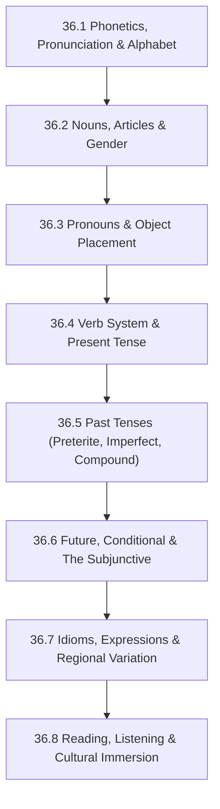

# Subject Syllabus: 36 - Spanish

*Back to [Learning Index](00---09---Learning-Index)*

This syllabus defines the roadmap for **adult-second-language acquisition** of Spanish, optimized for an English speaker with strong systematizing intuition (math/AET background) and rusty programming-language fluency. The path is deliberately compressed — no children's vocabulary lists, no rote memorization without structure. Verb conjugation is treated as a finite-state machine; gender agreement is treated as a typing system; subjunctive is the "monad" of Spanish (the abstraction that forces concrete English speakers to bend their thinking).

We optimize for two skills simultaneously: **comprehension** (read news, watch *Narcos*, follow native-speed podcasts) and **production** (speak unprepared, write business emails). Listening and reading drive vocabulary; conjugation drills and shadowing drive production. **Cultural fluency** is interwoven from chapter 1 — without it, you'll never sound like an adult.

---

## 🗺️ 1. Curriculum Mindmap & Milestones

**Target levels:**
- After 17.1–36.4: **A2** (basic conversation, present-tense)
- After 17.5–36.6: **B1** (express past/future, hold opinions, navigate hypotheticals)
- After 17.7–36.8: **B2/C1** (fluent comprehension, unprepared speech, native media)

---

## 📚 2. Premium Free Learning Catalog

### 🎬 Video & Course

- **[Language Transfer — Complete Spanish](https://www.languagetransfer.org/complete-spanish)** — gold-standard free audio course; teaches grammar like a math derivation (Mihalis Eleftheriou is a national treasure). Listen straight through; no rote memorization.
- **[Dreaming Spanish](https://www.dreamingspanish.com/)** — comprehensible-input-only YouTube channel with thousands of hours of graded videos. Free + premium tier. The Krashen Hypothesis put into practice.
- **[Easy Spanish (YouTube)](https://www.youtube.com/@EasySpanish)** — street interviews from Madrid, Mexico City, Buenos Aires, etc. Real native speech with subtitles in Spanish + English.
- **[SpanishPod101](https://www.spanishpod101.com/)** — free tier covers podcasts at all levels.
- **[Notes in Spanish](https://www.notesinspanish.com/)** — natural conversational pace.

### 📖 Open-Access Textbooks & References

- **[Real Academia Española (RAE)](https://www.rae.es/)** — the official Spanish-language authority (dictionary, grammar, conjugation database).
- **[SpanishDict](https://www.spanishdict.com/)** — best free verb conjugator + dictionary.
- **[Tatoeba](https://tatoeba.org/en/sentences/show_all_in/spa/none)** — sentence corpus for example-driven learning.
- *Practice Makes Perfect: Spanish Verb Tenses* by Dorothy Richmond — definitive verb-tense workbook.
- *A New Reference Grammar of Modern Spanish* by Butt & Benjamin — adult reference grammar.

### 📰 Native Media (use sub2srs / LingQ / Language Reactor)

- **[BBC Mundo](https://www.bbc.com/mundo)** — clear journalistic Spanish, news.
- **[NPR Latino USA](https://www.npr.org/podcasts/510038/latino-usa)** — accessible podcast for intermediate learners.
- **[Radio Ambulante](https://radioambulante.org/)** — narrative journalism in Spanish (the Spanish *This American Life*).
- TV: *Money Heist* (La Casa de Papel, Castilian), *Narcos* (Colombian), *Club de Cuervos* (Mexican). Use Language Reactor extension.

---

## 🛠️ 3. Practice & Tooling Integration

### Drill scripts (`_practice/scripts/`)

Same Python+SymPy-style pattern as the math curriculum, adapted for language:

- `17.1_pronunciation_drill.py` — generates IPA → orthography mappings; randomizes diphthongs, stress placement (graves, agudas, esdrújulas).
- `17.4_verb_conjugation_drill.py` — generates random verb + tense + person → conjugated form. Configurable: regular only, irregular only, mixed; AR/ER/IR; present, preterite, imperfect, etc.
- `17.6_subjunctive_drill.py` — generates "trigger phrase + clause" and asks for the subjunctive mood (e.g., "espero que tú ____ (venir)").
- `17.7_idiom_drill.py` — generates an idiom in context with multiple-choice meaning.
- `17_vocab_drill.py` — pulls from a frequency list (top 5000 Spanish words) and generates SR cards.

### External integrations

- **Anki** — import a Core 5K Spanish frequency deck for vocabulary spaced repetition.
- **LingQ / Language Reactor** — for graded reading and TV-watching.
- **Pimsleur Spanish I-V** (library audiobook) — passive listening for pronunciation muscle memory.

### Companion materials (NotebookLM)

Place generated artifacts in `obsidian-files/` with chapter-relevant names:
- Audio overviews per chapter (e.g., `Spanish_Verb_System_Overview.m4a`)
- Conjugation tables as PNG infographics
- Cultural-context PDFs

---

## 🎨 4. Immersion Directive

For each chapter, build at least one of:

- A **shadowing exercise**: pick a 30-second native clip, listen 10×, then speak along with the speaker matching their rhythm and intonation. Record yourself and compare.
- A **comprehensible-input session**: 30 min of Dreaming Spanish or Easy Spanish at the level just above your current ability.
- A **production task**: write 200 words on a chapter-relevant topic; use only structures from the chapter.

Spanish has **massive regional variation** — the curriculum defaults to **neutral Latin American Spanish** (most useful for US/Mexico contexts), but each chapter calls out:
- Castilian (Spain) differences (vosotros, leísmo, "z"/"c" lisp)
- Mexican vs Argentine vs Colombian variants
- Where slang and idioms diverge

---

## 📝 5. Chapter Outline

| # | Chapter | Core skill |
|---|---|---|
| 36.1 | **Phonetics, Pronunciation & Alphabet** | Hear the difference between Spanish vowels and English vowels; master the 5 vowels (always pure); understand stress rules; pronounce *r*, *rr*, *ñ*, *j*, *ll* correctly. |
| 36.2 | **Nouns, Articles & Gender** | Internalize gender as a "type system"; master the article rules (el/la/los/las/lo/un/una); understand how gender propagates through adjectives. |
| 36.3 | **Pronouns & Object Placement** | Direct, indirect, reflexive, possessive, demonstrative pronouns; the placement rules ("se lo doy", "dáselo", "se lo voy a dar"); leísmo & laísmo regional variation. |
| 36.4 | **Verb System & Present Tense** | The three verb conjugations (-ar, -er, -ir); regular present; the major irregulars (ser, estar, ir, tener, hacer, decir, poder, querer); ser-vs-estar mastery. |
| 36.5 | **Past Tenses** | Preterite (completed) vs imperfect (ongoing); compound tenses (he hablado, había hablado); pluperfect; pretérito anterior. The decision tree for "which past tense?". |
| 36.6 | **Future, Conditional & The Subjunctive** | Future tense (synthetic + ir-a + present); conditional; **the subjunctive in detail** — present, imperfect, pluperfect; trigger phrases (es necesario que, dudar que, ojalá que); si-clauses (real vs hypothetical vs counterfactual). |
| 36.7 | **Idioms, Expressions & Regional Variation** | High-frequency idioms (tener ganas de, dar igual, hacer falta); slang per region (chido/Mexico, guay/Spain, copado/Argentina); cursing (without sounding like a tourist). |
| 36.8 | **Reading, Listening & Cultural Immersion** | News, podcasts, TV, literature. How to actively learn from native media using sub2srs, LingQ, Language Reactor. Cultural milestones (Día de los Muertos, Carnaval, Semana Santa, regional historical context). |

Each chapter follows the same Pearson/Ambrose textbook structure: definitions, axioms (grammar rules as theorems), worked examples, anti-pattern warnings, and a "Common Misconceptions" section addressing where English-speakers fail.

---

## 🌐 6. Estimated Cadence

- **2 hr/day, 5 days/week**: complete A2 in ~2 months, B1 in ~5 months, B2 in ~9 months.
- **30 min/day**: double the timeline, but still achievable.
- The single highest-leverage activity at any level: **comprehensible-input listening** (Dreaming Spanish-style). Vocabulary and grammar fall into place when ears are trained first.

---

*Curriculum architect: Bill — adult-learner Spanish track. Cross-links: [Track 18 Japanese](Subject_Plan) for parallel-structure learning system.*

---

## Related Notes
- [LEARNING_PATH](LEARNING_PATH) - Shared curriculum/spanish focus
- [36.1 - Phonetics, Pronunciation & Alphabet](36.1---Phonetics,-Pronunciation-&-Alphabet) - Same Spanish folder
- [36.2 - Nouns, Articles & Gender](36.2---Nouns,-Articles-&-Gender) - Same Spanish folder
- [36.3 - Pronouns & Object Placement](36.3---Pronouns-&-Object-Placement) - Same Spanish folder
- [36.4 - Verb System & Present Tense](36.4---Verb-System-&-Present-Tense) - Same Spanish folder
