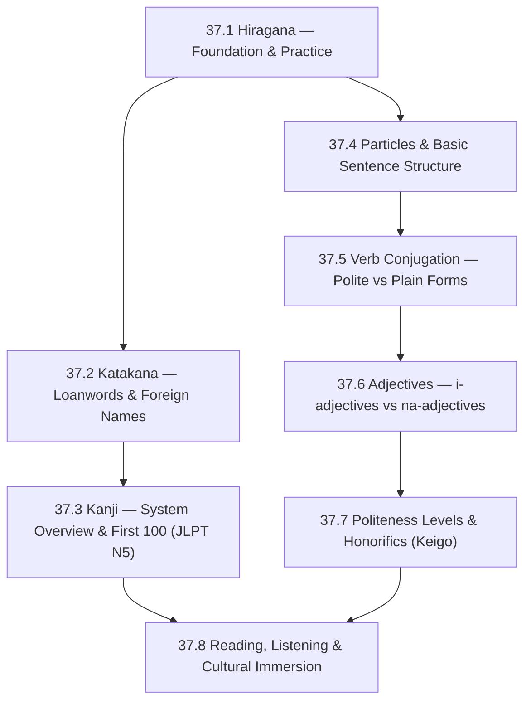

# Subject Syllabus: 37 - Japanese

*Back to [Learning Index](00---09---Learning-Index)*

This syllabus defines the roadmap for **adult-second-language acquisition** of Japanese, optimized for an English speaker with strong systematizing intuition (math/AET background). Japanese is **structurally alien** to English — SOV word order, agglutinative verb morphology, no plurals, no articles, no gendered nouns, three writing systems running in parallel, and politeness levels baked into the grammar. We treat it the way a mathematician treats a foreign axiomatic system: learn the axioms, derive the consequences, drill the patterns.

The curriculum has **three reinforcing tracks** running in parallel:

1. **Writing systems** (hiragana → katakana → kanji)
2. **Grammar** (particles → conjugation → politeness levels)
3. **Vocabulary** (high-frequency core 2k → JLPT-leveled vocab → media-driven acquisition)

The kanji subsystem is treated as **its own searchable database in the vault** — see §6 below.

---

## 🗺️ 1. Curriculum Mindmap & Milestones



**Target levels:**
- After 18.1–37.4: **JLPT N5** (~100 kanji, ~800 vocab, basic sentences)
- After 18.5–37.6: **JLPT N4** (~300 kanji, ~1500 vocab, daily conversation)
- After 18.7–37.8: **JLPT N3** (~650 kanji, ~3750 vocab, manga/anime/news comprehension)

(N2/N1 are post-curriculum; build them through native media + Bunpro grammar progression once N3 is solid.)

---

## 📚 2. Premium Free Learning Catalog

### 🎬 Video & Course

- **[Tofugu](https://www.tofugu.com/)** — exceptional adult-learner blog. Their hiragana/katakana mnemonic guides are the gold standard.
- **[JapanesePod101 (YouTube)](https://www.youtube.com/@learnjapanesewithjapanesepod101)** — free leveled tier with thousands of hours.
- **[Cure Dolly's Organic Japanese](https://www.youtube.com/playlist?list=PLg9uYxuZf8x_A-vcqqyOFZu06WlhnypWj)** — *the* deep-grammar series. Cure Dolly explains particles and copulas the way a category theorist would. Avatar is jarring; pedagogy is unmatched.
- **[Comprehensible Japanese](https://www.youtube.com/@cijapanese)** — Krashen-style comprehensible-input channel.
- **[NHK World Easy Japanese](https://www3.nhk.or.jp/news/easy/)** — graded news; the foundational resource for early reading.
- **[Game Gengo](https://www.youtube.com/@GameGengo)** — Japanese taught through video games.

### 📖 Open-Access Textbooks & References

- **[Tae Kim's Guide to Japanese](https://guidetojapanese.org/learn/)** — free comprehensive grammar (legendary).
- **[Imabi](https://www.imabi.org/)** — most rigorous free grammar reference; goes from N5 to N1.
- **[Bunpro](https://bunpro.jp/)** — JLPT-leveled grammar SRS (free tier limited; paid is worth it).
- **[Wanikani](https://www.wanikani.com/)** — kanji + vocab SRS using radicals + mnemonics. Free tier covers first 3 levels (~100 kanji).
- *Genki I & II* by The Japan Times — standard university textbook (paid, library available).
- *Tobira: Gateway to Advanced Japanese* — N3+ standard.
- **[Jisho.org](https://jisho.org/)** — best free Japanese-English dictionary; supports radical search, kanji-by-stroke search.
- **[KANJIDIC2](http://nihongo.monash.edu/kanjidic2/index.html)** — free XML database of every kanji in JIS X 0208 (~6,000 kanji) with meanings, on/kun readings, frequency, JLPT level. **Used directly by the kanji subsystem; see §6.**
- **[KanjiVG](https://kanjivg.tagaini.net/)** — Creative Commons SVG database of kanji stroke order. **Used directly by the kanji subsystem; see §6.**
- **[JMdict](https://www.edrdg.org/jmdict/edict.html)** — comprehensive Japanese-English vocabulary database.

### 📺 Native Media (graded difficulty)

- **Beginner:** Doraemon (anime), Shirokuma Cafe, Yotsuba& (manga).
- **Intermediate:** Studio Ghibli films, *Terrace House*, NHK World Easy News.
- **Advanced:** *Death Note*, Murakami short stories, news (NHK / Asahi), tech podcasts (LISTEN).

---

## 🛠️ 3. Practice & Tooling Integration

### Drill scripts (`_practice/scripts/`)

- `18.1_hiragana_drill.py` — randomized hiragana → romaji + romaji → hiragana drills; configurable subset (vowels first, then K-row, S-row, etc.).
- `18.2_katakana_drill.py` — same for katakana, plus loanword recognition (e.g., コンピューター → "konpyuutaa" → computer).
- `18.3_kanji_drill.py` — JLPT-level-filtered kanji recognition. Reads from the `_kanji/` database (see §6); drills on'yomi/kun'yomi, meaning, vocabulary using each kanji.
- `18.4_particle_drill.py` — fill-in-the-particle exercises (は, が, を, に, で, へ, と, から, まで, より, etc.) with progressive ambiguity.
- `18.5_verb_conjugation_drill.py` — random verb + form (ます-form, て-form, plain past, potential, passive, causative, conditional) → conjugated output. Ichidan/godan/irregular distinction.
- `18.6_adjective_drill.py` — i-adjective vs na-adjective conjugation; combining adjectives.
- `18.7_keigo_drill.py` — sonkeigo/kenjougo/teineigo translation drills (the killer politeness layer).
- `18_vocab_drill.py` — pulls from JLPT-leveled vocabulary database; SR-card output.

### External integrations

- **Anki** — import the **Core 6K** deck (top 6000 Japanese words by frequency, with audio); also import a JLPT-leveled kanji deck.
- **Wanikani** — primary kanji SRS for the first 100–300 kanji. Free tier covers N5-equivalent.
- **Bunpro** — grammar SRS, JLPT-tracked.
- **Language Reactor** for anime/Netflix subtitled study.

### Companion materials (NotebookLM)

- Audio overviews per chapter
- Hiragana/katakana flashcard PDFs
- Cultural-context infographics (e.g., the Genki-era timeline; modern social hierarchy diagrams)

---

## 🎨 4. Immersion Directive

For each chapter:

- **Listening:** 30 min/day of comprehensible input (Comprehensible Japanese / NHK Easy).
- **Reading:** start with hiragana-only graded readers (Olly Richards "Short Stories in Simple Japanese"); progress to NHK Easy News at chapter 18.3+; full furigana manga (Yotsuba&!) at 18.5+; native manga without furigana at N3 territory.
- **Production:** language exchange (Tandem/HelloTalk) starting chapter 18.4.

---

## 📝 5. Chapter Outline

| # | Chapter | Core skill |
|---|---|---|
| 37.1 | **Hiragana — Foundation & Practice** | All 46 base hiragana + dakuten/handakuten + youon (combined characters); reach 100% reading speed. |
| 37.2 | **Katakana — Loanwords & Foreign Names** | All 46 katakana + extended (ヴ, ファ, etc.); decode loanwords; recognize foreign names. |
| 37.3 | **Kanji — System Overview & First 100 (JLPT N5)** | The radical system; on'yomi vs kun'yomi (when to use which); the vault's `_kanji/` database; first 100 N5 kanji. |
| 37.4 | **Particles & Basic Sentence Structure** | は (topic) vs が (subject); を (object); に vs で (location); の (possessive/nominalizer); SOV order; copulas (です/だ). |
| 37.5 | **Verb Conjugation — Polite vs Plain Forms** | Ichidan vs godan vs irregular; ます-form; て-form (the workhorse); plain past; conditional; potential; volitional. |
| 37.6 | **Adjectives — i-adjectives vs na-adjectives** | Conjugation differences; combining adjectives with て-form; comparatives; the は/が distinction in adjective sentences. |
| 37.7 | **Politeness Levels & Honorifics (Keigo)** | Teineigo (polite), sonkeigo (respectful, for the listener), kenjougo (humble, for yourself); when to use which (business, customer service, in-laws, social hierarchy). |
| 37.8 | **Reading, Listening & Cultural Immersion** | NHK Easy News routine; manga reading methodology; anime as input; Japanese internet culture (Twitter, Reddit-equivalents); navigating Tokyo subway / convenience stores / hotels in Japanese. |

Each chapter follows the same Pearson/Ambrose textbook structure: definitions, axioms (grammar rules as theorems), worked examples, anti-pattern warnings, and a "Common Misconceptions" section addressing where English speakers fail (especially は/が, transitive/intransitive pairs, and keigo direction).

---

## 📝 6. THE KANJI METHOD — vault-native kanji database

Kanji is the hardest part of Japanese for adult learners — and the highest-leverage. This vault treats kanji as a **first-class searchable database**, not as flashcards bolted onto chapter notes.

### Folder structure

```
37 - Japanese/
├── _kanji/                          ← Kanji notes folder (one note per kanji)
│   ├── README.md                    ← Method documentation
│   ├── _index_n5.md                 ← Master table for JLPT N5 (~100 kanji)
│   ├── _index_n4.md                 ← Master table for JLPT N4 (~300 cumulative)
│   ├── _index_n3.md                 ← Master table for JLPT N3 (~650 cumulative)
│   ├── _index_by_radical.md         ← Cross-reference by radical
│   ├── _index_by_frequency.md       ← Top 1000 most-frequent kanji
│   ├── 人.md                        ← One file per kanji (filename = the kanji itself)
│   ├── 日.md
│   ├── 本.md
│   └── ...

09 - Learning/_svgs/
├── kanji-2-人.svg                   ← Stroke-order SVG (codepoint + kanji)
├── kanji-3-本.svg
└── ...
```

### Per-kanji note schema

Each kanji file (e.g., `_kanji/人.md`) has:

```markdown
---
kanji: 人
jlpt: N5
frequency: 5
strokes: 2
radicals: [人]
on_yomi: [ジン, ニン]
kun_yomi: [ひと, -り, -と]
meanings: [person, people, human, man]
tags: [japanese, kanji, jlpt-n5, frequency-top-10]
---

# 人

> Stroke order:
>
> 

## Readings

- **On'yomi:** ジン (jin), ニン (nin)
- **Kun'yomi:** ひと (hito), -り / -と (counter suffix)

## Core meaning

Person, people, human, man.

## Mnemonics

A simple stick figure standing on two legs. Two strokes — two legs.

## High-frequency vocabulary using 人

| Word | Reading | Meaning |
|---|---|---|
| 人 | ひと (hito) | person |
| 一人 | ひとり (hitori) | one person, alone |
| 二人 | ふたり (futari) | two people |
| 大人 | おとな (otona) | adult |
| 日本人 | にほんじん (nihonjin) | Japanese person |
| 友人 | ゆうじん (yuujin) | friend |

## Example sentences

- あの人は先生です。 (Ano hito wa sensei desu.) — That person is a teacher.
- 私は日本人です。 (Watashi wa nihonjin desu.) — I am Japanese.
- 友人と映画を見ました。 (Yuujin to eiga o mimashita.) — I watched a movie with a friend.

## Cross-links

- Radical: [人 (radical)](人-(radical))
- Related kanji: [大](大) (big), [入](入) (enter; visually similar — careful)
- JLPT level: [_index_n5](_index_n5)
```

### Bootstrapping the database

A Python script `_practice/scripts/bootstrap_kanji_db.py` will:

1. Download **KANJIDIC2** (~5MB XML) — provides on/kun readings, meanings, JLPT level, frequency, stroke count, radical for every kanji.
2. Download **KanjiVG** (~10MB) — provides stroke-order SVG for every kanji.
3. Download a **JLPT N5 kanji list** (~100 kanji).
4. For each N5 kanji:
   - Generate the per-kanji `.md` file with frontmatter populated from KANJIDIC2.
   - Copy the KanjiVG SVG to `09 - Learning/_svgs/kanji-<strokes>-<kanji>.svg`.
   - Pre-populate the "High-frequency vocabulary" table from JMdict.
   - Leave mnemonic and example sentences as TODO for hand-curation.
5. Build the `_index_n5.md` master table.

**Estimated runtime:** ~5 min to bootstrap N5; ~20 min for N4; ~45 min for N3.

### Search & navigation

Once populated, kanji are searchable in Obsidian by:

- **Filename:** typing `人` in Obsidian quick-switcher jumps directly to it.
- **Frontmatter:** Dataview queries (`from "_kanji" where jlpt = "N5" sort by frequency`).
- **Wikilinks:** any chapter or vocab note can `[人](人)` and Obsidian resolves it.
- **Tag:** `#japanese/kanji/jlpt-n5` filters across the vault.

### SR drill integration

The `18.3_kanji_drill.py` script reads the `_kanji/` folder, picks N kanji at the user's current level, and emits a markdown SR file with cards like:

```
?
人 ?
?
**Reading:** ひと (hito) · ジン (jin) · ニン (nin)
**Meaning:** person, people
**Stroke count:** 2
**JLPT:** N5
**Vocabulary:** 一人, 大人, 日本人, 友人
```

Marked `#review/japanese/kanji/N5` for the Obsidian Spaced Repetition plugin.

### Why this beats Anki

- **Discoverable:** kanji notes live in the same vault as chapter notes; cross-linking creates a knowledge graph.
- **Hand-editable:** add your own mnemonics, sentences, struggles, mistakes. Anki cards are fragile templates; markdown notes are forever.
- **Searchable in any direction:** by reading, meaning, JLPT, radical, frequency.
- **Composable with vocabulary:** a vocabulary note can `[人](人)` to backlink to the kanji; kanji notes accumulate examples organically.

---

## 🌐 7. Estimated Cadence

- **2 hr/day, 5 days/week:** N5 in ~2 months, N4 in ~6 months, N3 in ~14 months.
- **30 min/day:** N5 in ~5 months, N4 in ~14 months, N3 in ~3 years.
- **Highest-leverage activities** (by phase):
  - 18.1–37.2: brute-force hiragana/katakana to 100% reading speed (1–2 weeks).
  - 18.3–37.4: kanji + particles in parallel — kanji needs daily SR (Anki/Wanikani); particles need exposure via NHK Easy.
  - 18.5+: massive comprehensible input. Reading manga with furigana > grammar drills at this point.

---

*Curriculum architect: Bill — adult-learner Japanese track with vault-native kanji subsystem. Cross-links: [Track 17 Spanish](Subject_Plan) for parallel-structure language tracks; the [README](README) documents the kanji method in detail.*
