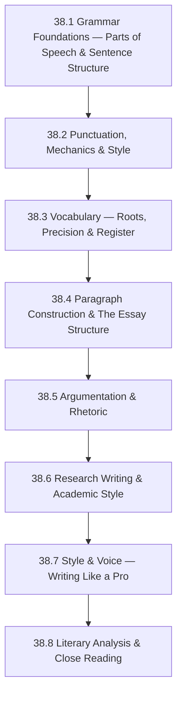

# Subject Syllabus: 38 - English

*Back to [Learning Index](00---09---Learning-Index)*

This syllabus defines a **high-school-to-advanced refresher** in English language arts, optimized for an adult learner who already reads and writes fluently but wants to tighten grammar, sharpen argumentation, master rhetoric, and write with the precision of a professional. This is not a remedial course — it's a systematic rebuild from axioms, the way a mathematician re-derives results they already know intuitively.

The curriculum is built around three interlocking skills:

1. **Grammar & Mechanics** — sentence-level precision: knowing *why* a sentence is correct, not just that it sounds right.
2. **Composition & Rhetoric** — paragraph-, essay-, and document-level structure: arguments that hold, prose that flows, audiences that are moved.
3. **Reading & Literary Analysis** — close reading of texts: how language works in the wild, how writers make choices, how to extract and challenge arguments.

**Why bother if you already speak English?** Because fluent ≠ precise. The gap between "I can communicate" and "I write with authority" is grammar at the sentence level, structure at the paragraph level, and rhetoric at the document level. Closing that gap is what this track does.

---

## 🗺️ 1. Curriculum Mindmap & Milestones

**Target levels:**
- After 19.1–38.2: **High-school mastery** — no grammar errors, clean mechanics, confident punctuation.
- After 19.3–38.5: **College freshman level** — strong vocabulary, structured essays, basic rhetoric.
- After 19.6–38.8: **Advanced / professional level** — research-grade writing, style control, literary literacy.

---

## 📚 2. Premium Free Learning Catalog

### 🎬 Video & Course

- **[Khan Academy — Grammar](https://www.khanacademy.org/humanities/grammar)** — complete free grammar curriculum from parts of speech through advanced usage. Mastery-based; skip what you know.
- **[Purdue OWL (Online Writing Lab)](https://owl.purdue.edu/owl/general_writing/index.html)** — the definitive free writing reference. Covers grammar, mechanics, essay types, MLA/APA/Chicago, research writing. Bookmark and live here.
- **[Coursera: Writing in the Sciences (Stanford, free audit)](https://www.coursera.org/learn/sciwrite)** — teaches tight, precise, active-voice writing. Lessons apply to all technical and professional writing, not just science.
- **[Crash Course: Literature (YouTube)](https://www.youtube.com/playlist?list=PL8dPuuaLjXtOeEc9ME62zTfqc0h6Pe8vb)** — John Green's AP English series; fast literary analysis from Homer to contemporary fiction.
- **[Crash Course: Study Skills — Reading (YouTube)](https://www.youtube.com/watch?v=eGSMS1GGqSo)** — close-reading techniques.
- **[Brandon Royal — The Little Red Writing Book (YouTube)](https://www.youtube.com/watch?v=2m_7wCTw6Y0)** — essay structure and argument construction.

### 📖 Open-Access Textbooks & References

- **[The Elements of Style](https://www.gutenberg.org/ebooks/37134)** (Strunk & White) — free on Project Gutenberg. Short, brutal, essential. Read it first.
- **[English Grammar in Use](https://www.cambridge.org/us/cambridgeenglish/catalog/grammar-vocabulary-and-pronunciation/english-grammar-use-5th-edition)** (Murphy) — gold-standard reference grammar; library copies widely available.
- **[On Writing Well](https://www.goodreads.com/book/show/53343.On_Writing_Well)** (Zinsser) — the companion to Strunk & White; full-length treatment of nonfiction prose.
- **[They Say / I Say](https://wwnorton.com/books/9780393538700)** (Graff & Birkenstein) — the best book on academic argumentation; teaches the "templates" of scholarly argument moves.
- **[Style: Lessons in Clarity and Grace](https://www.goodreads.com/book/show/246853.Style)** (Williams & Bizup) — sentence-level precision; academic standard.
- **[Grammar Girl Quick and Dirty Tips](https://www.quickanddirtytips.com/grammar-girl/)** — free podcast + articles on every grammar edge case imaginable.
- **[Merriam-Webster Dictionary](https://www.merriam-webster.com/)** — the authority for American English.
- **[Oxford English Dictionary (OED)](https://www.oed.com/)** — etymology and historical usage (requires subscription; most libraries provide access).

### 📰 Native Media (reading practice)

- **[The Atlantic](https://www.theatlantic.com/)** — long-form journalism; excellent model prose.
- **[The New Yorker](https://www.newyorker.com/)** — gold-standard American prose style; also covers books, criticism.
- **[Arts & Letters Daily](https://www.aldaily.com/)** — curated links to essays, criticism, commentary; an essay-reading buffet.
- **[Brain Pickings / The Marginalian](https://www.themarginalian.org/)** — long-form essays on literature, science, philosophy; beautiful model prose.
- **[Project Gutenberg](https://www.gutenberg.org/)** — free access to all public-domain literature (Shakespeare, Austen, Hemingway, etc.).

---

## 🛠️ 3. Practice & Tooling Integration

### Drill scripts (`_practice/scripts/`)

- `19.1_grammar_drill.py` — generates grammar identification exercises: identify parts of speech, clause types, sentence patterns (S-V, S-V-O, S-V-C, S-V-O-O, S-V-O-C); configurable difficulty.
- `19.2_punctuation_drill.py` — generates sentences with punctuation removed; user must supply commas, semicolons, colons, dashes, apostrophes; answer key with rule citation.
- `19.3_vocabulary_drill.py` — pulls from a Latin/Greek root list and SAT/GRE word frequency list; generates contextual fill-in-the-blank and definition matching.
- `19.4_outline_drill.py` — generates an essay prompt; outputs a blank 5-section outline scaffold (thesis → body × 3 → conclusion) with prompts for each section.
- `19.5_rhetoric_drill.py` — generates a passage and asks: identify the rhetorical appeal (ethos/pathos/logos), the logical fallacy (if any), the counterargument.
- `19_sentence_revision_drill.py` — generates wordy, passive, or structurally weak sentences; user revises; model answer shown.

### External integrations

- **Grammarly** (free tier) — real-time grammar and style feedback; treat suggestions as learning prompts, not auto-accepts.
- **Hemingway Editor** ([hemingwayapp.com](https://hemingwayapp.com/)) — highlights passive voice, adverb overuse, complex sentences; enforces Strunk & White discipline.
- **Anki** — for vocabulary (roots + SAT/GRE word lists).
- **NotebookLM** — generate audio overviews of grammar chapters; build a "grammar Q&A" corpus from this vault's chapter notes.

### Writing practice cadence

Each chapter includes a **writing assignment** — a short (200–500 word) piece that applies the chapter skill under constraints. These live in `_practice/writing/19.X_assignment.md`.

---

## 🎨 4. Immersion Directive

For each chapter, complete at least one of:

- **Read one essay** from The Atlantic or The New Yorker. Note one thing the writer did at the sentence level (punctuation, syntax, rhythm) that worked. Copy one sentence you admire into your notes and explain why it works.
- **Revise a piece of your own writing** (could be a daily log entry, a code comment, an email) applying only the skills from the current chapter. Before/after comparison.
- **Dictation exercise**: find a paragraph of excellent professional prose, close the source, and reconstruct it from memory. Compare your version to the original — differences reveal your defaults vs. the writer's choices.

The single highest-leverage habit: **read excellent prose daily** the way a musician listens to recordings of masters. Grammar and style absorb through exposure; the drills just make the patterns explicit.

---

## 📝 5. Chapter Outline

| # | Chapter | Core skill |
|---|---|---|
| 38.1 | **Grammar Foundations — Parts of Speech & Sentence Structure** | The eight parts of speech; phrases vs. clauses; the four sentence types (simple, compound, complex, compound-complex); subject-verb agreement; sentence fragments and run-ons. |
| 38.2 | **Punctuation, Mechanics & Style** | Commas (the seven comma rules), semicolons, colons, dashes (em vs en), apostrophes, quotation marks, parentheses, hyphens; capitalization; italics/underlining; numbers and abbreviations. |
| 38.3 | **Vocabulary — Roots, Precision & Register** | Latin and Greek root systems (the 100 most productive roots); connotation vs. denotation; register (formal/informal/technical); word choice precision; commonly confused words (affect/effect, who/whom, lay/lie, etc.). |
| 38.4 | **Paragraph Construction & The Essay Structure** | The topic sentence; paragraph unity and coherence; transitions; the five-paragraph essay as a scaffold (and why to transcend it); the thesis statement; introduction and conclusion strategies. |
| 38.5 | **Argumentation & Rhetoric** | Ethos, pathos, logos; claim, evidence, warrant (Toulmin model); logical fallacies (top 20); counterargument and rebuttal; the "They Say / I Say" framing for academic argument. |
| 38.6 | **Research Writing & Academic Style** | Finding and evaluating sources; paraphrase vs. summary vs. quotation; MLA and APA citation basics; avoiding plagiarism; the research essay structure; annotated bibliography. |
| 38.7 | **Style & Voice — Writing Like a Pro** | Active vs. passive voice (and when passive is correct); sentence variety and rhythm; concision and cutting deadwood; parallel structure; tone and persona; Zinsser's principles. |
| 38.8 | **Literary Analysis & Close Reading** | What literary analysis is (and isn't); close reading methodology; theme, symbol, motif, irony, narrative voice; how to write an analytical thesis; applying analysis to poetry, fiction, and nonfiction. |

Each chapter follows the same structure: definitions, rules as axioms (with rationale — *why* this rule), worked examples, before/after revisions, anti-patterns, and a "Common Errors" section targeting the mistakes native speakers most commonly make.

---

## 🌐 6. Estimated Cadence

- **1 hr/day, 5 days/week**: complete the full track in ~10 weeks.
- **30 min/day**: ~20 weeks. Still highly effective.
- **Highest-leverage activities:**
  - **Daily reading** of quality prose (The Atlantic, New Yorker, longform nonfiction) — absorbs style and grammar unconsciously.
  - **Weekly revision exercise** — take something you've written and rewrite it applying the current chapter's focus.
  - **Grammar drills** — 10 minutes/day on the chapter's specific rules until they're automatic.

---

*Curriculum architect: Bill — adult-learner English refresher track. Cross-links: [Track 17 Spanish](Subject_Plan) and [Track 18 Japanese](Subject_Plan) for the broader language learning system.*

---

## Related Notes
- [38.1 - Grammar Foundations — Parts of Speech & Sentence Structure](38.1---Grammar-Foundations-—-Parts-of-Speech-&-Sentence-Structure) - Shared english/grammar focus
- [38.4 - Paragraph Construction & The Essay Structure](38.4---Paragraph-Construction-&-The-Essay-Structure) - Shared english/writing focus
- [LEARNING_PATH](LEARNING_PATH) - Shared curriculum/english focus
- [38.2 - Punctuation, Mechanics & Style](38.2---Punctuation,-Mechanics-&-Style) - Same English folder
- [38.3 - Vocabulary — Roots, Precision & Register](38.3---Vocabulary-—-Roots,-Precision-&-Register) - Same English folder
