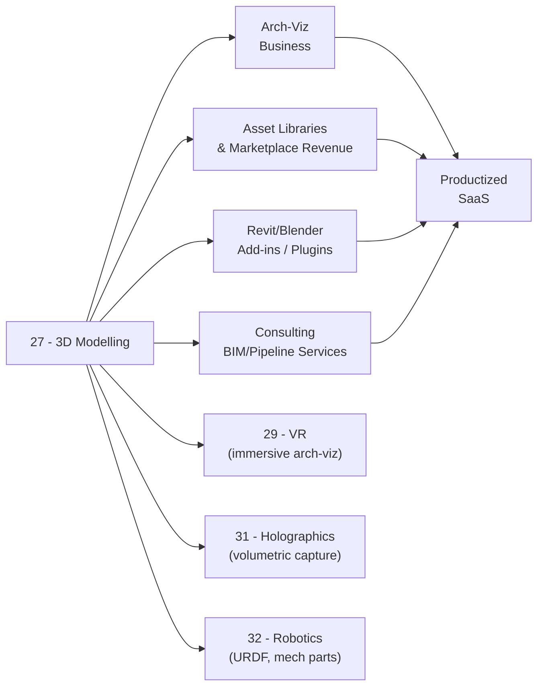

*Back to [Subject_Plan](Subject_Plan) | Part of [00 - 09 - Learning Index](00---09---Learning-Index)*

# 🗺️ 3D Modelling — Learning Path

> *"The model is the message. The pipeline is the product."*

---

## 🧭 Progression Map

```mermaid
graph TD
    %% Prerequisites
    LIN["✅ Linear Algebra<br/>Track 02"]
    M3D["✅ 3D Math Fundamentals<br/>9.1"]
    QUAT["✅ Quaternions<br/>9.2"]
    ARCH["🎓 Architecture Background<br/>(Bill — degree)"]

    %% Foundations
    C1["27.1 Foundations &<br/>Coordinate Systems"]

    %% BIM track
    C2["27.2 Revit<br/>Fundamentals"]
    C3["27.3 Advanced Revit<br/>Families + Dynamo"]

    %% Mechanical CAD track
    C4["27.4 Fusion 360<br/>Parametric + CAM"]
    C7["27.7 SolidWorks<br/>Mechanical + FEA"]

    %% DCC track
    C5["27.5 Maya & 3ds Max<br/>Animation + Arch-Viz"]
    C6["27.6 Blender<br/>Geometry Nodes"]

    %% Capstone
    C8["27.8 Pipelines, Interop<br/>& Productization"]

    %% Connections
    LIN --> C1
    M3D --> C1
    QUAT --> C1
    ARCH --> C2
    C1 --> C2
    C2 --> C3
    C1 --> C4
    C4 --> C7
    C1 --> C5
    C5 --> C6
    C3 --> C8
    C6 --> C8
    C7 --> C8

    %% Downstream
    C8 --> VR["29 - VR<br/>(arch-viz pipeline)"]
    C8 --> ROBO["32 - Robotics<br/>(URDF, mech CAD)"]
    C8 --> HOLO["31 - Holographics<br/>(volumetric assets)"]

    %% Styling
    style LIN fill:#2d5016,stroke:#4a8c2a
    style M3D fill:#2d5016,stroke:#4a8c2a
    style QUAT fill:#2d5016,stroke:#4a8c2a
    style ARCH fill:#5c3d16,stroke:#b88a3d
    style C1 fill:#1a3a5c,stroke:#3d7ab8
    style C2 fill:#4a1a3a,stroke:#8c3d6b
    style C3 fill:#4a1a3a,stroke:#8c3d6b
    style C4 fill:#3a3a1a,stroke:#8c8c3d
    style C7 fill:#3a3a1a,stroke:#8c8c3d
    style C5 fill:#1a4a4a,stroke:#3d8c8c
    style C6 fill:#1a4a4a,stroke:#3d8c8c
    style C8 fill:#5c1a3d,stroke:#b83d7a
    style VR fill:#2a2a2a,stroke:#666
    style ROBO fill:#2a2a2a,stroke:#666
    style HOLO fill:#2a2a2a,stroke:#666
```

---

## 📅 Suggested Timeline

| Week | Focus | Chapters | Hours/Week |
|------|-------|----------|------------|
| 1 | Foundations & coordinate systems | 27.1 | 4–6 |
| 2–3 | Revit fundamentals re-grounding | 27.2 | 8–10 |
| 4–5 | Advanced Revit + Dynamo | 27.3 | 8–10 |
| 6–7 | Fusion 360 (parametric mechanical CAD) | 27.4 | 6–8 |
| 8 | SolidWorks (engineering CAD) | 27.7 | 6–8 |
| 9–10 | Maya / 3ds Max (DCC + arch-viz) | 27.5 | 8–10 |
| 11 | Blender (geometry nodes, sculpting) | 27.6 | 8–10 |
| 12 | Pipelines + Interop + Business | 27.8 | 6–8 |

**Total: ~12 weeks at 8 hrs/week ≈ 96 hours**

---

## 🎯 Milestone Checkpoints

### ✅ Checkpoint 1: "I Speak 3D Fluently" (after 27.1)
- [ ] Can describe object/world/view/clip space transforms verbally and on paper
- [ ] Can derive a TRS matrix from scratch
- [ ] Can explain B-rep vs mesh vs NURBS vs SDF and when each is appropriate
- [ ] Can explain why every tool uses a different up-axis (Y-up vs Z-up) and how to convert

### ✅ Checkpoint 2: "I Am An Advanced Revit Modeler" (after 27.2 + 27.3)
- [ ] Can build a parametric, schedulable, type-catalog-ready family from a blank template
- [ ] Can adaptive-component a curtain-panel system that adapts to any 4-point boundary
- [ ] Can write a Dynamo graph (or Python node) to automate any repetitive modelling task
- [ ] Can round-trip a model through IFC 4 with no metadata loss
- [ ] Can produce sheets, schedules, and visibility-graphics overrides without thinking

### ✅ Checkpoint 3: "I Am Tool-Agnostic" (after 20.4–27.7)
- [ ] Can build a parametric mechanical part in Fusion 360 with a clean feature tree
- [ ] Can rig and animate a simple character in Maya or Blender
- [ ] Can produce a photorealistic arch-viz render in 3ds Max + V-Ray (or Blender + Cycles)
- [ ] Can build a multi-part assembly in SolidWorks with proper mating + a basic FEA run
- [ ] Can move geometry between any two of these tools without breaking it

### ✅ Checkpoint 4: "I Run a Pipeline" (after 27.8)
- [ ] Can build an end-to-end pipeline: Revit → IFC → Speckle → Blender → glTF/USD → Unity
- [ ] Understand the differences between B-rep kernels (Parasolid, ACIS, OpenCASCADE)
- [ ] Have at least one sellable artifact: an asset library, a Revit add-in, a Dynamo package, or a service offering
- [ ] Can quote a job, deliver it, and explain its value in business terms

---

## 🔄 How This Connects to Your Mission

---

## 📖 Reading Order with External Course Alignment

| Chapter | Free Course / Reference | Hours |
|---------|------------------------|-------|
| 27.1 | "Real-Time Rendering" Ch. 1–4 (free); 3Blue1Brown linear algebra | 4–6 |
| 27.2 | Autodesk Revit official paths + BIM Pure YouTube | 12–16 |
| 27.3 | Aussie BIM Guru — Dynamo + Adaptive Components series | 12–16 |
| 27.4 | Autodesk Fusion 360 Learning Hub (full free path) | 10–12 |
| 27.5 | Maya Learning Channel + 3ds Max + V-Ray Mastered | 14–18 |
| 27.6 | Blender Guru Donut + CG Cookie Fundamentals + Geometry Nodes | 14–18 |
| 27.7 | MySolidWorks free training + GoEngineer YouTube | 10–12 |
| 27.8 | Speckle docs + Pixar USD tutorials + Khronos glTF spec | 10–12 |

---

## 💡 The "Architect's Edge"

Most 3D artists never learned **building code-aware modelling**. Most BIM modelers never learned **DCC artistry**. Most engineers never learned **arch-viz**.

You will learn all three.

That intersection — *I can produce a building model that is constructible AND beautifully rendered AND game-engine-ready AND simulation-ready* — is where the highest-paid pipeline work lives. That is **the architect's edge**, and most architecture programs do not teach it explicitly. This track makes it explicit.

---

*Next: [27.1 - 3D Modelling Foundations & Coordinate Systems](27.1---3D-Modelling-Foundations-&-Coordinate-Systems) — Where math becomes geometry*

---

## Related Notes
- [Subject_Plan](Subject_Plan) - Shared 3d-modelling/solidworks focus
- [27.2 - Autodesk Revit Fundamentals](27.2---Autodesk-Revit-Fundamentals) - Shared 3d-modelling/revit focus
- [27.3 - Advanced Revit - Families, Adaptive Components & Dynamo](27.3---Advanced-Revit---Families,-Adaptive-Components-&-Dynamo) - Shared 3d-modelling/revit focus
- [27.4 - Autodesk Fusion 360 - Parametric Modelling & CAM](27.4---Autodesk-Fusion-360---Parametric-Modelling-&-CAM) - Shared 3d-modelling/fusion-360 focus
- [27.5 - Maya & 3ds Max - DCC, Animation & Arch-Viz Rendering](27.5---Maya-&-3ds-Max---DCC,-Animation-&-Arch-Viz-Rendering) - Shared 3d-modelling/maya focus
