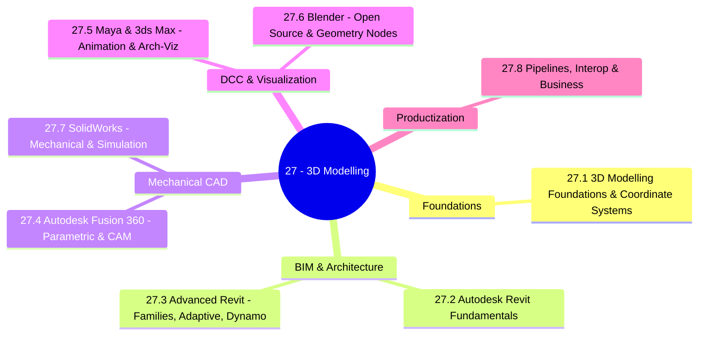

*Back to [00 - 09 - Learning Index](00---09---Learning-Index) | Part of [LEARNING_PATH](LEARNING_PATH)*

# 🏛️ 3D Modelling — Subject Plan

> *"Architecture is the learned game, correct and magnificent, of forms assembled in the light."* — Le Corbusier

> *"The industrial revolution was a hardware revolution. The next revolution is in models."* — Carl Bass (former Autodesk CEO)

---

## 🎯 Mission Statement

You studied **architecture**. You learned **Revit**. That is not a footnote — that is the **foundation of an entire 3D production pipeline**.

This track does three things:

1. **Deepens the Revit skillset** from competent draftsperson → advanced BIM modeler (adaptive components, parametric families, Dynamo visual programming, IFC interop, computational design).
2. **Cross-trains across the modern 3D toolchain** — Fusion 360 (parametric mechanical CAD), Maya & 3ds Max (DCC + animation + arch-viz), Blender (open-source powerhouse, geometry nodes), SolidWorks (engineering-grade mechanical CAD).
3. **Turns the skillset into a business** — pipelines, interop formats (IFC, USD, glTF, STEP), licensing, productization (asset libraries, plugin add-ins, custom services). The "systems behind the tech": kernels (Parasolid, ACIS), boundary representations (B-rep), NURBS, mesh data structures, file formats, GPU rendering paths.

This track is the **production layer** for [VR & 3D Engineering](Subject_Plan) (which is the math/engine layer), and feeds directly into [29 - VR](Subject_Plan) (the applied/business VR track) via arch-viz pipelines.

---

## 📊 Track Overview



---

## 📚 Chapter Inventory

| # | Chapter | Tool / Domain | Status |
|---|---------|---------------|--------|
| 27.1 | 3D Modelling Foundations & Coordinate Systems | Universal — math/geometry | 🟡 Skeleton |
| 27.2 | Autodesk Revit Fundamentals | Revit / BIM | 🟡 Skeleton |
| 27.3 | Advanced Revit — Families, Adaptive Components & Dynamo | Revit / BIM | 🟡 Skeleton |
| 27.4 | Autodesk Fusion 360 — Parametric Modelling & CAM | Fusion 360 | 🟡 Skeleton |
| 27.5 | Maya & 3ds Max — DCC, Animation & Arch-Viz Rendering | Maya / 3ds Max / V-Ray / Arnold | 🟡 Skeleton |
| 27.6 | Blender — Open-Source Modelling, Geometry Nodes & Sculpting | Blender | 🟡 Skeleton |
| 27.7 | SolidWorks — Mechanical CAD, Assemblies & Simulation | SolidWorks | 🟡 Skeleton |
| 27.8 | Pipelines, Interop & Productization — From Architecture to Business | USD / IFC / glTF / STEP / business | 🟡 Skeleton |

---

## 🔗 Prerequisites

| Prerequisite | Where You Learned It | Why It Matters |
|---|---|---|
| Architecture / drafting fundamentals | Your degree | You already think in plans, sections, elevations — that intuition transfers everywhere |
| Linear Algebra (matrices, transforms) | [Subject_Plan](Subject_Plan) | Every 3D operation is a matrix multiplication |
| 3D Math fundamentals | [28.1 - 3D Math Fundamentals](28.1---3D-Math-Fundamentals) | Shared coordinate system / TRS literacy |
| Quaternions & Rotations | [28.2 - Quaternions & Rotations](28.2---Quaternions-&-Rotations) | Maya/Blender rigging, Revit object rotation |
| Calculus (curves, surfaces) | [Subject_Plan](Subject_Plan) | NURBS, Bézier surfaces, parametric design |

---

## 🆓 Premium-Free Resource Catalog

> Pictures, videos, and reference materials live **outside the repo** (YouTube, official docs, open-source books). Each chapter and the [README](README) hub link to them by URL. SVG diagrams that we author live inside `_svgs/` with the `3dmod__<ch>-fig<n>.svg` prefix.

### 🎓 Primary Lecture & Course Series

| Resource | Provider | Coverage | Link |
|---|---|---|---|
| **Autodesk Revit Official Learning (2026)** | Autodesk | Revit fundamentals → advanced; covers Revit 2026 Accelerated Graphics, ReCap Pro Mesh plugin, Dynamo 3.5 | [autodesk.com/revit/learn](https://www.autodesk.com/products/revit/learn) |
| **What's New in Revit 2026 / 2026.1** | Autodesk Blog | Latest features (computational design, Dynamo 3.5, navigation perf) | [autodesk.com/blogs/aec/...whats-new-in-revit-2026-1](https://www.autodesk.com/blogs/aec/2025/05/22/whats-new-in-revit-2026-1/) |
| **Autodesk University on-demand classes** | AU | Free recordings of pro-level Revit classes (adaptive components, Dynamo curtain panels, structural conceptual design) | [autodesk.com/autodesk-university](https://www.autodesk.com/autodesk-university) |
| **AutoCAD/Revit on YouTube — "BIM Pure"** | Community | Practical Revit families & Dynamo | [BIM Pure Productions](https://www.youtube.com/@BIMPure) |
| **Aussie BIM Guru** | Community | Advanced Revit + Dynamo + Forge | [YouTube channel](https://www.youtube.com/@AussieBIMGuru) |
| **Blender Guru — Donut Tutorial 4.x** | Andrew Price | Blender from zero | [YouTube playlist](https://www.youtube.com/@blenderguru) |
| **CG Cookie — Blender Fundamentals** | CG Cookie | Free official Blender curriculum | [cgcookie.com](https://cgcookie.com/) |
| **Maya Learning Channel** | Autodesk | Maya official tutorials | [YouTube channel](https://www.youtube.com/@MayaHowTos) |
| **3ds Max Learning Channel** | Autodesk | 3ds Max + V-Ray + arch-viz | [YouTube channel](https://www.youtube.com/@3dsMaxHowTos) |
| **SolidWorks Tutorials (MySolidWorks)** | Dassault | Free SolidWorks fundamentals | [my.solidworks.com](https://my.solidworks.com/training) |
| **Fusion 360 Learning Hub** | Autodesk | Free Fusion 360 path | [autodesk.com/fusion-360/learn](https://www.autodesk.com/products/fusion-360/learn) |
| **MIT 4.500 — Computational Design I/II** | MIT OCW | Generative architecture | [ocw.mit.edu](https://ocw.mit.edu/search/?q=computational+design) |

### 📖 Open-Source / Free Books & References

| Resource | Author / Provider | Coverage |
|---|---|---|
| **The Blender 4.4 Manual** | Blender Foundation | Definitive open-source reference — [docs.blender.org/manual](https://docs.blender.org/manual/en/latest/) |
| **Geometry Nodes from Scratch (Blender Studio)** | Simon Thommes / Blender Foundation | Free official Geometry Nodes training — [studio.blender.org/training/geometry-nodes-from-scratch](https://studio.blender.org/training/geometry-nodes-from-scratch/) |
| **Geo Nodes Guide** | Community (geonodesguide.com) | Free Geometry Nodes reference — [geonodesguide.com](https://geonodesguide.com/) |
| **OpenUSD documentation (Pixar)** | Pixar | The interchange format taking over film + AEC + spatial computing — [openusd.org](https://openusd.org/) · GitHub: [PixarAnimationStudios/OpenUSD](https://github.com/PixarAnimationStudios/OpenUSD) |
| **NVIDIA Omniverse USD docs** | NVIDIA | Production USD pipelines — [docs.omniverse.nvidia.com/usd](https://docs.omniverse.nvidia.com/usd/latest/) |
| **glTF 2.0 Specification** | Khronos | The "JPEG of 3D" — [github.com/KhronosGroup/glTF](https://github.com/KhronosGroup/glTF) |
| **IFC 4.3 Specification** | buildingSMART | The open BIM exchange standard — [ifc43-docs.standards.buildingsmart.org](https://ifc43-docs.standards.buildingsmart.org/) |
| **OpenCASCADE Documentation** | Open Cascade | Open-source B-rep CAD kernel — [dev.opencascade.org](https://dev.opencascade.org/doc/overview/html/index.html) |
| **"Real-Time Rendering"** | Akenine-Möller et al. | Free chapters at [realtimerendering.com](https://www.realtimerendering.com/) |
| **The Architecture of Open Source Applications — Blender** | aosabook.org | How Blender is built — [aosabook.org](https://aosabook.org/en/) |
| **Speckle Open-Source AEC Data Platform** | Speckle | Open BIM/CAD interop (Revit ↔ Rhino ↔ Blender ↔ Unity ↔ Power BI) — [speckle.systems](https://speckle.systems/) · [docs.speckle.systems](https://docs.speckle.systems/) |
| **FreeCAD 1.0 documentation** | FreeCAD project | Now a legitimate professional parametric CAD tool — [freecad.org](https://www.freecad.org/) |

### 🛠️ Free/Indie Tooling Worth Knowing

- **FreeCAD** — open-source parametric CAD, alternative to Fusion/SolidWorks
- **Rhino + Grasshopper** — industry-standard for parametric architecture (paid, but trial)
- **Dynamo** — Revit's visual programming environment (ships with Revit)
- **Houdini Apprentice** — free for learning, the gold standard for procedural 3D
- **Autodesk Forma** — cloud-based generative architecture
- **Speckle** — open-source data platform connecting Revit ↔ Rhino ↔ Blender ↔ Unity

---

## 🏗️ Study Strategy

### Phase 1: Architecture Lineage (Chapters 20.1–27.3) — 4 weeks
You already have Revit hours. Sharpen them. Move from "I can model a building" to "I can build a parametric family that adapts to any context, automate it with Dynamo, and round-trip it through IFC to anyone's tool." This is where most architects plateau — you will not.

### Phase 2: Cross-Tool Literacy (Chapters 20.4–27.7) — 6 weeks
Each tool is a worldview. Fusion teaches you parametric **engineering** thinking. Maya/3ds Max teach you **DCC** (digital content creation) — animation, rigging, rendering. Blender teaches you that **open-source can be world-class** (and gives you geometry nodes — the future). SolidWorks teaches you **mechanical engineering CAD** — the world of feature trees, mating constraints, simulation, and FEA.

### Phase 3: Productization (Chapter 27.8) — 2 weeks
Pipelines. Interop. File formats. Licensing. Plugin/add-in development. Asset libraries. Custom services. This is where the skill becomes a **business**.

---

## 📁 Directory Structure

```
27 - 3D Modelling/
├── Subject_Plan.md          ← You are here
├── LEARNING_PATH.md         ← Visual roadmap
├── README.md                ← Subject hub + media references
├── 27.1 - 3D Modelling Foundations & Coordinate Systems.md
├── 27.2 - Autodesk Revit Fundamentals.md
├── 27.3 - Advanced Revit - Families, Adaptive Components & Dynamo.md
├── 27.4 - Autodesk Fusion 360 - Parametric Modelling & CAM.md
├── 27.5 - Maya & 3ds Max - DCC, Animation & Arch-Viz Rendering.md
├── 27.6 - Blender - Open-Source Modelling, Geometry Nodes & Sculpting.md
├── 27.7 - SolidWorks - Mechanical CAD, Assemblies & Simulation.md
├── 27.8 - Pipelines, Interop & Productization - From Architecture to Business.md
└── _practice/
    └── scripts/             ← Future drills (Dynamo Python, Blender bpy, USD scripts)
```

SVG figures live one level up in `../_svgs/3dmod__<chapter>-fig<n>.svg`.

---

*Next: [LEARNING_PATH](LEARNING_PATH) — Visual progression map*

---

## Related Notes
- [27.2 - Autodesk Revit Fundamentals](27.2---Autodesk-Revit-Fundamentals) - Shared 3d-modelling/revit focus
- [27.3 - Advanced Revit - Families, Adaptive Components & Dynamo](27.3---Advanced-Revit---Families,-Adaptive-Components-&-Dynamo) - Shared 3d-modelling/parametric focus
- [27.5 - Maya & 3ds Max - DCC, Animation & Arch-Viz Rendering](27.5---Maya-&-3ds-Max---DCC,-Animation-&-Arch-Viz-Rendering) - Shared 3d-modelling/3ds-max focus
- [LEARNING_PATH](LEARNING_PATH) - Shared 3d-modelling/solidworks focus
- [15_Drawing_Production_Standards](15_Drawing_Production_Standards) - Shared revit/bim focus
