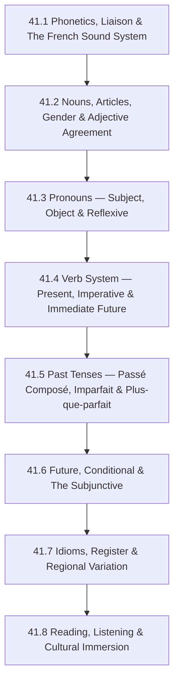

# Subject Syllabus: 41 - French

*Back to [Learning Index](00---09---Learning-Index)*

This syllabus defines the roadmap for **adult-second-language acquisition** of French, optimized for an English speaker with Spanish exposure and strong systematizing intuition. French sits at a fascinating intersection: its **grammar** is highly systematic and rule-governed (more so than Spanish in many respects), but its **sound system** is the steepest initial hurdle — silent letters, nasal vowels, liaison rules, and elision make written French almost unrecognizable to the ear until you've cracked the phonological code.

The key insight: French is **not phonetically transparent** (unlike Italian or Spanish). You must internalize the sound-spelling map early or you will permanently read French with an English accent and fail to parse spoken French. This curriculum front-loads phonetics in chapter 41.1 — do not skip it.

**Transfer advantage from Spanish:** If you have completed [Track 17 Spanish](Subject_Plan), French moves 2–3× faster because:
- Verb tense structure (preterite→passé composé, imperfect, subjunctive) maps directly
- ~75% of French vocabulary shares Latin roots with Spanish
- Gender assignment, article logic, and adjective agreement patterns are familiar
- The subjunctive trigger logic is nearly identical

---

## 🗺️ 1. Curriculum Mindmap & Milestones

**Target levels:**
- After 41.1–41.4: **A2** (basic conversation, present-tense fluency, can handle everyday situations)
- After 41.5–41.6: **B1** (past/future, hypotheticals, hold a conversation on familiar topics)
- After 41.7–41.8: **B2/C1** (fluent comprehension of native media, unprepared speech, literary reading)

---

## 📚 2. Premium Free Learning Catalog

### 🎬 Video & Course

- **[Language Transfer — Français (Complete French)](https://www.languagetransfer.org/french)** — the gold standard free audio course; same Socratic derivation approach as Spanish. 40 audio tracks (~13 hours). Start here — no note-taking required, just listen and respond.
- **[Français Authentique (YouTube)](https://www.youtube.com/@francaisauthentique)** — Johan's comprehensible French immersion channel. Slow → intermediate → fast speech. The French-language equivalent of Dreaming Spanish.
- **[Comme une Française (YouTube)](https://www.youtube.com/@CommeunefrancaiseTV)** — Géraldine Lepère's channel; native French speaker teaching adult learners real, natural French with cultural context. Excellent pronunciation and register guidance.
- **[InnerFrench (YouTube)](https://www.youtube.com/@innerfrench)** — Hugo Cotton's intermediate comprehensible-input channel; real French at a learnable pace. Ideal from chapter 41.4 onward.
- **[Learn French with Alexa (YouTube)](https://www.youtube.com/@learnfrenchwithalexa)** — structured grammar lessons; ideal for chapters 41.2–41.6.
- **[TV5MONDE — Apprendre le français](https://apprendre.tv5monde.com/en)** — free official francophone media learning platform; thousands of videos with subtitles and comprehension exercises at all CEFR levels.

### 📖 Open-Access Textbooks & References

- **[Tex's French Grammar (University of Texas)](https://coerll.utexas.edu/tex/)** — free, comprehensive, witty online French grammar reference. Written for adults. Covers every grammar point in this curriculum. **Primary reference text.**
- **[Lawless French](https://www.lawlessfrench.com/)** — the most comprehensive free French grammar and usage website in English. Excellent for looking up edge cases.
- **[Reverso Conjugation](https://conjugator.reverso.net/conjugation-french.html)** — best free French verb conjugator; shows all tenses including less common ones.
- **[Linguee](https://www.linguee.com/french-english)** — bilingual example-sentence corpus; shows how words are actually used in context.
- **[CNRTL (Centre National de Ressources Textuelles et Lexicales)](https://www.cnrtl.fr/)** — the authoritative French language dictionary and etymology database (in French; B1+).
- *Le Bon Usage* by Grevisse — the definitive French grammar reference (paid, library; like the RAE for French).
- *English Grammar for Students of French* by Jacqueline Morton — explains French grammar from English → excellent for self-study.
- **[OpenSubtitles.org](https://www.opensubtitles.org/)** — French subtitles for any film or series; essential for immersion study.

### 📺 Native Media (Graded by Difficulty)

- **Beginner:** *Extra French* (YouTube sitcom made for learners), *Peppa Pig en Français*, *1 jour 1 actu* (kid-friendly current affairs)
- **Intermediate:** *Le Monde* (newspaper), *France 24* (international news in French, with transcripts), *Radio France* podcasts
- **Advanced:** *Les Revenants*, *Lupin*, *Call My Agent (Dix Pour Cent)* on Netflix; *Le Petit Prince* (book); Flaubert's *Un Cœur Simple* (ideal first literary text)

---

## 🛠️ 3. Practice & Tooling Integration

### Drill scripts (`_practice/scripts/`)

- `41.1_phonetics_drill.py` — IPA → French orthography mapping; nasal vowel identification (an/en/in/on/un); liaison rule application (when liaison is obligatory, forbidden, or optional); silent-letter rules.
- `41.4_verb_conjugation_drill.py` — random verb + tense + person → conjugated form. Supports: all three regular groups (-ER/-IR/-RE); irregular verbs (être, avoir, aller, faire, vouloir, pouvoir, savoir, venir, prendre, partir); all tenses covered in the curriculum.
- `41.5_passe_compose_drill.py` — être vs. avoir auxiliary selection; past participle agreement; DR & MRS VANDERTRAMP/house verbs that use être; generates sentences requiring student to select correct auxiliary + form.
- `41.6_subjunctive_drill.py` — generates trigger phrase + clause; student supplies present or past subjunctive (e.g., "Il faut que tu ____ (venir)").
- `41_vocab_drill.py` — pulls from a 5000-word frequency list; generates SR cards with gender marked (le/la prefix); toggleable by CEFR level.

### External Integrations

- **Anki** — import *Top 5000 French Words* deck (community; includes audio from native speaker). Run alongside every chapter.
- **Language Reactor** — Chrome extension for Netflix + YouTube; hover subtitles in French with instant dictionary lookup.
- **Clozemaster** — cloze (fill-in-the-blank) sentence practice; excellent B1+ vocabulary expansion tool.
- **Pimsleur French I–V** (library audiobook) — passive car/commute listening; excellent for accent formation.

### Companion Materials (NotebookLM)

- Upload Tex's French Grammar chapters as source material per grammar topic
- Audio overviews per chapter (e.g., `French_Verb_System_Overview.m4a`)
- Conjugation tables as visual infographics
- French phonetic IPA chart with audio examples

---

## 🎨 4. Immersion Directive

French requires **two simultaneous immersion tracks**:

1. **Listening:** The French sound system must be trained separately from grammar. From day one: 20–30 min/day of French audio at your level. Français Authentique for beginners, InnerFrench from chapter 41.4+.

2. **Pronunciation shadowing:** Pick a 30-second clip from Comme une Française or InnerFrench. Listen 5×. Shadow (speak along simultaneously). Record yourself. Compare. The goal is eliminating the "reading French" pronunciation habit.

**French-specific challenge:** Liaison. In connected speech, the normally-silent final consonant of a word links to the vowel starting the next word. *"Les amis"* is pronounced "lez-amis" not "leh amis." This is not optional — it's how native speakers hear word boundaries. Chapter 41.1 addresses this systematically.

**Register awareness:** Spoken French differs dramatically from written French:
- *"Je ne sais pas"* (written) → *"Chais pas"* (spoken casual)
- *"Tu es"* (written) → *"T'es"* (spoken casual)
- *"Nous"* (formal/written first person plural) → *"On"* (spoken; almost always used in conversation)

---

## 📝 5. Chapter Outline

| # | Chapter | Core skill |
|---|---|---|
| 41.1 | **Phonetics, Liaison & The French Sound System** | French IPA; pure vowels (no diphthongs); nasal vowels (an/en/in/on/un); the semi-vowels (w, j, ɥ); liaison (obligatory, optional, forbidden); elision (l' before vowel); silent letter rules; *e muet* (schwa); the R (uvular fricative); stress (always final syllable of group); intonation patterns. **This chapter is non-negotiable before everything else.** |
| 41.2 | **Nouns, Articles, Gender & Adjective Agreement** | Gender patterns and endings (not all arbitrary — ~80% predictable by ending); 4 definite articles (le, la, l', les); 4 indefinite articles (un, une, des); partitive articles (du, de la, de l', des — used for uncountable nouns); adjective agreement (gender + number); adjective placement (BANGS rule: Beauty/Age/Number/Goodness/Size go before noun; most others after); elision and liaison with articles. |
| 41.3 | **Pronouns — Subject, Object & Reflexive** | Subject pronouns (je, tu, il/elle/on, nous, vous, ils/elles); direct object pronouns (me/te/le/la/nous/vous/les); indirect object pronouns (me/te/lui/nous/vous/leur); reflexive pronouns (me/te/se/nous/vous/se); stress/disjunctive pronouns (moi/toi/lui/elle/nous/vous/eux/elles); relative pronouns (qui/que/dont/où); pronoun placement order in sentence (the clitic stack: ne + [me/te/se/nous/vous] + [le/la/les] + [lui/leur] + y + en + verb). |
| 41.4 | **Verb System — Present, Imperative & Immediate Future** | The three regular conjugation groups (-ER most common; -IR with -iss- infix; -RE); the essential irregulars: être, avoir, aller, faire, vouloir, pouvoir, savoir, venir, prendre, partir, mettre, voir, croire; near future (aller + infinitive — the most common way to express future in speech); imperative formation; negation (ne...pas, ne...plus, ne...jamais, ne...rien, ne...personne — placement around verb); the key reflexive verb class (se lever, se coucher, se souvenir, s'habiller, se dépêcher, se retrouver). |
| 41.5 | **Past Tenses — Passé Composé, Imparfait & Plus-que-parfait** | **Passé composé** (compound past): être vs. avoir as auxiliary (DR & MRS VANDERTRAMP/house verbs use être + all reflexive verbs; past participle agrees with subject when être used); past participle formation (-ER → -é, -IR → -i, -RE → -u; irregular: fait, été, eu, pris, mis, vu, su, venu, parti, né, mort). **Imparfait** (imperfect): formation (nous stem + imperfect endings); usage (ongoing past state/action, habitual past, background/scene setting, indirect speech, polite requests). **Decision tree for which past tense.** Plus-que-parfait (past perfect): had done X. |
| 41.6 | **Future, Conditional & The Subjunctive** | **Futur simple** (simple future): infinitive stem + future endings (-ai/-as/-a/-ons/-ez/-ont); irregular stems (ser-, aur-, ir-, fer-, pourr-, voudr-, saur-, viendr-, verr-, devr-). **Conditionnel présent** (conditional): same stems + imperfect endings; si-clauses (si + présent → futur; si + imparfait → conditionnel; si + plus-que-parfait → conditionnel passé). **Subjonctif présent**: formation (ils-form present stem + subj endings); trigger phrases (il faut que, bien que, pour que, avant que, vouloir que, avoir peur que, être content que — any expression of will, emotion, doubt, necessity). Subjonctif passé (past subjunctive). |
| 41.7 | **Idioms, Register & Regional Variation** | High-frequency French idioms (avoir du pain sur la planche, casser les pieds de quelqu'un, avoir le cafard, mettre les pieds dans le plat, etc.); Verlan (French back-slang: laisse béton/tomber, meuf/femme, ouf/fou — essential for media comprehension); register levels (soutenu/literary, standard, familier, argot); Quebec French vs. metropolitan French (vocabulary differences, pronunciation, tu/vous usage, archaisms retained); African francophone French; Belgian and Swiss French. |
| 41.8 | **Reading, Listening & Cultural Immersion** | Native media strategy: LingQ/Language Reactor with French Netflix; *Le Monde* reading routine; France 24 listening; French podcast consumption (France Inter, Les Couilles sur la Table, Choses à Savoir); literary entry points (*Le Petit Prince*, *L'Étranger*, Maupassant short stories); cultural literacy (la laïcité, les grandes écoles, le bac, the café culture and social meal structure, the political spectrum, francophonie as a global concept). |

Each chapter follows the Pearson/Ambrose textbook structure: axioms (grammar rules stated formally), worked examples, anti-pattern warnings, and "Common Misconceptions" sections addressing where English speakers fail.

---

## 🌐 6. Estimated Cadence

- **2 hr/day, 5 days/week:** A2 in ~6 weeks, B1 in ~4 months, B2 in ~8 months.
- **30 min/day:** Double the timeline.
- **Highest-leverage activities (by phase):**
  - 41.1: Daily phonetics drilling until silent letters and nasal vowels are automatic
  - 41.4–41.5: Verb conjugation drills daily; être-vs-avoir errors are persistent without repetition
  - 41.6+: Shift to comprehensible input (InnerFrench, TV5MONDE) as primary activity

---

*Curriculum architect: Bill — adult-learner French track with Romance-transfer optimization. Cross-links: [Track 17 Spanish](Subject_Plan), [Track 19 Italian](Subject_Plan), [Track 20 Latin](Subject_Plan).*

---

## Related Notes
- [LEARNING_PATH](LEARNING_PATH) — Recommended chapter order and daily habits
- [41.1 - Phonetics, Liaison & The French Sound System](41.1---Phonetics,-Liaison-&-The-French-Sound-System)
- [41.2 - Nouns, Articles, Gender & Adjective Agreement](41.2---Nouns,-Articles,-Gender-&-Adjective-Agreement)
- [41.3 - Pronouns — Subject, Object & Reflexive](41.3---Pronouns-—-Subject,-Object-&-Reflexive)
- [41.4 - Verb System — Present, Imperative & Immediate Future](41.4---Verb-System-—-Present,-Imperative-&-Immediate-Future)
- [41.5 - Past Tenses — Passé Composé, Imparfait & Plus-que-parfait](41.5---Past-Tenses-—-Passé-Composé,-Imparfait-&-Plus-que-parfait)
- [41.6 - Future, Conditional & The Subjunctive](41.6---Future,-Conditional-&-The-Subjunctive)
