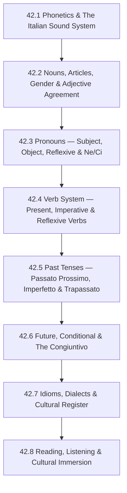

# Subject Syllabus: 42 - Italian

*Back to [Learning Index](00---09---Learning-Index)*

This syllabus defines the roadmap for **adult-second-language acquisition** of Italian, the most **phonetically transparent** of the Romance languages and — for English speakers with prior Spanish or French — arguably the fastest path to conversational fluency in any European language.

Italian's great gift: **what you see is what you say.** Every letter has one sound (with a few predictable exceptions). There are no silent letters (except *h*), no nasal vowels like French, no ambiguous vowel sounds like English. The spelling-to-sound mapping is almost perfectly one-to-one. This means pronunciation is learnable in a week, and the energy that French or Japanese learners must spend on phonetics can go directly into grammar and vocabulary.

**The key structural insight:** Italian grammar is extremely close to Latin — more so than Spanish or French. It has retained more inflectional morphology, including a robust **subjunctive (congiuntivo)** that is actually *more* used in everyday speech than in Spanish or French. It also has a fascinating **double pronoun system** and the most elegant article system in any European language.

**Transfer advantage from Spanish:** Vocabulary overlap is ~80%. Verb tense structure maps almost 1:1. A B1 Spanish speaker can reach Italian A2 in 4–6 weeks of focused study.

**Transfer advantage from French:** The passé composé → passato prossimo mapping is exact (even sharing the être/essere vs. avoir/avere auxiliary distinction). Vocabulary overlaps heavily with French via shared Latin roots.

---

## 🗺️ 1. Curriculum Mindmap & Milestones

**Target levels:**
- After 42.1–42.4: **A2** (basic everyday conversation; present + immediate future; essential verbs)
- After 42.5–42.6: **B1** (full past tense; hypotheticals; hold a conversation on most topics)
- After 42.7–42.8: **B2** (native media comprehension; unprepared speech; read Italian literature)

---

## 📚 2. Premium Free Learning Catalog

### 🎬 Video & Course

- **[Language Transfer — Complete Italian](https://www.languagetransfer.org/italian)** — 45 free audio tracks; Mihalis derives Italian from its Latin roots in real time. The single best starting resource. No prior knowledge required.
- **[ItalianPod101 (YouTube)](https://www.youtube.com/@learnitalianwithitalianpod101)** — thousands of free leveled lessons; grammar, culture, vocabulary.
- **[Italiano Automatico (YouTube)](https://www.youtube.com/@ItalianoAutomatico)** — Alberto Arrighini's comprehensible-input channel; slow, clear Italian on Italian culture, language, and lifestyle topics. Ideal from chapter 42.4+.
- **[Italy Made Easy (YouTube)](https://www.youtube.com/@ItalyMadeEasy)** — Manu Venditti's grammar-forward lessons; excellent explanations of the congiuntivo, double pronouns, and article system.
- **[Dreaming Italian (YouTube)](https://www.youtube.com/@DreamingItalian)** — Stefano Lodola's comprehensible-input channel modeled on Dreaming Spanish. Graded videos from beginner to advanced.
- **[RAI Play](https://www.raiplay.it/)** — Free streaming of Italian public television (RAI 1/2/3) with subtitles; the equivalent of BBC iPlayer for Italian.

### 📖 Open-Access Textbooks & References

- **[Italiano Bello](https://www.italianobello.com/)** — free structured Italian grammar lessons online; clear, adult-oriented.
- **[Treccani — Vocabolario](https://www.treccani.it/vocabolario/)** — the authoritative Italian dictionary and encyclopedia (in Italian; B1+).
- **[WordReference Italian](https://www.wordreference.com/iten/)** — best free Italian-English dictionary; strong forum for edge-case grammar questions.
- **[Reverso Italian Conjugator](https://conjugator.reverso.net/conjugation-italian.html)** — all Italian verb forms including irregular congiuntivo.
- **[Tatoeba — Italian sentences](https://tatoeba.org/en/sentences/show_all_in/ita/none)** — native-sentence corpus for example-driven vocabulary acquisition.
- *Italian: A Complete Course* (Living Language) — excellent structured textbook; library available.
- *Ciao! An Italian Course* by Carla Larese Riga — standard university textbook.
- **[Project Gutenberg — Italian texts](https://www.gutenberg.org/browse/languages/it)** — Dante, Boccaccio, Calvino, Pirandello free in the original Italian.

### 📺 Native Media (Graded by Difficulty)

- **Beginner:** *Peppa Pig in Italiano* (YouTube), *TGR Ragazzi* (children's news), easy Italian street interviews
- **Intermediate:** *Suburra* (Netflix), *My Brilliant Friend (L'amica geniale)* (HBO/RAI), *La Casa di Carta* dubbed in Italian
- **Advanced:** *Gomorra* (Naples dialect; challenging), Italian films by Fellini/Sorrentino, *La Repubblica* (newspaper), *Il Post* (clean journalistic Italian)

---

## 🛠️ 3. Practice & Tooling Integration

### Drill scripts (`_practice/scripts/`)

- `42.1_phonetics_drill.py` — letter-to-sound mapping; hard/soft *c* and *g* (before e/i vs. a/o/u); *ch/gh* digraphs; *gl* vs. *gli*; double consonant length distinction (minimal pairs: *pala/palla*, *caro/carro*); stress rules.
- `42.4_verb_conjugation_drill.py` — random verb + tense + person → conjugated form. Covers -ARE/-ERE/-IRE (both types); irregulars (essere, avere, andare, fare, venire, volere, potere, sapere, stare, dare, dire); all indicative tenses through futuro semplice.
- `42.5_past_drill.py` — essere vs. avere auxiliary selection; past participle agreement with essere verbs; generates sentences requiring correct auxiliary + participle agreement. Includes passato prossimo vs. imperfetto decision tree exercises.
- `42.6_congiuntivo_drill.py` — generates trigger phrase (penso che, voglio che, benché, sebbene, prima che, perché, etc.) + clause; student conjugates congiuntivo presente or passato.
- `42_vocab_drill.py` — frequency-list-based SR cards; includes grammatical gender in the cue.

### External Integrations

- **Anki** — *Italian Core 5000* frequency deck (community-made; includes audio).
- **Clozemaster** — cloze exercises for B1+ vocabulary in authentic Italian sentences.
- **Language Reactor** — for Netflix + YouTube Italian content with hover-subtitles.
- **Forvo** — native pronunciation of any Italian word; essential for verifying stress on unfamiliar words.

---

## 🎨 4. Immersion Directive

Italian rewards immersion faster than any other Romance language because the phonetic transparency means **you can pronounce anything you can read from day one**. This creates a virtuous cycle:

- Read aloud aggressively — your pronunciation will be correct before you understand the words
- Italians respond warmly to any attempt at speaking — get on HelloTalk/Tandem from chapter 42.4
- **Cinema immersion:** Italian cinema (Fellini, De Sica, Sorrentino, Garrone) is unparalleled; even passive watching with Italian subtitles is high-yield from B1

**The double-consonant trap:** Italian distinguishes *pala* (shovel) from *palla* (ball) purely by consonant length. Native speakers can hear this; learners must consciously practice holding the double consonant. Use minimal pair drills in chapter 42.1.

**The formal/informal register:** Italian's *tu* (informal) vs. *Lei* (formal, third-person singular) vs. *voi* (plural) system is stricter than French. Using *tu* with a professor or stranger is a social error. Chapter 42.7 covers register in depth.

---

## 📝 5. Chapter Outline

| # | Chapter | Core skill |
|---|---|---|
| 42.1 | **Phonetics & The Italian Sound System** | Pure vowels (5 only: a/e/i/o/u — each with one sound, no diphthongs, no nasals); the hard/soft rule for c and g (ca/co/cu/che/chi vs. ce/ci; ga/go/gu/ghe/ghi vs. ge/gi); *gli* (palatal lateral /ʎ/); *gn* (palatal nasal /ɲ/); double consonants (phonemically distinct — must be held longer); stress rules (default penultimate; exceptions marked with accent); silent *h*; the close/open vowel distinction (e/è, o/ò). |
| 42.2 | **Nouns, Articles, Gender & Adjective Agreement** | Gender patterns (masculine/feminine; default endings -o/-a; many -e nouns can be either; irregular); the Italian article system — 7 definite article forms (il/lo/l'/la/i/gli/le) and the rules for which to use (before s+consonant, z, ps, gn, x, y → lo/gli; before vowel → l'/gli); indefinite articles (un/uno/una/un'); partitive articles (del/dello/dell'/della/dei/degli/delle — Italian uses these where English uses "some"); adjective agreement (4 forms for regular adjectives: bello/bella/belli/belle); placement (usually after noun; before: bello, buono, grande, piccolo, brutto, nuovo, vecchio). |
| 42.3 | **Pronouns — Subject, Object, Reflexive & Ne/Ci** | Subject pronouns (io/tu/lui/lei/Lei/noi/voi/loro); direct object pronouns (mi/ti/lo/la/La/ci/vi/li/le); indirect object pronouns (mi/ti/gli/le/Le/ci/vi/gli or loro); combined double pronouns (me lo, te la, glielo, etc. — the Italian double pronoun table); reflexive pronouns (mi/ti/si/ci/vi/si); the particles *ne* (partitive/genitive: "di + noun" → ne) and *ci* (locative: "in/at that place" → ci; also *c'è/ci sono* for there is/are); placement rules for all pronouns with conjugated verbs, infinitives, imperatives, gerunds. |
| 42.4 | **Verb System — Present, Imperative & Reflexive Verbs** | Regular conjugations: 1st conjugation (-ARE: parlare, mangiare, etc.); 2nd conjugation (-ERE: vedere, scrivere); 3rd conjugation (-IRE: partire; and -IRE with -isc- infix: finire, capire, costruire); the essential irregulars: essere, avere, andare, fare, venire, volere, potere, sapere, stare, dare, dire; near future (stare per + infinitive); reflexive verbs (conjugation + placement of reflexive pronoun); modal verbs (volere, potere, dovere) with infinitive. |
| 42.5 | **Past Tenses — Passato Prossimo, Imperfetto & Trapassato** | **Passato prossimo** (compound past — the main past tense in spoken Italian): avere vs. essere auxiliary (essere: all reflexives + intransitive motion/change-of-state verbs — andare, venire, partire, arrivare, nascere, morire, etc.; past participle agrees with subject when essere); past participle formation + irregular participles (fatto, stato, avuto, venuto, andato, detto, scritto, aperto, chiuso, visto, messo, preso, rimasto). **Imperfetto**: formation + uses (habitual past, ongoing background state, description, indirect speech, polite requests). **Decision tree for passato prossimo vs. imperfetto.** Trapassato prossimo (past perfect: aveva + past participle). |
| 42.6 | **Future, Conditional & The Congiuntivo** | **Futuro semplice**: infinitive stem + future endings (irregular stems: sarò, avrò, andrò, farò, verrò, vorrò, potrò, saprò, starò, darò, dirò); use (future facts; probability "sarà stanco" = "he's probably tired"). **Condizionale presente**: same stems + conditional endings; si-clauses. **Congiuntivo presente + passato**: the Italian subjunctive is *more* used in everyday speech than Spanish/French equivalents; trigger categories: volition (voglio che), emotion (sono contento che), doubt (non credo che), necessity (bisogna che), concession (benché, sebbene, nonostante), purpose (affinché), before (prima che). |
| 42.7 | **Idioms, Dialects & Cultural Register** | High-frequency Italian idioms (avere le mani in pasta, essere al verde, prendere due piccioni con una fava, non avere peli sulla lingua, etc.); the Italian dialect landscape (Neapolitan, Sicilian, Venetian, Milanese — all mutually intelligible with standard Italian at B1+; comprehension challenge in media); standard Italian (based on Florentine; codified by Manzoni); register levels (formale/standard/informale/gergale); tu vs. Lei usage rules; the cultural-linguistic significance of food vocabulary (Italians are precise about food words); false friends between Italian and Spanish/French. |
| 42.8 | **Reading, Listening & Cultural Immersion** | Native media strategy: RAI Play with subtitles; Dreaming Italian graded videos; *Il Post* for readable online journalism; Italo Calvino (*Le città invisibili*, *Il visconte dimezzato*) as ideal first literary Italian (clean, modern prose); Boccaccio's *Decameron* for classical Italian; Italian cinema methodology (Fellini → Sorrentino progression); the Italian cultural framework (bella figura, sprezzatura, campanilismo, the North-South divide); language exchange via HelloTalk/Tandem. |

---

## 🌐 6. Estimated Cadence

- **With Spanish background, 2 hr/day, 5 days/week:** A2 in 3–4 weeks, B1 in 2–3 months, B2 in 5–6 months.
- **From zero (no Romance background):** A2 in ~6 weeks, B1 in ~4 months, B2 in ~8 months.
- **30 min/day:** Double all timelines.

---

*Curriculum architect: Bill — adult-learner Italian track with Romance-transfer optimization. Cross-links: [Track 17 Spanish](Subject_Plan), [Track 18 French](Subject_Plan), [Track 20 Latin](Subject_Plan).*

---

## Related Notes
- [LEARNING_PATH](LEARNING_PATH) — Recommended chapter order and daily habits
- [42.1 - Phonetics & The Italian Sound System](42.1---Phonetics-&-The-Italian-Sound-System)
- [42.2 - Nouns, Articles, Gender & Adjective Agreement](42.2---Nouns,-Articles,-Gender-&-Adjective-Agreement)
- [Ci](Ci)
- [42.4 - Verb System — Present, Imperative & Reflexive Verbs](42.4---Verb-System-—-Present,-Imperative-&-Reflexive-Verbs)
- [42.5 - Past Tenses — Passato Prossimo, Imperfetto & Trapassato](42.5---Past-Tenses-—-Passato-Prossimo,-Imperfetto-&-Trapassato)
- [42.6 - Future, Conditional & The Congiuntivo](42.6---Future,-Conditional-&-The-Congiuntivo)
