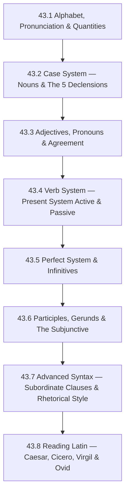

# Subject Syllabus: 43 - Latin

*Back to [Learning Index](00---09---Learning-Index)*

This syllabus defines the roadmap for **adult-learner Latin**, optimized for a systematic thinker who wants to unlock the source code of French, Italian, Spanish, and a significant portion of English — and who wants to read Caesar, Cicero, Virgil, and Ovid in the original.

Latin is not a dead language — it is a **frozen language.** It stopped evolving (as spoken Latin) around the 6th–7th century CE, which means every text written in classical Latin (50 BCE–150 CE) is perfectly readable with the same grammar. Latin's enormous payoff: mastering it is a multiplier on every other intellectual domain. Scientific nomenclature, legal terminology, medical vocabulary, philosophical concepts, theological language, Western literature — all of it is Latin in thin disguise.

**The key insight for systematic thinkers:** Latin has **no word order requirement.** Instead, it uses a **case system** — noun endings that encode the grammatical role of each word. This is the opposite of English (SVO word order) and Spanish/French/Italian (mostly SVO with some flexibility). Latin grammar is best understood the way a programmer understands a type system: each noun carries its own type tag (case), and the parser (your brain) extracts meaning from the tags, not from position.

**Why Latin alongside French/Italian:** Latin is not just a historical curiosity:
- It unlocks ~30% of English vocabulary (the Latinate register: government, science, law, religion, medicine)
- It makes French vocabulary instantly recognizable (~90% of French words are Latin-derived)
- Italian grammar's subjunctive and infinitive constructions are direct descendants of Latin
- Reading Latin trains grammatical precision in a way no other study achieves

---

## 🗺️ 1. Curriculum Mindmap & Milestones

**Target milestones:**
- After 43.1–43.3: **Beginner** — parse simple sentences; identify all 6 cases; read adapted Latin
- After 43.4–43.5: **Intermediate** — read adapted Caesar (*Commentarii de Bello Gallico*); handle all indicative and infinitive forms
- After 43.6–43.8: **Advanced reader** — read authentic classical prose; approach Virgil's *Aeneid* with a commentary

---

## 📚 2. Premium Free Learning Catalog

### 🎬 Video & Course

- **[Latinum Podcast](https://latinum.org.uk/)** — free audio Latin instruction; uses the Adler method (learning Latin through Latin, not translation). Hundreds of free episodes.
- **[ScorpioMartianus (YouTube)](https://www.youtube.com/@ScorpioMartianus)** — the best free Latin pronunciation and grammar video series on YouTube. Covers classical pronunciation, all 5 declensions, all 4 conjugations, and advanced syntax. **Essential.**
- **[Comprehensible Antiquity (YouTube)](https://www.youtube.com/@ComprehensibleAntiquity)** — Latin comprehensible-input videos; stories told in classical Latin at beginner and intermediate pace. The Dreaming Spanish of Latin.
- **[LatinTutorial (YouTube)](https://www.youtube.com/@latintutorial)** — systematic grammar instruction; very clear chapter-by-chapter coverage of every grammar topic in this curriculum.
- **[Paideia Institute — Living Latin](https://www.paideiainstitute.org/)** — online living Latin resources, immersive Latin events, Legonium (Latin comics series — free online).
- **[Magister Craft (YouTube)](https://www.youtube.com/@magistercraftmc)** — Latin taught through Minecraft; surprisingly effective for immersion learners.

### 📖 Open-Access Textbooks & References

- **[Wheelock's Latin](https://wheelockslatin.com/)** — the most widely used Latin textbook in university courses. The standard. Chapters 1–40 cover everything in this curriculum. 7th edition. [Companion site: wheelockslatin.com]
- **[Allen & Greenough's New Latin Grammar (archive.org)](https://archive.org/details/allengreenoughsnewlatingrammar)** — the authoritative scholarly Latin reference grammar; free on Internet Archive. Use as a reference, not a textbook.
- **[Lewis & Short Latin Dictionary (Perseus)](http://www.perseus.tufts.edu/hopper/resolveform?redirect=true)** — the standard Latin-English dictionary; free on Perseus Digital Library.
- **[Perseus Digital Library](http://www.perseus.tufts.edu/)** — **the single most important Latin resource online.** Free access to virtually every classical Latin text with vocabulary lookup, grammatical parsing, and commentary. Caesar, Cicero, Virgil, Ovid, Livy, Tacitus — all free, all parseable.
- **[Dickinson College Commentaries](https://dcc.dickinson.edu/)** — free open-access Latin texts with facing vocabulary and commentary. Ideal for first authentic readings.
- **[Latin Library](https://thelatinlibrary.com/)** — free plain-text versions of classical Latin texts (no parsing assistance, but excellent for printing).
- **[SPQR Latin Dictionary & Reader](https://spqrapp.com/)** — app with built-in parsing; excellent for reading practice on the go.
- *Wheelock's Latin* (7th ed.) — the standard university textbook; available at most libraries.
- *Lingua Latina per se Illustrata* by Hans Ørberg — the famous immersive-method Latin textbook (reads like a Roman novel from page 1; everything is Latin, no English translation provided). Pairs excellently with Wheelock.

### 📺 Authentic Latin Texts (Reading Progression)

- **Beginner:** Ørberg's *Familia Romana* (LLPSI vol. 1), adapted Caesar passages, *Fabulae Faciles* (D'Ooge)
- **Intermediate:** Caesar's *Bellum Gallicum* Books I–II (the gold standard intermediate Latin text), Nepos' *Lives*
- **Advanced prose:** Cicero's *In Catilinam*, *De Amicitia*, *De Senectute*; Livy's Ab Urbe Condita selections
- **Advanced poetry:** Ovid's *Metamorphoses* Book I; Virgil's *Aeneid* Book I–II (requires a commentary)
- **Medieval/Church Latin:** Vulgate Bible (Jerome's Latin), Augustine's *Confessions* (more accessible than classical)

---

## 🛠️ 3. Practice & Tooling Integration

### Drill scripts (`_practice/scripts/`)

- `43.2_declension_drill.py` — random noun + case + number → correct form. Configurable by declension (1st through 5th) and case. Tests both direction: "Give nominative plural of *puella*" and "Parse *puellarum* — what case, number, declension?".
- `43.3_adjective_agreement_drill.py` — given a noun, match the correct adjective form; 1st/2nd declension adjectives; 3rd declension adjectives; demonstratives (hic/haec/hoc, ille/illa/illud, is/ea/id).
- `43.4_verb_conjugation_drill.py` — random verb + tense + mood + voice + person/number → correct form. Present system (present/imperfect/future) active and passive; all 4 regular conjugations + sum/possum/eo/fero/volo.
- `43.5_perfect_drill.py` — perfect/pluperfect/future perfect active and passive; principal parts lookup; indirect statement (accusative + infinitive construction).
- `43.6_participle_drill.py` — given a verb, produce the correct participle form (present active, perfect passive, future active, future passive/gerundive); gerund vs. gerundive distinction.
- `43.8_parsing_drill.py` — given a Latin word from a Caesar or Cicero text, parse it fully: part of speech, declension/conjugation, case/tense/mood/person, number, gender. Uses passages from Perseus Digital Library.

### External Integrations

- **Anki** — import *Latin Core Vocabulary* deck (top 500 Latin words cover ~70% of any classical text). Also available: Wheelock chapter-by-chapter vocabulary decks.
- **Perseus Digital Library** — use the "word study tool" for parsing any Latin word; essential for reading practice.
- **SPQR app** — built-in vocabulary lookup for reading on the go.
- **Whitaker's Words** — free Latin parsing tool; paste any Latin word or text for full morphological analysis. Available online and as desktop app.

---

## 🎨 4. Reading Methodology

Latin study has a fundamentally different end goal than modern language learning — the primary product is **reading comprehension**, not conversation. The immersion directive therefore focuses on:

1. **Intensive reading:** Read a short passage (5–10 sentences) from an appropriate text. Look up every unknown word in Lewis & Short. Parse every ambiguous form. Reread until the passage is fluent.
2. **Sight reading practice:** From chapter 43.5, begin reading passages cold (without preparation) to train real-time parsing speed.
3. **Active writing (composition):** Translating short English sentences into Latin forces grammatical precision and internalizes case usage. Wheelock's Latin includes composition exercises throughout.
4. **Reading aloud:** Classical Latin pronunciation is known and reconstructable. Reading aloud with correct quantity (vowel length) and accent trains the prosody that makes poetry scansion possible.

---

## 📝 5. Chapter Outline

| # | Chapter | Core skill |
|---|---|---|
| 43.1 | **The Latin Alphabet, Pronunciation & Quantities** | Classical vs. ecclesiastical pronunciation; the 23-letter Latin alphabet; vowel quantities (long vs. short — critical for poetry and accent); the accent rule (penultimate if heavy, antepenultimate if penultimate is light); pronunciation of c (always hard /k/), v (pronounced /w/), ae/oe diphthongs; consonant clusters; Latin reading aloud from simple sentences. |
| 43.2 | **The Case System — Nouns & The 5 Declensions** | The 6 Latin cases and their core functions: **Nominative** (subject), **Accusative** (direct object; also object of motion-toward prepositions), **Genitive** (possession, "of"), **Dative** (indirect object, "to/for"), **Ablative** (means/agent/manner/place "by/with/from/in"; also object of many prepositions), **Vocative** (address); all 5 declension paradigms in full (singular + plural, all 6 cases); noun parsing (case + number + declension); common irregular nouns. |
| 43.3 | **Adjectives, Pronouns & Agreement** | 1st/2nd declension adjectives (bonus/bona/bonum paradigm; agree in gender/case/number with noun, **not necessarily same ending**); 3rd declension adjectives (two and one termination); comparison of adjectives (regular and irregular: bonus/melior/optimus, magnus/maior/maximus, parvus/minor/minimus, multus/plus/plurimus); demonstrative pronouns/adjectives (hic haec hoc; ille illa illud; is ea id); personal pronouns (ego/tu/nos/vos/sui); interrogative (quis/quid) and relative (qui/quae/quod) pronouns. |
| 43.4 | **The Verb System — Present System Active & Passive** | Latin verb identification: 4 conjugations (-are/-ere[-ēre]/-ere[-ĕre]/-ire); principal parts (4 forms to memorize per verb); present system = present, imperfect, future indicative active and passive; personal endings (active: -o/-m, -s, -t, -mus, -tis, -nt; passive: -r, -ris, -tur, -mur, -mini, -ntur); the irregular verbs: sum/esse (being verb — must be mastered first), possum/posse, eo/ire, fero/ferre, volo/nolle/malo; the *agent* construction (ablative of agent with *a/ab* + passive verb). |
| 43.5 | **The Perfect System & Infinitives** | Perfect system = perfect, pluperfect, future perfect indicative active and passive; perfect active from 3rd principal part (stem + perfect endings: -i/-isti/-it/-imus/-istis/-erunt); pluperfect active (perfect stem + eram/eras/erat...); future perfect active (perfect stem + ero/eris/erit...); perfect passive (4th principal part + forms of sum); all 6 Latin infinitives (present active/passive, perfect active/passive, future active/passive); **indirect statement** (accusative + infinitive: the most important Latin construction — used after verbs of thinking, saying, knowing, perceiving). |
| 43.6 | **Participles, Gerunds & The Subjunctive** | All 4 participle forms: present active (-ns/-ntis), perfect passive (4th principal part), future active (-urus/-ura/-urum), future passive/gerundive (-ndus/-nda/-ndum); gerund (verbal noun: object of prepositions, genitive of purpose) vs. gerundive (verbal adjective: obligation/necessity when used predicatively with sum — *amanda est* = "she must be loved"); **ablative absolute** (participle + noun/pronoun in ablative, grammatically independent — Caesar's favorite construction); **subjunctive mood**: present (active: stem + e/a + endings; passive: same stem); imperfect (present infinitive + endings); perfect (perfect stem + eri + endings); pluperfect (perfect infinitive + endings); main uses: purpose clauses (*ut* + subj), result clauses (*ut* + subj), indirect command (*ut/ne* + subj after verbs of ordering), fear clauses, cum clauses. |
| 43.7 | **Advanced Syntax — Subordinate Clauses & Rhetorical Style** | Sequence of tenses (primary sequence: present/future main → present/perfect subj; secondary sequence: past main → imperfect/pluperfect subj); conditions (simple/open, contrary-to-fact: si + pluperfect subj → pluperfect subj passive); indirect questions; relative clauses of characteristic; Ciceronian periodic sentence structure (hypotaxis — nested subordinate clauses building to climax); Caesar's parataxis (simple, coordinated main clauses); rhetorical devices (anaphora, chiasmus, tricolon, litotes, hendiadys) with examples from authentic texts. |
| 43.8 | **Reading Latin — Caesar, Cicero, Virgil & Ovid** | Caesar's *Bellum Gallicum* I.1 (*"Gallia est omnis divisa in partes tres"*) — the iconic opening; reading strategy for Caesar (short, factual sentences; indirect statement everywhere; ablative absolute at every turn); Cicero's *In Catilinam* I.1 (*"Quo usque tandem abutere, Catilina, patientia nostra?"*) — rhetorical Latin; Ovid's *Metamorphoses* I.1–4 (*"In nova fert animus mutatas dicere formas / corpora"*) — dactylic hexameter; scansion method (long/short syllable quantities → feet); Virgil's *Aeneid* I.1 (*"Arma virumque cano"*) — epic register; using Perseus + Dickinson commentaries effectively; building a personal Latin vocabulary notebook. |

Each chapter includes: all paradigm tables, worked parsing examples, translation exercises (Latin → English and English → Latin), "Where Students Fail" section, and cross-references to Perseus Digital Library passages.

---

## 🌐 6. Estimated Cadence

- **1.5 hr/day, 5 days/week:** Beginner milestone in 6–8 weeks; intermediate (reading Caesar) in 4–5 months; advanced reading in 8–12 months.
- **30 min/day:** Double the timeline, but still highly achievable — Latin grammar is stable and doesn't decay without immersion the way spoken languages do.
- **Highest-leverage habits:**
  - Daily paradigm drills (declension + conjugation) for the first 3 months — non-negotiable
  - Active translation (English → Latin) from chapter 43.4 onward
  - Perseus reading sessions (with parsing) from chapter 43.5 onward

---

*Curriculum architect: Bill — adult-learner Latin track as the root system for Romance languages and Latinate English. Cross-links: [Track 18 French](Subject_Plan), [Track 19 Italian](Subject_Plan), [Track 17 Spanish](Subject_Plan).*

---

## Related Notes
- [LEARNING_PATH](LEARNING_PATH) — Recommended chapter order and daily habits
- [43.1 - The Latin Alphabet, Pronunciation & Quantities](43.1---The-Latin-Alphabet,-Pronunciation-&-Quantities)
- [43.2 - The Case System — Nouns & The 5 Declensions](43.2---The-Case-System-—-Nouns-&-The-5-Declensions)
- [43.3 - Adjectives, Pronouns & Agreement](43.3---Adjectives,-Pronouns-&-Agreement)
- [43.4 - The Verb System — Present System Active & Passive](43.4---The-Verb-System-—-Present-System-Active-&-Passive)
- [43.5 - The Perfect System & Infinitives](43.5---The-Perfect-System-&-Infinitives)
- [43.6 - Participles, Gerunds & The Subjunctive](43.6---Participles,-Gerunds-&-The-Subjunctive)
