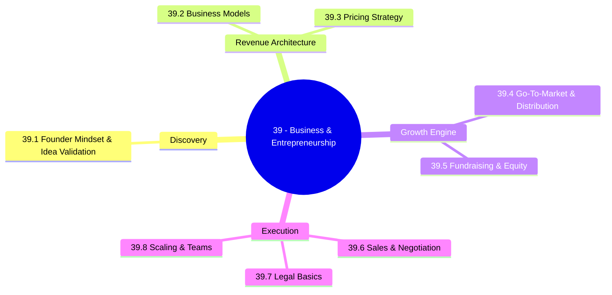
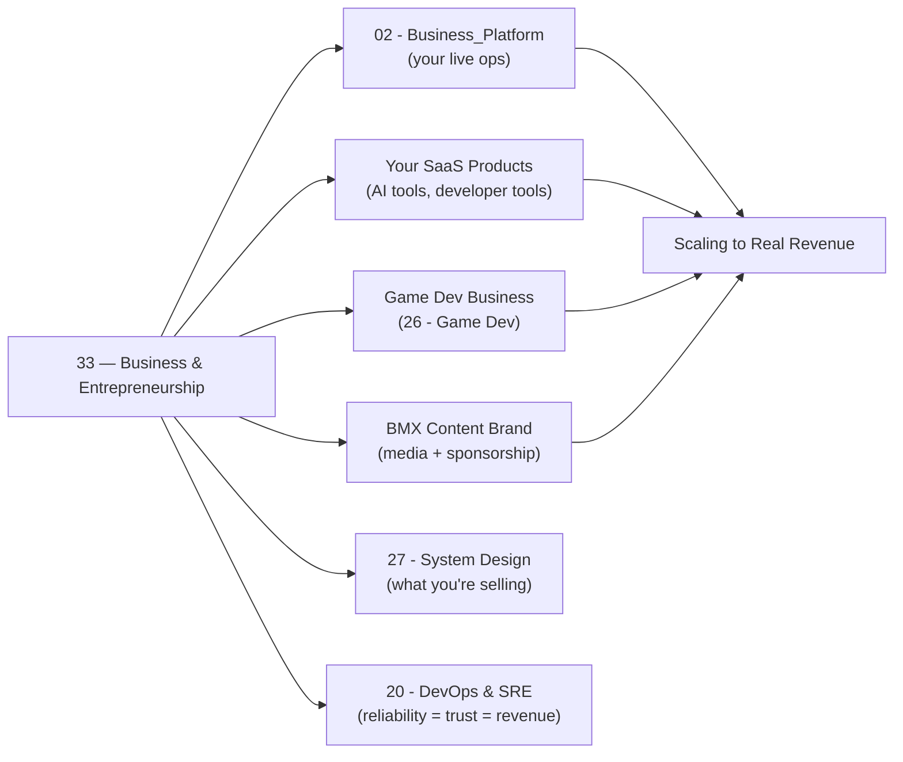

*Back to [00 - 09 - Learning Index](00---09---Learning-Index) | Part of [LEARNING_PATH](LEARNING_PATH)*

# 💼 Business & Entrepreneurship — Subject Plan

> *"The best businesses come from personal frustration. Make something you wish existed."* — Paul Graham, paraphrased from [paulgraham.com/startupideas](http://www.paulgraham.com/startupideas.html)

> *"Distribution is the thing most technical founders underestimate. They think the product sells itself. It does not."*

---

## 🎯 Mission Statement

**Turn the builder into the founder.** Idea validation → business models → pricing → GTM → fundraising → sales → legal → scaling. The track that turns your AI tools, games, and content brand from **side projects into companies**.

You already have the rare combination of technical depth (Python/AI, game dev, SaaS architecture) and creative output (BMX content brand, game concepts). What this track adds is the **business operating system** that converts those assets into revenue, equity, and sustainable growth.

The chapters mirror the questions every founder faces in sequence:
- *Is this even a real problem?* → 39.1 Founder Mindset & Idea Validation
- *How does money flow in and out?* → 39.2 Business Models & Revenue Architecture
- *What should I charge?* → 39.3 Pricing Strategy & Value Capture
- *How do people find me?* → 39.4 Go-To-Market Strategy & Distribution
- *Do I need investors? On what terms?* → 39.5 Fundraising, Investors & Equity
- *How do I close the deal?* → 39.6 Sales, Negotiation & Closing
- *Am I protected?* → 39.7 Legal Basics for Founders
- *How do I grow without breaking?* → 39.8 Scaling Operations & Building Teams

---

## 📊 Track Overview



---

## 📚 Chapter Inventory

| # | Chapter | Domain | Status |
|---|---------|--------|--------|
| 39.1 | Founder Mindset & Idea Validation | JTBD, problem discovery, customer interviews, validation | 🟡 Active |
| 39.2 | Business Models & Revenue Architecture | BMC, SaaS, marketplace, productized service, recurring revenue | 🟡 Active |
| 39.3 | Pricing Strategy & Value Capture | Value-based, cost-plus, competitor, freemium math, van Westendorp | 🟡 Active |
| 39.4 | Go-To-Market Strategy & Distribution | PLG, sales-led, content-led, channels, cold outreach, ICP | 🟡 Active |
| 39.5 | Fundraising, Investors & Equity | Angels, VCs, SAFEs, convertible notes, cap table, dilution | 🟡 Active |
| 39.6 | Sales, Negotiation & Closing | Discovery calls, objection handling, SPIN, closing, negotiation | 🟡 Active |
| 39.7 | Legal Basics for Founders | Delaware C-Corp vs LLC, IP assignment, contractor vs employee, vesting | 🟡 Active |
| 39.8 | Scaling Operations & Building Teams | Hiring, org design, metrics (MRR/ARR/CAC/LTV/churn/NRR), processes | 🟡 Active |

---

## 🔗 Prerequisites

| Prerequisite | Where you learned it | Why it matters |
|---|---|---|
| SaaS architecture patterns | [Track 27]() | You need to know what you're pricing and selling |
| Your business context | [02 - Business_Platform]() | Your real products — AI tools, game dev, BMX brand — are the case studies |
| Product thinking basics | Any previous product work | Business strategy without product intuition is theory |
| Basic numeracy | N/A | Pricing math, cap table, LTV/CAC ratios all require comfort with numbers |

---

## 🆓 Open-Source / Free Catalog

> Pictures, videos, and reference materials live **outside the repo** (YouTube, official docs, open-source resources). Each chapter and the [README](README) hub link to them by URL. SVG diagrams that we author live inside `_svgs/` with the `biz__<ch>-fig<n>.svg` prefix.

### 📖 Books & Essays (free / open access)

| Title | Author / Provider | Why |
|---|---|---|
| **Paul Graham Essays** | Paul Graham | The definitive founder thinking catalog — [paulgraham.com](http://www.paulgraham.com/) — all free |
| **Zero to One** | Peter Thiel / Blake Masters | Competition is for losers; monopoly thinking for founders |
| **The Lean Startup** | Eric Ries | The canonical build-measure-learn framework |
| **The Mom Test** | Rob Fitzpatrick | The best book on customer interviews ever written — [momtestbook.com](http://momtestbook.com/) |
| **Stripe Atlas Guides** | Stripe | Starting, structuring, and growing companies — [stripe.com/atlas/guides](https://stripe.com/atlas/guides) — all free |
| **Hacker News: Ask HN — How to get first 10 customers** | HN Community | Tactical cold start advice — [news.ycombinator.com](https://news.ycombinator.com/) |
| **Founding Sales** | Pete Kazanjy | Free PDF of the canonical founder-led sales playbook — [foundingsales.com](https://www.foundingsales.com/) |
| **SaaS Metrics 2.0** | David Skok (Matrix Partners) | The definitive SaaS metric reference — [forentrepreneurs.com](https://www.forentrepreneurs.com/saas-metrics-2/) — free |

### 🎓 Courses & Video Series

| Resource | Provider | Coverage |
|---|---|---|
| **YC Startup School** | Y Combinator | Free 6-week async course: idea → launch → growth — [startupschool.org](https://www.startupschool.org/) |
| **How to Start a Startup (CS183)** | Stanford / Sam Altman | Classic lecture series — [startupclass.samaltman.com](http://startupclass.samaltman.com/) |
| **Goldman Sachs 10,000 Women** | Goldman Sachs | Business fundamentals, free certificate course — [goldmansachs.com/community-impact/10000-women](https://www.goldmansachs.com/community-impact/10000-women) |
| **a16z Podcast** | Andreessen Horowitz | Founder stories + strategy — [a16z.com/podcast](https://a16z.com/podcast/) |
| **My First Million Podcast** | Sam Parr & Shaan Puri | Business idea generation + frameworks — [mfmpod.com](https://www.mfmpod.com/) |
| **Indie Hackers** | Courtland Allen | Community + interviews for bootstrapped SaaS — [indiehackers.com](https://www.indiehackers.com/) |
| **First Round Capital Blog** | First Round | Tactical long-form essays on building companies — [firstround.com/review](https://review.firstround.com/) |
| **Lenny's Newsletter** | Lenny Rachitsky | Product + growth + GTM — [lennysnewsletter.com](https://www.lennysnewsletter.com/) |

### 🛠️ Tools & Reference (cite-quality)

| Tool / Spec | Link | Use |
|---|---|---|
| Stripe Atlas Guides | [stripe.com/atlas/guides](https://stripe.com/atlas/guides) | Entity formation, equity, compliance checklists |
| Y Combinator SAFE (Simple Agreement for Future Equity) | [ycombinator.com/documents](https://www.ycombinator.com/documents) | Free standard legal templates |
| Cap Table templates | [captable.io](https://captable.io/) | Free cap table modeling |
| Carta (free tier) | [carta.com](https://carta.com/) | Cap table + equity management |
| Profitwell Benchmarks | [profitwell.com/recur/resources](https://www.profitwell.com/recur/resources) | SaaS metric benchmarks |
| Price Intelligently / ProfitWell blog | [profitwell.com/recur/blog](https://www.profitwell.com/recur/blog) | Pricing strategy research |
| Baremetrics Open Benchmarks | [baremetrics.com/open-benchmarks](https://baremetrics.com/open-benchmarks) | Real SaaS MRR/ARR data |
| AngelList / Wellfound | [wellfound.com](https://wellfound.com/) | Fundraising, investor discovery |
| SAFE Primer (YC) | [ycombinator.com/resources/safe-primer](https://www.ycombinator.com/resources/safe-primer) | How SAFEs actually work |

---

## 🏗️ Study Strategy

### Phase 1 — Founder Foundations (Chapters 33.1–39.2) — 2 weeks
Start where every company starts: **is this a real problem, and how does the money flow?** Before writing a line of code or designing a logo, you need evidence that someone will pay. These two chapters together answer: *what am I building and for whom, and what is the economic machine underneath it.*

### Phase 2 — Revenue & Go-To-Market (Chapters 33.3–39.4) — 2 weeks
**Pricing is the fastest lever for revenue growth.** Most technical founders are charging 5–10× too little. Chapter 39.3 gives you the frameworks to price on value, not cost. Chapter 39.4 tells you how to actually get it in front of people — channel strategy, distribution, and cold acquisition.

### Phase 3 — Capital & Closing (Chapters 33.5–39.6) — 2 weeks
Not every founder needs to raise money, but every founder needs to understand the mechanics. Chapter 39.5 covers the full capital stack — bootstrapping to Series A — and equity mechanics (SAFEs, dilution, cap tables). Chapter 39.6 covers sales as a skill you can learn: from first contact to signed contract.

### Phase 4 — Foundations & Scale (Chapters 33.7–39.8) — 2 weeks
Chapter 39.7 is the "don't step on a legal landmine" chapter — entity structure, IP protection, contractor vs employee, vesting. Chapter 39.8 is about not breaking as you grow: hiring, org design, and the metrics that distinguish a growing business from a leaking one.

**Total ≈ 8 weeks at 6 hrs/week ≈ 48 hours.** Pair with active YC Startup School enrollment for the best results.

---

## 🔭 2026 Industry Snapshot (web-grounded)

> Sources rephrased and paraphrased for compliance — never more than 30 consecutive words from any single source.

- **AI-native SaaS is now the default PMF category for solo builders.** The tooling has compresses GTM cycles — startups reaching $1M ARR in under 12 months are no longer anomalies. — paraphrased from a16z *State of AI 2025* and YC W2026 batch announcements.
- **Bootstrapping is resurging.** The 2022–2024 VC correction pushed many founders toward revenue-first, capital-efficient models. Indie Hackers and the "ramen-profitable" playbook have been validated at scale. — paraphrased from [indiehackers.com state of indie hacking 2025](https://www.indiehackers.com/).
- **Pricing intelligence is a competitive moat.** SaaS companies using value-based pricing with segmented tiers grow 2–3× faster than those using cost-plus, according to Price Intelligently / ProfitWell research. — paraphrased from [profitwell.com pricing strategy research](https://www.profitwell.com/recur/blog/saas-pricing-strategies).
- **PLG (product-led growth) has matured.** Companies like Figma, Notion, and Linear proved that a great product can be the primary sales vehicle. The 2026 trend is *PLG + sales assist* — product-qualified leads (PQLs) handed to AEs, not cold SDR outbound. — paraphrased from [openviewpartners.com 2025 PLG benchmark report](https://openviewpartners.com/).
- **Solo founder legitimacy.** YC 2026 data shows that solo founders, historically penalized in investor perception, now represent a higher success rate in AI/developer tools categories. The thesis: high-IQ AI coding tools compress team size requirements. — paraphrased from [ycombinator.com trends](https://www.ycombinator.com/).
- **SAFEs have become the universal seed instrument.** Post-money SAFEs (YC standard) dominate early-stage US fundraising. Convertible notes are declining except in specific bridge situations. — paraphrased from [stripe.com/atlas/guides](https://stripe.com/atlas/guides) and [ycombinator.com/resources/safe-primer](https://www.ycombinator.com/resources/safe-primer).
- **Vibe coding + sales = new founder archetype.** The 2026 pattern is a solo dev who builds with AI-assisted coding, launches via a PLG funnel, and does the first 10–20 sales calls themselves. Sales and code are no longer separate skills. — paraphrased from [firstround.com/review](https://review.firstround.com/).

---

## 📁 Directory Structure

```
39 - Business & Entrepreneurship/
├── Subject_Plan.md          ← You are here
├── LEARNING_PATH.md         ← Visual roadmap
├── README.md                ← Subject hub + media references
├── 39.1 - Founder Mindset & Idea Validation.md
├── 39.2 - Business Models & Revenue Architecture.md
├── 39.3 - Pricing Strategy & Value Capture.md
├── 39.4 - Go-To-Market Strategy & Distribution.md
├── 39.5 - Fundraising, Investors & Equity.md
├── 39.6 - Sales, Negotiation & Closing.md
├── 39.7 - Legal Basics for Founders.md
└── 39.8 - Scaling Operations & Building Teams.md
```

SVG figures live one level up in `../_svgs/biz__<chapter>-fig<n>.svg`.

---

## 🔗 How This Track Plugs Into Everything Else



---

*Next: [LEARNING_PATH](LEARNING_PATH) — Visual progression map*

---

## Related Notes
- [39.2 - Business Models & Revenue Architecture](39.2---Business-Models-&-Revenue-Architecture) - Shared entrepreneurship/business-models focus
- [39.3 - Pricing Strategy & Value Capture](39.3---Pricing-Strategy-&-Value-Capture) - Shared entrepreneurship/pricing focus
- [39.4 - Go-To-Market Strategy & Distribution](39.4---Go-To-Market-Strategy-&-Distribution) - Shared entrepreneurship/gtm focus
- [39.5 - Fundraising, Investors & Equity](39.5---Fundraising,-Investors-&-Equity) - Shared entrepreneurship/fundraising focus
