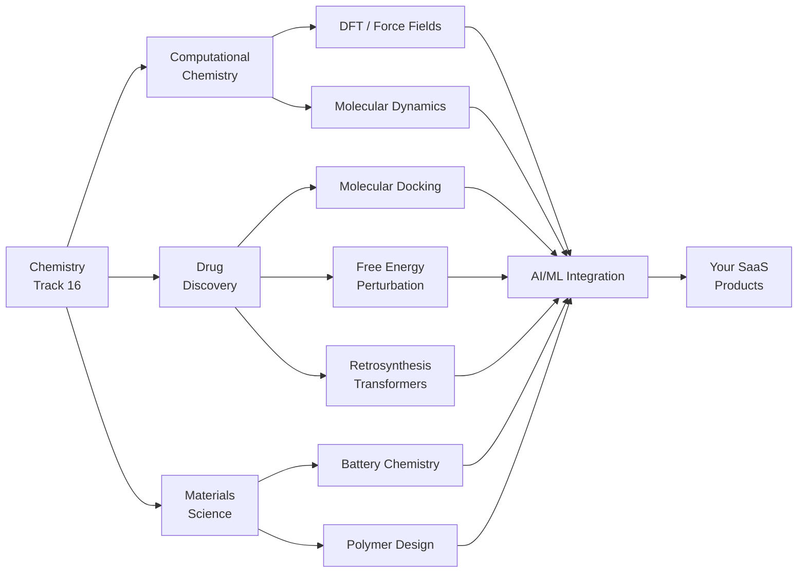

*Back to [Subject_Plan](Subject_Plan) | Part of [00 - 09 - Learning Index](00---09---Learning-Index)*

# 🗺️ Chemistry — Learning Path

> *"Nothing in life is to be feared, it is only to be understood. Now is the time to understand more, so that we may fear less."* — Marie Curie

---

## 🧭 Progression Map

```mermaid
graph TD
    %% Prerequisites (already completed)
    QM["✅ Track 09: Quantum Mechanics<br/>Schrödinger, orbitals, spin"]
    THERMO["✅ Track 05: Thermodynamics<br/>Partition functions, free energy"]
    LINALG["✅ Track 02: Linear Algebra<br/>Eigenvalues, matrices"]
    ODE["✅ Track 03: ODEs & PDEs<br/>Rate equations"]

    %% Chemistry chapters
    C1["03.1 Atomic Structure<br/>& Periodic Table"]
    C2["03.2 Chemical Bonding<br/>Ionic, Covalent, Metallic"]
    C3["03.3 Stoichiometry<br/>& Reactions"]
    C4["03.4 Thermodynamics<br/>& Kinetics"]
    C5["03.5 Acids, Bases<br/>& Equilibrium"]
    C6["03.6 Electrochemistry<br/>& Redox"]
    C7["03.7 Organic Chemistry<br/>Foundations"]
    C8["03.8 Biochemistry<br/>& Modern Topics"]

    %% Connections
    QM --> C1
    LINALG --> C2
    C1 --> C2
    C2 --> C3
    THERMO --> C4
    C3 --> C4
    C4 --> C5
    THERMO --> C5
    C5 --> C6
    C2 --> C7
    C4 --> C7
    C6 --> C8
    C7 --> C8

    %% Styling
    style QM fill:#2d5016,stroke:#4a8c2a
    style THERMO fill:#2d5016,stroke:#4a8c2a
    style LINALG fill:#2d5016,stroke:#4a8c2a
    style ODE fill:#2d5016,stroke:#4a8c2a
    style C1 fill:#1a3a5c,stroke:#3d7ab8
    style C2 fill:#1a3a5c,stroke:#3d7ab8
    style C3 fill:#1a3a5c,stroke:#3d7ab8
    style C4 fill:#4a1a3a,stroke:#8c3d6b
    style C5 fill:#4a1a3a,stroke:#8c3d6b
    style C6 fill:#4a1a3a,stroke:#8c3d6b
    style C7 fill:#3a3a1a,stroke:#8c8c3d
    style C8 fill:#3a3a1a,stroke:#8c8c3d
```

---

## 📅 Suggested Timeline

| Week | Focus | Chapters | Hours/Week |
|------|-------|----------|------------|
| 1 | Atomic structure → bonding | 03.1, 03.2 | 8–10 |
| 2 | Stoichiometry & reaction types | 03.3 | 6–8 |
| 3 | Chemical thermodynamics | 03.4 | 8–10 |
| 4 | Equilibrium & acid-base | 03.5 | 8–10 |
| 5 | Electrochemistry | 03.6 | 6–8 |
| 6–7 | Organic chemistry | 03.7 | 10–12 |
| 8 | Biochemistry & computational | 03.8 | 8–10 |

**Total: ~8 weeks at 8 hrs/week = 64 hours**

---

## 🎯 Milestone Checkpoints

### ✅ Checkpoint 1: "I Understand Atoms" (after 16.1–03.2)
- [ ] Can write electron configurations for any element using QM quantum numbers
- [ ] Can explain WHY the periodic table has its shape (it's the angular momentum quantum number $\ell$)
- [ ] Can predict bond type (ionic vs covalent) from electronegativity difference
- [ ] Can construct a molecular orbital diagram for O₂ and explain its paramagnetism

### ✅ Checkpoint 2: "I Can Predict Reactions" (after 16.3–03.4)
- [ ] Can balance any chemical equation (including redox by half-reaction method)
- [ ] Can calculate limiting reagent and theoretical yield
- [ ] Can derive the Arrhenius equation from the Boltzmann distribution
- [ ] Can calculate $\Delta G$ for a reaction and predict spontaneity

### ✅ Checkpoint 3: "I Understand Equilibrium" (after 16.5–03.6)
- [ ] Can derive $K_{eq}$ from the partition function (statistical mechanics route)
- [ ] Can calculate pH of any buffer system
- [ ] Can use the Nernst equation to predict cell voltage
- [ ] Can balance redox equations in acidic and basic solution

### ✅ Checkpoint 4: "I Can Think Like a Chemist" (after 16.7–03.8)
- [ ] Can classify organic reactions by mechanism (SN1/SN2/E1/E2/addition/EAS)
- [ ] Can push arrows for any major mechanism
- [ ] Can explain how DFT calculates molecular properties
- [ ] Can describe a drug-discovery pipeline from target to lead optimization

---

## 🔄 How This Connects to Your AI Mission

---

## 📖 Reading Order with MIT OCW Alignment

| Chapter | MIT 5.111 Lectures | Khan Academy Unit |
|---------|-------------------|-------------------|
| 03.1 | Lectures 1–7 (Atomic theory, electron config) | Atomic structure |
| 03.2 | Lectures 8–12 (Bonding, Lewis, MO theory) | Chemical bonds |
| 03.3 | Lectures 13–15 (Stoichiometry) | Stoichiometry |
| 03.4 | Lectures 16–20 (Thermochemistry, kinetics) | Thermochemistry |
| 03.5 | Lectures 21–26 (Equilibrium, acid-base) | Acids and bases |
| 03.6 | Lectures 27–30 (Electrochemistry) | Redox & electrochemistry |
| 03.7 | Lectures 31–34 (Organic intro) | Organic chemistry |
| 03.8 | Lectures 35–36 (Biochemistry) | — |

---

## 💡 The "Second Attempt" Advantage

You're not starting from zero. You're starting from **quantum mechanics and thermodynamics**. Here's what that means:

1. **Orbitals aren't memorization** — they're solutions to the hydrogen Schrödinger equation you already solved in [9.4 - Angular Momentum, Spin & Fine Structure](9.4---Angular-Momentum,-Spin-&-Fine-Structure)
2. **The periodic table isn't arbitrary** — it's the filling order of quantum states ($n$, $\ell$, $m_\ell$, $m_s$)
3. **Equilibrium isn't magic** — it's the state that minimizes Gibbs free energy, which you derived from the partition function in [5.6 - The Partition Function & Free Energy](5.6---The-Partition-Function-&-Free-Energy)
4. **Reaction rates aren't random** — they follow from the Boltzmann distribution (fraction of molecules with $E > E_a$)

**This time, chemistry will click.**

---

*Next: [03.1 - Atomic Structure & The Periodic Table](03.1---Atomic-Structure-&-The-Periodic-Table) — Where quantum mechanics becomes chemistry*

---

## Related Notes
- [03.2 - Chemical Bonding - Ionic, Covalent, Metallic & Intermolecular](03.2---Chemical-Bonding---Ionic,-Covalent,-Metallic-&-Intermolecular) - Same Chemistry folder
- [03.3 - Stoichiometry & Reactions](03.3---Stoichiometry-&-Reactions) - Same Chemistry folder
- [03.4 - Thermodynamics & Kinetics](03.4---Thermodynamics-&-Kinetics) - Same Chemistry folder
- [03.5 - Acids, Bases & Equilibrium](03.5---Acids,-Bases-&-Equilibrium) - Same Chemistry folder
