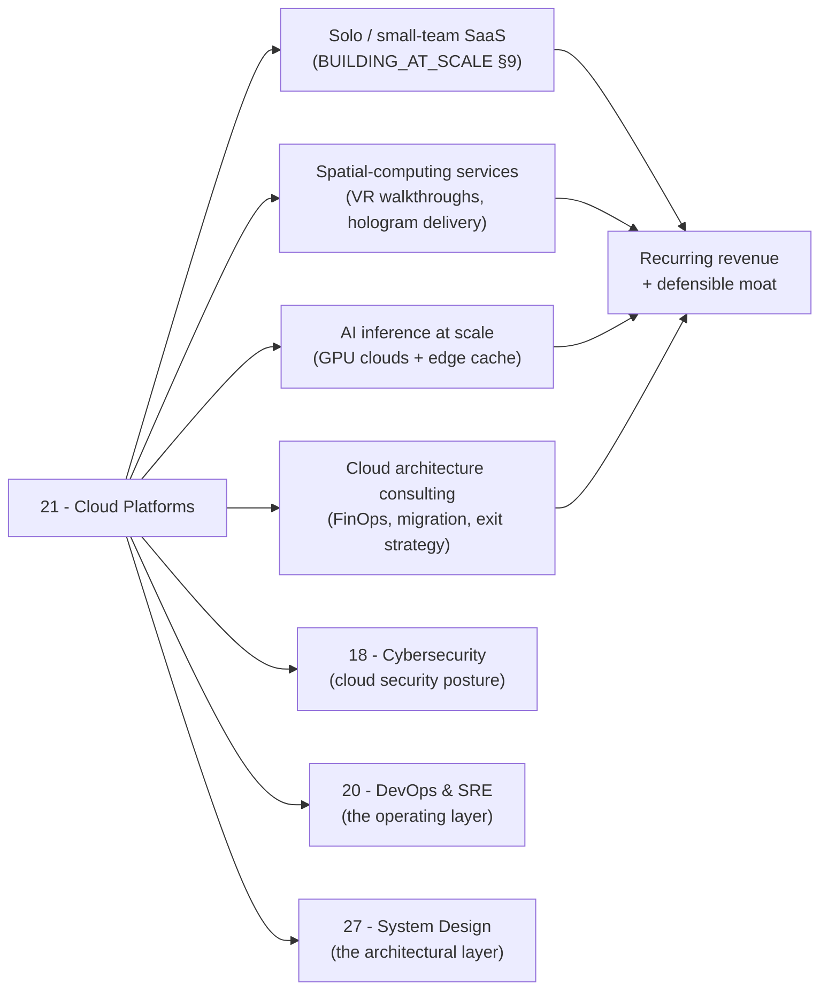

*Back to [Subject_Plan](Subject_Plan) | Part of [00 - 09 - Learning Index](00---09---Learning-Index)*

# 🗺️ Cloud Platforms — Learning Path

> *"The cloud is not a noun. It is a set of decisions: where compute runs, where data lives, who can reach it, what it costs, and how you leave."*

---

## 🧭 Progression Map

```mermaid
graph TD
    %% Prerequisites
    DOCKER["✅ Docker & Containers<br/>1.9"]
    NET["✅ Computer Networks<br/>1.11"]
    DIST["✅ Distributed Systems<br/>1.16"]
    SCALE["📘 BUILDING_AT_SCALE<br/>(meta playbook)"]

    %% Survey
    C1["21.1 The Cloud<br/>Provider Landscape"]

    %% Primitives
    C2["21.2 Compute<br/>Primitives"]
    C3["21.3 Storage<br/>& Databases"]
    C4["21.4 Networking,<br/>DNS & CDN"]
    C5["21.5 Identity, IAM<br/>& Org Structure"]

    %% Strategy
    C6["21.6 Cost<br/>Optimization"]
    C7["21.7 Multi-Cloud,<br/>Edge & Lock-In"]

    %% Capstone
    C8["21.8 The Indie<br/>& Solo Cloud Stack"]

    %% Connections
    DOCKER --> C2
    NET --> C4
    DIST --> C2
    DIST --> C3
    SCALE --> C1

    C1 --> C2
    C1 --> C3
    C1 --> C4
    C1 --> C5
    C2 --> C6
    C3 --> C6
    C4 --> C6
    C5 --> C6
    C6 --> C7
    C7 --> C8

    %% Downstream tracks
    C8 --> SEC["25.7 Cloud &<br/>Container Security"]
    C8 --> DEVOPS["26.2 IaC<br/>26.3 Containers<br/>26.8 Cost"]
    C8 --> SYSDES["27.2 Edge<br/>27.3 Databases at Scale"]

    %% Styling
    style DOCKER fill:#2d5016,stroke:#4a8c2a
    style NET fill:#2d5016,stroke:#4a8c2a
    style DIST fill:#2d5016,stroke:#4a8c2a
    style SCALE fill:#5c3d16,stroke:#b88a3d
    style C1 fill:#1a3a5c,stroke:#3d7ab8
    style C2 fill:#3a3a1a,stroke:#8c8c3d
    style C3 fill:#3a3a1a,stroke:#8c8c3d
    style C4 fill:#3a3a1a,stroke:#8c8c3d
    style C5 fill:#3a3a1a,stroke:#8c8c3d
    style C6 fill:#4a1a3a,stroke:#8c3d6b
    style C7 fill:#4a1a3a,stroke:#8c3d6b
    style C8 fill:#5c1a3d,stroke:#b83d7a
    style SEC fill:#2a2a2a,stroke:#666
    style DEVOPS fill:#2a2a2a,stroke:#666
    style SYSDES fill:#2a2a2a,stroke:#666
```

---

## 📅 Suggested Timeline

| Week | Focus | Chapters | Hours/Week |
|------|-------|----------|------------|
| 1 | Survey the landscape — who is who | 21.1 | 4–6 |
| 2 | Compute primitives | 21.2 | 6–8 |
| 3 | Storage & databases | 21.3 | 6–8 |
| 4 | Networking, DNS, CDN | 21.4 | 6–8 |
| 5 | Identity, IAM, multi-account | 21.5 | 6–8 |
| 6 | Cost optimization & FinOps | 21.6 | 6–8 |
| 7 | Multi-cloud, edge, lock-in | 21.7 | 5–7 |
| 8 | The Indie & Solo stack — ship something | 21.8 | 8–10 |

**Total: ~8 weeks at 7 hrs/week ≈ 56 hours**

---

## 🎯 Milestone Checkpoints

### ✅ Checkpoint 1: "I Know Who Plays What Role" (after 21.1)
- [ ] Can name 12+ providers and one-line their primary use case
- [ ] Can sketch the three-column map (hyperscalers · developer clouds · bare-metal-ish) plus the GPU-cloud row
- [ ] Can explain why list prices barely vary but real bills do (egress + managed-service markup + commitment discounts)
- [ ] Can decide between Cloudflare-edge-first vs containers-on-Fly.io vs hyperscaler for a given workload

### ✅ Checkpoint 2: "I Know the Primitives" (after 21.2 → 21.5)
- [ ] Can describe the spectrum from VM → container → serverless function → batch → GPU and pick the right rung
- [ ] Can pick between object · block · managed Postgres · managed Redis · vector · warehouse for a given dataset
- [ ] Can design a VPC with public/private subnets, NAT, a CDN in front, DNS at Cloudflare, and a service mesh-or-Tunnel for east-west
- [ ] Can write a least-privilege IAM policy from scratch and explain the AWS Org / GCP Folder / Azure Mgmt-Group model

### ✅ Checkpoint 3: "I Don't Get Surprised by the Bill" (after 21.6 → 21.7)
- [ ] Can apply the FinOps Inform / Optimise / Operate maturity model to a real account
- [ ] Can run an Infracost report on a Terraform plan and explain the dominant line items
- [ ] Can decide when multi-cloud is worth the complexity (rare) vs when single-cloud + portability strategy is enough
- [ ] Can quote an exit-cost estimate for any of the major clouds (egress + re-architecting + managed-service replacement)

### ✅ Checkpoint 4: "I Have Shipped" (after 21.8)
- [ ] Have a deployed app on the Cloudflare Workers + D1 + R2 + Queues stack OR Supabase + Fly.io OR Railway/Render
- [ ] Can show a $-figure proof: total monthly bill at < $200 for a 1,000-user app
- [ ] Have automated deploys (GitHub Actions → vendor) with a one-command rollback
- [ ] Have monitoring (Sentry · Better Stack · Plausible/PostHog) wired in from day 1

---

## 🔄 How This Connects to Your Mission

---

## 📖 Reading Order with External Course Alignment

| Chapter | Free Course / Reference | Hours |
|---------|------------------------|-------|
| 21.1 | AWS Architecture Center intro · Roadmap.sh AWS overview | 4–6 |
| 21.2 | AWS EC2 / GCP Compute Engine docs · Cloudflare Workers tutorial · RunPod / Modal quickstarts | 6–8 |
| 21.3 | AWS S3 / GCS / R2 docs · Supabase / Neon docs · BigQuery / ClickHouse tutorials | 6–8 |
| 21.4 | AWS VPC tutorial · Cloudflare Tunnel quickstart · Tailscale solo-dev guide | 6–8 |
| 21.5 | AWS IAM walkthrough · GCP IAM principles · Azure RBAC · Org Adoption Framework | 6–8 |
| 21.6 | AWS Cost Optimization white paper · FinOps Foundation framework · Infracost tutorial | 6–8 |
| 21.7 | CNCF landscape · WinterCG runtime spec · Cloudflare/Vercel/Deno edge docs | 5–7 |
| 21.8 | BUILDING_AT_SCALE §9 · Cloudflare full-stack tutorial · Supabase + Fly.io recipe | 8–10 |

---

## 💡 The "Cloud Architect's Edge"

Most engineers learn one cloud and stay there. Most cloud certs only test you on that one cloud. Most consultants pick a "best" cloud and evangelize it.

You will learn the **decision framework** instead of the religion. That means:
- You can quote any of three providers for the same workload and explain the cost / lock-in / portability trade-offs.
- You can spot the "we should be on AWS" defaulting before it happens, and counter with the indie stack when appropriate.
- You can read a cloud bill and find the 27–35% waste before the invoice arrives.
- You can ship a profitable solo SaaS for under $200/month — and scale it without re-architecting.

That is the architect's edge for the cloud era.

---

*Next: [21.1 - The Cloud Provider Landscape 2026](21.1---The-Cloud-Provider-Landscape-2026) — Where the map gets drawn.*

---

## Related Notes
- [21.6 - Cost Optimization](21.6---Cost-Optimization) - Shared finops/cloud focus
- [21.8 - The Indie & Solo Cloud Stack](21.8---The-Indie-&-Solo-Cloud-Stack) - Shared cloudflare/cloud focus
- [21.2 - Compute Primitives](21.2---Compute-Primitives) - Same Cloud Platforms folder
