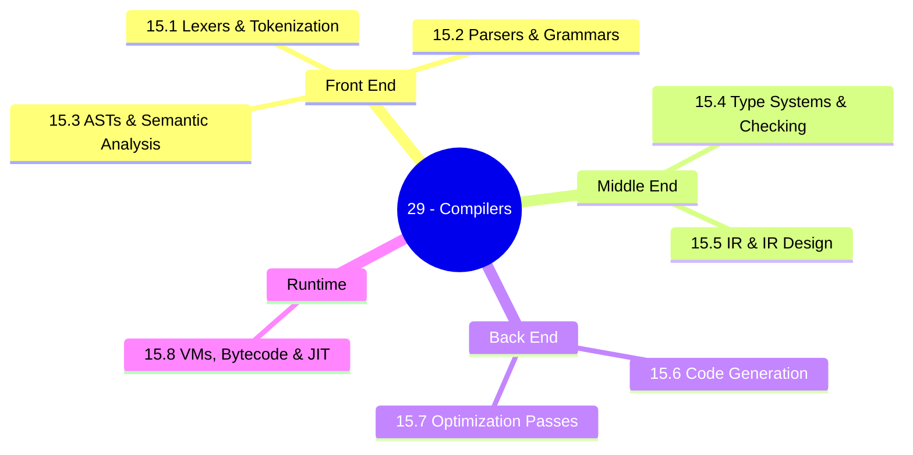
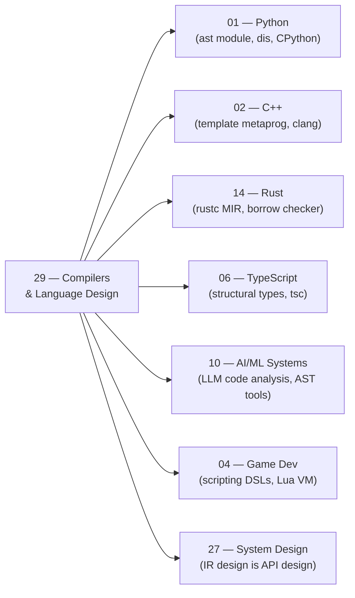

*Back to [00 - 09 - Learning Index](00---09---Learning-Index) | Part of [LEARNING_PATH](LEARNING_PATH)*

# ⚙️ Compilers & Language Design — Subject Plan

> *"Any sufficiently advanced compiler is indistinguishable from magic — until you build one."*

> *"The compiler is the most honest source of truth about the language. Not the spec. The compiler."*

---

## 🎯 Mission Statement

**Build the decoder ring for every language you know.** Lexers → parsers → ASTs → type systems → IR → codegen → optimization → VMs. The track that turns 7 languages from tools into transparent machines — and directly powers your AI tooling and LLM code-analysis work.

This is the track Bill never took formally. You have Python, C++, C#, JS, TypeScript, Rust, and SQL — you *use* them daily. This track answers the question you have always been afraid to ask: **what actually happens between your keystroke and the running program?**

The chapters mirror the pipeline a compiler walks every source file through:
- *What characters are in here?* → 15.1 Lexers & Tokenization
- *What structure do they form?* → 15.2 Parsers & Grammars
- *What does the structure mean?* → 15.3 Abstract Syntax Trees & Semantic Analysis
- *Are the types consistent?* → 15.4 Type Systems & Type Checking
- *What machine-independent form does it take?* → 15.5 Intermediate Representations & IR Design
- *What machine code should it produce?* → 15.6 Code Generation & Backends
- *How do we make it faster at compile time?* → 15.7 Optimization Passes
- *What if we want a sandboxed runtime?* → 15.8 Virtual Machines, Bytecode & JIT

Every chapter includes **Python implementations** that Bill can run, because the goal isn't just to understand compilers — it's to *build things with that understanding* (AST-walking tools, custom linters, LLM code-analysis pipelines, DSLs for game scripting, etc.).

---

## 📊 Track Overview



---

## 📚 Chapter Inventory

| # | Chapter | Domain | Status |
|---|---------|--------|--------|
| 15.1 | Lexers & Tokenization | Regex, NFA/DFA, Thompson construction, maximal munch | 🟡 Active |
| 15.2 | Parsers & Grammars | BNF/EBNF, LL(1), recursive descent, Pratt, LR(1) | 🟡 Active |
| 15.3 | ASTs & Semantic Analysis | Node types, visitor pattern, symbol tables, scope | 🟡 Active |
| 15.4 | Type Systems & Type Checking | HM inference, unification, subtyping, generics | 🟡 Active |
| 15.5 | Intermediate Representations & IR Design | TAC, SSA, CFG, phi nodes, LLVM IR | 🟡 Active |
| 15.6 | Code Generation & Backends | Instruction selection, register allocation, calling conventions | 🟡 Active |
| 15.7 | Optimization Passes | Constant folding, DCE, inlining, LICM, loop vectorisation | 🟡 Active |
| 15.8 | Virtual Machines, Bytecode & JIT | Stack/reg VMs, CPython bytecode, V8 tiers, GC | 🟡 Active |

---

## 🔗 Prerequisites

| Prerequisite | Where you learned it | Why it matters |
|---|---|---|
| Python fluency | [Subject_Plan](Subject_Plan) | All small compiler examples are in Python |
| Data structures | [1.3 - Data Structures - Lists, Dicts, Sets, Tuples](1.3---Data-Structures---Lists,-Dicts,-Sets,-Tuples) | Trees, stacks, hash maps are the building blocks of compilers |
| Recursion & functional patterns | Python / general | Recursive descent parsers *are* recursion |
| Basic graph theory | [Subject_Plan](Subject_Plan) (discrete math) | CFG = directed graph; register allocation = graph colouring |
| Any compiled language (C++, Rust, C#) | [Subject_Plan](Subject_Plan) / [Subject_Plan](Subject_Plan) | Concrete feel for what the compiler must produce |
| Regular expressions | any language | Lexer patterns; used in every chapter |

---

## 🆓 Open-Source / Free Catalog

> Pictures, videos, and reference materials live **outside the repo** (YouTube, official docs, open-source books). Chapter files and the [README](README) hub link to them by URL. SVG diagrams we author live inside `../_svgs/` with the `comp__<ch>-fig<n>.svg` prefix.

### 📖 Books (free / fully open-source)

| Title | Author / Provider | Why |
|---|---|---|
| **Crafting Interpreters** | Robert Nystrom (CC BY-NC-ND 4.0) | The most readable compiler book ever written, free at [craftinginterpreters.com](https://craftinginterpreters.com/) |
| **Write You a Haskell** | Stephen Diehl (CC BY) | Build a Haskell subset compiler; excellent type-system chapters — [dev.stephendiehl.com/fun/](http://dev.stephendiehl.com/fun/) |
| **An Incremental Approach to Compiler Construction** | Abdulaziz Ghuloum (open paper) | Build a Scheme→x86 compiler in tiny steps — [scheme2006.cs.uchicago.edu/11-ghuloum.pdf](http://scheme2006.cs.uchicago.edu/11-ghuloum.pdf) |
| **The Dragon Book** | Aho, Lam, Sethi, Ullman (Compilers: Principles, Techniques & Tools) | The canonical academic reference; dense but comprehensive |
| **Engineering a Compiler** | Cooper & Torczon | More readable than Dragon Book; excellent IR and optimization chapters |
| **A Practical Introduction to Modern Compiler Construction** | various (CMU notes) | Free CMU lecture notes |
| **LLVM Language Reference Manual** | LLVM project | The spec for LLVM IR — [llvm.org/docs/LangRef.html](https://llvm.org/docs/LangRef.html) |
| **Introduction to Automata Theory, Languages and Computation** | Hopcroft, Motwani, Ullman | NFA/DFA/regex theory foundation |

### 🎓 Courses & Lecture Series

| Resource | Provider | Coverage |
|---|---|---|
| **Stanford CS143 — Compilers** | Stanford Online / Coursera | Full formal course — [online.stanford.edu/courses/cs143-compilers](https://online.stanford.edu/courses/cs143-compilers) |
| **CMU 15-411 — Compiler Design** | CMU (Frank Pfenning) | Advanced; focuses on safety-certified compilation |
| **LLVM Tutorial — Kaleidoscope** | LLVM project | Build a JIT compiler for a toy language — [llvm.org/docs/tutorial](https://llvm.org/docs/tutorial/) |
| **Writing an Interpreter in Go** | Thorsten Ball | Monkey language interpreter, Go implementation; closely parallels Python path |
| **Bril — a teaching IR** | Cornell Adrian Sampson | Open IR for teaching compiler courses — [capra.cs.cornell.edu/bril](https://capra.cs.cornell.edu/bril/) |
| **CS 6120 — Advanced Compilers (Cornell)** | Adrian Sampson | Open course with open-source Bril IR — [cs.cornell.edu/courses/cs6120](https://www.cs.cornell.edu/courses/cs6120/2020fa/) |

### 🛠️ Reference Tools & Projects

| Tool / Project | Link |
|---|---|
| CPython source (dis module, ast module) | [github.com/python/cpython](https://github.com/python/cpython) |
| LLVM / Clang source | [github.com/llvm/llvm-project](https://github.com/llvm/llvm-project) |
| Rust compiler (rustc) source | [github.com/rust-lang/rust](https://github.com/rust-lang/rust) |
| V8 JavaScript engine | [v8.dev](https://v8.dev/) |
| tree-sitter (parser generator for tooling) | [tree-sitter.github.io](https://tree-sitter.github.io/) |
| ANTLR4 (parser generator) | [antlr.org](https://www.antlr.org/) |
| PLY (Python Lex-Yacc) | [github.com/dabeaz/ply](https://github.com/dabeaz/ply) |
| lark (Python parser toolkit) | [lark-parser.readthedocs.io](https://lark-parser.readthedocs.io/) |
| mypy (Python type checker) | [mypy-lang.org](https://mypy-lang.org/) |
| pylint / flake8 AST source | [github.com/PyCQA](https://github.com/PyCQA) |
| Binaryen (Wasm optimiser) | [github.com/WebAssembly/binaryen](https://github.com/WebAssembly/binaryen) |
| Cranelift (Rust-native codegen) | [cranelift.dev](https://cranelift.dev/) |

---

## 🏗️ Study Strategy

### Phase 1 — Front End: Source → AST (Chapters 29.1–15.3) — 3 weeks
The front end is where the *human language* becomes a *machine-manipulable tree*. These three chapters are self-contained and immediately applicable: after 29.1–15.3 you can write your own Python linter, AST-based code transformer, or LLM prompt that references syntactic structure. Python's `ast` module becomes fully transparent.

> **Quick win:** after 15.1, `import dis; dis.dis(lambda: x + 1)` will make perfect sense. After 15.3, you can write a visitor that counts all function definitions in a codebase.

### Phase 2 — Middle End: Types & IR (Chapters 29.4–15.5) — 3 weeks
The type system is the language designer's most powerful tool. Chapter 15.4 explains why TypeScript is structurally typed, why Rust has a borrow checker, and why Python 3.10+ type hints are optional. Chapter 15.5 is where you understand *why* LLVM IR looks the way it does, and what SSA form buys you. These chapters unlock the ability to understand `rustc --emit=llvm-ir` output.

### Phase 3 — Back End: Codegen & Optimisation (Chapters 29.6–15.7) — 2 weeks
From IR to running bytes. Register allocation as graph colouring, calling conventions, and the LLVM optimizer pipeline. The "magic" of -O2 becomes a named list of passes. After 15.7, `clang -O0` vs `clang -O2` output will be explicable line-by-line.

### Phase 4 — Runtime: VMs & JIT (Chapter 15.8) — 1 week
Why CPython is "slow" (it isn't — the interpreter loop is the cost). What V8 does when your JavaScript gets "warm". Why WebAssembly is so safe. What GC pauses actually are. This chapter ties everything back to the languages Bill writes daily.

**Total ≈ 9 weeks at 6–8 hrs/week ≈ 54–72 hours.**

---

## 🔭 2026 Industry Snapshot (web-grounded)

> Sources rephrased and paraphrased for compliance — never more than 30 consecutive words from any single source.

- **Python 3.13 free-threaded mode** removes the GIL for multi-core CPython workloads, enabled by a new specialized adaptive interpreter (specializing bytecode per call site). — paraphrased from [realpython.com — Python 3.13 Preview](https://realpython.com/python313-free-threading/) and [Python 3.13 What's New docs](https://docs.python.org/3/whatsnew/3.13.html).
- **CPython's specializing adaptive interpreter (CEVAL)** introduced in 3.11 and extended in 3.12–3.13: the interpreter rewrites hot bytecode instructions in-place to faster "specialized" forms (e.g. `LOAD_FAST_LOAD_FAST`). This is a form of inline caching / micro-JIT. — paraphrased from [peps.python.org/pep-0659](https://peps.python.org/pep-0659/).
- **Rust's borrow checker (NLL — Non-Lexical Lifetimes)** became the stable default in 2019 and the new Polonius borrow checker is being rolled out in 2025–2026 as an opt-in. Polonius uses a Datalog-based constraint solving approach that fixes several NLL false positives. — paraphrased from [blog.rust-lang.org — Polonius](https://blog.rust-lang.org/2024/06/26/polonius-update.html).
- **TypeScript 5.x** (2024–2025) introduced improved control-flow-based narrowing, isolated declarations (for faster parallel type checking in monorepos), and `--noUncheckedSideEffectImports`. The type checker itself is one of the most-studied open-source HM-style type systems. — paraphrased from [devblogs.microsoft.com — TS 5.5](https://devblogs.microsoft.com/typescript/announcing-typescript-5-5/).
- **LLVM 18–19 (2024–2025)**: MLIR (Multi-Level IR) is the major architectural shift — a reusable IR framework that allows multiple abstraction levels (HLO for ML, LLHD for hardware, etc.) to share infrastructure. — paraphrased from [mlir.llvm.org](https://mlir.llvm.org/).
- **tree-sitter** (used in Neovim, GitHub, Helix) is the dominant 2025 approach to language-aware tooling without a full compiler: incremental, error-tolerant, query-based AST access. LLM-based code-analysis tools (GitHub Copilot, Cursor) use tree-sitter under the hood for context extraction. — paraphrased from [tree-sitter.github.io](https://tree-sitter.github.io/).
- **WebAssembly (Wasm) 2.0** added GC types, tail calls, and multi-memory; combined with WASI (WebAssembly System Interface) and component model, it is increasingly the portable runtime for edge compute and AI inference. — paraphrased from [webassembly.org — roadmap](https://webassembly.org/roadmap/).
- **JIT renaissance in Python**: PyPy has existed for years; in 2025, CPython's PEP 744 JIT (copy-and-patch JIT) landed as an experimental option in CPython 3.13. It generates native code using a technique borrowed from V8's Maglev. — paraphrased from [peps.python.org/pep-0744](https://peps.python.org/pep-0744/).

---

## 🔗 How This Track Plugs Into Everything Else



---

## 📁 Directory Structure

```
15 - Compilers & Language Design/
├── Subject_Plan.md          ← You are here
├── LEARNING_PATH.md         ← Visual roadmap
├── README.md                ← Subject hub + media references
├── 15.1 - Lexers & Tokenization.md
├── 15.2 - Parsers & Grammars.md
├── 15.3 - Abstract Syntax Trees & Semantic Analysis.md
├── 15.4 - Type Systems & Type Checking.md
├── 15.5 - Intermediate Representations & IR Design.md
├── 15.6 - Code Generation & Backends.md
├── 15.7 - Optimization Passes.md
└── 15.8 - Virtual Machines, Bytecode & JIT.md
```

SVG figures live one level up in `../_svgs/comp__<chapter>-fig<n>.svg`.

---

*Next: [LEARNING_PATH](LEARNING_PATH) — Visual progression map*

---

## Related Notes
- [15.5 - Intermediate Representations & IR Design](15.5---Intermediate-Representations-&-IR-Design) - Shared compilers/ssa focus
- [15.8 - Virtual Machines, Bytecode & JIT](15.8---Virtual-Machines,-Bytecode-&-JIT) - Shared virtual-machines/compilers focus
- [15.1 - Lexers & Tokenization](15.1---Lexers-&-Tokenization) - Shared compilers/lexers focus
- [15.2 - Parsers & Grammars](15.2---Parsers-&-Grammars) - Shared compilers/parsers focus
