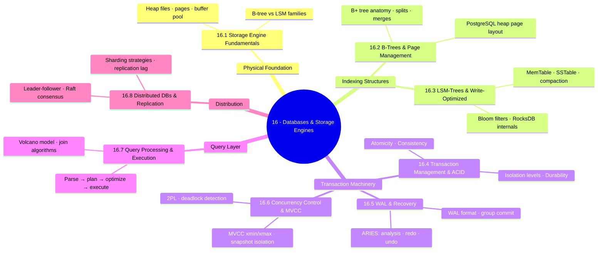
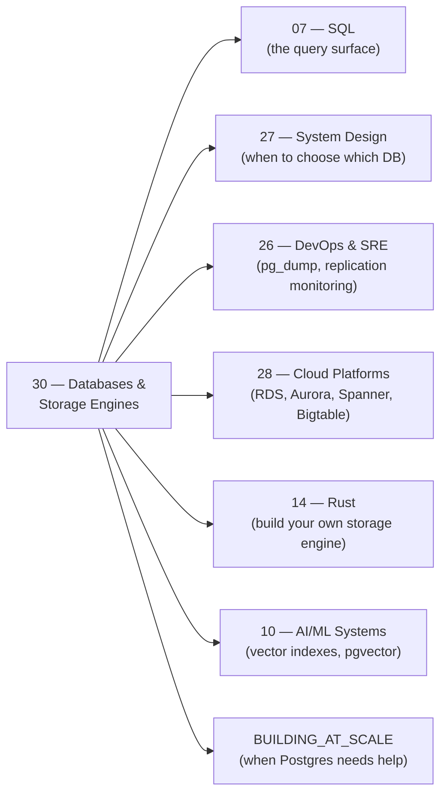

*Back to [00 - 09 - Learning Index](00---09---Learning-Index) | Part of [LEARNING_PATH](LEARNING_PATH)*

# 🗄️ Databases & Storage Engines — Subject Plan

> *"Programs that store data must make two hard promises: the data is there when you ask for it, and it is the data you actually wrote."* — paraphrased from DDIA preface

> *"Postgres is slow" is never the diagnosis. It is always a symptom. This track gives you the vocabulary to find the real cause.*

---

## 🎯 Mission Statement

**Understand what happens below the SQL.** B-trees, LSM trees, WAL, MVCC, Raft — the mechanical room beneath every database you've ever touched. The track that turns `'Postgres is slow'` from a mystery into a diagnosis.

This is the engineering complement to everything you already know about databases. Where [Track 07](Subject_Plan) taught you *what* queries to write, **Track 16 teaches you *why* those queries cost what they cost** — what data structure is on disk, how pages move in and out of memory, how the engine ensures your writes survive a power failure, and how it keeps six concurrent transactions from seeing each other's half-finished work.

Where [Track 27](Subject_Plan) taught you *when* to use which database, **Track 16 teaches you *how* the database actually does its job**. The two tracks are the same coin, different faces.

The chapters follow the only sensible path: storage → indexing → writes → durability → concurrency → queries → distribution:

- *What is stored and how is it laid out on disk?* → 16.1 Storage Engine Fundamentals
- *How does a B+ tree search, insert, and delete in O(log n)?* → 16.2 B-Trees & Page Management
- *Why are Cassandra and RocksDB faster to write than Postgres?* → 16.3 LSM-Trees & Write-Optimized Storage
- *What exactly does "ACID" promise and how is it enforced?* → 16.4 Transaction Management & ACID
- *How does Postgres survive a power cut?* → 16.5 Write-Ahead Logging & Recovery
- *How do two simultaneous transactions not destroy each other?* → 16.6 Concurrency Control & MVCC
- *How does a query become a result?* → 16.7 Query Processing & Execution
- *How do databases scale beyond one machine?* → 16.8 Distributed Databases & Replication

---

## 📊 Track Overview



---

## 📚 Chapter Inventory

| # | Chapter | Domain | Status |
|---|---------|--------|--------|
| 16.1 | Storage Engine Fundamentals | Heap files, pages, buffer pool, B-tree vs LSM families | 🟡 Active |
| 16.2 | B-Trees & Page Management | B+ tree anatomy, splits, merges, PostgreSQL heap page layout | 🟡 Active |
| 16.3 | LSM-Trees & Write-Optimized Storage | MemTable, SSTable, compaction, Bloom filters, RocksDB | 🟡 Active |
| 16.4 | Transaction Management & ACID | ACID guarantees, isolation levels, anomalies | 🟡 Active |
| 16.5 | Write-Ahead Logging & Recovery | WAL format, group commit, ARIES algorithm | 🟡 Active |
| 16.6 | Concurrency Control & MVCC | 2PL, deadlock detection, PostgreSQL MVCC internals | 🟡 Active |
| 16.7 | Query Processing & Execution | Volcano model, join algorithms, EXPLAIN ANALYZE | 🟡 Active |
| 16.8 | Distributed Databases & Replication | Leader-follower, Raft, sharding, replication lag | 🟡 Active |

---

## 🔗 Prerequisites

| Prerequisite | Where you learned it | Why it matters |
|---|---|---|
| SQL querying fundamentals | [Subject_Plan](Subject_Plan) | You need to know what queries look like before you can understand how they're executed |
| Operating systems essentials | [1.10 - Operating Systems Essentials](1.10---Operating-Systems-Essentials) | Disk I/O, virtual memory, page cache, fsync — all come from OS knowledge |
| Computer networks | [1.11 - Computer Networks Essentials](1.11---Computer-Networks-Essentials) | Replication, Raft, distributed transactions involve network primitives |
| Concurrency model | [1.4 - Concurrency - asyncio, threading, multiprocessing & the GIL](1.4---Concurrency---asyncio,-threading,-multiprocessing-&-the-GIL) | 2PL, MVCC, and lock managers are concurrency problems |
| System design context | [Subject_Plan](Subject_Plan) | Knowing *when* to use a database helps you appreciate *why* its internals are the way they are |

---

## 🆓 Open-Source / Free Catalog

> Pictures, videos, and reference materials live **outside the repo** (YouTube, official docs, open-source books). Each chapter and the [README](README) hub link to them by URL. SVG diagrams live in `../_svgs/` with the `dbs__<ch>-fig<n>.svg` prefix.

### 📖 Books (free chapters / fully open)

| Title | Author / Provider | Why |
|---|---|---|
| **Designing Data-Intensive Applications (DDIA)** | Martin Kleppmann (O'Reilly) — Ch. 3, 7, 8, 9 | The canonical modern database internals book. Ch. 3 = storage engines. Ch. 7 = transactions. |
| **Database Internals** | Alex Petrov (O'Reilly) — free preview chapters | The deepest modern book on B-trees, LSM-trees, and distributed databases |
| **Architecture of a Database System** | Hellerstein, Stonebraker, Hamilton (VLDB 2007) | The free academic paper that surveys every layer of a DBMS |
| **Readings in Database Systems ("Red Book")** | Hellerstein & Stonebraker (5th ed) | Curated classic research papers — [redbook.io](http://www.redbook.io/) |
| **CMU Advanced Database Systems 15-721 Notes** | Andy Pavlo | Deep dive into column stores, HTAP, and modern OLAP |
| **PostgreSQL Documentation** | PostgreSQL Global Dev Group | Chapter 68–70: storage internals, WAL, MVCC — [postgresql.org/docs/current](https://www.postgresql.org/docs/current/) |
| **LevelDB Implementation Notes** | Google — Jeff Dean & Sanjay Ghemawat | The original LSM-tree production codebase — [github.com/google/leveldb](https://github.com/google/leveldb) |
| **RocksDB Wiki** | Meta Engineering | Compaction, tuning, write-path internals — [github.com/facebook/rocksdb/wiki](https://github.com/facebook/rocksdb/wiki) |

### 🎓 Courses & Lecture Series

| Resource | Provider | Coverage |
|---|---|---|
| **CMU 15-445 — Database Systems** | Andy Pavlo (free YouTube + slides) | The single best database internals course — covers storage, B-trees, hashing, sorting, query execution, transactions, recovery, concurrency. [15445.courses.cs.cmu.edu](https://15445.courses.cs.cmu.edu/) |
| **CMU 15-721 — Advanced Database Systems** | Andy Pavlo | In-memory OLAP, column stores, vectorized execution, HTAP. [15721.courses.cs.cmu.edu](https://15721.courses.cs.cmu.edu/) |
| **MIT 6.824 — Distributed Systems** | Robert Morris | Raft, Paxos, Spanner, ZooKeeper — [pdos.csail.mit.edu/6.824](https://pdos.csail.mit.edu/6.824/) |
| **Hussein Nasser — Postgres Internals** | YouTube / @hnasr | Worked EXPLAIN ANALYZE walkthroughs, MVCC deep dives |
| **PostgreSQL wiki — Developer FAQ** | PostgreSQL community | Internal implementation notes for contributors |

### 🛠️ Reference Documentation & Primary Sources

| Resource | Link |
|---|---|
| PostgreSQL Documentation (current) | [postgresql.org/docs/current](https://www.postgresql.org/docs/current/) |
| PostgreSQL Storage & Filenode internals | [postgresql.org/docs/current/storage.html](https://www.postgresql.org/docs/current/storage.html) |
| RocksDB wiki | [github.com/facebook/rocksdb/wiki](https://github.com/facebook/rocksdb/wiki) |
| LevelDB source (Go-to for LSM reference) | [github.com/google/leveldb](https://github.com/google/leveldb) |
| ARIES paper (Mohan et al. 1992) | [dl.acm.org/doi/10.1145/128765.128770](https://dl.acm.org/doi/10.1145/128765.128770) |
| Raft paper (Ongaro & Ousterhout 2014) | [raft.github.io/raft.pdf](https://raft.github.io/raft.pdf) |
| The Red Book (Readings in Database Systems) | [redbook.io](http://www.redbook.io/) |
| Architecture of a Database System (free PDF) | [dsf.berkeley.edu/papers/fntdb07-architecture.pdf](http://dsf.berkeley.edu/papers/fntdb07-architecture.pdf) |
| Spanner paper (Corbett et al. 2012) | [dl.acm.org/doi/10.1145/2491245](https://dl.acm.org/doi/10.1145/2491245) |
| Dynamo paper (DeCandia et al. 2007) | [dl.acm.org/doi/10.1145/1294261.1294281](https://dl.acm.org/doi/10.1145/1294261.1294281) |
| Bigtable paper (Chang et al. 2006) | [dl.acm.org/doi/10.1145/1365815.1365816](https://dl.acm.org/doi/10.1145/1365815.1365816) |
| DuckDB (analytical in-process engine) | [duckdb.org/docs/internals](https://duckdb.org/docs/internals/overview.html) |
| SQLite File Format | [sqlite.org/fileformat.html](https://www.sqlite.org/fileformat.html) |

---

## 🏗️ Study Strategy

### Phase 1 — Physical Foundations (Chapters 30.1–16.2) — 2 weeks

The most important insight: **a database is a page manager with a good story**. Everything — indexes, transactions, recovery — is built on fixed-size pages moving between disk and a buffer pool in RAM. Get this model right first, then every subsequent chapter falls into place as "another layer on top of pages".

Read CMU 15-445 Lectures 1–5 (storage, buffer pool) and DDIA Ch. 3 (first half) in parallel with these chapters. Build a mental picture of a B+ tree node as a 4 KB or 8 KB block on disk before moving on.

### Phase 2 — Write Path & Durability (Chapters 30.3–16.5) — 3 weeks

The LSM-tree and WAL chapters answer the single most important question in database engineering: **how do you make writes both fast and durable at the same time?** The answer is "write sequentially, then reconcile" — LSM does it for the index, WAL does it for recovery. They're the same idea expressed differently.

CMU 15-445 Lectures 16–20 (logging, recovery) align with 30.4–30.5. Read the ARIES paper abstract + introduction before diving in — it frames everything.

### Phase 3 — Concurrency & Queries (Chapters 30.6–16.7) — 3 weeks

MVCC is the single biggest idea you don't already know from SQL knowledge. The insight — *readers never block writers and writers never block readers* — is what makes PostgreSQL's concurrent performance possible. Work through a realistic scenario with xmin/xmax pencil-and-paper before reading the chapter.

For query processing, get `EXPLAIN (ANALYZE, BUFFERS)` running on a real Postgres database before reading 30.7. Seeing the actual output makes the Volcano model concrete.

### Phase 4 — Distribution (Chapter 16.8) — 2 weeks

Distribution is where everything from the previous phases gets harder. Every guarantee you took for granted on a single node — ACID, consistent reads, low latency — must now be negotiated across the network. Raft is the cleanest consensus algorithm to understand. Read the Raft paper (it was written to be understandable) before studying 30.8.

**Total ≈ 10 weeks at 8 hrs/week ≈ 80 hours.**

---

## 🔭 2026 Industry Snapshot (web-grounded)

> Sources rephrased and paraphrased for compliance — never more than 30 consecutive words from any single source.

- **PostgreSQL 17 (Oct 2024) and PostgreSQL 18 (expected late 2026)**: The "everything database" keeps expanding. PostgreSQL 17 introduced incremental base backup, improved VACUUM performance, and better streaming replication monitoring. The 2026 roadmap includes native logical replication improvements and continued work on the query JIT compiler. — paraphrased from [postgresql.org/about/news](https://www.postgresql.org/about/news/) and PostgreSQL developer mailing lists.

- **DuckDB is the SQLite of analytics (2024–2026)**: DuckDB reached 1.0 in 2024 and is now the de-facto embedded OLAP engine. It uses columnar storage, vectorized execution, and can query Parquet, CSV, and Arrow files in-process with zero setup. Many data engineering pipelines now use DuckDB as a local transformation layer before pushing to cloud warehouses. — paraphrased from [duckdb.org/docs](https://duckdb.org/docs/) and [motherduck.com/blog](https://motherduck.com/blog/).

- **RocksDB remains the dominant LSM-tree engine (2026)**: RocksDB (Meta/Facebook) underlies TiKV (TiDB), MyRocks (MySQL at Meta), Yugabyte's DocDB, CockroachDB's Pebble (a Go re-implementation), and dozens of other systems. The LSM-tree pattern pioneered by LevelDB has become the standard write-optimized storage primitive. — paraphrased from [github.com/facebook/rocksdb/wiki](https://github.com/facebook/rocksdb/wiki) and [tikv.org](https://tikv.org/).

- **Raft is consensus default (2026)**: Following Kafka 4.0's ZooKeeper removal and KRaft mode adoption, Raft now underlies etcd (Kubernetes), CockroachDB, TiKV, RethinkDB, and most new distributed systems. Paxos remains in Spanner (Multi-Paxos) and Chubby. The "Raft is easier to understand" promise from the 2014 paper turned out to be true in practice. — paraphrased from [raft.github.io](https://raft.github.io/) and [etcd.io/docs](https://etcd.io/docs/).

- **HTAP (Hybrid Transactional/Analytical) convergence**: TiDB (TiKV for TP + TiFlash columnar for AP) and SingleStore have popularised the idea of a single database serving both OLTP and OLAP workloads. PostgreSQL add-ons (Citus, pg_analytics + DuckDB extension) push in the same direction. The separation between row-store OLTP and column-store OLAP is shrinking. — paraphrased from [docs.pingcap.com/tidb/stable/htap-quick-start](https://docs.pingcap.com/tidb/stable/htap-quick-start) and [singlestore.com/blog](https://www.singlestore.com/blog/).

- **NVM / persistent memory (2026)**: Intel Optane has been discontinued but NVMe SSDs with 100–200 µs latency have made the "storage is almost as fast as RAM" scenario real at the high end. Database buffer pools and WAL designs are being re-evaluated for these latency profiles. ByteDance's Terra (2024) and several academic systems explore NVM-native storage engines. — paraphrased from [vldb.org/pvldb/volumes/18](https://vldb.org/pvldb/volumes/18/) and [cidrdb.org/2025](https://cidrdb.org/2025/).

---

## 📁 Directory Structure

```
16 - Databases & Storage Engines/
├── Subject_Plan.md          ← You are here
├── LEARNING_PATH.md         ← Visual roadmap
├── README.md                ← Subject hub + media references
├── 16.1 - Storage Engine Fundamentals.md
├── 16.2 - B-Trees & Page Management.md
├── 16.3 - LSM-Trees & Write-Optimized Storage.md
├── 16.4 - Transaction Management & ACID.md
├── 16.5 - Write-Ahead Logging & Recovery.md
├── 16.6 - Concurrency Control & MVCC.md
├── 16.7 - Query Processing & Execution.md
└── 16.8 - Distributed Databases & Replication.md
```

SVG figures live one level up in `../_svgs/dbs__<chapter>-fig<n>.svg`.

---

## 🔗 How This Track Plugs Into Everything Else



---

*Next: [LEARNING_PATH](LEARNING_PATH) — Visual progression map*

---

## Related Notes
- [16.1 - Storage Engine Fundamentals](16.1---Storage-Engine-Fundamentals) - Shared storage-engines/databases focus
- [16.8 - Distributed Databases & Replication](16.8---Distributed-Databases-&-Replication) - Shared replication/databases focus
- [14.6 - Transactions, ACID & Concurrency](14.6---Transactions,-ACID-&-Concurrency) - Shared acid/mvcc focus
- [16.2 - B-Trees & Page Management](16.2---B-Trees-&-Page-Management) - Shared databases/b-tree focus
