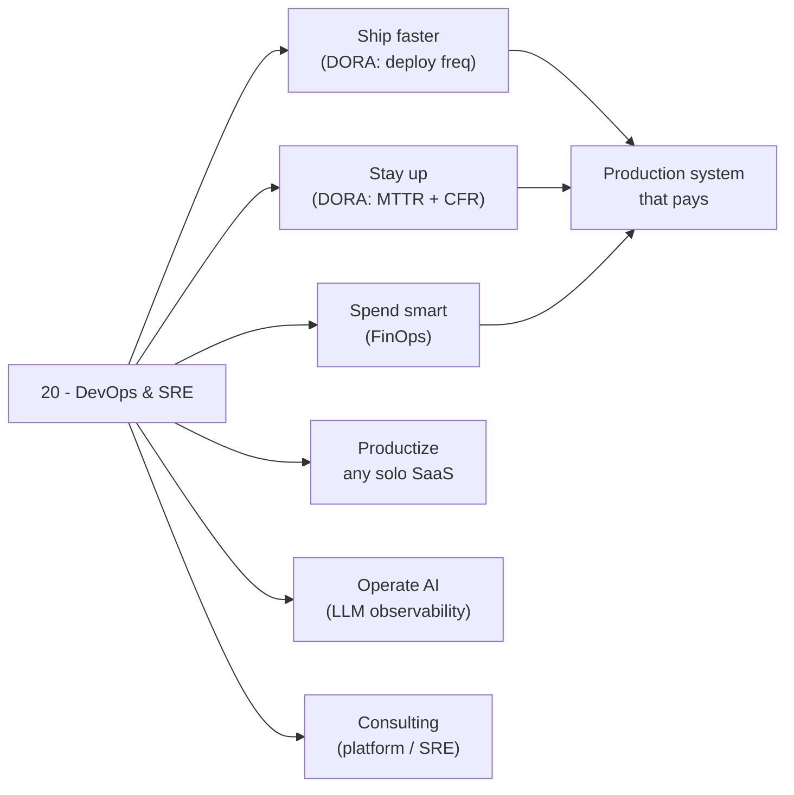

*Back to [Subject_Plan](Subject_Plan) | Part of [00 - 09 - Learning Index](00---09---Learning-Index)*

# 🗺️ DevOps & SRE — Learning Path

> *"You build it, you run it."* — Werner Vogels (paraphrased; the operator-owns-production ethos)

---

## 🧭 Progression Map

```mermaid
graph TD
    %% Prerequisites
    GIT["✅ Git<br/>1.8"]
    DOCK["✅ Docker<br/>1.9"]
    OS["✅ OS Essentials<br/>1.10"]
    NET["✅ Networking<br/>1.11"]
    DIST["✅ Distributed Systems<br/>1.16"]

    %% Pipeline + Provisioning
    C1["20.1 CI/CD<br/>Foundations"]
    C2["20.2 Infrastructure<br/>as Code"]
    C3["20.3 Containers &<br/>Orchestration"]

    %% Operability
    C4["20.4 Observability<br/>Logs · Metrics · Traces"]
    C5["20.5 SLOs · Error Budgets<br/>Incident Response"]

    %% Resilience
    C6["20.6 Chaos<br/>Engineering"]
    C7["20.7 Deployment<br/>Strategies"]

    %% Economics
    C8["20.8 FinOps —<br/>Cost & Capacity"]

    %% Connections
    GIT  --> C1
    DOCK --> C1
    DOCK --> C3
    OS   --> C3
    NET  --> C3
    NET  --> C4
    DIST --> C4
    DIST --> C5

    C1 --> C2
    C2 --> C3
    C3 --> C4
    C4 --> C5
    C5 --> C6
    C5 --> C7
    C6 --> C7
    C7 --> C8

    %% Downstream
    C8 --> CLOUD["21 - Cloud Platforms"]
    C5 --> SEC["18 - Cybersecurity<br/>(supply chain)"]
    C7 --> SD["27 - System Design"]
    C4 --> AI["10 - AI/ML Systems<br/>(GenAI traces)"]

    %% Styling
    style GIT  fill:#2d5016,stroke:#4a8c2a
    style DOCK fill:#2d5016,stroke:#4a8c2a
    style OS   fill:#2d5016,stroke:#4a8c2a
    style NET  fill:#2d5016,stroke:#4a8c2a
    style DIST fill:#2d5016,stroke:#4a8c2a
    style C1 fill:#1a3a5c,stroke:#3d7ab8
    style C2 fill:#1a3a5c,stroke:#3d7ab8
    style C3 fill:#1a3a5c,stroke:#3d7ab8
    style C4 fill:#4a1a3a,stroke:#8c3d6b
    style C5 fill:#4a1a3a,stroke:#8c3d6b
    style C6 fill:#3a3a1a,stroke:#8c8c3d
    style C7 fill:#3a3a1a,stroke:#8c8c3d
    style C8 fill:#5c1a3d,stroke:#b83d7a
    style CLOUD fill:#2a2a2a,stroke:#666
    style SEC   fill:#2a2a2a,stroke:#666
    style SD    fill:#2a2a2a,stroke:#666
    style AI    fill:#2a2a2a,stroke:#666
```

---

## 📅 Suggested Timeline

| Week | Focus | Chapters | Hours/Week |
|------|-------|----------|------------|
| 1 | CI/CD pipelines, monorepo strategies | 20.1 | 6–8 |
| 2 | IaC — Terraform / OpenTofu / Pulumi / Ansible | 20.2 | 6–8 |
| 3 | Containers, Kubernetes, Helm, GitOps | 20.3 | 8–10 |
| 4 | OpenTelemetry, Prometheus, Grafana, Loki, Tempo | 20.4 | 8–10 |
| 5 | SLOs, error budgets, incident response | 20.5 | 8–10 |
| 6 | Chaos engineering, resilience patterns | 20.6 | 6–8 |
| 7 | Deployment strategies, feature flags, Argo Rollouts | 20.7 | 6–8 |
| 8 | FinOps — autoscaling, right-sizing, cost dashboards | 20.8 | 4–6 |

**Total: ~8 weeks at 8 hrs/week ≈ 60 hours**

---

## 🎯 Milestone Checkpoints

### ✅ Checkpoint 1: "I Ship Code Through a Pipeline" (after 26.1–20.2)
- [ ] Can write a GitHub Actions / GitLab CI workflow with caching, matrix builds, and reusable workflows
- [ ] Can structure a monorepo build with Nx, Turborepo, or Bazel
- [ ] Can write a Terraform / OpenTofu module with remote state and a backend
- [ ] Understand what changed when HashiCorp went BSL and what OpenTofu adds (state encryption, provider `for_each`)

### ✅ Checkpoint 2: "I Run Kubernetes Through Git" (after 20.3)
- [ ] Can package a service as a Helm chart or a Kustomize overlay
- [ ] Have a personal cluster (k3s / kind / EKS / GKE) reconciled by Argo CD or Flux from a Git repo
- [ ] Can articulate when to choose Argo CD (UI, multi-cluster from one instance) vs Flux (controllers, native image automation)

### ✅ Checkpoint 3: "I Can See What's Happening" (after 26.4–20.5)
- [ ] Service emits OpenTelemetry traces, metrics, and structured logs
- [ ] Prometheus + Grafana shows golden signals (latency, traffic, errors, saturation)
- [ ] At least one **SLO** is defined with a written error-budget policy
- [ ] A burn-rate alert fires before total budget is consumed
- [ ] Have run one practice postmortem with action items, not blame

### ✅ Checkpoint 4: "I Survive Failure" (after 26.6–20.7)
- [ ] Have run a chaos experiment (Litmus, Gremlin, or AWS FIS) with a hypothesis + blast-radius limit + revert plan
- [ ] Have shipped a canary or blue-green deployment with automated promotion based on metrics
- [ ] Use a feature-flag system (LaunchDarkly, Flagsmith, Unleash) to decouple deploy from release

### ✅ Checkpoint 5: "I Spend Money Like It's Mine" (after 20.8)
- [ ] Cluster has HPA/VPA or KEDA-driven autoscaling
- [ ] Workloads use spot/preemptible where safe
- [ ] Cost-allocation tags are enforced via OPA / policy
- [ ] A cost dashboard (Vantage, OpenCost, Kubecost, CloudHealth) shows per-team / per-service spend

---

## 🔄 How This Connects to Your Mission

---

## 📖 Reading Order with External Course Alignment

| Chapter | Free Course / Reference | Hours |
|---------|------------------------|-------|
| 20.1 | GitHub Actions docs + GitLab CI tutorials + Roadmap.sh DevOps | 6–8 |
| 20.2 | OpenTofu docs + Terraform "Get Started" + Pulumi tutorials | 6–8 |
| 20.3 | Kubernetes docs + Argo CD getting-started + Helm + TechWorld with Nana | 10–12 |
| 20.4 | OpenTelemetry docs + Prometheus tutorial + Grafana Loki + Tempo | 10–12 |
| 20.5 | **Google SRE Book + SRE Workbook** (read in full) | 12–16 |
| 20.6 | LitmusChaos docs + AWS FIS docs + Gremlin learning hub | 6–8 |
| 20.7 | Argo Rollouts docs + Flagger docs + LaunchDarkly free tier | 6–8 |
| 20.8 | FinOps Foundation framework + OpenCost + KEDA docs | 4–6 |

---

## 💡 The "SRE Edge"

Most application engineers can write code. Many can deploy code. Few can keep code up under load with a written error budget, an instrumented trace pipeline, and a postmortem culture that doesn't blame humans.

That last gap is where the highest-leverage operations roles live — and it is where this track lands you.

You will be able to:
- Look at a system and name its SLIs in under a minute.
- Write an error-budget policy in plain English that doesn't sound like a buzzword salad.
- Run a chaos experiment without panicking the team.
- Argue intelligently for or against Argo CD vs Flux, OpenTofu vs Terraform, Kubernetes vs serverless — based on workload shape, not vibes.

That is the SRE edge.

---

*Next: [20.1 - CI-CD Foundations](20.1---CI-CD-Foundations) — Where the assembly line begins.*

---

## Related Notes
- [20.5 - SLOs, SLAs, Error Budgets & Incident Response](20.5---SLOs,-SLAs,-Error-Budgets-&-Incident-Response) - Shared devops/slo focus
- [20.3 - Containers & Orchestration](20.3---Containers-&-Orchestration) - Shared kubernetes/devops focus
- [20.4 - Observability - Logs, Metrics, Traces](20.4---Observability---Logs,-Metrics,-Traces) - Shared observability/devops focus
