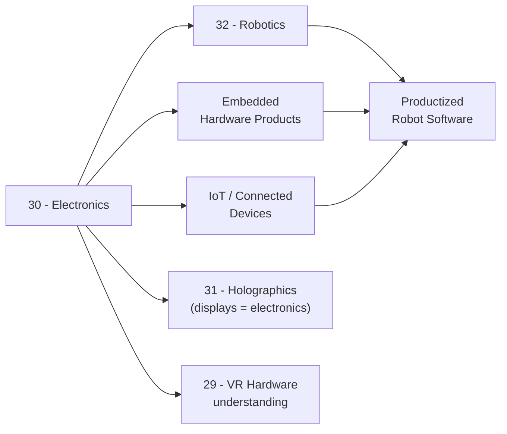

*Back to [Subject_Plan](Subject_Plan) | Part of [00 - 09 - Learning Index](00---09---Learning-Index)*

# 🗺️ Electronics — Learning Path

> *"From electrons → schematics → silicon → systems. Each layer is built directly on top of the one below."*

---

## 🧭 Progression Map

```mermaid
graph TD
    %% Prerequisites
    CALC["✅ Calculus<br/>Track 01"]
    LIN["✅ Linear Algebra<br/>Track 02"]
    ODE["✅ ODEs<br/>Track 03"]
    ED["✅ Electrodynamics<br/>Math/Phys 07"]

    %% Foundations
    C1["30.1 Electrical<br/>Fundamentals"]
    C2["30.2 Passive<br/>Components"]

    %% Active
    C3["30.3 Semiconductors<br/>Diodes/BJT/MOSFET/Op-Amp"]
    C4["30.4 Digital Logic<br/>& FSMs"]

    %% Embedded + arch
    C5["30.5 Microcontrollers<br/>Arduino/ESP32/RP2040/STM32"]
    C6["30.6 Motherboards &<br/>Computer Architecture"]

    %% Power + bus
    C7["30.7 Power Electronics<br/>& Motor Drivers"]
    C8["30.8 Bridge to Robotics<br/>Buses, Sensors, Actuators"]

    %% Connections
    CALC --> C1
    LIN --> C1
    ODE --> C2
    ED --> C2
    C1 --> C2
    C2 --> C3
    C3 --> C4
    C4 --> C5
    C4 --> C6
    C5 --> C8
    C3 --> C7
    C7 --> C8
    C6 --> C8

    %% Downstream
    C8 --> ROBO["32 - Robotics"]
    C5 --> ROBO

    %% Styling
    style CALC fill:#2d5016,stroke:#4a8c2a
    style LIN fill:#2d5016,stroke:#4a8c2a
    style ODE fill:#2d5016,stroke:#4a8c2a
    style ED fill:#2d5016,stroke:#4a8c2a
    style C1 fill:#1a3a5c,stroke:#3d7ab8
    style C2 fill:#1a3a5c,stroke:#3d7ab8
    style C3 fill:#4a1a3a,stroke:#8c3d6b
    style C4 fill:#4a1a3a,stroke:#8c3d6b
    style C5 fill:#3a3a1a,stroke:#8c8c3d
    style C6 fill:#3a3a1a,stroke:#8c8c3d
    style C7 fill:#1a4a4a,stroke:#3d8c8c
    style C8 fill:#5c1a3d,stroke:#b83d7a
    style ROBO fill:#2a2a2a,stroke:#666
```

---

## 📅 Suggested Timeline

| Week | Focus | Chapters | Hours/Week |
|------|-------|----------|------------|
| 1 | Charge → Ohm → Kirchhoff | 30.1 | 6–8 |
| 2 | Passive components + RLC transients | 30.2 | 6–8 |
| 3 | Diodes, BJT/FET as switch | 30.3 (part 1) | 6–8 |
| 4 | Op-amps + amplifier circuits | 30.3 (part 2) | 6–8 |
| 5 | Boolean algebra + combinational logic | 30.4 (part 1) | 6–8 |
| 6 | Sequential logic + FSMs | 30.4 (part 2) | 6–8 |
| 7 | Arduino + ESP32 + MicroPython | 30.5 | 8–10 |
| 8 | RP2040 / STM32 / RTOS | 30.5 (cont) | 6–8 |
| 9 | Motherboard architecture | 30.6 | 6–8 |
| 10 | PWM, H-bridges, BLDC, regulators | 30.7 | 6–8 |
| 11–12 | I²C / SPI / UART / CAN + integration project | 30.8 | 8–10 |

**Total: ~12 weeks at 7 hrs/week ≈ 84 hours**

---

## 🎯 Milestone Checkpoints

### ✅ Checkpoint 1: "I Can Read a Schematic" (after 21.1–30.2)
- [ ] Recite Ohm's law and both Kirchhoff laws from memory
- [ ] Solve a 3-loop mesh circuit on paper
- [ ] Sketch the step response of an RC circuit and label τ
- [ ] Recognize and orient resistors, capacitors, inductors, diodes, transistors on a schematic

### ✅ Checkpoint 2: "I Can Design a Small Analog Circuit" (after 30.3)
- [ ] Pick a base resistor for a BJT switch driving an LED
- [ ] Design a non-inverting op-amp gain stage with $\mathrm{Gain} = 1 + R_f/R_g$
- [ ] Build a comparator + Schmitt trigger and explain hysteresis
- [ ] Simulate it in LTspice / ngspice and verify against breadboard

### ✅ Checkpoint 3: "I Speak Digital" (after 30.4)
- [ ] Convert any logic expression to AND/OR/NOT and to NAND-only / NOR-only
- [ ] Reduce a 4-input truth table with a Karnaugh map
- [ ] Design a Moore FSM for a vending machine on paper
- [ ] Implement that FSM on an FPGA simulator (Wokwi / open-source) or microcontroller

### ✅ Checkpoint 4: "I Can Embed" (after 21.5–30.6)
- [ ] Blink an LED on Arduino, then ESP32, then RP2040 using each tool's native build system
- [ ] Read a sensor over I²C and write to a 16×2 LCD over SPI
- [ ] Explain RAM ↔ CPU ↔ chipset ↔ PCIe ↔ NVMe ↔ GPU at a block-diagram level
- [ ] Tell the difference between BIOS and UEFI and explain Secure Boot

### ✅ Checkpoint 5: "I Can Drive a Robot" (after 21.7–30.8)
- [ ] Drive a DC motor forward + reverse with an H-bridge from a microcontroller
- [ ] Drive a BLDC with a 3-phase ESC + PWM
- [ ] Read an IMU (MPU-6050 / BNO055) over I²C
- [ ] Read an encoder via interrupts; measure RPM
- [ ] Connect a microcontroller to a Raspberry Pi / Jetson over UART or CAN — feeds [Robotics](Subject_Plan)

---

## 🔄 How This Connects to Your Mission

Without electronics literacy, you treat hardware as a black box. **With** it, every device is debuggable, every sensor is hackable, and you can move freely between software and silicon — the rare engineer profile that builds the most defensible products.

---

## 📖 Reading Order with External Course Alignment

| Chapter | Free Course / Reference | Hours |
|---------|------------------------|-------|
| 30.1 | MIT 6.002 Lectures 1–4; All About Circuits Vol. 1 Ch. 1–3 | 6–8 |
| 30.2 | MIT 6.002 Lectures 5–7; AAC Vol. 1 Ch. 13–15 | 6–8 |
| 30.3 | MIT 6.002 Lectures 8–18; AAC Vol. 3 (Semiconductors) | 14–18 |
| 30.4 | MIT 6.004 Lectures 1–8; Ben Eater 8-bit CPU series | 12–16 |
| 30.5 | Coursera "Foundations of Embedded Software Design"; Arm University Embedded-Systems-Fundamentals | 14–18 |
| 30.6 | MIT 6.004 Lectures 9–25; Patterson & Hennessy Ch. 4–5 | 10–14 |
| 30.7 | EEVblog motor-drive episodes; Texas Instruments motor app notes (free) | 6–8 |
| 30.8 | SparkFun + Adafruit tutorials on I²C/SPI/UART/CAN; Arm Embedded labs | 8–12 |

---

## 💡 The "Hardware-Aware Software Engineer" Edge

Most software engineers fear the hardware boundary. Most hardware engineers fear the software boundary. The engineer who can move freely across both — debugging a misbehaving robot by checking a scope on a SPI line, then patching the host firmware, then updating the cloud telemetry pipeline — is rare and disproportionately well paid. **This track is the cheapest way to become that engineer.**

---

*Next: [30.1 - Electrical Fundamentals - Charge, Current, Voltage, Ohm & Kirchhoff](30.1---Electrical-Fundamentals---Charge,-Current,-Voltage,-Ohm-&-Kirchhoff) — Where the universe starts to obey your schematic.*

---

## Related Notes
- [Subject_Plan](Subject_Plan) - Shared microcontrollers/semiconductors focus
- [30.3 - Semiconductors - Diodes, BJTs, MOSFETs, Op-Amps](30.3---Semiconductors---Diodes,-BJTs,-MOSFETs,-Op-Amps) - Shared semiconductors/electronics focus
- [30.5 - Microcontrollers & Embedded Systems - Arduino, ESP32, RP2040, STM32](30.5---Microcontrollers-&-Embedded-Systems---Arduino,-ESP32,-RP2040,-STM32) - Shared microcontrollers/electronics focus
- [30.8 - From Electronics to Robotics - I2C, SPI, UART, CAN, Sensors & Actuators](30.8---From-Electronics-to-Robotics---I2C,-SPI,-UART,-CAN,-Sensors-&-Actuators) - Shared robotics-bridge/electronics focus
