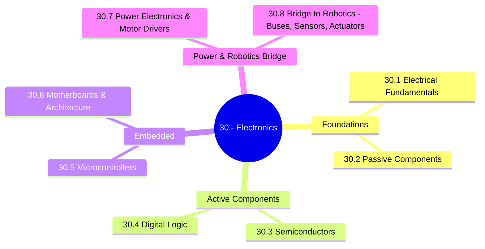

*Back to [00 - 09 - Learning Index](00---09---Learning-Index) | Part of [LEARNING_PATH](LEARNING_PATH)*

# ⚡ Electronics — Subject Plan

> *"If you can read a schematic, the rest of engineering opens up. Sensors, motors, computers, robots, drones, holograms — all of it is just electrons moved on purpose."*

> *"The day you understand a transistor as a current-controlled valve is the day you stop being intimidated by every electronic device on Earth."*

---

## 🎯 Mission Statement

This track exists for **two** reasons:

1. **Hardware literacy as a force multiplier.** You're a software-and-3D person aiming at AI/robotics/spatial computing. Every one of those domains *runs on hardware*. Understanding what's actually happening on the silicon makes you a better systems designer — and it stops you from being fooled by abstraction leaks (latency, power, EMI, timing).
2. **The on-ramp to [32 - Robotics](Subject_Plan).** A robot is electronics + actuators + sensors + control loops. You cannot debug a misbehaving robot if you can't reason about a wire, a battery, or a motor driver. This track gives you exactly that ability.

The curriculum follows the **classical EE ladder**: physical electrons → discrete components → semiconductors → digital logic → embedded systems → computer architecture (motherboards) → power electronics → bus protocols. By the end, you can read a schematic, design a small PCB, program a microcontroller, drive a motor, and connect it all to a Raspberry Pi or Jetson over I²C / SPI / CAN — the exact prerequisite stack for the Robotics track that follows.

---

## 📊 Track Overview



---

## 📚 Chapter Inventory

| # | Chapter | Domain | Status |
|---|---------|--------|--------|
| 30.1 | Electrical Fundamentals — Charge, Current, Voltage, Ohm & Kirchhoff | DC analysis | 🟡 Skeleton |
| 30.2 | Passive Components — Resistors, Capacitors, Inductors, Transformers | RLC circuits | 🟡 Skeleton |
| 30.3 | Semiconductors — Diodes, BJTs, MOSFETs, Op-Amps | Active analog | 🟡 Skeleton |
| 30.4 | Digital Logic & Boolean Algebra — Gates, Flip-Flops, FSMs | Digital systems | 🟡 Skeleton |
| 30.5 | Microcontrollers & Embedded Systems — Arduino / ESP32 / RP2040 / STM32 | Embedded firmware | 🟡 Skeleton |
| 30.6 | Motherboards & Computer Architecture — CPU, RAM, Chipset, PCIe, UEFI | Systems hardware | 🟡 Skeleton |
| 30.7 | Power Electronics & Motor Drivers — PWM, H-Bridges, BLDC, Regulators | Power | 🟡 Skeleton |
| 30.8 | From Electronics to Robotics — I²C, SPI, UART, CAN, Sensors & Actuators | Bus + integration | 🟡 Skeleton |

---

## 🔗 Prerequisites

| Prerequisite | Where You Learned It | Why It Matters |
|---|---|---|
| Calculus (derivatives, integrals) | [Subject_Plan](Subject_Plan) | $i = C\frac{dv}{dt}$, $v = L\frac{di}{dt}$, integrals everywhere |
| Linear algebra | [Subject_Plan](Subject_Plan) | Mesh + nodal analysis, state-space systems |
| ODEs | [Subject_Plan](Subject_Plan) | RC, RL, RLC transient response |
| Electrodynamics | [Subject_Plan](Subject_Plan) | Maxwell underneath all of this |
| Python basics | [Subject_Plan](Subject_Plan) | MicroPython on RP2040/ESP32, host-side tooling |

---

## 🆓 Premium-Free Resource Catalog

> Pictures, videos, and reference materials live **outside the repo** — see [README](README) for the canonical link list. SVG diagrams that we author live inside `../_svgs/` with the `elec__<ch>-fig<n>.svg` prefix.

### 🎓 Primary Lecture & Course Series

| Resource | Provider | Coverage | Link |
|---|---|---|---|
| **MIT 6.002 — Circuits and Electronics** | MIT OCW | Foundational EE — DC, AC, op-amps | [ocw.mit.edu/6-002](https://ocw.mit.edu/courses/6-002-circuits-and-electronics-spring-2007/) |
| **MIT 6.004 — Computation Structures** | MIT OCW | Digital logic → CPU architecture | [ocw.mit.edu/6-004](https://ocw.mit.edu/courses/6-004-computation-structures-spring-2017/) |
| **Altium Education (free PCB curriculum)** | Altium | Free K-12 / college PCB design curriculum | [education.altium.com](https://education.altium.com/) |
| **Coursera — Foundations of Embedded Software Design** | University of Colorado | Free-to-audit; practical microcontroller embedded software fundamentals | [coursera.org](https://www.coursera.org/learn/foundations-of-embedded-software-design) |
| **Coursera — Introduction to Chip Design with Open-Source EDA Tools** | NIELIT / Coursera | Free-to-audit; open-source EDA flow (OpenROAD, OpenLane) | [coursera.org](https://www.coursera.org/learn/introduction-to-chip-design-with-open-source-eda-tools) |
| **arm-education / Embedded-Systems-Fundamentals** | Arm University | Open educational textbook + labs on Cortex-M | [github.com/arm-university/Embedded-Systems-Fundamentals](https://github.com/arm-university/Embedded-Systems-Fundamentals) |
| **Class Central — 7 Best Electronics Courses for 2026** | Class Central (curated) | Curated list of best free / cheap electronics courses | [classcentral.com](https://www.classcentral.com/report/best-electronics-courses/) |
| **EEVblog (Dave Jones)** | YouTube | 1500+ episodes on practical electronics, instrumentation, teardown | [@EEVblog](https://www.youtube.com/@EEVblog) |
| **Ben Eater — "Build a 6502 / 8-bit CPU on breadboards"** | YouTube | Best digital-logic and computer-architecture series on Earth | [@BenEater](https://www.youtube.com/@BenEater) |
| **GreatScott!** | YouTube | Practical projects bridging hobby → engineering | [@greatscottlab](https://www.youtube.com/@greatscottlab) |

### 📖 Open-Source / Free Books

| Resource | Author / Provider | Coverage |
|---|---|---|
| **The Art of Electronics (Horowitz & Hill, 3rd ed.)** | Cambridge | THE practical EE bible (paid book; sample chapters on publisher site) |
| **Practical Electronics for Inventors (Scherz & Monk)** | McGraw-Hill | Practical reference (paid; library access often free) |
| **Lessons in Electric Circuits (Tony Kuphaldt)** | All About Circuits / public domain | Free, comprehensive — [allaboutcircuits.com/textbook](https://www.allaboutcircuits.com/textbook/) |
| **Open Circuits (Eric Schlaepfer & Windell Oskay)** | No Starch Press | Beautiful component cross-section photography (paid; preview free) |
| **Foundations of Analog and Digital Electronic Circuits (Agarwal & Lang)** | MIT OCW companion | Free PDF accompanying MIT 6.002 |
| **Computer Organization and Design (Patterson & Hennessy)** | Elsevier | The CPU/architecture textbook (paid; many universities post slides) |
| **Embedded-Systems-Fundamentals (Arm University)** | Arm | Open educational on GitHub |
| **KiCad Documentation** | KiCad project | Free, official, comprehensive — [docs.kicad.org](https://docs.kicad.org/) |

### 🛠️ Free / Indie Tooling Worth Knowing

- **KiCad 8** — open-source schematic + PCB design (the modern Altium alternative).
- **LTspice / ngspice** — circuit simulation.
- **Wokwi** — browser-based microcontroller simulator (Arduino, ESP32, RP2040).
- **Tinkercad Circuits** — beginner-friendly browser sim.
- **PlatformIO** — VSCode-based unified embedded build system (Arduino / ESP-IDF / STM32 / NXP).
- **Renode** — open-source full-system emulation for embedded testing.
- **OpenROAD / OpenLane** — open-source RTL → silicon EDA flow.

---

## 🏗️ Study Strategy

### Phase 1: Foundations (Chapters 21.1–30.2) — 2 weeks
DC analysis, Ohm + Kirchhoff, RC/RL transients. **Build it on a breadboard while you read the math** — a 2-resistor voltage divider is enough.

### Phase 2: Active Components (Chapters 21.3–30.4) — 3 weeks
Diodes, BJTs/MOSFETs as switches and amplifiers, op-amps, then digital gates / flip-flops / FSMs. **Build a simple op-amp comparator and a 4-bit ripple counter on breadboard** (or in Wokwi).

### Phase 3: Embedded + Architecture (Chapters 21.5–30.6) — 3 weeks
Microcontrollers (Arduino → ESP32 → RP2040 → STM32 progression). Then zoom out to motherboards: CPU, RAM, chipset, PCIe, UEFI. **Build a microcontroller project that reads a sensor and lights an LED based on a threshold.**

### Phase 4: Power + Robotics Bridge (Chapters 21.7–30.8) — 2 weeks
PWM, H-bridges, motor drivers, regulators, then the bus protocols (I²C/SPI/UART/CAN) that connect everything. **Drive a small DC motor and read an I²C sensor.** This puts you on the doorstep of [32 - Robotics](Subject_Plan).

---

## 📁 Directory Structure

```
30 - Electronics/
├── Subject_Plan.md          ← You are here
├── LEARNING_PATH.md         ← Visual roadmap
├── README.md                ← Subject hub + media references
├── 30.1 - Electrical Fundamentals - Charge, Current, Voltage, Ohm & Kirchhoff.md
├── 30.2 - Passive Components - Resistors, Capacitors, Inductors, Transformers.md
├── 30.3 - Semiconductors - Diodes, BJTs, MOSFETs, Op-Amps.md
├── 30.4 - Digital Logic & Boolean Algebra - Gates, Flip-Flops, FSMs.md
├── 30.5 - Microcontrollers & Embedded Systems - Arduino, ESP32, RP2040, STM32.md
├── 30.6 - Motherboards & Computer Architecture - CPU, RAM, Chipset, PCIe, UEFI.md
├── 30.7 - Power Electronics & Motor Drivers - PWM, H-Bridges, BLDC, Regulators.md
├── 30.8 - From Electronics to Robotics - I2C, SPI, UART, CAN, Sensors & Actuators.md
└── _practice/
    └── scripts/             ← Future drills (LTspice runners, MicroPython examples)
```

SVG figures live one level up in `../_svgs/elec__<chapter>-fig<n>.svg`.

---

*Next: [LEARNING_PATH](LEARNING_PATH) — Visual progression map*

---

## Related Notes
- [LEARNING_PATH](LEARNING_PATH) - Shared microcontrollers/semiconductors focus
- [30.3 - Semiconductors - Diodes, BJTs, MOSFETs, Op-Amps](30.3---Semiconductors---Diodes,-BJTs,-MOSFETs,-Op-Amps) - Shared semiconductors/electronics focus
- [30.5 - Microcontrollers & Embedded Systems - Arduino, ESP32, RP2040, STM32](30.5---Microcontrollers-&-Embedded-Systems---Arduino,-ESP32,-RP2040,-STM32) - Shared microcontrollers/electronics focus
- [30.6 - Motherboards & Computer Architecture - CPU, RAM, Chipset, PCIe, UEFI](30.6---Motherboards-&-Computer-Architecture---CPU,-RAM,-Chipset,-PCIe,-UEFI) - Shared motherboards/electronics focus
- [30.1 - Electrical Fundamentals - Charge, Current, Voltage, Ohm & Kirchhoff](30.1---Electrical-Fundamentals---Charge,-Current,-Voltage,-Ohm-&-Kirchhoff) - Same Electronics folder
