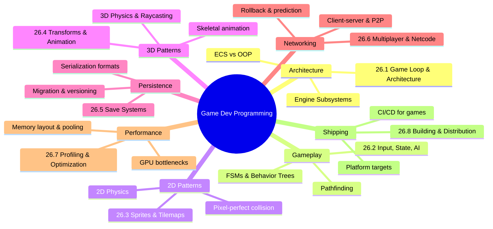

*Back to [09 - Learning Index](09---Learning-Index)*

# 🎮 Track 26 — Game Development Programming

> *"The cost of adding a feature isn't just the time it takes to code it. The cost also includes the addition of an obstacle to future expansion."* — John Carmack

---

## 🧭 Subject Overview

This track covers the **systems engineering** side of game development — the architecture, patterns, and implementation techniques that turn a game design document into a shipping product. It assumes you already understand programming fundamentals (Track 01 Python, Track 02 C++, Track 03 C#) and have exposure to 3D math (Track 09 VR & 3D Engineering). Here we focus on how engines work internally, how to structure gameplay code for maintainability, and how to solve the hard problems: networking, serialization, performance.

**Target projects:** Stardew Valley-style farming sim, VR experiences, multiplayer games.

---

## 🗺️ Chapter Map



---

## 📚 Premium-Free Learning Catalog

### 📖 Books (Free or Widely Available)
| Title | Author | Focus |
|-------|--------|-------|
| *Game Programming Patterns* | Robert Nystrom | Architecture, patterns (free online) |
| *The Art of Game Design* | Jesse Schell | Design thinking (complements this track) |
| *Real-Time Collision Detection* | Christer Ericson | Physics & spatial queries |
| *Multiplayer Game Programming* | Josh Glazer & Sanjay Madhav | Networking deep-dive |
| *Game Engine Architecture* | Jason Gregory | Engine internals (Naughty Dog) |
| *Data-Oriented Design* | Richard Fabian | ECS philosophy (free online) |
| *Game AI Pro* series | Steve Rabin (ed.) | AI techniques (chapters free online) |

### 🎥 YouTube Channels & Series
| Channel | Best For |
|---------|----------|
| **Brackeys** | Unity fundamentals, beginner-to-intermediate |
| **Sebastian Lague** | Procedural generation, pathfinding, coding adventures |
| **Game Maker's Toolkit** | Design analysis (pairs with Track 06) |
| **Code Monkey** | Unity C# patterns, multiplayer |
| **GDC Talks** | Industry postmortems, technical deep-dives |
| **The Cherno** | C++ game engine from scratch |
| **Molly Rocket (Casey Muratori)** | Handmade Hero, performance-first thinking |
| **Mix and Jam** | Recreating game mechanics |
| **Godot Tutorials (GDQuest)** | Godot-specific patterns |
| **ThinMatrix** | OpenGL/Vulkan game engine dev |

### 🎓 Courses & Lecture Series
- **CS50's Introduction to Game Development** (Harvard/edX) — free
- **Unity Learn** (unity.com/learn) — official tutorials
- **Unreal Online Learning** (dev.epicgames.com) — official UE5 courses
- **Handmade Hero** (handmadehero.org) — building a game from scratch in C

---

## 🔗 Integration Points

| This Chapter | Connects To |
|-------------|-------------|
| 26.1 Game Loop | [28.5 - Game Engine Architectures - Unity & Unreal](28.5---Game-Engine-Architectures---Unity-&-Unreal) |
| 26.2 AI & Pathfinding | [08.13 - Algorithms & Data Structures in Python](08.13---Algorithms-&-Data-Structures-in-Python) |
| 26.3 2D Physics | [26.4 - Classical Mechanics & Dynamical Systems](26.4---Classical-Mechanics-&-Dynamical-Systems) (math) |
| 26.4 3D Transforms | [28.1 - 3D Math Fundamentals](28.1---3D-Math-Fundamentals), [28.2 - Quaternions & Rotations](28.2---Quaternions-&-Rotations) |
| 26.5 Serialization | [08.3 - OOP, Data Models & Pythonic Idioms](08.3---OOP,-Data-Models-&-Pythonic-Idioms) |
| 26.6 Networking | [08.11 - Computer Networks Essentials](08.11---Computer-Networks-Essentials) |
| 26.7 Performance | [08.12 - Computer Architecture - Performance Intuition](08.12---Computer-Architecture---Performance-Intuition) |
| 26.8 Distribution | [08.9 - Docker & Containers](08.9---Docker-&-Containers) |

---

## 🖼️ Visualization Directive

All SVGs for this subject use the prefix `gamedev__` and are stored in the centralized `09 - Learning/_svgs/` folder. Reference pattern:

```

```

---

## 🧪 Practice Integration

Practice scripts live in `26 - Game Dev/_practice/scripts/`. Each generates randomized game-dev challenges (state machine design, physics calculations, network packet ordering) with SymPy/NumPy verification where applicable. Compatible with the Practice GUI app.

---

## 📅 Maintenance Log

| Date | Action |
|------|--------|
| 2026-05-24 | Initial creation — 8 chapters planned |

---

## Related Notes
- [26.1 - Game Loop & Architecture](26.1---Game-Loop-&-Architecture) - Shared game-loop/game-dev focus
- [26.6 - Multiplayer & Networking](26.6---Multiplayer-&-Networking) - Shared networking/game-dev focus
- [26.2 - Gameplay Programming - Input, State, AI](26.2---Gameplay-Programming---Input,-State,-AI) - Same Game Dev folder
- [26.3 - 2D Game Patterns - Sprites, Tilemaps, Physics](26.3---2D-Game-Patterns---Sprites,-Tilemaps,-Physics) - Same Game Dev folder
