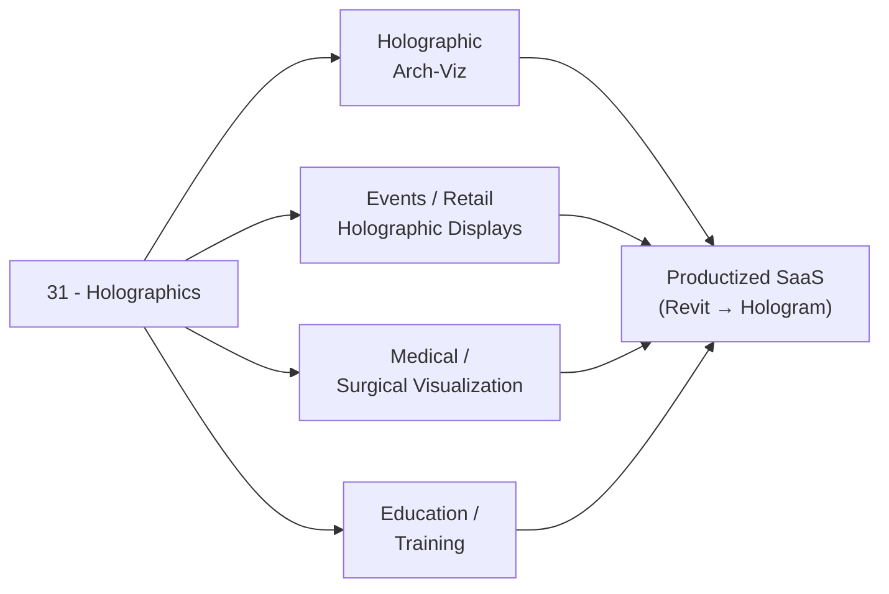

*Back to [Subject_Plan](Subject_Plan) | Part of [00 - 09 - Learning Index](00---09---Learning-Index)*

# 🗺️ Holographics — Learning Path

> *"Wave optics → recording → synthesis → modulation → display → application → product."*

---

## 🧭 Progression Map

```mermaid
graph TD
    %% Prereqs
    CALC["✅ Calculus + Fourier"]
    EM["✅ Electrodynamics<br/>Math/Phys 07"]
    QM["✅ Quantum Mechanics<br/>Math/Phys 09"]
    LA["✅ Linear Algebra"]
    PY["✅ Python + NumPy + PyTorch"]
    R3D["✅ 3D Math + Rendering<br/>Track 09"]

    C1["31.1 Optics Foundations<br/>Interference, Diffraction,<br/>Coherence, Fourier Optics"]
    C2["31.2 Classical Holography<br/>Gabor, Denisyuk, Trans/Refl"]
    C3["31.3 Computer-Generated<br/>Holography (CGH + Neural)"]
    C4["31.4 SLMs &<br/>Holographic Displays"]
    C5["31.5 Light-Field & Volumetric<br/>Capture (Looking Glass, NeRF, 3DGS)"]
    C6["31.6 Holographic AR<br/>HoloLens · Magic Leap · waveguides"]
    C7["31.7 Architecture &<br/>Engineering Visualization"]
    C8["31.8 Systems Stack<br/>Photons → Pixels → Product"]

    CALC --> C1
    EM --> C1
    QM --> C1
    LA --> C1
    C1 --> C2
    C1 --> C3
    PY --> C3
    C2 --> C3
    C3 --> C4
    C4 --> C6
    C3 --> C5
    R3D --> C5
    C5 --> C7
    C6 --> C7
    C7 --> C8
    C4 --> C8
    C5 --> C8

    style CALC fill:#2d5016,stroke:#4a8c2a
    style EM fill:#2d5016,stroke:#4a8c2a
    style QM fill:#2d5016,stroke:#4a8c2a
    style LA fill:#2d5016,stroke:#4a8c2a
    style PY fill:#2d5016,stroke:#4a8c2a
    style R3D fill:#2d5016,stroke:#4a8c2a
    style C1 fill:#1a3a5c,stroke:#3d7ab8
    style C2 fill:#1a3a5c,stroke:#3d7ab8
    style C3 fill:#4a1a3a,stroke:#8c3d6b
    style C4 fill:#4a1a3a,stroke:#8c3d6b
    style C5 fill:#3a3a1a,stroke:#8c8c3d
    style C6 fill:#3a3a1a,stroke:#8c8c3d
    style C7 fill:#1a4a4a,stroke:#3d8c8c
    style C8 fill:#5c1a3d,stroke:#b83d7a
```

---

## 📅 Suggested Timeline

| Week | Focus | Chapters | Hours/Week |
|------|-------|----------|------------|
| 1 | Wave optics + diffraction | 31.1 (part 1) | 6–8 |
| 2 | Fourier optics + coherence | 31.1 (part 2) | 6–8 |
| 3 | Classical holography | 31.2 | 6–8 |
| 4 | CGH algorithms | 31.3 (part 1) | 8–10 |
| 5 | Neural CGH (Tensor Holography) | 31.3 (part 2) | 8–10 |
| 6 | SLMs + holographic displays | 31.4 | 6–8 |
| 7 | Light-field displays + Looking Glass | 31.5 (part 1) | 6–8 |
| 8 | NeRF + 3DGS volumetric capture | 31.5 (part 2) | 8–10 |
| 9 | Holographic AR + waveguides + marketing-vs-physics | 31.6 | 6–8 |
| 10 | Architecture + engineering applications | 31.7 | 6–8 |
| 11–12 | Systems stack capstone | 31.8 | 8–10 |

**Total: ~12 weeks at 8 hrs/week ≈ 96 hours**

---

## 🎯 Milestone Checkpoints

### ✅ Checkpoint 1: "I Speak Wave Optics" (after 23.1–31.2)
- [ ] Derive Fraunhofer diffraction as a Fourier transform
- [ ] Compute the resolution limit of a lens
- [ ] Explain coherence (temporal + spatial) and why holography needs lasers
- [ ] Sketch the Leith-Upatnieks recording geometry
- [ ] Distinguish transmission vs reflection (Denisyuk) holograms

### ✅ Checkpoint 2: "I Compute Holograms" (after 23.3–31.4)
- [ ] Implement angular-spectrum + Fresnel propagation in Python
- [ ] Generate a CGH from a 3D scene by summing point-source contributions
- [ ] Implement Gerchberg-Saxton phase retrieval
- [ ] Read the MIT Tensor Holography paper and reproduce a simple variant
- [ ] Drive a simulated SLM (or real one if available)

### ✅ Checkpoint 3: "I Build a 3D Display" (after 23.5–31.6)
- [ ] Render multi-view content for a Looking Glass display
- [ ] Capture a NeRF / 3DGS of a real object and view it volumetrically
- [ ] Articulate what is + is not "holographic" about HoloLens 2 / Magic Leap 2
- [ ] Compute the vergence-accommodation conflict (VAC) implications of a fixed-focus AR display

### ✅ Checkpoint 4: "I Productize" (after 23.7–31.8)
- [ ] Convert a Revit model → light-field display content (a real arch-viz pipeline)
- [ ] Spec a portable holographic-presentation rig for a client meeting
- [ ] Outline the photons-to-pixels-to-product chain end to end
- [ ] Identify at least one product opportunity in arch-viz / engineering / medical / retail / events

---

## 🔄 How This Connects to Your Mission

For someone with your background (architecture + Revit + 3D), the **arch-viz holographic** path is the most direct revenue route.

---

## 📖 Reading Order with External Course Alignment

| Chapter | Free Course / Reference | Hours |
|---------|------------------------|-------|
| 31.1 | MIT MAS.450 Lectures 1–4; Hecht Ch. 9–10 | 8–10 |
| 31.2 | MIT MAS.450 Lectures 5–10; Hariharan "Optical Holography" | 6–8 |
| 31.3 | Stanford EE 367; MIT Tensor Holography paper + repo | 12–14 |
| 31.4 | HOLOEYE SLM SDK docs; manufacturer datasheets | 6–8 |
| 31.5 | Stanford computational imaging lectures; Looking Glass docs; Nerfstudio docs | 10–12 |
| 31.6 | HoloLens 2 + Magic Leap 2 + Microsoft Mixed Reality docs; vrarwiki "Waveguide" article | 6–8 |
| 31.7 | Speckle docs; arch-viz holographic case studies | 6–8 |
| 31.8 | Industry coverage (phys.org, arXiv, AECMag) | 6–8 |

---

## 💡 The "Architect-Plus-Photons" Edge

Most arch-viz studios sell flat renders + maybe a VR walkthrough. Almost none sell holographic deliverables. As displays like Looking Glass become commodity ($499–$2750), the integration bottleneck is **content pipelines** — exactly the gap a Revit-fluent architect can fill.

---

*Next: [31.1 - Optics Foundations - Interference, Diffraction, Coherence, Fourier Optics](31.1---Optics-Foundations---Interference,-Diffraction,-Coherence,-Fourier-Optics) — Where light becomes a wave you can program.*

---

## Related Notes
- [Subject_Plan](Subject_Plan) - Shared holographics/light-field focus
- [31.3 - Computer-Generated Holography - Algorithms, FFT, Neural CGH](31.3---Computer-Generated-Holography---Algorithms,-FFT,-Neural-CGH) - Shared holographics/cgh focus
- [31.5 - Light-Field Displays & Volumetric Capture - Looking Glass, NeRF, 3D Gaussian Splatting](31.5---Light-Field-Displays-&-Volumetric-Capture---Looking-Glass,-NeRF,-3D-Gaussian-Splatting) - Shared holographics/light-field focus
- [31.6 - Holographic AR - HoloLens, Magic Leap, Waveguides & the Marketing-vs-Physics Gap](31.6---Holographic-AR---HoloLens,-Magic-Leap,-Waveguides-&-the-Marketing-vs-Physics-Gap) - Shared holographics/ar focus
