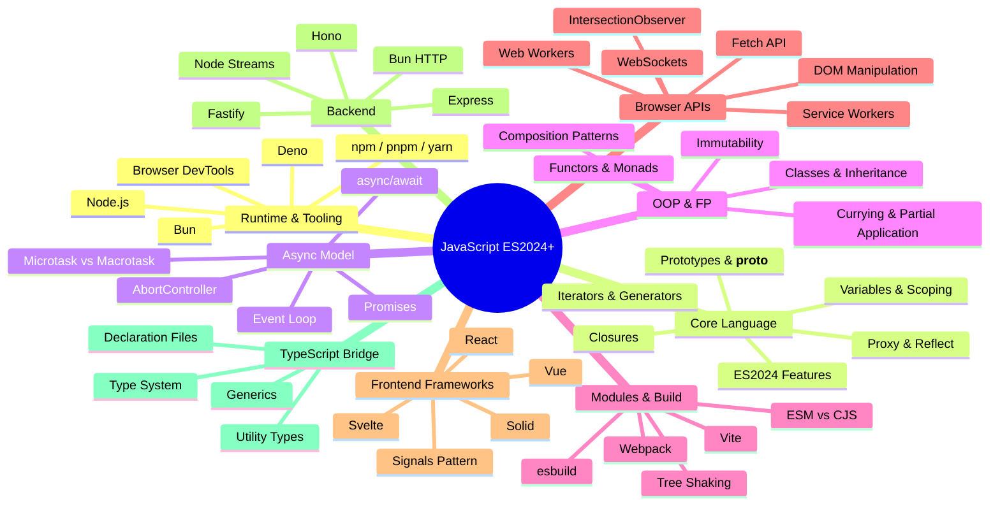
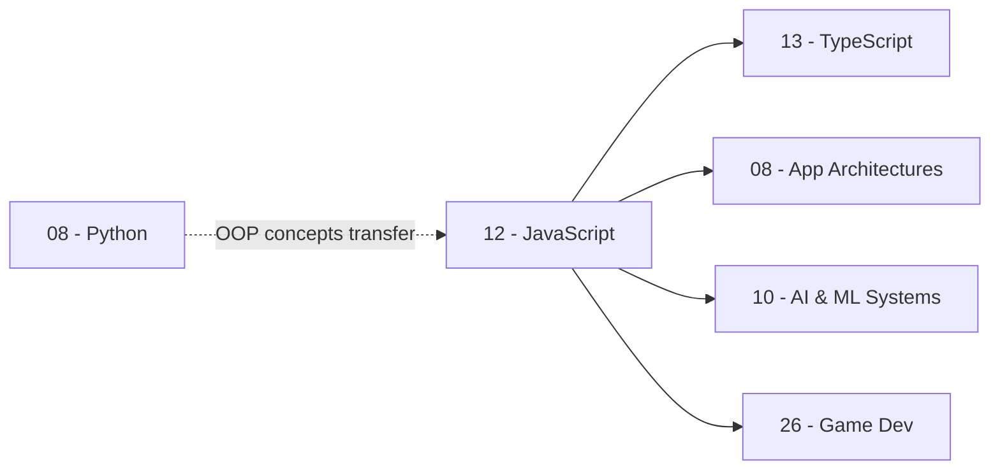

*Back to [09 - Learning Index](09---Learning-Index)*

# JavaScript — Subject Plan

> *"Always bet on JavaScript."* — **Brendan Eich**, creator of JavaScript (2011)

---

## 🎯 Track Mission

Rebuild and modernize your JavaScript fluency from the Dreamweaver-era foundations to production-grade ES2024+. This track treats you as an experienced programmer (Python-fluent, OOP-literate) who needs to re-map familiar concepts onto JavaScript's unique execution model — prototypal inheritance, single-threaded async, and the module ecosystem explosion.

**End state:** You can architect full-stack JS/TS applications, pass technical interviews, contribute to open-source frameworks, and evaluate the React/Vue/Svelte/Solid landscape with informed opinions.

---

## 🗺️ Curriculum Mind Map



---

## 📚 Chapter Index

| # | Chapter | Key Topics | Status |
|---|---------|-----------|--------|
| 12.1 | [12.1 - Setup, Runtime & Tooling](12.1---Setup,-Runtime-&-Tooling) | Node, Bun, Deno, browser; npm/pnpm/yarn; REPL workflows | 🟢 Active |
| 12.2 | [12.2 - Core Language - ES2024+, Closures, Prototypes](12.2---Core-Language---ES2024+,-Closures,-Prototypes) | let/const, closures, prototype chain, ES2024 features, Proxy/Reflect | 🟢 Active |
| 12.3 | [12.3 - Async - Promises, Async_Await, Event Loop](12.3---Async---Promises,-Async_Await,-Event-Loop) | Event loop internals, microtask/macrotask, Promise combinators, async patterns | 🟢 Active |
| 12.4 | [12.4 - OOP & FP Patterns](12.4---OOP-&-FP-Patterns) | Classes, prototypal inheritance, currying, composition, immutability | 🟢 Active |
| 12.5 | [12.5 - Modules & Build Systems](12.5---Modules-&-Build-Systems) | ESM, CJS, Vite, Webpack, esbuild, tree shaking, code splitting | 🟢 Active |
| 12.6 | [12.6 - DOM & Browser APIs](12.6---DOM-&-Browser-APIs) | Modern DOM, Fetch, IntersectionObserver, Workers, WebSockets | 🟢 Active |
| 12.7 | [12.7 - Modern Frontend Frameworks Overview](12.7---Modern-Frontend-Frameworks-Overview) | React/Vue/Svelte/Solid comparison, signals, reactivity models | 🟢 Active |
| 12.8 | [12.8 - Modern Backend - Node, Bun, Express, Fastify, Hono](12.8---Modern-Backend---Node,-Bun,-Express,-Fastify,-Hono) | Server architectures, middleware, streaming, edge runtimes | 🟢 Active |
| — | [JavaScript Essentials for Coding Tests](JavaScript-Essentials-for-Coding-Tests) | Quick-reference cheatsheet for interview prep | 📋 Reference |

---

## 🔗 Cross-Track Dependencies



- **[13 - TypeScript](13---TypeScript)** — TypeScript is JavaScript with a compile-time type system. Every JS concept here applies directly; TS adds safety.
- **[Track 08 App Architectures](Track-08-App-Architectures)** — Deep dives into React, Angular, Vue, etc. Chapter 12.7 here is the overview; Track 08 is the drill-down.
- **[01- Python](01--Python)** — Your Python OOP and async knowledge maps cleanly onto JS patterns (different syntax, same mental models).

---

## 📖 Recommended Free Resources

### 📕 Books (Free Online)
| Title | Author | URL | Best For |
|-------|--------|-----|----------|
| *You Don't Know JS Yet* (2nd ed.) | Kyle Simpson | [github.com/getify/You-Dont-Know-JS](https://github.com/getify/You-Dont-Know-JS) | Deep language mechanics |
| *Eloquent JavaScript* (4th ed.) | Marijn Haverbeke | [eloquentjavascript.net](https://eloquentjavascript.net) | Foundations + projects |
| *JavaScript.info* | Ilya Kantor | [javascript.info](https://javascript.info) | Modern tutorial, exhaustive |

### 🎥 Video & Courses (Free)
| Creator | Platform | Best For |
|---------|----------|----------|
| Wes Bos | [JavaScript30.com](https://javascript30.com) | 30 vanilla JS projects (free) |
| Theo Browne | [YouTube @t3dotgg](https://youtube.com/@t3dotgg) | Modern ecosystem opinions, framework comparisons |
| Fireship | [YouTube @fireship](https://youtube.com/@fireship) | 100-second explainers, rapid overviews |
| Matt Pocock | [YouTube @mattpocockuk](https://youtube.com/@mattpocockuk) | TypeScript deep dives |

### 📚 Reference
| Resource | URL | Use |
|----------|-----|-----|
| MDN Web Docs | [developer.mozilla.org](https://developer.mozilla.org/en-US/docs/Web/JavaScript) | Canonical API reference |
| Can I Use | [caniuse.com](https://caniuse.com) | Browser compatibility tables |
| Node.js Docs | [nodejs.org/docs](https://nodejs.org/en/docs) | Runtime API reference |
| TC39 Proposals | [github.com/tc39/proposals](https://github.com/tc39/proposals) | Upcoming language features |

---

## ⏱️ Pacing Guide

**Target:** 6 weeks at ~2 hours/day (84 hours total)

| Week | Chapters | Focus |
|------|----------|-------|
| 1 | 12.1 + 12.2 (first half) | Environment setup, core syntax refresh, scoping |
| 2 | 12.2 (second half) + 12.3 | Closures, prototypes, async model |
| 3 | 12.4 + 12.5 | OOP/FP patterns, module systems |
| 4 | 12.6 | Browser APIs, DOM mastery |
| 5 | 12.7 + 12.8 | Framework landscape, backend architectures |
| 6 | Review + Projects | Build a full-stack app combining all concepts |

---

## 🧪 Practice Infrastructure

All practice scripts live in `_practice/scripts/` within this directory. Run them with Node.js or Bun:

```bash
# Run any practice script
node _practice/scripts/5.2_closures_lab.js
bun _practice/scripts/5.3_event_loop_trace.js
```

---

## 📋 Prerequisites

- **Required:** Comfortable reading/writing code in any language (you have Python ✅)
- **Helpful:** Basic HTML/CSS knowledge (you have this from Dreamweaver era ✅)
- **Not required:** No prior modern JS framework experience needed

---

## Related Notes
- [LEARNING_PATH](LEARNING_PATH) - Shared javascript/curriculum focus
