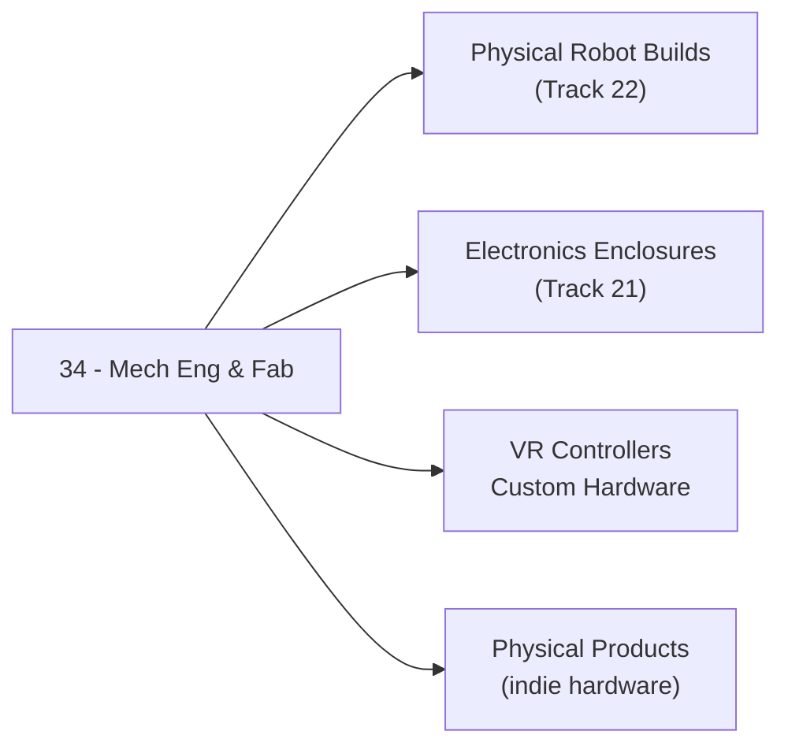

*Back to [Subject_Plan](Subject_Plan) | Part of [00 - 09 - Learning Index](00---09---Learning-Index)*

# 🗺️ Mechanical Engineering & Fabrication — Learning Path

> *"The gap between a drawing and a part is where most designs die. This track closes that gap."*

---

## 🧭 Progression Map

```mermaid
graph TD
    %% Prerequisites
    AET["✅ AET Background<br/>Architecture & Drawing"]
    MOD["✅ 3D Modelling<br/>Track 20"]
    ELEC["✅ Electronics Basics<br/>Track 21"]
    ROBO["✅ Robotics<br/>Track 22"]

    %% Chapters
    C1["33.1 Engineering Drawing<br/>& GD&T"]
    C2["33.2 Materials Science<br/>& Selection"]
    C3["33.3 Manufacturing Processes<br/>& DFM"]
    C4["33.4 CNC Machining<br/>& G-Code"]
    C5["33.5 3D Printing<br/>& Additive Mfg"]
    C6["33.6 Tolerancing, Fits<br/>& Assemblies"]
    C7["33.7 FreeCAD & Parametric<br/>Modelling"]
    C8["33.8 Mechatronics &<br/>CAD-to-Fab Pipeline"]

    %% Connections
    AET --> C1
    MOD --> C7
    ELEC --> C8
    ROBO --> C8

    C1 --> C2
    C1 --> C6
    C2 --> C3
    C3 --> C4
    C3 --> C5
    C4 --> C8
    C5 --> C8
    C6 --> C8
    C7 --> C4
    C7 --> C5
    C7 --> C8

    %% Downstream
    C8 --> PHYSROBO["Physical Robot<br/>(north star)"]
    C8 --> ENCLOSURE["Custom Electronics<br/>Enclosures"]
    C8 --> HARDWARE["Custom Hardware<br/>Products"]

    %% Styling
    style AET fill:#2d5016,stroke:#4a8c2a
    style MOD fill:#2d5016,stroke:#4a8c2a
    style ELEC fill:#2d5016,stroke:#4a8c2a
    style ROBO fill:#2d5016,stroke:#4a8c2a

    style C1 fill:#1a3a5c,stroke:#3d7ab8
    style C2 fill:#4a3a1a,stroke:#b8a83d
    style C3 fill:#3a1a4a,stroke:#8c3db8
    style C4 fill:#4a1a1a,stroke:#b83d3d
    style C5 fill:#1a4a3a,stroke:#3db88c
    style C6 fill:#1a3a5c,stroke:#3d7ab8
    style C7 fill:#4a3a1a,stroke:#b8a83d
    style C8 fill:#5c1a1a,stroke:#b83d3d

    style PHYSROBO fill:#2a2a2a,stroke:#666
    style ENCLOSURE fill:#2a2a2a,stroke:#666
    style HARDWARE fill:#2a2a2a,stroke:#666
```

---

## 📅 Suggested Timeline

| Week | Focus | Chapters | Hours/Week |
|------|-------|----------|------------|
| 1 | Drawing literacy + GD&T | 33.1 | 6–8 |
| 2 | Materials science + selection | 33.2 | 5–7 |
| 3–4 | Manufacturing processes + DFM | 33.3 | 6–8 |
| 4–5 | CNC machining + G-code | 33.4 | 6–8 |
| 5–6 | 3D printing + additive | 33.5 | 5–7 |
| 6 | Tolerancing + fits | 33.6 | 6–8 |
| 7 | FreeCAD deep dive | 33.7 | 8–10 |
| 8 | Full pipeline integration | 33.8 | 6–8 |

**Total ≈ 8 weeks at 6–8 hrs/week ≈ 52 hours.**

---

## 🎯 Milestone Checkpoints

### ✅ Checkpoint 1: "I Can Read and Create Technical Drawings" (after 33.1)
- [ ] Can read a multi-view engineering drawing and identify all views, sections, and auxiliary views
- [ ] Can identify and interpret 10+ GD&T symbols including position, perpendicularity, and flatness
- [ ] Can identify datum reference frames (A→B→C hierarchy) on a real drawing
- [ ] Can create a basic 2-view drawing in FreeCAD TechDraw with a title block and general tolerance note
- [ ] Can explain the difference between ASME Y14.5 and ISO 1101 (projection symbol difference)

### ✅ Checkpoint 2: "I Select Materials Like an Engineer" (after 33.2)
- [ ] Can place 6 materials on an Ashby strength-density chart and explain their position
- [ ] Can explain the Hall-Petch relation and why smaller grain size means higher yield strength
- [ ] Can name the appropriate material for: robot frame, 3D printed enclosure, high-temperature bracket, and corrosion-resistant enclosure
- [ ] Can explain the difference between annealing, quench & temper, and precipitation hardening and which steels/alloys each applies to

### ✅ Checkpoint 3: "I Choose the Right Manufacturing Process" (after 33.3)
- [ ] Can select between FDM, CNC, sheet metal, and injection moulding for a given volume/geometry/material combination
- [ ] Can list 5 DFM rules for CNC machining and 5 for FDM printing
- [ ] Can explain minimum corner radius, depth-to-width ratio, and tool access constraints for CNC pockets
- [ ] Can describe why tool cost and unit cost trade differently across processes

### ✅ Checkpoint 4: "I Can Program and Run a CNC Operation" (after 33.4)
- [ ] Can write a basic G-code program with rapid moves, linear feed, arcs, and tool changes
- [ ] Can calculate RPM and feed rate for aluminium with a given tool diameter using the SFM formula
- [ ] Can set up work offsets (G54) and tool length offsets (G43) conceptually
- [ ] Can generate a pocket toolpath in FreeCAD Path workbench and post-process to Grbl G-code
- [ ] Can explain adaptive (trochoidal) clearing and why it extends tool life

### ✅ Checkpoint 5: "I Print, Fail, and Fix" (after 33.5)
- [ ] Can diagnose 5 common FDM print failures (stringing, layer separation, elephant foot, warping, clogging) and fix each
- [ ] Can explain why holes in FDM print undersize and apply the correct compensation
- [ ] Can install heat-set inserts correctly and explain why they're superior to printed threads
- [ ] Can compare SLA/MSLA vs FDM for a given application and justify the choice
- [ ] Can set up a complete PrusaSlicer profile for a structural PETG part

### ✅ Checkpoint 6: "I Design for Precise Assembly" (after 33.6 + 33.7 + 33.8)
- [ ] Can perform a worst-case tolerance stack-up for a 3-part assembly and identify the critical chain
- [ ] Can specify H7/g6 sliding fit and H7/p6 interference fit in FreeCAD and on a drawing
- [ ] Can model a parametric robot bracket in FreeCAD with spreadsheet-driven dimensions
- [ ] Can export a STEP file, import into a CAM package, and generate a facing + pocket operation
- [ ] Can design a PCB enclosure with correct standoff spacing, connector cutouts, and thermal management

---

## 📖 Reading Order with External Course Alignment

| Chapter | Free Resource | Hours |
|---------|--------------|-------|
| 33.1 | MIT OCW 2.008 Drawing lecture + GD&T Basics YouTube channel | 6–8 |
| 33.2 | MIT OCW 3.091 Introduction to Materials + Ashby "Materials Selection" slides (free online) | 6–8 |
| 33.3 | MIT OCW 2.008 Manufacturing processes lectures + Hubs DFM knowledge base | 8–10 |
| 33.4 | NYC CNC YouTube CAM playlist + FreeCAD Path workbench wiki | 8–10 |
| 33.5 | 3D Printing Nerd + Prusa blog + PrusaSlicer docs + MangoJelly FreeCAD | 6–8 |
| 33.6 | EngineersEdge tolerance calculator + Machinery's Handbook ISO fits section | 6–8 |
| 33.7 | FreeCAD wiki tutorials + MangoJelly "FreeCAD for Beginners" playlist | 8–10 |
| 33.8 | MIT IAP "How to CAD Almost Anything" + KiCad STEP integration guides | 6–8 |

---

## 🔄 How This Track Connects to Your Mission

This track is the bridge between **digital models and physical reality.** Every other track produces software. This one produces *objects you can hold.* For robotics, custom hardware, and any electronics project that leaves the breadboard, this is the prerequisite you didn't know was missing.

---

*Next: [33.1 - Engineering Drawing & GD&T](33.1---Engineering-Drawing-&-GD&T) — Start with the language of physical precision.*

---

## Related Notes
- [33.3 - Manufacturing Processes & DFM](33.3---Manufacturing-Processes-&-DFM) - Shared 3d-printing/maybe-tier focus
- [33.4 - CNC Machining & G-Code](33.4---CNC-Machining-&-G-Code) - Shared maybe-tier/cnc focus
- [33.5 - 3D Printing & Additive Manufacturing](33.5---3D-Printing-&-Additive-Manufacturing) - Shared 3d-printing/maybe-tier focus
