*Back to [Subject_Plan](Subject_Plan) | Part of [00 - 09 - Learning Index](00---09---Learning-Index)*

# 🗺️ Music Production & Sound Design — Learning Path

> *"Theory is the map. Listening is the territory. Production is the expedition."*

---

## 🧭 Progression Map

```mermaid
graph TD
    %% Prerequisites
    DSP["✅ DSP / Track 32<br/>Fourier, filters, FFT"]
    PY["✅ Python / Track 01<br/>scripting foundation"]
    EAR["✅ Any Musical Ear<br/>basic listening ability"]

    %% Chapters
    C1["35.1 Music Theory<br/>for Producers"]
    C2["35.2 Sound Design<br/>& Synthesis"]
    C3["35.3 DAW Workflow<br/>& Signal Chain"]
    C4["35.4 Sampling, Slicing<br/>& Resampling"]
    C5["35.5 Mixing Fundamentals"]
    C6["35.6 Mastering & Loudness"]
    C7["35.7 Audio Programming<br/>JUCE & Python"]
    C8["35.8 Generative Music<br/>& AI Audio"]

    %% Prereq connections
    EAR --> C1
    DSP --> C2
    PY --> C7

    %% Chapter flow
    C1 --> C2
    C1 --> C3
    C2 --> C3
    C3 --> C4
    C3 --> C5
    C4 --> C5
    C5 --> C6
    DSP --> C7
    C2 --> C7
    C8 --> C7
    C1 --> C8

    %% Downstream
    C6 --> RELEASE["Released Tracks<br/>(north star)"]
    C7 --> PLUGINS["Custom VST Plugins"]
    C8 --> AI_MUSIC["AI Music Tools"]
    C3 --> GAME_OST["Game Soundtracks"]

    %% Styles
    style DSP fill:#2d5016,stroke:#4a8c2a
    style PY fill:#2d5016,stroke:#4a8c2a
    style EAR fill:#2d5016,stroke:#4a8c2a

    style C1 fill:#1a3a5c,stroke:#3d7ab8
    style C2 fill:#4a2a1a,stroke:#b87a3d
    style C3 fill:#3a1a4a,stroke:#8c3db8
    style C4 fill:#1a4a3a,stroke:#3db88c
    style C5 fill:#4a3a1a,stroke:#b8a83d
    style C6 fill:#4a1a1a,stroke:#b83d3d
    style C7 fill:#1a3a5c,stroke:#3d7ab8
    style C8 fill:#1a4a4a,stroke:#3db8b8

    style RELEASE fill:#2a2a2a,stroke:#666
    style PLUGINS fill:#2a2a2a,stroke:#666
    style AI_MUSIC fill:#2a2a2a,stroke:#666
    style GAME_OST fill:#2a2a2a,stroke:#666
```

---

## 📅 Suggested Timeline

| Week | Focus | Chapters | Hours/Week |
|------|-------|----------|------------|
| 1 | Music theory + DAW setup | 35.1 | 5–7 |
| 2 | Synthesis deep dive | 35.2 | 6–8 |
| 2–3 | DAW workflow + sampling | 35.3 + 35.4 | 6–8 |
| 4 | Mixing fundamentals | 35.5 | 6–8 |
| 5 | Mastering + distribution | 35.6 | 5–6 |
| 6–7 | JUCE + Python audio | 35.7 | 8–10 |
| 7–8 | Generative + AI audio | 35.8 | 6–8 |

**Total ≈ 8 weeks at 6 hrs/week ≈ 48 hours.**

---

## 🎯 Milestone Checkpoints

### ✅ Checkpoint 1: "I Can Write Chord Progressions and Understand Modes" (after 35.1)
- [ ] Can play (or program in a piano roll) a I–V–vi–IV progression in 3 different keys
- [ ] Can identify the Dorian, Phrygian, and Lydian modes by their characteristic intervals
- [ ] Can explain why trap uses double-time hi-hats and half-time bass (rhythmic displacement)
- [ ] Can state MIDI note numbers for C4 (60), A4 (69), and any note in between
- [ ] Can notate a 4-bar groove in a DAW piano roll with correct velocity variation

### ✅ Checkpoint 2: "I Can Design a Sound from Scratch" (after 35.2)
- [ ] Can program a bass sound using saw oscillator + low-pass filter + fast ADSR
- [ ] Can create a pad by combining two detuned oscillators + long attack + reverb
- [ ] Can explain the difference between subtractive, additive, FM, and wavetable synthesis
- [ ] Can demonstrate LFO-driven filter cutoff (auto-wah effect)
- [ ] Can build a basic drum kit from noise + sine + envelopes in Bespoke Synth or LMMS

### ✅ Checkpoint 3: "I Have a Complete Mix and Know What I'm Doing" (after 35.3–35.5)
- [ ] Can organise a session into drum bus, synth bus, vocal bus, and master with appropriate processing on each
- [ ] Can EQ a kick drum to cut around 300–500Hz and boost sub under 80Hz
- [ ] Can set compression on a snare: ratio 4:1, attack 5ms, release 80ms, -3dB GR
- [ ] Can explain the mono compatibility rule and check a mix in mono
- [ ] Can chop a drum break into 8 slices, remap to a MIDI keyboard, and create a new groove

### ✅ Checkpoint 4: "I Can Master to Platform Spec" (after 35.6)
- [ ] Can master a mix to -14 LUFS integrated, -1 dBTP using YOULEAN + limiter
- [ ] Can explain the difference between LUFS, dBFS, VU, and dBTP
- [ ] Can deliver final file as 24-bit/44.1kHz WAV with correct metadata

### ✅ Checkpoint 5: "I Can Write an Audio Plugin" (after 35.7)
- [ ] Can create a JUCE plugin that applies a biquad filter to audio in processBlock()
- [ ] Can use librosa to extract BPM and chroma from an audio file in Python
- [ ] Can use sounddevice to process audio in real time with a callback function
- [ ] Can use pedalboard to apply a VST/AU plugin to an audio file from Python

### ✅ Checkpoint 6: "I Can Generate Music Algorithmically" (after 35.8)
- [ ] Can generate a MIDI melody using a Markov chain trained on a short motif
- [ ] Can use Meta's MusicGen (local or API) to generate a 30-second track from a text prompt
- [ ] Can describe how TidalCycles pattern syntax works at a conceptual level
- [ ] Can patch a generative sequence in Bespoke Synth or VCV Rack that varies without repeating

---

## 📖 External Course Alignment

| Chapter | Free Resource |
|---------|--------------|
| 35.1 | MusicTheory.net · Splice theory course |
| 35.2 | Sound on Sound Synth Secrets (free archive) |
| 35.3 | In The Mix YouTube · LMMS manual |
| 35.4 | Produce Like A Pro YouTube · Looperman.com |
| 35.5 | In The Mix mixing playlist · SPAN free analyser |
| 35.6 | Youlean Loudness Meter guide · Ian Shepherd mastering podcast |
| 35.7 | JUCE tutorials (juce.com) · librosa docs (librosa.org) |
| 35.8 | TidalCycles docs · MusicGen demo space (huggingface.co) |

---

*Next: [35.1 - Music Theory for Producers](35.1---Music-Theory-for-Producers) — Start with the language before the instruments.*

---

## Related Notes
- [35.2 - Sound Design & Synthesis](35.2---Sound-Design-&-Synthesis) - Shared sound-design/maybe-tier focus
- [35.5 - Mixing Fundamentals](35.5---Mixing-Fundamentals) - Shared maybe-tier/mixing focus
- [35.6 - Mastering & Loudness](35.6---Mastering-&-Loudness) - Shared maybe-tier/mastering focus
- [35.8 - Generative Music & AI Audio](35.8---Generative-Music-&-AI-Audio) - Shared generative-music/maybe-tier focus
