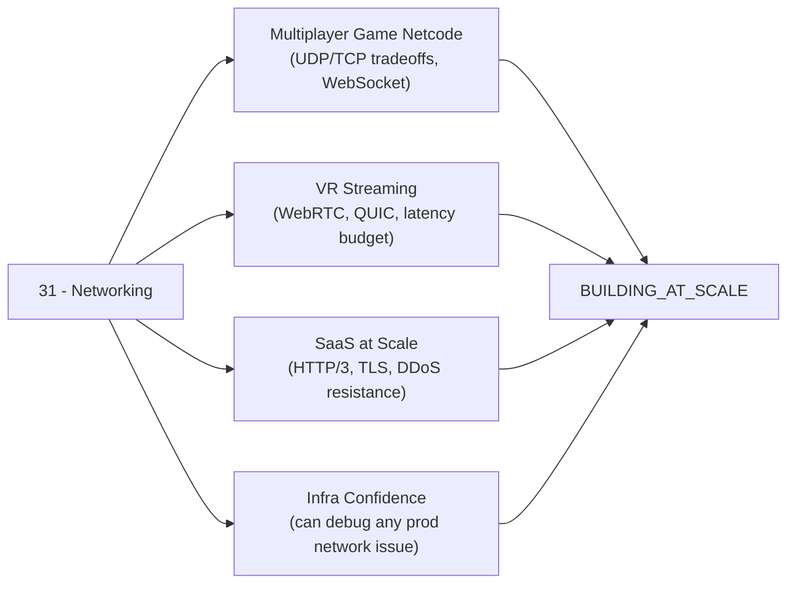

*Back to [Subject_Plan](Subject_Plan) | Part of [00 - 09 - Learning Index](00---09---Learning-Index)*

# 🗺️ Networking & Protocols — Learning Path

> *"To understand the Internet you must understand the layers. To understand the layers you must ignore them — packets don't care about your model. They're just bits on a wire, following rules all the way up."*

---

## 🧭 Progression Map

```mermaid
graph TD
    %% Prerequisites
    OS["✅ OS Essentials<br/>1.10 — sockets, syscalls"]
    NET0["✅ Networks Intro<br/>1.11 — existing foundation"]
    CONC["✅ Concurrency<br/>1.4 — async I/O"]
    CYBER["✅ Cybersecurity<br/>Track 25 — security context"]
    SD["✅ System Design<br/>Track 27 — architecture context"]

    %% Wire layer
    C1["17.1 Physical & Data Link<br/>OSI · Ethernet · ARP · MAC"]

    %% Routing
    C2["17.2 IP, Routing & BGP<br/>IPv4/IPv6 · CIDR · Dijkstra<br/>BGP AS-path · Anycast"]

    %% Transport
    C3["17.3 TCP & UDP Deep Dive<br/>Handshake · Sliding Window<br/>CUBIC · BBR · TIME_WAIT"]

    %% Security
    C4["17.4 TLS, mTLS & PKI<br/>TLS 1.3 · Cert chains<br/>mTLS · OCSP · 0-RTT"]

    %% Application
    C5["17.5 HTTP/1.1 · HTTP/2 · HTTP/3<br/>Keep-alive · Multiplexing<br/>HPACK · QUIC 0-RTT"]

    C6["17.6 WebSockets · SSE · WebRTC<br/>WS upgrade · ICE · STUN<br/>TURN · SDP Offer/Answer"]

    C7["17.7 gRPC · Protobuf · Service Mesh<br/>Streaming modes · wire encoding<br/>Istio Ambient · Linkerd"]

    %% Defence
    C8["17.8 Network Security & DDoS<br/>Volumetric · Protocol · L7<br/>BGP hijack · RPKI · eBPF XDP"]

    %% Dependency graph
    OS --> C1
    NET0 --> C1
    CONC --> C3

    C1 --> C2
    C2 --> C3
    C3 --> C4
    C4 --> C5
    C5 --> C6
    C5 --> C7
    C4 --> C7
    C2 --> C8
    C3 --> C8

    CYBER --> C4
    SD --> C5
    SD --> C7

    %% Downstream tracks
    C6 --> VR["24 — VR<br/>(WebRTC streaming)"]
    C6 --> GAME["04 — Game Dev<br/>(netcode patterns)"]
    C7 --> DEVOPS["26 — DevOps & SRE<br/>(mesh + k8s)"]
    C8 --> CYBER2["25 — Cybersecurity<br/>(network defence)"]
    C3 --> SCALE["BUILDING_AT_SCALE<br/>(TCP tuning)"]

    %% Styles
    style OS   fill:#2d5016,stroke:#4a8c2a
    style NET0 fill:#2d5016,stroke:#4a8c2a
    style CONC fill:#2d5016,stroke:#4a8c2a
    style CYBER fill:#2d5016,stroke:#4a8c2a
    style SD   fill:#2d5016,stroke:#4a8c2a

    style C1 fill:#3d1a1a,stroke:#ff6b6b
    style C2 fill:#3d2a1a,stroke:#ffa94d
    style C3 fill:#3d3a1a,stroke:#ffd93d
    style C4 fill:#1a3d1a,stroke:#51cf66
    style C5 fill:#1a3a3d,stroke:#4dabf7
    style C6 fill:#1a1a3d,stroke:#748ffc
    style C7 fill:#2d1a3d,stroke:var(--interactive-accent,#58a6ff)
    style C8 fill:#3d1a2d,stroke:#f06595

    style VR    fill:#2a2a2a,stroke:#666
    style GAME  fill:#2a2a2a,stroke:#666
    style DEVOPS fill:#2a2a2a,stroke:#666
    style CYBER2 fill:#2a2a2a,stroke:#666
    style SCALE  fill:#2a2a2a,stroke:#666
```

---

## 📅 Suggested Timeline

| Week | Focus | Chapters | Hours/Week |
|------|-------|----------|------------|
| 1 | OSI model, Ethernet, ARP, MAC, Wireshark intro | 17.1 | 6–8 |
| 2 | IPv4/IPv6 subnetting, routing algorithms, BGP | 17.2 | 6–8 |
| 3–4 | TCP deep dive — handshake, congestion control, tuning | 17.3 | 10–12 |
| 5 | TLS 1.3 handshake, PKI, mTLS | 17.4 | 8–10 |
| 6 | HTTP/2 multiplexing, HTTP/3 QUIC, HPACK, QPACK | 17.5 | 8–10 |
| 7 | WebSockets, SSE, WebRTC ICE/STUN/TURN/SDP | 17.6 | 8–10 |
| 8 | gRPC streaming, protobuf encoding, service mesh | 17.7 | 6–8 |
| 9 | Network security, DDoS mitigation, BGP hijacking, eBPF XDP | 17.8 | 6–8 |

**Total ≈ 9 weeks at 8 hrs/week ≈ 72 hours.**

---

## 🎯 Milestone Checkpoints

### ✅ Checkpoint 1: "I Can Read Packets" (after 17.1)
- [ ] Can explain all 7 OSI layers and map them to TCP/IP's 4-layer model with real protocols at each layer
- [ ] Can read an Ethernet II frame header (preamble, SFD, dst MAC, src MAC, Ethertype, FCS) without looking anything up
- [ ] Can explain how ARP resolves an IP address to a MAC address, including the broadcast/unicast flow
- [ ] Can open Wireshark and filter `arp`, `eth`, and identify frame fields by clicking on a captured frame
- [ ] Can explain the difference between a hub, switch, and router at the frame-forwarding level

### ✅ Checkpoint 2: "I Understand Routing" (after 17.2)
- [ ] Can subnet any /24 into /25, /26, /27 — calculating network address, broadcast, and usable range mentally
- [ ] Can explain the difference between OSPF (link-state, Dijkstra) and RIP (distance-vector, Bellman-Ford)
- [ ] Can explain BGP's 8-attribute decision process and place 3 real ASes on a path trace (`traceroute` + `bgp.tools`)
- [ ] Can explain what Anycast is and why Cloudflare's 1.1.1.1 resolves within 5 ms from anywhere
- [ ] Can distinguish IPv4 private ranges, explain NAT, and describe IPv6 address types (link-local, global unicast, multicast)

### ✅ Checkpoint 3: "I Own TCP" (after 17.3)
- [ ] Can sketch the 3-way handshake with sequence numbers and the 4-way FIN teardown
- [ ] Can calculate theoretical TCP throughput given RTT and window size
- [ ] Can explain Slow Start → Congestion Avoidance → Fast Retransmit → Fast Recovery state transitions
- [ ] Can explain the difference between CUBIC (loss-based) and BBR (model-based) in plain English
- [ ] Can explain TIME_WAIT, why it exists (2×MSL), and how to mitigate port exhaustion
- [ ] Can tune `tcp_rmem`, `tcp_wmem`, `tcp_tw_reuse` and explain what each does

### ✅ Checkpoint 4: "I See Through TLS" (after 17.4)
- [ ] Can narrate every message in a TLS 1.3 1-RTT handshake: ClientHello → ServerHello → cert → CertVerify → Finished → Finished
- [ ] Can explain ECDHE key exchange — why forward secrecy is achieved even if the server's private key leaks later
- [ ] Can verify a certificate chain manually: leaf → intermediate → root
- [ ] Can explain mTLS: what changes, what stays the same, and why it's required for zero-trust service mesh
- [ ] Can explain TLS 1.3 0-RTT resumption and its replay attack risk

### ✅ Checkpoint 5: "I Fluently Speak HTTP" (after 17.5)
- [ ] Can explain HTTP/1.1 head-of-line blocking and why browsers open 6 connections per origin
- [ ] Can explain HTTP/2 stream multiplexing, HPACK header compression, and server push
- [ ] Can explain how QUIC eliminates TCP head-of-line blocking and how connection migration works
- [ ] Can capture HTTP/2 and HTTP/3 traffic in Wireshark and identify stream IDs
- [ ] Can configure Nginx/Caddy/Cloudflare to serve HTTP/3 and verify it with `curl --http3`

### ✅ Checkpoint 6: "I Build Real-Time Connections" (after 17.6)
- [ ] Can implement a WebSocket server in Python (asyncio/websockets) that handles ping/pong and binary frames
- [ ] Can explain the SSE event format (`data:`, `id:`, `event:`) and implement auto-reconnect with Last-Event-ID
- [ ] Can explain WebRTC ICE: host candidates, srflx (STUN), relay (TURN), and the connectivity check process
- [ ] Can write a basic WebRTC signaling server (Node.js + Socket.io) for SDP offer/answer exchange
- [ ] Can decide between WebSocket, SSE, and WebRTC DataChannel for any given real-time use case

### ✅ Checkpoint 7: "I Ship gRPC Efficiently" (after 17.7)
- [ ] Can write a `.proto` file with a bidirectional streaming RPC and generate stubs in Python and Go
- [ ] Can explain protobuf wire encoding (varint, len-delimited, 64-bit, 32-bit) and decode a hex dump manually
- [ ] Can explain how gRPC uses HTTP/2 streams for multiplexing and how flow control interacts
- [ ] Can deploy Linkerd onto a local k3s cluster and verify mTLS between two services using `linkerd viz`
- [ ] Can explain the difference between Istio's sidecar mode and Ambient Mesh mode

### ✅ Checkpoint 8: "I Defend the Network" (after 17.8)
- [ ] Can classify any DDoS attack into volumetric / protocol / application and name the correct mitigation
- [ ] Can explain how SYN cookies work and implement them conceptually (hash function + ISN encoding)
- [ ] Can explain BGP prefix hijacking and how RPKI ROA validation prevents it
- [ ] Can write a simple eBPF XDP program that drops packets matching a specific source IP
- [ ] Can explain the Anycast DDoS mitigation model and why Cloudflare's capacity moats matter

---

## 🔄 How This Connects to Your Mission



Networking is the **hidden cost center of every product**. Latency, packet loss, TLS overhead, connection storms — these are the failure modes that appear *after* launch, under real traffic, when it's most expensive to fix them. This track makes you the person in the room who *already thought about it*.

---

## 📖 Reading Order with External Course Alignment

| Chapter | Free Course / Reference | Hours |
|---------|------------------------|-------|
| 17.1 | Kurose & Ross Ch. 1–6 (Ethernet, MAC, ARP) + Wireshark Lab 1 | 8–10 |
| 17.2 | Kurose & Ross Ch. 4–5 (IP, routing) + Practical Networking subnetting series | 8–10 |
| 17.3 | Kurose & Ross Ch. 3 (TCP) + Beej's socket guide Ch. 1–5 + Stanford TCPLab spec | 14–18 |
| 17.4 | RFC 8446 §1–4 + tls13.xargs.org byte walkthrough + Cloudflare TLS blog | 10–12 |
| 17.5 | hpbn.co Ch. 9–12 (HTTP/2, QUIC) + RFC 9000 §1–4 + quic.xargs.org | 10–12 |
| 17.6 | webrtcforthecurious.com (full book) + MDN WebRTC API | 10–12 |
| 17.7 | grpc.io docs + protobuf.dev language guide + Istio ambient blog | 8–10 |
| 17.8 | Cloudflare DDoS reports + MANRS docs + eBPF XDP tutorial (cilium.io) | 8–10 |

---

## 💡 The "Network Engineer's Edge"

Most application developers treat the network as magic — a function call that "just works." The network engineer's edge is knowing **exactly** what happens between your function call and the response:

1. **DNS resolution** (UDP, recursive, cached — or not)
2. **TCP 3-way handshake** (1 RTT overhead before any data)
3. **TLS 1.3 handshake** (1 RTT more, key exchange, cert verification)
4. **HTTP request** (possibly multiplexed over an existing H2 stream, or 0-RTT QUIC)
5. **Server processing + response** (the part you control)
6. **TCP congestion control** (does your window fill the pipe?)
7. **Last mile** (the one part no CDN can fix)

Once that sequence is second nature, you *automatically* design systems that don't waste RTTs, don't create TLS overhead for nothing, and don't fall over when a single component is slow. That's the edge.

---

*Next: [17.1 - Physical & Data Link Layer](17.1---Physical-&-Data-Link-Layer) — Start at the bottom of the stack.*

---

## Related Notes
- [17.2 - IP, Routing & BGP](17.2---IP,-Routing-&-BGP) - Shared networking/bgp focus
- [17.3 - TCP & UDP Deep Dive](17.3---TCP-&-UDP-Deep-Dive) - Shared networking/tcp focus
- [17.4 - TLS, mTLS & PKI](17.4---TLS,-mTLS-&-PKI) - Shared networking/tls focus
- [17.6 - WebSockets, SSE & WebRTC](17.6---WebSockets,-SSE-&-WebRTC) - Shared networking/webrtc focus
