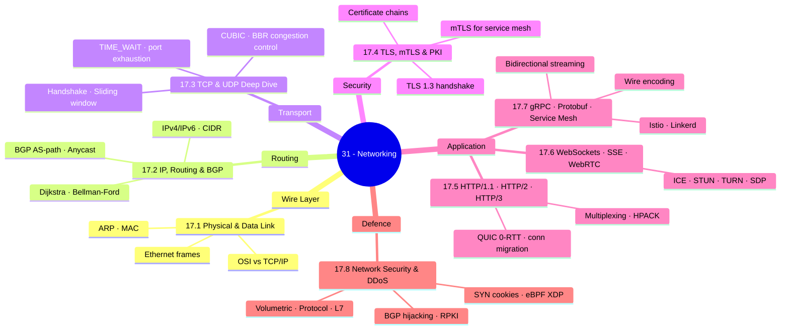
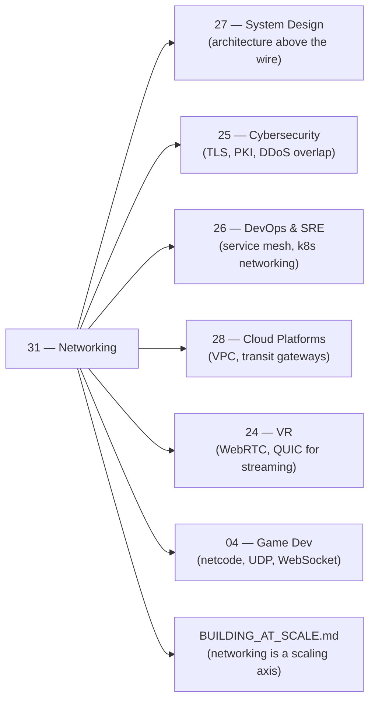

*Back to [00 - 09 - Learning Index](00---09---Learning-Index) | Part of [LEARNING_PATH](LEARNING_PATH)*

# 🌐 Networking & Protocols — Subject Plan

> *"The network is a computer. You just haven't figured out which parts are the programming language."* — paraphrased from Sun Microsystems' original vision

> *"Packets don't care about your feelings. TCP will drop your connection, TLS will fail your handshake, and BGP will route your traffic somewhere unexpected — unless you understand exactly why."*

---

## 🎯 Mission Statement

**See the wire.** TCP handshakes, TLS key exchange, HTTP/2 multiplexing, QUIC 0-RTT, WebRTC ICE, gRPC streaming, mTLS — every packet on every hop. Critical for multiplayer game netcode, VR streaming, distributed AI inference, and every SaaS product you ship.

This track fills the gap between [Track 27](Subject_Plan) (architecture) and the raw physical reality of data moving through networks. Where Track 27 teaches you *what to build*, Track 17 teaches you *how the wire actually works beneath every abstraction you rely on*.

The chapters answer the engineer's wire-level questions:
- *What does an Ethernet frame actually look like?* → 17.1 Physical & Data Link
- *How does a packet find its way across the Internet?* → 17.2 IP, Routing & BGP
- *Why does my game feel laggy under 1% packet loss?* → 17.3 TCP & UDP Deep Dive
- *What is TLS actually doing during that 50ms?* → 17.4 TLS, mTLS & PKI
- *Why is HTTP/2 faster and HTTP/3 even faster?* → 17.5 HTTP/1.1, HTTP/2 & HTTP/3
- *WebSocket vs SSE vs WebRTC — when is each right?* → 17.6 WebSockets, SSE & WebRTC
- *How does gRPC bidirectional streaming work internally?* → 17.7 gRPC, Protobuf & Service Mesh
- *How do I survive a 1 Tbit/s DDoS?* → 17.8 Network Security & DDoS Mitigation

---

## 📊 Track Overview



---

## 📚 Chapter Inventory

| # | Chapter | Domain | Status |
|---|---------|--------|--------|
| 17.1 | Physical & Data Link Layer | OSI model, Ethernet, ARP, MAC, switching | 🟡 Skeleton |
| 17.2 | IP, Routing & BGP | IPv4/IPv6, CIDR, OSPF, BGP, Anycast | 🟡 Skeleton |
| 17.3 | TCP & UDP Deep Dive | Handshake, sliding window, CUBIC/BBR, TIME_WAIT | 🟡 Skeleton |
| 17.4 | TLS, mTLS & PKI | TLS 1.3, certificate chains, mTLS, OCSP | 🟡 Skeleton |
| 17.5 | HTTP/1.1, HTTP/2 & HTTP/3 (QUIC) | Keep-alive, multiplexing, HPACK, QUIC 0-RTT | 🟡 Skeleton |
| 17.6 | WebSockets, SSE & WebRTC | WS upgrade, SSE, ICE, STUN, TURN, SDP | 🟡 Skeleton |
| 17.7 | gRPC, Protocol Buffers & Service Mesh | Streaming modes, protobuf encoding, Istio, Linkerd | 🟡 Skeleton |
| 17.8 | Network Security & DDoS Mitigation | DDoS categories, BGP hijacking, RPKI, Anycast, eBPF | 🟡 Skeleton |

---

## 🔗 Prerequisites

| Prerequisite | Where you learned it | Why it matters |
|---|---|---|
| Computer Networks Essentials | [1.11 - Computer Networks Essentials](1.11---Computer-Networks-Essentials) | Existing foundation — this track deepens it dramatically |
| OS Essentials (sockets, syscalls) | [1.10 - Operating Systems Essentials](1.10---Operating-Systems-Essentials) | TCP is implemented in the kernel; sockets are the userland abstraction |
| Concurrency & async I/O | [1.4 - Concurrency - asyncio, threading, multiprocessing & the GIL](1.4---Concurrency---asyncio,-threading,-multiprocessing-&-the-GIL) | Every server is async I/O on sockets; understanding the event loop matters |
| System Design fundamentals | [Subject_Plan](Subject_Plan) | CAP, PACELC, latency numbers give meaning to the measurements in this track |
| Cybersecurity basics | [Subject_Plan](Subject_Plan) | TLS and PKI concepts overlap; network security prereqs |
| Distributed Systems | [1.16 - Distributed Systems & Multi-GPU Training](1.16---Distributed-Systems-&-Multi-GPU-Training) | RPC, pub/sub patterns contextualize gRPC and protobuf |

---

## 🆓 Open-Source / Free Catalog

> SVG diagrams we author live in `../_svgs/` with the `net__<ch>-fig<n>.svg` prefix. Videos, screenshots, and external assets link out by URL only.

### 📖 Books & Guides (fully free)

| Title | Author / Provider | Why |
|---|---|---|
| **Computer Networking: A Top-Down Approach** | Kurose & Ross — free lecture slides + Wireshark labs | [gaia.cs.umass.edu/kurose_ross](http://gaia.cs.umass.edu/kurose_ross/) — the canonical networking textbook |
| **Beej's Guide to Network Programming** | Brian "Beej" Hall — CC license | [beej.us/guide/bgnet](https://beej.us/guide/bgnet/) — practical BSD sockets in C; the programmer's entry point |
| **High Performance Browser Networking** | Ilya Grigorik (O'Reilly) — free online | [hpbn.co](https://hpbn.co/) — HTTP/1.1 → HTTP/2 → QUIC from a web-perf angle |
| **Julia Evans "Networking" Zines** | Julia Evans (jvns.ca) — cheap / free previews | [jvns.ca](https://jvns.ca/) — incredibly clear visual explainers on DNS, HTTP, TCP |
| **Cloudflare Learning Center** | Cloudflare — free | [cloudflare.com/learning](https://www.cloudflare.com/learning/) — DNS, DDoS, TLS explained at production scale |
| **QUIC spec (RFC 9000)** | IETF | [rfc-editor.org/rfc/rfc9000](https://www.rfc-editor.org/rfc/rfc9000) — the protocol spec |
| **HTTP/3 RFC 9114** | IETF | [rfc-editor.org/rfc/rfc9114](https://www.rfc-editor.org/rfc/rfc9114) — HTTP/3 over QUIC |
| **TLS 1.3 (RFC 8446)** | IETF | [rfc-editor.org/rfc/rfc8446](https://www.rfc-editor.org/rfc/rfc8446) — the definitive TLS 1.3 spec |
| **The Illustrated TLS 1.3 Connection** | Michael Driscoll | [tls13.xargs.org](https://tls13.xargs.org/) — byte-level visual walkthrough of a real TLS 1.3 handshake |
| **The Illustrated QUIC Connection** | Michael Driscoll | [quic.xargs.org](https://quic.xargs.org/) — same treatment for QUIC |
| **WebRTC for the Curious** | WebRTC community | [webrtcforthecurious.com](https://webrtcforthecurious.com/) — free book, deep ICE/DTLS/SRTP detail |
| **TCP/IP Guide** | Charles Kozierok — free online | [tcpipguide.com](http://www.tcpipguide.com/) — encyclopedic reference |
| **Awesome Networking** | clowwindy — CC | [github.com/clowwindy/Awesome-Networking](https://github.com/clowwindy/Awesome-Networking) — curated resource list |

### 🎓 Courses & Lecture Series

| Resource | Provider | Coverage |
|---|---|---|
| **CS144 — Introduction to Computer Networking** | Stanford (open courseware) | Full networking stack; TCPLab assignments | [cs144.github.io](https://cs144.github.io/) |
| **Kurose & Ross Video Lectures** | YouTube playlist (unofficial mirrors) | Chapter-by-chapter companion to the textbook |
| **Hussein Nasser YouTube** | Hussein Nasser | HTTP/2, HTTP/3, WebSockets, gRPC — practitioner-level | [@hnasr](https://www.youtube.com/@hnasr) |
| **Networking Fundamentals (Practical Networking)** | Practical Networking | Subnetting, routing, switching — free series | [practicalnetworking.net](https://www.practicalnetworking.net/) |
| **Wireshark Official Training** | Wireshark Foundation | Free PCAP analysis skill-building | [wireshark.org/learn](https://www.wireshark.org/learn/) |

### 🛠️ Reference Documentation (cite-quality)

| Spec / Tool | Link |
|---|---|
| gRPC documentation | [grpc.io/docs](https://grpc.io/docs/) |
| Protocol Buffers language guide | [protobuf.dev](https://protobuf.dev/) |
| WebRTC API (MDN) | [developer.mozilla.org/en-US/docs/Web/API/WebRTC_API](https://developer.mozilla.org/en-US/docs/Web/API/WebRTC_API) |
| Cloudflare QUIC + HTTP/3 blog | [blog.cloudflare.com](https://blog.cloudflare.com/) |
| Wireshark docs | [wireshark.org/docs](https://www.wireshark.org/docs/) |
| RPKI / MANRS | [manrs.org](https://www.manrs.org/) |
| Istio docs | [istio.io/docs](https://istio.io/docs/) |
| Linkerd docs | [linkerd.io/2.x/overview](https://linkerd.io/2.x/overview/) |
| Linux `tc` / `iptables` / `nftables` | [netfilter.org](https://www.netfilter.org/) |

---

## 🏗️ Study Strategy

### Phase 1 — Wire Reality (Chapters 31.1–17.2) — 2 weeks
Start at the bottom of the stack. You can't reason about protocol behavior without knowing what Ethernet frames look like, how ARP resolves MAC addresses, and how BGP moves prefixes around the Internet. Use Wireshark on your own machine throughout this phase — look at real packets while reading theory.

### Phase 2 — Transport Mastery (Chapter 17.3) — 2 weeks
TCP is the most important protocol you probably half-understand. This chapter alone contains the answers to "why is my game laggy," "why do I have port exhaustion," and "why does my connection slow down under loss." Read the Stanford TCPLab spec. Write a toy TCP state machine. Look at BBR vs CUBIC graphs.

### Phase 3 — Security Layer (Chapter 17.4) — 1 week
TLS 1.3 is a masterpiece of protocol design. The xargs.org byte-level walkthrough (linked above) will make this chapter click. After TLS, mTLS is just "both sides have certs" — and then Istio/Linkerd make sense at a mechanical level.

### Phase 4 — Application Protocols (Chapters 31.5–17.6) — 2 weeks
HTTP/3 and QUIC in 2026 account for ~30% of web traffic. WebRTC is how multiplayer VR and video calls work. These chapters are directly relevant to your game dev and VR projects — prioritize them.

### Phase 5 — gRPC + Service Mesh + Security (Chapters 31.7–17.8) — 2 weeks
gRPC is the wire for internal microservices. protobuf is 10× smaller and faster than JSON for game state. Service mesh (Istio/Linkerd) is how you get mTLS, retries, and observability "for free" at the infrastructure level. The DDoS chapter rounds out your network security picture from [Track 25](Subject_Plan).

**Total ≈ 9 weeks at 8 hrs/week ≈ 72 hours.**

---

## 🔭 2026 Industry Snapshot (web-grounded)

> Sources rephrased and paraphrased for compliance — never more than 30 consecutive words from any single source.

- **HTTP/3 adoption**: As of early 2026, HTTP/3 accounts for roughly 30% of web traffic globally and is enabled by default in Chrome, Firefox, and Safari. Cloudflare reports that over 70% of their traffic is now served over QUIC. — paraphrased from [Cloudflare Radar 2025 Year in Review](https://radar.cloudflare.com/year-in-review/2025).
- **BBR v3**: Google shipped BBR version 3 into the Linux kernel in late 2023/2024; it improves fairness with CUBIC and is now the default in many cloud providers' kernel images. — paraphrased from Google's BBR v3 release notes and [LWN.net coverage](https://lwn.net/).
- **QUIC ecosystem**: Major CDNs and cloud providers have production QUIC stacks. The MSQUIC library (Microsoft, open-source) powers SMB-over-QUIC and Azure services. Google QUICHE and Cloudflare quiche are the dominant open implementations. — paraphrased from [IETF QUIC working group](https://quicwg.org/).
- **gRPC in 2026**: gRPC remains the dominant framework for internal service communication in polyglot environments. gRPC-Web (browser-native) and gRPC over HTTP/3 (QUIC transport) are both supported in the grpc-go and grpc-java stacks. — paraphrased from [grpc.io blog](https://grpc.io/blog/).
- **Service mesh simplification**: Istio's Ambient Mesh mode (no sidecar injection, ztunnel L4 node proxy + Waypoint L7 proxy) is production-stable as of 2025. Cilium's eBPF-native mesh offers lower overhead than proxy-based approaches. — paraphrased from [istio.io blog](https://istio.io/latest/blog/) and [cilium.io](https://cilium.io/).
- **DDoS scale**: The largest recorded DDoS in 2024 peaked at 5.6 Tbit/s (targeting Cloudflare infrastructure, Oct 2024). Cloudflare autonomously mitigated it without human intervention. — paraphrased from [Cloudflare blog — largest DDoS attack](https://blog.cloudflare.com/ddos-threat-report-for-2024-q4/).
- **RPKI adoption**: As of 2025, roughly 45% of Internet prefixes have RPKI Route Origin Authorizations (ROAs), and major transit providers enforce Route Origin Validation (ROV). BGP hijacks of RPKI-signed prefixes are now largely self-correcting. — paraphrased from [NIST RPKI monitor](https://rpki-monitor.antd.nist.gov/).
- **WebRTC & VR**: Meta's Quest platform, Microsoft's Mesh, and Apple's visionOS all rely on WebRTC-derived real-time media stacks. WebTransport (QUIC-based, replacing WebRTC DataChannel for latency-sensitive non-media use cases) is GA in Chrome 114+. — paraphrased from [W3C WebTransport spec](https://www.w3.org/TR/webtransport/).

---

## 📁 Directory Structure

```
17 - Networking & Protocols/
├── Subject_Plan.md          ← You are here
├── LEARNING_PATH.md         ← Visual roadmap
├── README.md                ← Subject hub + media references
├── 17.1 - Physical & Data Link Layer.md
├── 17.2 - IP, Routing & BGP.md
├── 17.3 - TCP & UDP Deep Dive.md
├── 17.4 - TLS, mTLS & PKI.md
├── 17.5 - HTTP/1.1, HTTP/2 & HTTP/3 (QUIC).md
├── 17.6 - WebSockets, SSE & WebRTC.md
├── 17.7 - gRPC, Protocol Buffers & Service Mesh.md
└── 17.8 - Network Security & DDoS Mitigation.md
```

SVG figures live one level up in `../_svgs/net__<chapter>-fig<n>.svg`.

---

## 🔗 How This Track Plugs Into Everything Else



---

*Next: [LEARNING_PATH](LEARNING_PATH) — Visual progression map*

---

## Related Notes
- [17.3 - TCP & UDP Deep Dive](17.3---TCP-&-UDP-Deep-Dive) - Shared networking/udp focus
- [08.11 - Computer Networks Essentials](08.11---Computer-Networks-Essentials) - Shared networking/http focus
- [17.2 - IP, Routing & BGP](17.2---IP,-Routing-&-BGP) - Shared networking/bgp focus
- [17.4 - TLS, mTLS & PKI](17.4---TLS,-mTLS-&-PKI) - Shared networking/tls focus
