*Back to [Subject_Plan](Subject_Plan) | Part of [00 - 09 - Learning Index](00---09---Learning-Index)*

# 🗺️ Philosophy of Mind & Consciousness — Learning Path

> *"The mystery of consciousness is the mystery of ourselves."*

---

## 🧭 Progression Map

```mermaid
graph TD
    %% Prerequisites
    NEURO["✅ Neuroscience<br/>Track 11"]
    AIML["✅ AI/ML Systems<br/>Track 10"]
    PSYCH["✅ Behavioral Psych<br/>Track 12"]

    %% Chapters
    C1["07.1 The Hard Problem<br/>of Consciousness"]
    C2["07.2 Functionalism,<br/>Physicalism & Dualism"]
    C3["07.3 Computational<br/>Theories of Mind"]
    C4["07.4 Perception, Qualia<br/>& Phenomenology"]
    C5["07.5 Free Will, Agency<br/>& Causation"]
    C6["07.6 Personal Identity<br/>& Continuity"]
    C7["07.7 AI Consciousness<br/>& Machine Sentience"]
    C8["07.8 Altered States, Dreams<br/>& Non-Ordinary Consciousness"]

    %% Connections
    NEURO --> C3
    NEURO --> C8
    AIML --> C7
    PSYCH --> C5

    C1 --> C2
    C1 --> C4
    C2 --> C3
    C2 --> C7
    C3 --> C7
    C4 --> C6
    C5 --> C6
    C6 --> C7
    C8 --> C1

    %% Downstream
    C7 --> ALIGN["AI Alignment Work"]
    C7 --> ETHICS["AI Ethics Framework"]
    C6 --> UPLOAD["Mind Upload Questions"]

    %% Styles
    style NEURO fill:#2d5016,stroke:#4a8c2a
    style AIML fill:#2d5016,stroke:#4a8c2a
    style PSYCH fill:#2d5016,stroke:#4a8c2a

    style C1 fill:#1a1a4a,stroke:#5a5ab8
    style C2 fill:#3a1a3a,stroke:#b83db8
    style C3 fill:#1a3a5c,stroke:#3d7ab8
    style C4 fill:#1a4a3a,stroke:#3db88c
    style C5 fill:#4a3a1a,stroke:#b8a83d
    style C6 fill:#4a1a1a,stroke:#b83d3d
    style C7 fill:#1a1a4a,stroke:#5a5ab8
    style C8 fill:#1a3a1a,stroke:#3db83d

    style ALIGN fill:#2a2a2a,stroke:#666
    style ETHICS fill:#2a2a2a,stroke:#666
    style UPLOAD fill:#2a2a2a,stroke:#666
```

---

## 📅 Suggested Timeline

| Week | Focus | Chapters | Hours/Week |
|------|-------|----------|------------|
| 1 | The hard problem + major positions | 07.1 + 07.2 | 5–7 |
| 2 | Computational theories (IIT, GWT, PP) | 07.3 | 5–6 |
| 3 | Qualia and phenomenology | 07.4 | 4–6 |
| 4 | Free will + personal identity | 07.5 + 07.6 | 5–7 |
| 5–6 | AI consciousness + altered states | 07.7 + 07.8 | 5–7 |

**Total ≈ 6 weeks at 5 hrs/week ≈ 35 hours.**

---

## 🎯 Milestone Checkpoints

### ✅ Checkpoint 1: "I Can Articulate the Hard Problem" (after 07.1)
- [ ] Can explain Chalmers' distinction between the "easy problems" and the "hard problem" in one paragraph
- [ ] Can describe the philosophical zombie thought experiment and its implications
- [ ] Can name and describe 4 major responses to the hard problem (illusionism, panpsychism, mysterialism, physicalism)
- [ ] Can explain why Nagel's "What Is It Like to Be a Bat?" is philosophically important
- [ ] Can state what "explanatory gap" means in philosophy of mind

### ✅ Checkpoint 2: "I Can Navigate the Position Map" (after 07.2)
- [ ] Can place 6 philosophers (Descartes, Putnam, Dennett, Chalmers, Churchland, Searle) on the mind-body position map
- [ ] Can explain the multiple realizability argument for functionalism
- [ ] Can state Searle's Chinese Room argument and one standard reply to it
- [ ] Can explain the difference between type identity theory and token identity theory
- [ ] Can state what "eliminative materialism" claims and why it's radical

### ✅ Checkpoint 3: "I Can Apply IIT, GWT, and Predictive Processing" (after 07.3)
- [ ] Can explain what Φ (phi) measures in IIT and why feedforward networks have low Φ
- [ ] Can describe the Global Workspace "ignition" pattern in neuroscience terms
- [ ] Can explain what "prediction error minimisation" means in predictive processing
- [ ] Can state one empirical prediction of each theory and one criticism

### ✅ Checkpoint 4: "I Can Engage the AI Consciousness Question" (after 07.7)
- [ ] Can explain why the Turing Test is necessary but not sufficient for consciousness
- [ ] Can argue from two different theoretical positions (functionalism and IIT) whether a large language model could be conscious
- [ ] Can explain the moral status framework (Schwitzgebel) and apply it to AI systems
- [ ] Can describe Anthropic's model welfare research and why it's being taken seriously

### ✅ Checkpoint 5: "I Have Applied These Ideas to My Own AI Work" (after full track)
- [ ] Can write 1-page reflection: how does the hard problem affect my AI development approach?
- [ ] Have read at least one primary source paper (Chalmers 1995, Nagel 1974, or equivalent)
- [ ] Can articulate what "AI welfare" concerns are legitimate vs speculative under current theory

---

## 📖 External Reading Alignment

| Chapter | Primary Free Resources |
|---------|----------------------|
| 07.1 | Chalmers "Facing Up" (consc.net) · Nagel "What Is It Like to Be a Bat?" |
| 07.2 | SEP: functionalism, physicalism, dualism entries |
| 07.3 | SEP: CTM, IIT entry (scholarpedia.org) · Friston "Free Energy Principle" |
| 07.4 | Jackson "Epiphenomenal Qualia" · SEP: qualia, phenomenology |
| 07.5 | SEP: compatibilism, free will entries · Libet 1983 paper |
| 07.6 | Parfit "Divided Minds" (free PDF) · SEP: personal identity |
| 07.7 | Chalmers "Could a LLM be Conscious?" (2023, free) · Schwitzgebel AI moral status |
| 07.8 | Carhart-Harris "Entropic Brain" · SEP: consciousness-states |

---

*Next: [07.1 - The Hard Problem of Consciousness](07.1---The-Hard-Problem-of-Consciousness) — Start at the question that changes everything.*

---

## Related Notes
- [07.2 - Functionalism, Physicalism & Dualism](07.2---Functionalism,-Physicalism-&-Dualism) - Same Philosophy of Mind & folder
- [07.3 - Computational Theories of Mind](07.3---Computational-Theories-of-Mind) - Same Philosophy of Mind & folder
- [07.4 - Perception, Qualia & Phenomenology](07.4---Perception,-Qualia-&-Phenomenology) - Same Philosophy of Mind & folder
