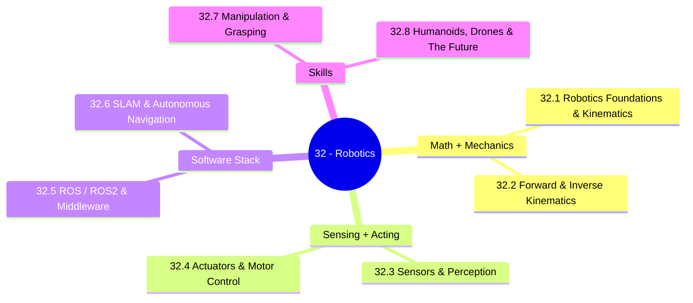

*Back to [00 - 09 - Learning Index](00---09---Learning-Index) | Part of [LEARNING_PATH](LEARNING_PATH)*

# 🤖 Robotics — Subject Plan

> *"In 2026, humanoid robotics crossed from research curiosity into commercial reality. Boston Dynamics's electric Atlas began shipping; Figure AI deployed thousands; Tesla committed to consumer Optimus by year-end. The question is no longer 'can robots work?' — it's 'who controls the software?'"*
> — paraphrased from [TechTimes — Robotics Summit 2026](https://www.techtimes.com/articles/317154/20260525/humanoid-robots-reach-production-scale-robotics-summit-opens-ros-vs-proprietary-physical-ai.htm) and [aimagicx — Humanoid Robots in the Workplace 2026](https://www.aimagicx.com/blog/humanoid-robots-workplace-tesla-optimus-atlas-2026) (rephrased for compliance)

---

## 🎯 Mission Statement

This track exists to make you **fluent** in the robotics stack at the moment it matters most.

The 2026 reality:
- Boston Dynamics Atlas (electric) is in commercial production, with Hyundai and Google DeepMind committed.
- Figure AI 03 is deploying at warehouses by the thousands.
- Tesla Optimus Gen 3 is targeted for consumer availability by end of 2026 at ~$20K.
- Unitree G1 ($16K), 1X NEO, Apptronik Apollo, Agility Digit are all live in the field.
- The platform war is **ROS 2 vs proprietary "physical AI" stacks** (NVIDIA Isaac, Meta Habitat, Skild AI).

Whether you build robots or build *for* robots (perception models, simulation, fleet ops, vertical software), you need a working mental model of:

1. **Kinematics + dynamics** — what a robot can do mechanically.
2. **Sensors + perception** — how it senses the world.
3. **Actuators + control** — how it moves.
4. **ROS 2 + middleware** — how the software is wired.
5. **SLAM + navigation** — how it knows where it is.
6. **Manipulation + grasping** — how it picks things up.
7. **Humanoids + drones** — the form factors driving the next decade.

This curriculum is built on the **prerequisites you already have**: electronics ([Track 21](Subject_Plan)), Python ([Track 01](Subject_Plan)), 3D math ([Track 09](Subject_Plan)), control theory + dynamics ([Math/Phys 11](Subject_Plan), [Math/Phys 04](Subject_Plan)).

---

## 📊 Track Overview



---

## 📚 Chapter Inventory

| # | Chapter | Domain | Status |
|---|---------|--------|--------|
| 32.1 | Robotics Foundations & Kinematics | Frames, transforms, DH parameters | 🟡 Skeleton |
| 32.2 | Forward & Inverse Kinematics | FK, IK (analytical + numerical), Jacobians | 🟡 Skeleton |
| 32.3 | Sensors & Perception — IMU, LiDAR, Cameras, Encoders | Sensor processing | 🟡 Skeleton |
| 32.4 | Actuators & Motor Control — Servos, BLDC, Steppers, Torque Control | Low-level control | 🟡 Skeleton |
| 32.5 | ROS / ROS 2 & Middleware — Nodes, Topics, Services, Actions, DDS | Software architecture | 🟡 Skeleton |
| 32.6 | SLAM & Autonomous Navigation — ORB-SLAM3, Cartographer, Nav2 | Mapping + localization | 🟡 Skeleton |
| 32.7 | Manipulation & Grasping — MoveIt, GraspNet, Whole-body Control | Manipulator robotics | 🟡 Skeleton |
| 32.8 | Humanoids, Drones & The Future of Robotics | Frontier systems | 🟡 Skeleton |

---

## 🔗 Prerequisites

| Prerequisite | Where You Learned It | Why It Matters |
|---|---|---|
| Electronics & buses | [Subject_Plan](Subject_Plan) | A robot is still a microcontroller talking to motors and sensors |
| Linear algebra | [Subject_Plan](Subject_Plan) | Every transform is a matrix; Jacobians, SVD for IK |
| Calculus / ODEs | [Subject_Plan](Subject_Plan), [Subject_Plan](Subject_Plan) | Equations of motion, control loops |
| Classical mechanics | [Subject_Plan](Subject_Plan) | Lagrangian + Newton-Euler dynamics |
| Control theory | [Subject_Plan](Subject_Plan) | PID, LQR, MPC |
| 3D math + quaternions | [28.1 - 3D Math Fundamentals](28.1---3D-Math-Fundamentals), [28.2 - Quaternions & Rotations](28.2---Quaternions-&-Rotations) | SE(3), orientation |
| Python | [Subject_Plan](Subject_Plan) | ROS 2 rclpy, perception scripting |
| C++ | [Subject_Plan](Subject_Plan) | ROS 2 rclcpp, real-time nodes |

---

## 🆓 Premium-Free Resource Catalog

> Pictures, videos, and reference materials live **outside the repo** (YouTube, GitHub, official docs). SVG diagrams that we author live inside `../_svgs/` with the `robo__<ch>-fig<n>.svg` prefix.

### 🎓 Primary Lecture & Course Series

| Resource | Provider | Coverage | Link |
|---|---|---|---|
| **Modern Robotics (Lynch & Park)** | Northwestern / Coursera | The canonical free textbook + video lectures + Coursera specialization | [hades.mech.northwestern.edu/index.php/Modern_Robotics](http://hades.mech.northwestern.edu/index.php/Modern_Robotics) |
| **MIT 6.4210/6.842 — Robotic Manipulation (Russ Tedrake)** | MIT OCW | Modern manipulation + Drake + dynamics | [manipulation.mit.edu](https://manipulation.csail.mit.edu/) |
| **MIT 6.832 — Underactuated Robotics (Russ Tedrake)** | MIT OCW | Hard problems: walking, flight, contact | [underactuated.mit.edu](https://underactuated.csail.mit.edu/) |
| **MIT 6.881 — Computational Sensorimotor Learning** | MIT OCW | RL + robotics | [ocw.mit.edu](https://ocw.mit.edu/) |
| **Stanford CS223A — Introduction to Robotics (Khatib)** | Stanford Online | Manipulator robotics classic | [Stanford Online](https://see.stanford.edu/Course/CS223A) |
| **ROS 2 official tutorials** | Open Robotics | ROS 2 Jazzy / Humble fundamentals | [docs.ros.org](https://docs.ros.org/en/jazzy/Tutorials.html) |
| **Articulated Robotics (Josh Newans)** | YouTube | Best practical ROS 2 + Gazebo + real robot series | [@articulatedrobotics](https://www.youtube.com/@ArticulatedRobotics) |
| **Robotics Back-End** | YouTube | ROS 2 + Nav2 + MoveIt 2 tutorials | [@RoboticsBackEnd](https://www.youtube.com/@RoboticsBackEnd) |
| **The Construct ROS Online Academy** | Community | Free + paid ROS courses, simulators in browser | [theconstruct.ai](https://www.theconstruct.ai/) |
| **NVIDIA Isaac Lab** | NVIDIA | GPU-accelerated robot learning environments | [developer.nvidia.com/isaac/lab](https://developer.nvidia.com/isaac/lab) |
| **Drake (Toyota Research / MIT)** | TRI | Multibody simulation + planning toolbox | [drake.mit.edu](https://drake.mit.edu/) |
| **OpenAI Gym / Gymnasium / RoboHive** | OpenAI / community | RL benchmarks + robotics envs | [github.com/Farama-Foundation/Gymnasium](https://github.com/Farama-Foundation/Gymnasium) |

### 📖 Open-Source / Free Books

| Resource | Author / Provider | Coverage |
|---|---|---|
| **Modern Robotics** | Lynch & Park | Free PDF — [open free textbook](http://hades.mech.northwestern.edu/index.php/Modern_Robotics) |
| **Robotic Manipulation (Tedrake)** | MIT | Free online textbook — [manipulation.csail.mit.edu](https://manipulation.csail.mit.edu/) |
| **Underactuated Robotics (Tedrake)** | MIT | Free online textbook — [underactuated.csail.mit.edu](https://underactuated.csail.mit.edu/) |
| **Probabilistic Robotics (Thrun, Burgard, Fox)** | MIT Press | Bayesian filtering, SLAM (paid; companion notes free) |
| **Robotics: Modelling, Planning and Control (Siciliano et al.)** | Springer | Comprehensive textbook (paid; lecture notes online) |
| **ROS 2 Documentation** | Open Robotics | Authoritative — [docs.ros.org](https://docs.ros.org/) |
| **Nav2 Documentation** | Steve Macenski et al. | Best-in-class navigation stack docs — [docs.nav2.org](https://docs.nav2.org/) |
| **MoveIt 2 Documentation** | PickNik Robotics | Manipulation framework — [moveit.picknik.ai](https://moveit.picknik.ai/) |
| **ORB-SLAM3 paper + repo** | UZ-SLAMLab | Visual-Inertial SLAM reference — [github.com/UZ-SLAMLab/ORB_SLAM3](https://github.com/UZ-SLAMLab/ORB_SLAM3) |

### 🛠️ Free / Indie Tooling Worth Knowing

- **ROS 2** (Jazzy / Humble) — middleware + ecosystem.
- **Gazebo Sim** (Harmonic / Ionic) — modern Gazebo, replaces "Classic".
- **NVIDIA Isaac Sim** + **Isaac Lab** — GPU-accelerated physics + RL.
- **Drake** — Toyota Research / MIT multibody simulator.
- **MuJoCo** (now open-source under Google DeepMind) — fast, accurate contact simulation.
- **PyBullet** — Python-friendly physics for prototyping.
- **Foxglove Studio** — modern ROS visualization.
- **rerun.io** — live multi-modal logging/visualization.
- **MoveIt 2** — manipulation stack.
- **Nav2** — autonomous navigation stack.
- **micro-ROS** — ROS 2 on microcontrollers (FreeRTOS, Zephyr).

---

## 🏗️ Study Strategy

### Phase 1: Math + Mechanics (Chapters 22.1–32.2) — 3 weeks
Frames, transforms, DH parameters, FK + IK, Jacobians. **Pair with Modern Robotics chapters 1–6 + Coursera specialization Course 1–2.** Implement FK / IK in Python for a 6-DOF arm.

### Phase 2: Sensors + Actuators (Chapters 22.3–32.4) — 3 weeks
IMU/Lidar/cameras/encoders; servo/BLDC/stepper drives. **Build a small two-wheeled robot or a 3-servo arm.** This phase exits the textbook and enters the lab.

### Phase 3: Software Stack (Chapters 22.5–32.6) — 4 weeks
ROS 2 from zero — nodes, topics, services, actions, DDS, launch files, tf2. Then Nav2 + SLAM (Cartographer / slam_toolbox / ORB-SLAM3). **Outcome: your robot localizes, maps, and navigates a room.**

### Phase 4: Skills + Frontier (Chapters 22.7–32.8) — 2 weeks
MoveIt 2 manipulation, grasping, then a survey of humanoid + drone frontiers + the 2026 industry landscape.

---

## 📁 Directory Structure

```
32 - Robotics/
├── Subject_Plan.md          ← You are here
├── LEARNING_PATH.md
├── README.md
├── 32.1 - Robotics Foundations & Kinematics.md
├── 32.2 - Forward & Inverse Kinematics.md
├── 32.3 - Sensors & Perception - IMU, LiDAR, Cameras, Encoders.md
├── 32.4 - Actuators & Motor Control - Servos, BLDC, Steppers, Torque Control.md
├── 32.5 - ROS 2 & Middleware - Nodes, Topics, Services, Actions, DDS.md
├── 32.6 - SLAM & Autonomous Navigation - ORB-SLAM3, Cartographer, Nav2.md
├── 32.7 - Manipulation & Grasping - MoveIt, GraspNet, Whole-body Control.md
├── 32.8 - Humanoids, Drones & The Future of Robotics.md
└── _practice/
    └── scripts/             ← FK/IK calculators, ROS 2 examples, URDF loaders
```

SVG figures live one level up in `../_svgs/robo__<chapter>-fig<n>.svg`.

---

*Next: [LEARNING_PATH](LEARNING_PATH) — Visual progression map*

---

## Related Notes
- [32.6 - SLAM & Autonomous Navigation - ORB-SLAM3, Cartographer, Nav2](32.6---SLAM-&-Autonomous-Navigation---ORB-SLAM3,-Cartographer,-Nav2) - Shared navigation/robotics focus
- [32.8 - Humanoids, Drones & The Future of Robotics](32.8---Humanoids,-Drones-&-The-Future-of-Robotics) - Shared humanoids/robotics focus
- [LEARNING_PATH](LEARNING_PATH) - Shared manipulation/humanoids focus
- [32.1 - Robotics Foundations & Kinematics](32.1---Robotics-Foundations-&-Kinematics) - Shared kinematics/robotics focus
- [32.2 - Forward & Inverse Kinematics](32.2---Forward-&-Inverse-Kinematics) - Shared kinematics/robotics focus
