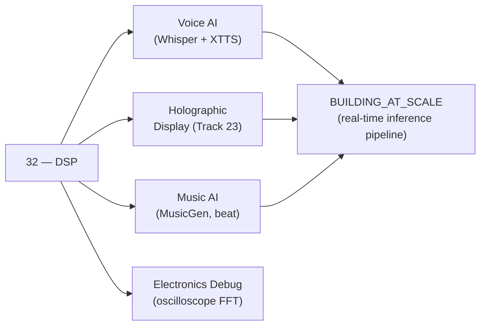

*Back to [Subject_Plan](Subject_Plan) | Part of [00 - 09 - Learning Index](00---09---Learning-Index)*

# 🗺️ Signal Processing & DSP — Learning Path

> *"Every audio AI mistake — wrong sample rate, aliased features, phased-out formants, incoherent phase in the vocoder — traces back to skipping something in this track. Build the foundation once. Build it correctly."*

---

## 🧭 Progression Map

```mermaid
graph TD
    %% Prerequisites
    MATH["✅ Track 07 Math<br/>Complex numbers, integrals"]
    PY["✅ Track 01 Python<br/>NumPy, SciPy, Matplotlib"]
    ELEC["✅ Track 21 Electronics<br/>ADC/DAC hardware"]

    %% Foundations
    C1["04.1 Signals & Sampling<br/>Nyquist · ADC/DAC · LTI · Quantization"]

    %% Frequency analysis
    C2["04.2 Fourier Series & Transform<br/>FT theory · Pairs · Convolution thm"]
    C3["04.3 DFT & FFT<br/>Cooley-Tukey · Windowing · Resolution"]

    %% Filter design
    C4["04.4 FIR & IIR Filters<br/>Parks-McClellan · Bilinear · Biquad"]

    %% Audio AI pipeline
    C5["04.5 Audio & Psychoacoustics<br/>Mel · MFCCs · Log-mel · Masking"]

    %% Spatial DSP
    C6["04.6 Image & 2D Transforms<br/>2D DFT · Kernels · Fourier optics"]

    %% Speech AI
    C7["04.7 Speech & Voice<br/>Whisper ASR · XTTS TTS · Pitch"]

    %% AI applications
    C8["04.8 Spectral AI<br/>wav2vec2 · EnCodec · AudioLM · Features"]

    %% Prerequisite → Chapter 1
    MATH --> C1
    PY   --> C1
    ELEC --> C1

    %% Linear chain
    C1 --> C2 --> C3 --> C4 --> C5
    C3 --> C6
    C5 --> C7 --> C8

    %% Cross-connections
    C4 --> C5
    C6 --> HOLO["23 — Holographics<br/>(angular spectrum)"]
    C8 --> AIEXP["05 — AI Experiments<br/>(Whisper · XTTS)"]
    C8 --> AIML["10 — AI/ML Systems<br/>(foundation models)"]

    %% Styling
    style MATH fill:#2d5016,stroke:#4a8c2a
    style PY   fill:#2d5016,stroke:#4a8c2a
    style ELEC fill:#2d5016,stroke:#4a8c2a

    style C1 fill:#1a3a5c,stroke:#3d7ab8
    style C2 fill:#1a3a5c,stroke:#3d7ab8
    style C3 fill:#1a3a5c,stroke:#3d7ab8
    style C4 fill:#4a3a1a,stroke:#b8a83d
    style C5 fill:#3a1a4a,stroke:#8c3db8
    style C6 fill:#1a4a2a,stroke:#3db85c
    style C7 fill:#4a1a2a,stroke:#b83d5c
    style C8 fill:#1a4a4a,stroke:#3db8b8

    style HOLO  fill:#2a2a2a,stroke:#666
    style AIEXP fill:#2a2a2a,stroke:#666
    style AIML  fill:#2a2a2a,stroke:#666
```

---

## 📅 Suggested Timeline

| Week | Focus | Chapter | Hours/Week | Key Checkpoint |
|------|-------|---------|------------|----------------|
| 1 | Sampling foundations + LTI systems | 04.1 | 6–8 | Implement aliasing demo in Python |
| 2 | Fourier Series + Transform + worked example | 04.2 | 8–10 | Reproduce 440+880 Hz spectrum by hand AND in NumPy |
| 3 | FFT algorithm + windowing + STFT | 04.3 | 8–10 | Implement Hann-windowed FFT with correct amplitude scaling |
| 4 | Filter design — FIR and IIR | 04.4 | 8–10 | Design and plot a 60 Hz notch filter + 4th-order LPF |
| 5 | Mel scale + MFCCs + log-mel spectrogram | 04.5 | 8–10 | Extract log-mel spec from your own voice; compare to Whisper's output |
| 6 | 2D DFT + image filtering + edge detection | 04.6 | 6–8 | Apply Sobel to a photograph; visualise 2D FFT magnitude |
| 7 | Pitch detection + Whisper + XTTS | 04.7 | 8–10 | Run Whisper on a voice recording; inspect mel input tensor |
| 8 | Spectral features + audio AI landscape | 04.8 | 6–8 | Extract full feature set; run EnCodec on a file |

**Total ≈ 8 weeks at 8 hrs/week ≈ 64 hours.**

---

## 🎯 Milestone Checkpoints

### ✅ Checkpoint 1: "I Understand Sampling" (after 04.1)
- [ ] Can state Nyquist theorem precisely: fs ≥ 2·f_max
- [ ] Can calculate the alias frequency of a 12 kHz tone sampled at 16 kHz (answer: 4 kHz)
- [ ] Can calculate SQNR for a 16-bit system (≈ 98 dB)
- [ ] Can name the 4 steps of the ADC chain and what is lost permanently at each
- [ ] Has implemented the aliasing demo in Python (see 04.1 §7)

### ✅ Checkpoint 2: "I See in Frequency" (after 04.2 + 04.3)
- [ ] Can derive the Fourier Series coefficients for a square wave (result: 4/π · Σ sin(nωt)/n for odd n)
- [ ] Can compute the spectrum of A₁sin(2π·440t) + A₂sin(2π·880t) by hand
- [ ] Can draw the Cooley-Tukey 8-point butterfly diagram from memory
- [ ] Can calculate frequency resolution: for fs=16 000, N=512, Δf = 31.25 Hz
- [ ] Can apply a Hann window and explain the amplitude correction factor
- [ ] Has implemented a Hann-windowed FFT with correct dBFS axis

### ✅ Checkpoint 3: "I Design Filters" (after 04.4)
- [ ] Can state when to use FIR vs IIR and the primary reason for each
- [ ] Can design a Butterworth IIR LPF using `scipy.signal.butter(..., output='sos')`
- [ ] Knows the danger of using `lfilter` with high-order `ba` coefficients (numerical instability)
- [ ] Can design a Parks-McClellan FIR using `scipy.signal.remez`
- [ ] Understands the Audio EQ Cookbook biquad parametric EQ formula
- [ ] Has applied a notch filter to remove 60 Hz hum from a simulated signal

### ✅ Checkpoint 4: "I Speak Mel" (after 04.5)
- [ ] Can state the mel formula: m = 2595·log₁₀(1+f/700)
- [ ] Can list the 7 MFCC extraction steps from memory
- [ ] Understands why Whisper uses 80 mel bins, 16 kHz, 400-sample window
- [ ] Can reproduce Whisper's log-mel spectrogram using Librosa
- [ ] Understands simultaneous masking and why MP3 exploits it
- [ ] Has extracted log-mel spectrogram from their own voice recording

### ✅ Checkpoint 5: "I Process Images Correctly" (after 04.6)
- [ ] Can write the 2D DFT equation and explain what DC and high-frequency bins represent
- [ ] Can apply Gaussian blur, Sobel X, Sobel Y, and Laplacian using scipy.signal
- [ ] Understands why `fftshift` is needed for spectrum visualisation
- [ ] Can explain the angular spectrum method H(u,v) = e^{jkz√(1-λ²u²-λ²v²)}
- [ ] Has applied frequency-domain lowpass filtering to an image

### ✅ Checkpoint 6: "I Run the Voice Stack" (after 04.7 + 04.8)
- [ ] Can run Whisper on a 30-second audio file and inspect the mel tensor shape (80, 3000)
- [ ] Can run XTTS to synthesise speech from text with a cloned voice
- [ ] Can compute f₀ using `librosa.pyin` and plot the pitch track
- [ ] Can extract the full Librosa feature set: centroid, bandwidth, rolloff, flatness, ZCR, chroma
- [ ] Can explain how EnCodec tokenises audio for language model training
- [ ] Has run `encodec` on a file and inspected the codec token shape

---

## 🔄 How This Connects to Bill's Mission

Track 04 is the **signal layer** under Bill's creative technical stack. It provides:
- **Voice intelligence** — understanding what Whisper is doing to your audio before feeding it to the LLM
- **Synthesis quality** — debugging XTTS artefacts by examining the mel spectrogram
- **Holographic math** — the 2D FFT and angular spectrum method that propagates wavefronts in Track 23
- **Electronics intuition** — reading an oscilloscope's FFT mode, understanding ADC noise floor

---

## 📖 Reading Order with External Resource Alignment

| Chapter | Free Course / Reference | External Hours |
|---------|------------------------|----------------|
| 04.1 | dspguide.com Ch. 3 (Sampling) + MIT 6.003 Lec 1–3 | 4–6 |
| 04.2 | dspguide.com Ch. 8–10 + 3Blue1Brown Fourier video | 6–8 |
| 04.3 | dspguide.com Ch. 12 + Julius Smith CCRMA MathDFT | 6–8 |
| 04.4 | dspguide.com Ch. 14–17 + Julius Smith IntroFilters + Audio EQ Cookbook | 8–10 |
| 04.5 | Haytham Fayek MFCC tutorial + Librosa docs + Whisper paper | 6–8 |
| 04.6 | dspguide.com Ch. 24 + scipy.ndimage docs + OpenCV tutorials | 4–6 |
| 04.7 | Whisper paper + XTTS docs + VITS paper + HiFi-GAN paper | 8–10 |
| 04.8 | wav2vec2 / HuBERT / EnCodec / AudioLM papers + Librosa feature docs | 6–8 |

---

## 💡 The DSP Engineer's Edge

Three principles separate the engineer who *uses* audio AI from the one who *understands* it:

1. **Sampling rate is not arbitrary.** A wrong sample rate = corrupted features = degraded model performance. Always check the model's expected rate. Whisper = 16 kHz. HiFi-GAN = 22 050 Hz or 24 000 Hz. Don't assume.

2. **Phase is real.** For synthesis tasks (TTS, neural vocoder, holography), phase is everything. Stripping phase (as MFCCs do) loses reconstruction fidelity. Griffin-Lim struggles precisely because it ignores phase. HiFi-GAN succeeds because it learns to generate correct phase implicitly.

3. **The frequency domain is the native domain.** Every filter, every spectral feature, every mel bin is easier to reason about in the frequency domain. When something sounds wrong in a synthesised voice, look at the mel spectrogram first. The artefact is usually visible there before it is audible.

That triad — *respect sample rate, respect phase, think in frequency* — is the DSP edge.

---

*Next: [04.1 - Signals, Systems & Sampling Theory](04.1---Signals,-Systems-&-Sampling-Theory) — Build the foundation.*

---

## Related Notes
- [04.5 - Audio Signal Processing & Psychoacoustics](04.5---Audio-Signal-Processing-&-Psychoacoustics) - Shared whisper/mfcc focus
- [04.7 - Speech & Voice Processing (ASR-TTS Foundations)](04.7---Speech-&-Voice-Processing-(ASR-TTS-Foundations)) - Shared whisper/mfcc focus
- [04.8 - Spectral Analysis & Applications in AI](04.8---Spectral-Analysis-&-Applications-in-AI) - Shared audio-ai/whisper focus
