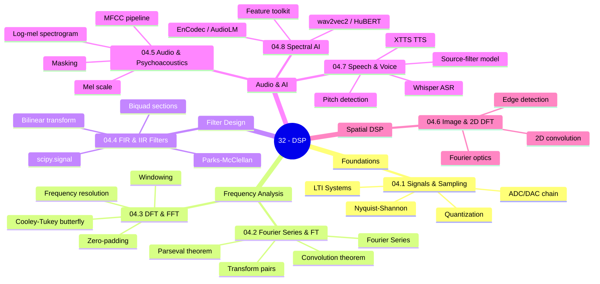
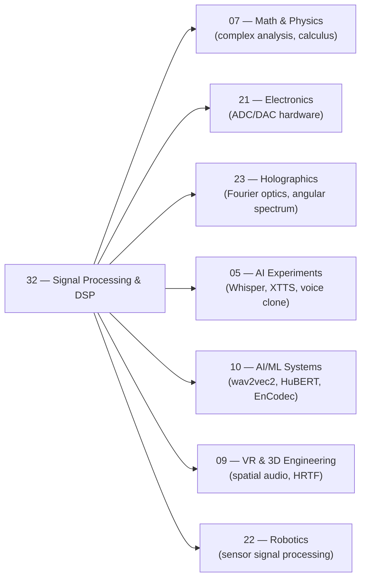

*Back to [00 - 09 - Learning Index](00---09---Learning-Index) | Part of [LEARNING_PATH](LEARNING_PATH)*

# 📡 Signal Processing & DSP — Subject Plan

> *"The FFT is a computer algorithm that computes the Discrete Fourier Transform. It is one of the most important algorithms ever created."* — paraphrased from [dspguide.com](https://www.dspguide.com/ch12.htm)

> *"Every audio AI model is built on top of DSP machinery. The FFT didn't retire — it became a frozen preprocessing layer in a neural network."*

---

## 🎯 Mission Statement

**The math that connects your physics brain to audio AI.** FFT, filters, sampling theory, MFCCs, spectrograms — the signal chain from microphone to Whisper to XTTS to holographic wavefront. Bridges [Track 07 Math](Subject_Plan), [Track 21 Electronics](Subject_Plan), [Track 23 Holographics](Subject_Plan), and the voice/audio experiments in [Track 05](Subject_Plan).

The chapters mirror the questions a DSP engineer asks:

- *What is the signal and how do I digitise it without losing information?* → 04.1 Signals & Sampling
- *What frequencies are in this signal?* → 04.2 Fourier Transform
- *How do I compute that fast enough to run in real-time?* → 04.3 DFT & FFT
- *How do I shape or remove specific frequencies?* → 04.4 Filters
- *Why does Whisper use 80 mel bins at 16 kHz, and why does that match the ear?* → 04.5 Audio & Psychoacoustics
- *How do I apply the same tools to images and holograms?* → 04.6 Image Processing
- *How does speech become text and text become speech?* → 04.7 Speech & Voice
- *How do modern AI models consume all of this?* → 04.8 Spectral AI

---

## 📊 Track Overview



---

## 📚 Chapter Inventory

| # | Chapter | Domain | Status |
|---|---------|--------|--------|
| 04.1 | Signals, Systems & Sampling Theory | ADC/DAC, Nyquist, LTI, quantization | ✅ Active |
| 04.2 | Fourier Series & Fourier Transform | FT theory, transform pairs, Parseval, 440+880 Hz example | ✅ Active |
| 04.3 | Discrete Fourier Transform & FFT | Cooley-Tukey, windowing, frequency resolution | ✅ Active |
| 04.4 | Digital Filters: FIR & IIR | Parks-McClellan, bilinear transform, biquad SOS | ✅ Active |
| 04.5 | Audio Signal Processing & Psychoacoustics | Mel scale, MFCCs, log-mel, masking | ✅ Active |
| 04.6 | Image Processing & 2D Transforms | 2D DFT, kernels, edge detection, Fourier optics | ✅ Active |
| 04.7 | Speech & Voice Processing (ASR/TTS Foundations) | Whisper, XTTS, pitch detection, source-filter | ✅ Active |
| 04.8 | Spectral Analysis & Applications in AI | wav2vec2, EnCodec, AudioLM, feature toolkit | ✅ Active |

---

## 🔗 Prerequisites

| Prerequisite | Where you learned it | Why it matters |
|---|---|---|
| Complex numbers & Euler's formula | [Track 07 Math](Subject_Plan) | e^{jωt} = cos(ωt) + j·sin(ωt) underpins the Fourier Transform |
| Calculus (integration, differentiation) | [Track 07 Math](Subject_Plan) | Fourier integrals, filter derivations |
| Linear algebra (vectors, matrices) | [Track 07 Math](Subject_Plan) | DFT matrix, mel filterbank as matrix multiply |
| Basic Python + NumPy | [Track 01 Python](Subject_Plan) | All examples use NumPy, SciPy, Librosa |
| Waves & oscillations (physics) | [Track 07 Math](Subject_Plan) | Intuition for sinusoids and wave superposition |
| Electronic circuits (ADC/DAC) | [Track 21 Electronics](Subject_Plan) | Physical implementation of sampling |

---

## 🆓 Open-Source / Free Catalog

> Pictures, videos, and course recordings are stored **outside the vault** (YouTube, official docs, open-source books). SVG figures are stored in `../_svgs/dsp__32.x-fig1.svg`.

### 📖 Books (Free / Fully Open)

| Title | Author / Provider | Why |
|---|---|---|
| **The Scientist and Engineer's Guide to DSP** | Steven W. Smith — [dspguide.com](https://www.dspguide.com/) | **The** free DSP textbook. Covers everything in this track. 34 chapters, fully online. |
| **Mathematics of the DFT** | Julius O. Smith III (CCRMA Stanford) — [ccrma.stanford.edu/~jos/mdft](https://ccrma.stanford.edu/~jos/mdft/) | Rigorous DFT theory, free online |
| **Introduction to Digital Filters** | Julius O. Smith III (CCRMA) — [ccrma.stanford.edu/~jos/filters](https://ccrma.stanford.edu/~jos/filters/) | FIR/IIR filter theory, free |
| **Spectral Audio Signal Processing** | Julius O. Smith III (CCRMA) — [ccrma.stanford.edu/~jos/sasp](https://ccrma.stanford.edu/~jos/sasp/) | Audio-focused DSP, free |
| **Physical Audio Signal Processing** | Julius O. Smith III (CCRMA) — [ccrma.stanford.edu/~jos/pasp](https://ccrma.stanford.edu/~jos/pasp/) | Synthesis models, reverb physics, free |
| **Audio EQ Cookbook** | Robert Bristow-Johnson — [webaudio.github.io/Audio-EQ-Cookbook](https://webaudio.github.io/Audio-EQ-Cookbook/audio-eq-cookbook.html) | The canonical biquad EQ reference |
| **Think DSP** | Allen Downey (O'Reilly) — [greenteapress.com/wp/think-dsp](https://greenteapress.com/wp/think-dsp/) | Practical DSP in Python, free |

### 🎓 Courses & Lecture Series

| Resource | Provider | Coverage |
|---|---|---|
| **MIT OCW 6.341 Discrete-Time Signal Processing** | MIT (Oppenheim & Schafer) | Full graduate DSP course — [ocw.mit.edu/6.341](https://ocw.mit.edu/courses/6-341-discrete-time-signal-processing-fall-2005/) |
| **MIT OCW 6.003 Signals and Systems** | MIT | Continuous + discrete systems — [ocw.mit.edu/6.003](https://ocw.mit.edu/courses/6-003-signals-and-systems-fall-2011/) |
| **DSP specialisation** | Coursera (EPFL / Duke / Northwestern) | Guided DSP with programming assignments |
| **3Blue1Brown — Fourier Transform** | YouTube | Visual intuition — [youtube.com/watch?v=spUNpyF58BY](https://www.youtube.com/watch?v=spUNpyF58BY) |
| **Librosa tutorial series** | Official Librosa docs + Music Information Retrieval (MIR) community | Audio in Python |

### 🛠️ Reference Documentation

| Tool | Link | Use in this track |
|---|---|---|
| **NumPy FFT** | [numpy.org/doc/stable/reference/routines.fft](https://numpy.org/doc/stable/reference/routines.fft.html) | Core FFT |
| **SciPy Signal** | [docs.scipy.org/doc/scipy/reference/signal](https://docs.scipy.org/doc/scipy/reference/signal.html) | Filters, STFT, spectrograms |
| **SciPy FFT** | [docs.scipy.org/doc/scipy/reference/fft](https://docs.scipy.org/doc/scipy/reference/fft.html) | Faster FFT than NumPy for large N |
| **Librosa** | [librosa.org/doc/latest](https://librosa.org/doc/latest/) | Audio analysis, MFCCs, mel specs, beat tracking |
| **TorchAudio** | [pytorch.org/audio](https://pytorch.org/audio/stable/index.html) | GPU-accelerated audio DSP + AI models |
| **PyDub** | [pydub.com](https://www.pydub.com/) | Audio file manipulation, format conversion |
| **soundfile** | [python-soundfile.readthedocs.io](https://python-soundfile.readthedocs.io/) | Reading/writing WAV, FLAC, OGG |
| **webrtcvad** | [github.com/wiseman/py-webrtcvad](https://github.com/wiseman/py-webrtcvad) | Real-time VAD |
| **Silero VAD** | [github.com/snakers4/silero-vad](https://github.com/snakers4/silero-vad) | Neural VAD |
| **OpenAI Whisper** | [github.com/openai/whisper](https://github.com/openai/whisper) | ASR |
| **Coqui TTS / XTTS** | [docs.coqui.ai](https://docs.coqui.ai/) | TTS synthesis |
| **HuggingFace Audio** | [huggingface.co/docs/transformers/audio](https://huggingface.co/docs/transformers/index) | wav2vec2, HuBERT, Whisper via HF |

---

## 🏗️ Study Strategy

### Phase 1 — Foundations (Chapters 32.1–04.3) — 2 weeks
Build the mathematical core. Sampling theorem, Fourier Transform theory, and FFT algorithm. Do not skip the worked examples — implement them in Python as you go. The 440 Hz + 880 Hz spectrum example in 04.2 should be reproducible by hand calculation *and* with NumPy.

### Phase 2 — Filter Design (Chapter 04.4) — 1 week
Learn both FIR and IIR design. The goal: given a cutoff frequency and stopband attenuation, produce a working filter in scipy.signal in under 5 minutes without looking at the docs. Always use `output='sos'` for IIR.

### Phase 3 — Audio Features & Psychoacoustics (Chapter 04.5) — 2 weeks
This is the bridge to audio AI. Extract mel spectrograms from your own voice using Librosa. Compare what 40 vs 80 vs 128 mel bins look like. Run the Whisper pre-processing manually step-by-step and inspect each stage.

### Phase 4 — Image Processing & Spatial DSP (Chapter 04.6) — 1 week
Apply the same tools to images. Compute 2D FFTs of photographs. Run Sobel edge detection. The angular spectrum propagation example in 04.6 directly connects to Track 23 holographics work.

### Phase 5 — Speech & Voice AI (Chapters 32.7–04.8) — 2 weeks
Run Whisper and XTTS locally. Inspect the STFT/mel representations they consume. Modify the feature extraction and observe the effect. This is the direct application phase.

**Total ≈ 8 weeks at 8 hrs/week ≈ 64 hours.**

---

## 🔭 2026 Industry Snapshot

> Sources paraphrased for compliance — never more than 30 consecutive words from any single source.

- **Whisper large-v3-turbo (Oct 2024):** OpenAI released a distilled version offering roughly 8× faster inference than large-v3 at comparable accuracy, available via the standard `openai/whisper` package. — paraphrased from [openai/whisper GitHub releases](https://github.com/openai/whisper/releases).
- **EnCodec → language model audio generation:** The combination of neural audio codecs (EnCodec, DAC, SoundStream) and autoregressive language models (VALL-E, MusicGen, AudioLM) is the dominant 2026 paradigm for high-quality audio generation from text or other conditioning signals. — paraphrased from [arXiv EnCodec 2210.13438](https://arxiv.org/abs/2210.13438) and [arXiv AudioLM 2209.03143](https://arxiv.org/abs/2209.03143).
- **Moshi (Kyutai, 2024):** A full-duplex real-time voice AI that processes speech input and synthesises speech output simultaneously using a causal streaming architecture built on codec tokens. — paraphrased from [kyutai.org/moshi](https://kyutai.org/moshi).
- **Kokoro TTS (2025):** An 82M parameter open-source TTS model competitive with commercial APIs, capable of running in real-time on CPU. — paraphrased from [kokoro-tts GitHub](https://github.com/remsky/kokoro-tts).
- **DSP + AI hybrid:** Leading edge models (Canary, SeamlessM4T) use learnable feature extractors that replace fixed mel filterbanks, while maintaining the same STFT preprocessing step. The mel filterbank is being jointly optimised with the rest of the model in some recent architectures. — paraphrased from [arXiv Canary 2406.19674](https://arxiv.org/abs/2406.19674).
- **WebAssembly DSP (2025–26):** WASM SIMD instructions now enable real-time FFT, STFT, and Whisper-tiny inference in the browser without GPU, enabling client-side audio AI. — paraphrased from [web.dev/articles/web-audio-api-performance](https://web.dev/articles/web-audio-api-performance).

---

## 📁 Directory Structure

```
04 - Signal Processing & DSP/
├── Subject_Plan.md                              ← You are here
├── LEARNING_PATH.md                             ← Visual roadmap
├── README.md                                    ← Subject hub + media references
├── 04.1 - Signals, Systems & Sampling Theory.md
├── 04.2 - Fourier Series & Fourier Transform.md
├── 04.3 - Discrete Fourier Transform & FFT.md
├── 04.4 - Digital Filters - FIR & IIR.md
├── 04.5 - Audio Signal Processing & Psychoacoustics.md
├── 04.6 - Image Processing & 2D Transforms.md
├── 04.7 - Speech & Voice Processing (ASR-TTS Foundations).md
└── 04.8 - Spectral Analysis & Applications in AI.md

SVG figures in ../_svgs/:
  dsp__32.1-fig1.svg   dsp__32.2-fig1.svg   dsp__32.3-fig1.svg
  dsp__32.4-fig1.svg   dsp__32.5-fig1.svg   dsp__32.6-fig1.svg
  dsp__32.7-fig1.svg   dsp__32.8-fig1.svg
```

---

## 🔗 How This Track Plugs Into Everything Else



---

*Next: [LEARNING_PATH](LEARNING_PATH) — Visual progression map and weekly schedule*

---

## Related Notes
- [04.4 - Digital Filters - FIR & IIR](04.4---Digital-Filters---FIR-&-IIR) - Shared dsp/fir focus
- [04.5 - Audio Signal Processing & Psychoacoustics](04.5---Audio-Signal-Processing-&-Psychoacoustics) - Shared psychoacoustics/whisper focus
- [04.7 - Speech & Voice Processing (ASR-TTS Foundations)](04.7---Speech-&-Voice-Processing-(ASR-TTS-Foundations)) - Shared whisper/mfcc focus
- [04.8 - Spectral Analysis & Applications in AI](04.8---Spectral-Analysis-&-Applications-in-AI) - Shared audio-ai/whisper focus
