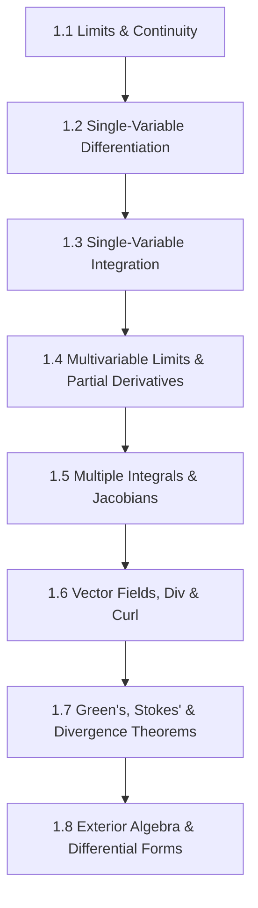

# Subject Syllabus: 01 - Mathematical Foundations & Calculus

*Back to [Math & Physics Curriculum](07---Math-and-Physics-Index)*

This syllabus defines the roadmap to mastering single-variable, multi-variable, and vector calculus, leading to differential forms. It connects theoretical proofs to your local C++ `CalculusVisualizer` tool and provides rigorous, step-by-step mathematical problems.

---

## 🗺️ 1. Curriculum Mindmap & Milestones

---

## 📚 2. Premium Free Learning Catalog

*   **🎬 Video Playlists & Courses:**
    *   [3Blue1Brown - Essence of Calculus](https://www.youtube.com/playlist?list=PLZHQObOWTQDMsr9K-rj53DwVRMYO3t5Yr) (Visual intuition for derivatives, integrals, and Taylor series).
    *   [MIT OCW - Single Variable Calculus (18.01)](https://ocw.mit.edu/courses/18-01sc-single-variable-calculus-fall-2010/) (Rigorous conceptual foundations).
    *   [MIT OCW - Multivariable Calculus (18.02)](https://ocw.mit.edu/courses/18-02sc-multivariable-calculus-fall-2010/) (Vectors, partial derivatives, multiple integrals, and vector analysis).
    *   [Professor Dave Explains - Calculus Playlist](https://www.youtube.com/playlist?list=PLybg94GvOJ9ELg33spglDeb8y15Vzo9yZ) (Excellent quick review).
*   **📖 Open-Access Textbooks:**
    *   [Apex Calculus](https://www.apexcalculus.com/) (Open-source, comprehensive, high-quality illustrations).
    *   *Calculus* by Gilbert Strang (MIT Open Textbook).

---

## 🛠️ 3. Integration with Local C++ `CalculusVisualizer`

Your local Qt/C++ tool `CalculusVisualizer` located at:
`[CalculusVisualizer](CalculusVisualizer)`
should be utilized to:
1.  **Plot derivative slopes:** Input functions $f(x)$ to watch secant lines converge to the tangent line at $x_0$.
2.  **Visualize Riemann Sums:** Adjust interval widths ($\Delta x$) to visually see the approximation error converge to zero as $n \to \infty$.
3.  **Graph Gradient Fields:** Use it to plot 2D surfaces $z = f(x,y)$ and vector gradient trajectories $\nabla f$.

---

## 🎨 4. Visualization Directive
For notes under this section, generate SVGs that highlight:
*   Secant-to-tangent limit approximations.
*   Riemann integration partitions with variable step heights.
*   Flux lines passing through closed boundaries (illustrating Green's Theorem).

---

## 📝 5. Hand-Written Challenge Problems & Exhaustive Proofs

Solve the following problems by hand. Write down every intermediate step. Check your final mathematical logic against the detailed solutions below.

### 📝 Problem 1: Rigorous Limit via Conjugate Expansion
**Evaluate the following limit analytically:**
$$\lim_{x \to 0} \frac{\sqrt{x^2 + 9} - 3}{x^2}$$

🔍 View Step-by-Step Solution

#### Step 1: Identify indeterminate form
Direct substitution yields:

$$\frac{\sqrt{0^2 + 9} - 3}{0^2} = \frac{3 - 3}{0} = \frac{0}{0} \quad (\text{Indeterminate form})$$

#### Step 2: Rationalize the numerator using the conjugate
Multiply the numerator and denominator by $\sqrt{x^2 + 9} + 3$:

$$\lim_{x \to 0} \frac{(\sqrt{x^2 + 9} - 3)(\sqrt{x^2 + 9} + 3)}{x^2 (\sqrt{x^2 + 9} + 3)}$$

#### Step 3: Expand the numerator using $(a-b)(a+b) = a^2 - b^2$

$$(\sqrt{x^2 + 9})^2 - (3)^2 = x^2 + 9 - 9 = x^2$$

Substitute this back into the limit expression:

$$\lim_{x \to 0} \frac{x^2}{x^2 (\sqrt{x^2 + 9} + 3)}$$

#### Step 4: Cancel the common factor $x^2$ (valid since $x \neq 0$)

$$\text{For } x \neq 0: \quad \frac{x^2}{x^2} = 1$$

Thus:

$$\lim_{x \to 0} \frac{1}{\sqrt{x^2 + 9} + 3}$$

#### Step 5: Evaluate the limit by direct substitution

$$\lim_{x \to 0} \frac{1}{\sqrt{x^2 + 9} + 3} = \frac{1}{\sqrt{0^2 + 9} + 3} = \frac{1}{3 + 3} = \frac{1}{6}$$

**Final Answer:**

$$\lim_{x \to 0} \frac{\sqrt{x^2 + 9} - 3}{x^2} = \frac{1}{6}$$

---

### 📝 Problem 2: Vector Calculus - Divergence Theorem Derivation
**Given the vector field $\mathbf{F} = x\mathbf{i} + y\mathbf{j} + z\mathbf{k}$ and a sphere $S$ of radius $R$ centered at the origin, verify the Divergence Theorem:**
$$\iint_S \mathbf{F} \cdot d\mathbf{S} = \iiint_V (\nabla \cdot \mathbf{F}) dV$$

🔍 View Step-by-Step Solution

#### Step 1: Compute the Divergence $\nabla \cdot \mathbf{F}$

$$\nabla \cdot \mathbf{F} = \frac{\partial}{\partial x}(x) + \frac{\partial}{\partial y}(y) + \frac{\partial}{\partial z}(z)$$

$$\nabla \cdot \mathbf{F} = 1 + 1 + 1 = 3$$

#### Step 2: Evaluate the Volume Integral (Right-Hand Side)

$$\iiint_V (\nabla \cdot \mathbf{F}) dV = \iiint_V 3 \, dV = 3 \iiint_V dV$$

Since $V$ is a sphere of radius $R$, its volume is $V_{\text{sphere}} = \frac{4}{3}\pi R^3$.

$$\iiint_V (\nabla \cdot \mathbf{F}) dV = 3 \left( \frac{4}{3}\pi R^3 \right) = 4\pi R^3$$

#### Step 3: Evaluate the Surface Integral (Left-Hand Side)
The outer unit normal vector $\mathbf{n}$ on the sphere of radius $R$ at point $(x,y,z)$ is:

$$\mathbf{n} = \frac{x\mathbf{i} + y\mathbf{j} + z\mathbf{k}}{\sqrt{x^2+y^2+z^2}} = \frac{x\mathbf{i} + y\mathbf{j} + z\mathbf{k}}{R}$$

Since $d\mathbf{S} = \mathbf{n} dS$:

$$\mathbf{F} \cdot d\mathbf{S} = (\mathbf{F} \cdot \mathbf{n}) dS$$

$$\mathbf{F} \cdot \mathbf{n} = (x\mathbf{i} + y\mathbf{j} + z\mathbf{k}) \cdot \left(\frac{x\mathbf{i} + y\mathbf{j} + z\mathbf{k}}{R}\right) = \frac{x^2 + y^2 + z^2}{R}$$

On the surface $S$ of the sphere, $x^2 + y^2 + z^2 = R^2$:

$$\mathbf{F} \cdot \mathbf{n} = \frac{R^2}{R} = R$$

Thus, the surface integral becomes:

$$\iint_S \mathbf{F} \cdot d\mathbf{S} = \iint_S R \, dS = R \iint_S dS$$

Since the surface area of a sphere of radius $R$ is $A_{\text{sphere}} = 4\pi R^2$:

$$\iint_S \mathbf{F} \cdot d\mathbf{S} = R (4\pi R^2) = 4\pi R^3$$

#### Step 4: Verify Equivalence
Both sides yield $4\pi R^3$. The theorem is verified!

$$\iint_S \mathbf{F} \cdot d\mathbf{S} = \iiint_V (\nabla \cdot \mathbf{F}) dV = 4\pi R^3$$

---

## Related Notes
- [AGENT_MANUAL](AGENT_MANUAL) - Shared mathematics/learning focus
- [SVG_TEMPLATES](SVG_TEMPLATES) - Shared mathematics/learning focus
- [1.1 - Limits & Continuity](1.1---Limits-&-Continuity) - Same Mathematical Foundat folder
- [1.2 - Single-Variable Differentiation](1.2---Single-Variable-Differentiation) - Same Mathematical Foundat folder
