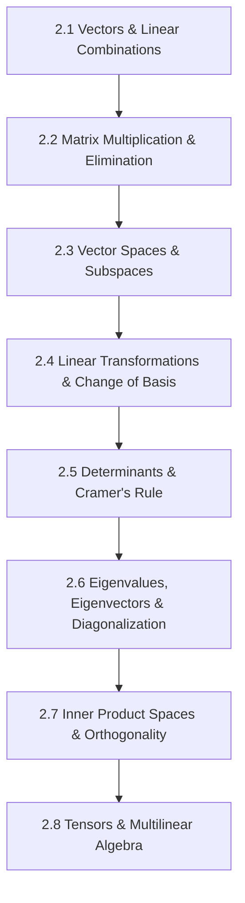

# Subject Syllabus: 02 - Linear Algebra & Matrix Theory

*Back to [Math & Physics Curriculum](07---Math-and-Physics-Index)*

This syllabus defines the roadmap to mastering vectors, vector spaces, linear transformations, matrices, eigenvalue problems, and tensor analysis. It connects theoretical proofs to your local C++ `MatrixCommander` tool and provides rigorous, step-by-step mathematical problems.

---

## 🗺️ 1. Curriculum Mindmap & Milestones

---

## 📚 2. Premium Free Learning Catalog

*   **🎬 Video Playlists & Courses:**
    *   [3Blue1Brown - Essence of Linear Algebra](https://www.youtube.com/playlist?list=PLZHQObOWTQDPD3MizzM2xVFitgF8hE_ab) (The absolute gold standard for visual understanding of matrix actions, determinants, and eigenvectors).
    *   [MIT OCW - Linear Algebra by Gilbert Strang (18.06)](https://ocw.mit.edu/courses/18-06-linear-algebra-spring-2010/) (Excellent foundational lectures with a focus on subspaces and matrix decompositions).
    *   [Pavel Grinfeld - Lemmas / Linear Algebra](https://www.youtube.com/playlist?list=PLlXipRg9C6dgn2964S9V8KjI6m69xVvK3) (Deep math rigor and geometric clarity).
*   **📖 Open-Access Textbooks:**
    *   *Introduction to Linear Algebra* by Gilbert Strang (Reference standard).
    *   [Linear Algebra Done Wrong](https://www.math.brown.edu/treil/papers/LADW/LADW.html) by Sergei Treil (Highly theoretical, emphasis on operator theory).

---

## 🛠️ 3. Integration with Local C++ `MatrixCommander`

Your local Qt/C++ tool `MatrixCommander` located at:
`[MatrixCommander](MatrixCommander)`
should be utilized to:
1.  **Perform LU & QR Decompositions:** Feed matrices $A$ to the tool and inspect the step-by-step elimination multipliers and orthogonalizing matrices.
2.  **Verify Eigensystems:** Compute the characteristic polynomial $\det(A - \lambda I) = 0$ numerically to verify hand-calculated eigenvalues.
3.  **Compute Determinants:** Double-check high-dimension determinants using Gaussian elimination mode.

---

## 🎨 4. Visualization Directive
For notes under this section, generate SVGs that highlight:
*   Basis vector transformations (how $\mathbf{\hat{i}}$ and $\mathbf{\hat{j}}$ land under matrix $A$).
*   Eigenvector lines remaining invariant during shear or stretch transformations.
*   Tensor coordinate transformations (rotating basis vectors and showing covariant/contravariant components).

---

## 📝 5. Hand-Written Challenge Problems & Exhaustive Proofs

Solve the following problems by hand. Write down every intermediate step. Check your final mathematical logic against the detailed solutions below.

### 📝 Problem 1: Eigensystem Analysis and Diagonalization
**Find the eigenvalues and eigenvectors of the matrix $A$, and find the diagonalizing matrix $S$ such that $S^{-1}AS = D$:**
$$A = \begin{pmatrix} 4 & 2 \\ 1 & 3 \end{pmatrix}$$

🔍 View Step-by-Step Solution

#### Step 1: Write down the characteristic equation
To find the eigenvalues $\lambda$, solve the equation:
$$\det(A - \lambda I) = 0$$
$$\det \begin{pmatrix} 4-\lambda & 2 \\ 1 & 3-\lambda \end{pmatrix} = 0$$

#### Step 2: Expand the determinant
$$\det = (4-\lambda)(3-\lambda) - (2)(1) = 0$$
$$\lambda^2 - 7\lambda + 12 - 2 = 0$$
$$\lambda^2 - 7\lambda + 10 = 0$$

#### Step 3: Factor the characteristic polynomial
$$(\lambda - 5)(\lambda - 2) = 0$$
Thus, the eigenvalues are:
$$\lambda_1 = 5, \quad \lambda_2 = 2$$

#### Step 4: Find the eigenvector for $\lambda_1 = 5$
Solve $(A - 5I)\mathbf{v}_1 = \mathbf{0}$:
$$\begin{pmatrix} 4-5 & 2 \\ 1 & 3-5 \end{pmatrix} \begin{pmatrix} x \\ y \end{pmatrix} = \begin{pmatrix} 0 \\ 0 \end{pmatrix}$$
$$\begin{pmatrix} -1 & 2 \\ 1 & -2 \end{pmatrix} \begin{pmatrix} x \\ y \end{pmatrix} = \begin{pmatrix} 0 \\ 0 \end{pmatrix}$$
This yields the linear system:
$$-x + 2y = 0 \implies x = 2y$$
Choosing $y = 1$ yields the eigenvector:
$$\mathbf{v}_1 = \begin{pmatrix} 2 \\ 1 \end{pmatrix}$$

#### Step 5: Find the eigenvector for $\lambda_2 = 2$
Solve $(A - 2I)\mathbf{v}_2 = \mathbf{0}$:
$$\begin{pmatrix} 4-2 & 2 \\ 1 & 3-2 \end{pmatrix} \begin{pmatrix} x \\ y \end{pmatrix} = \begin{pmatrix} 0 \\ 0 \end{pmatrix}$$
$$\begin{pmatrix} 2 & 2 \\ 1 & 1 \end{pmatrix} \begin{pmatrix} x \\ y \end{pmatrix} = \begin{pmatrix} 0 \\ 0 \end{pmatrix}$$
This yields the linear system:
$$x + y = 0 \implies x = -y$$
Choosing $y = 1$ yields the eigenvector:
$$\mathbf{v}_2 = \begin{pmatrix} -1 \\ 1 \end{pmatrix}$$

#### Step 6: Construct the diagonalizing matrices $S$ and $D$
The matrix $S$ is formed by placing eigenvectors in columns:
$$S = \begin{pmatrix} 2 & -1 \\ 1 & 1 \end{pmatrix}$$
The diagonal matrix $D$ consists of the corresponding eigenvalues:
$$D = \begin{pmatrix} 5 & 0 \\ 0 & 2 \end{pmatrix}$$

#### Step 7: Verify diagonalization by showing $AS = SD$
$$AS = \begin{pmatrix} 4 & 2 \\ 1 & 3 \end{pmatrix} \begin{pmatrix} 2 & -1 \\ 1 & 1 \end{pmatrix} = \begin{pmatrix} (4)(2)+(2)(1) & (4)(-1)+(2)(1) \\ (1)(2)+(3)(1) & (1)(-1)+(3)(1) \end{pmatrix} = \begin{pmatrix} 10 & -2 \\ 5 & 2 \end{pmatrix}$$
$$SD = \begin{pmatrix} 2 & -1 \\ 1 & 1 \end{pmatrix} \begin{pmatrix} 5 & 0 \\ 0 & 2 \end{pmatrix} = \begin{pmatrix} (2)(5) & (-1)(2) \\ (1)(5) & (1)(2) \end{pmatrix} = \begin{pmatrix} 10 & -2 \\ 5 & 2 \end{pmatrix}$$
Since $AS = SD$, multiplying by $S^{-1}$ on the left verifies $S^{-1}AS = D$.

**Final Eigenvectors & Eigenvalues:**
$$\lambda_1 = 5, \; \mathbf{v}_1 = \begin{pmatrix} 2 \\ 1 \end{pmatrix} \qquad \lambda_2 = 2, \; \mathbf{v}_2 = \begin{pmatrix} -1 \\ 1 \end{pmatrix}$$
$$S = \begin{pmatrix} 2 & -1 \\ 1 & 1 \end{pmatrix}$$

---

## Related Notes
- [AGENT_MANUAL](AGENT_MANUAL) - Shared mathematics/learning focus
- [SVG_TEMPLATES](SVG_TEMPLATES) - Shared mathematics/learning focus
- [2.1 - Vectors & Linear Combinations](2.1---Vectors-&-Linear-Combinations) - Same Linear Algebra & Mat folder
- [2.2 - Matrix Multiplication & Gaussian Elimination](2.2---Matrix-Multiplication-&-Gaussian-Elimination) - Same Linear Algebra & Mat folder
