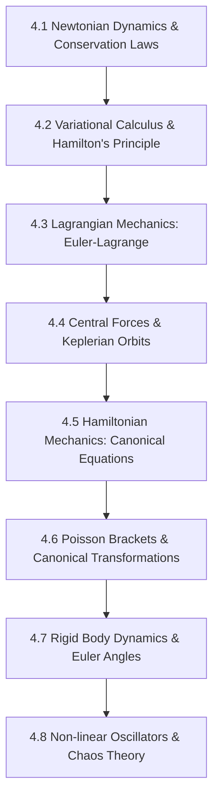

# Subject Syllabus: 04 - Classical Mechanics & Dynamical Systems

*Back to [Math & Physics Curriculum](07---Math-and-Physics-Index)*

This syllabus defines the roadmap to mastering Newtonian, Lagrangian, and Hamiltonian mechanics, variational principles, rigid body rotation, and non-linear dynamical systems (chaos). It connects theoretical proofs to your local C++ `CalculusVisualizer` and `MatrixCommander` tools and provides rigorous, step-by-step mathematical problems.

---

## 🗺️ 1. Curriculum Mindmap & Milestones

---

## 📚 2. Premium Free Learning Catalog

*   **🎬 Video Playlists & Courses:**
    *   [Leonard Susskind - Stanford Theoretical Minimum: Classical Mechanics](https://www.youtube.com/playlist?list=PLpGHT1n4-mAsaFNwEN1_U2v7LIteE8K3c) (Excellent physical insights into states, coordinates, Action, and Lagrangians).
    *   [MIT OCW - Classical Mechanics (8.01)](https://ocw.mit.edu/courses/8-01sc-classical-mechanics-fall-2016/) (Foundational mechanics, forces, energy, momentum).
    *   [Harvard University - Advanced Classical Mechanics (Physics 151)](https://www.youtube.com/playlist?list=PLyQSN7X0ro203yGX4m5d21t9-1-PQLWzU) (Intense college-level lecture course).
*   **📖 Open-Access Textbooks & References:**
    *   *Classical Mechanics* by Herbert Goldstein (The absolute graduate-level Bible).
    *   *The Feynman Lectures on Physics: Volume I* (Excellent conceptual reading).

---

## 🛠️ 3. Integration with Local C++ `CalculusVisualizer` & `MatrixCommander`

1.  **Solve Eigensystems for Coupled Oscillators:** For systems with multiple degrees of freedom (e.g., coupled pendulums), the equations of motion are written as $M\mathbf{\ddot{q}} + K\mathbf{q} = \mathbf{0}$. Solve the generalized eigenvalue problem $\det(K - \omega^2 M) = 0$ using `MatrixCommander` to find the normal modes and frequencies!
2.  **Phase Plane Tracking:** Write the equations of a chaotic system (e.g., Lorenz Attractor) in state-space format. Use `CalculusVisualizer` to plot phase portraits showing trajectories circulating around chaotic attractors.

---

## 🎨 4. Visualization Directive
For notes under this section, generate SVGs that highlight:
*   Generalized coordinate diagrams (e.g., coordinates $(r, \theta)$ representing a mass on a swinging string).
*   The path of least action (showing physical paths minimizing $S = \int L dt$ compared to non-physical paths).
*   Phase space orbits of a pendulum, showing the transition from closed orbits (periodic motion) to open wavy paths (rotation/looping).

---

## 📝 5. Hand-Written Challenge Problems & Exhaustive Proofs

Solve the following problems by hand. Write down every intermediate step. Check your final mathematical logic against the detailed solutions below.

### 📝 Problem 1: Euler-Lagrange Derivation for a Simple Pendulum
**Using Lagrangian Mechanics, derive the equation of motion for a simple pendulum of mass $m$ and string length $l$ swinging in a 2D plane under gravity $g$:**

🔍 View Step-by-Step Solution

#### Step 1: Define generalized coordinates
The system has one degree of freedom. Let the generalized coordinate be the angle $\theta$ measured from the vertical downward axis.
The cartesian positions $(x, y)$ of the mass $m$ are:
$$x = l \sin(\theta)$$
$$y = -l \cos(\theta) \quad (\text{taking vertical downward as positive } y)$$
Or simpler: take horizontal as $x$ and vertical downward as $y$, so $y = 0$ at the pivot:
$$x = l \sin(\theta)$$
$$y = l - l \cos(\theta) \quad (\text{taking pivot height as reference } y=0 \text{, pointing down})$$
Let's write down the velocities:
$$\dot{x} = l \cos(\theta) \dot{\theta}$$
$$\dot{y} = l \sin(\theta) \dot{\theta}$$

#### Step 2: Formulate Kinetic Energy $T$
$$T = \frac{1}{2}m(\dot{x}^2 + \dot{y}^2)$$
$$T = \frac{1}{2}m \left( (l \cos(\theta) \dot{\theta})^2 + (l \sin(\theta) \dot{\theta})^2 \right)$$
$$T = \frac{1}{2}ml^2 \dot{\theta}^2 (\cos^2(\theta) + \sin^2(\theta))$$
Using the trigonometric identity $\cos^2(\theta) + \sin^2(\theta) = 1$:
$$T = \frac{1}{2}ml^2 \dot{\theta}^2$$

#### Step 3: Formulate Potential Energy $U$
Taking the pivot height $y=0$ as reference, the vertical height of the mass (downward is positive $y$, so gravitational potential is $-mgy$):
Alternatively, taking the lowest point of the swing as $U=0$:
$$U = mgl(1 - \cos(\theta))$$
Let's use this expression (its derivative with respect to $\theta$ is the same regardless of constant reference offset).

#### Step 4: Write down the Lagrangian $L$
$$L = T - U$$
$$L = \frac{1}{2}ml^2 \dot{\theta}^2 - mgl(1 - \cos(\theta))$$

#### Step 5: Apply the Euler-Lagrange Equation
The Euler-Lagrange equation for the generalized coordinate $\theta$ is:
$$\frac{d}{dt}\left( \frac{\partial L}{\partial \dot{\theta}} \right) - \frac{\partial L}{\partial \theta} = 0$$

*   **Evaluate partial derivatives:**
    $$\frac{\partial L}{\partial \dot{\theta}} = \frac{\partial}{\partial \dot{\theta}} \left[ \frac{1}{2}ml^2 \dot{\theta}^2 \right] = ml^2 \dot{\theta}$$
    $$\frac{\partial L}{\partial \theta} = -\frac{\partial}{\partial \theta} \left[ mgl(1 - \cos(\theta)) \right] = -mgl(0 - (-\sin(\theta))) = -mgl \sin(\theta)$$
*   **Evaluate time derivative:**
    $$\frac{d}{dt}\left( \frac{\partial L}{\partial \dot{\theta}} \right) = \frac{d}{dt}(ml^2 \dot{\theta}) = ml^2 \ddot{\theta}$$

#### Step 6: Substitute back and simplify the differential equation
$$ml^2 \ddot{\theta} - (-mgl \sin(\theta)) = 0$$
$$ml^2 \ddot{\theta} + mgl \sin(\theta) = 0$$
Divide both sides by $ml^2$ (valid since $m, l \neq 0$):
$$\ddot{\theta} + \frac{g}{l} \sin(\theta) = 0$$

**Final Answer:**
The equation of motion is:
$$\ddot{\theta} + \frac{g}{l} \sin(\theta) = 0$$
For small angles ($\sin(\theta) \approx \theta$), this reduces to the linear harmonic oscillator $\ddot{\theta} + \frac{g}{l}\theta = 0$.

---

## Related Notes
- [AGENT_MANUAL](AGENT_MANUAL) - Shared mathematics/learning focus
- [SVG_TEMPLATES](SVG_TEMPLATES) - Shared mathematics/learning focus
- [4.1 - Newtonian Dynamics & Conservation Laws](4.1---Newtonian-Dynamics-&-Conservation-Laws) - Same Classical Mechanics  folder
- [4.2 - Variational Calculus & Hamilton's Principle](4.2---Variational-Calculus-&-Hamilton's-Principle) - Same Classical Mechanics  folder
