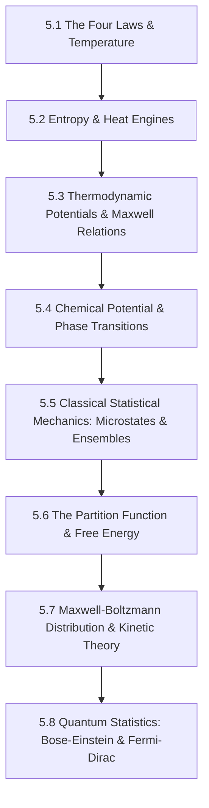

# Subject Syllabus: 05 - Thermodynamics & Statistical Mechanics

*Back to [Math & Physics Curriculum](07---Math-and-Physics-Index)*

This syllabus defines the roadmap to mastering classical thermodynamics (the four laws, thermodynamic potentials, Maxwell relations) and statistical mechanics (ensembles, partition functions, kinetic theory, Bose-Einstein and Fermi-Dirac quantum statistics). It connects theoretical proofs to your local C++ `ProbabilityStudio` and `CalculusVisualizer` tools and provides rigorous, step-by-step mathematical problems.

---

## 🗺️ 1. Curriculum Mindmap & Milestones

---

## 📚 2. Premium Free Learning Catalog

*   **🎬 Video Playlists & Courses:**
    *   [Leonard Susskind - Stanford Theoretical Minimum: Statistical Mechanics](https://www.youtube.com/playlist?list=PLB7B6194A5405021F) (Exceptional lectures introducing microstates, entropy $S = - \sum p \ln p$, and partition functions).
    *   [MIT OCW - Statistical Mechanics I (8.333)](https://ocw.mit.edu/courses/8-333-statistical-mechanics-i-statistical-mechanics-of-particles-fall-2013/) (Rigorous, advanced graduate-level statistical physics).
    *   [Yale Courses - Thermodynamics & Statistical Mechanics](https://www.youtube.com/playlist?list=PLD07A2A9446166CE1) (Excellent pedagogical style from Ramamurti Shankar).
*   **📖 Open-Access Textbooks & References:**
    *   *Thermal Physics* by Charles Kittel and Herbert Kroemer (Industry standard).
    *   [Statistical Mechanics](http://www.physics.mcgill.ca/~cline/statistical_mechanics.pdf) open lecture notes.

---

## 🛠️ 3. Integration with Local C++ `ProbabilityStudio` & `CalculusVisualizer`

1.  **Maxwell-Boltzmann Velocity Analysis:** Use `ProbabilityStudio` to generate normal distributions representing particle velocity components ($v_x, v_y, v_z$) at varying temperatures $T$. Compute the combined speed distribution $\chi^2$ (3 degrees of freedom) to reconstruct the Maxwell-Boltzmann speed curve!
2.  **Optimize Cycles:** Graph multi-variable thermodynamic states (e.g., $P = \frac{nRT}{V}$) in `CalculusVisualizer` to observe isothermal and adiabatic lines and calculate integration areas (work $\int P dV$).

---

## 🎨 4. Visualization Directive
For notes under this section, generate SVGs that highlight:
*   PV (Pressure-Volume) and TS (Entropy-Temperature) cycles.
*   The Maxwell-Boltzmann speed distribution shifts as temperature $T$ increases (broadening and flattening).
*   Fermi-Dirac distribution functions step-dropping from 1 to 0 at absolute zero.

---

## 📝 5. Hand-Written Challenge Problems & Exhaustive Proofs

Solve the following problems by hand. Write down every intermediate step. Check your final mathematical logic against the detailed solutions below.

### 📝 Problem 1: Maxwell Relation Derivation via Exact Differentials
**Using the definition of the Helmholtz Free Energy $F = U - TS$, derive the Maxwell Relation:**
$$\left(\frac{\partial S}{\partial V}\right)_T = \left(\frac{\partial P}{\partial T}\right)_V$$

🔍 View Step-by-Step Solution

#### Step 1: Write down the First Law of Thermodynamics in differential form
For a reversible process:
$$dU = T dS - P dV$$

#### Step 2: Differentiate the Helmholtz Free Energy $F = U - TS$
Take the total differential of $F$:
$$dF = dU - d(TS)$$
Using the product rule on $d(TS)$:
$$dF = dU - (T dS + S dT) = dU - T dS - S dT$$

#### Step 3: Substitute $dU$ into the differential $dF$
$$dF = (T dS - P dV) - T dS - S dT$$
Cancel the common terms ($T dS$ and $-T dS$):
$$dF = -S dT - P dV$$

#### Step 4: Express $dF$ as a function of its natural variables $(T, V)$
Since $F = F(T, V)$, its total differential is:
$$dF = \left(\frac{\partial F}{\partial T}\right)_V dT + \left(\frac{\partial F}{\partial V}\right)_T dV$$

#### Step 5: Equate coefficients
Comparing the two expressions for $dF$:
1.  $$\left(\frac{\partial F}{\partial T}\right)_V = -S$$
2.  $$\left(\frac{\partial F}{\partial V}\right)_T = -P$$

#### Step 6: Apply Clairaut's Theorem (equality of mixed partial derivatives)
Since $F$ is a state function, its mixed second partial derivatives must be equal:
$$\frac{\partial^2 F}{\partial V \partial T} = \frac{\partial^2 F}{\partial T \partial V}$$
Substitute the coefficient relations:
$$\frac{\partial}{\partial V}\left[ \left(\frac{\partial F}{\partial T}\right)_V \right]_T = \frac{\partial}{\partial T}\left[ \left(\frac{\partial F}{\partial V}\right)_T \right]_V$$
$$\frac{\partial}{\partial V}\left[ -S \right]_T = \frac{\partial}{\partial T}\left[ -P \right]_V$$
Simplify by multiplying by $-1$:
$$\left(\frac{\partial S}{\partial V}\right)_T = \left(\frac{\partial P}{\partial T}\right)_V$$

**Final Answer:**
The Maxwell Relation is verified:
$$\left(\frac{\partial S}{\partial V}\right)_T = \left(\frac{\partial P}{\partial T}\right)_V$$

---

### 📝 Problem 2: Partition Function of a Simple Two-State System
**Consider a system of $N$ non-interacting particles. Each particle can occupy one of two energy states: a ground state with energy $\epsilon_0 = 0$ and an excited state with energy $\epsilon_1 = E$. Find the single-particle partition function $Z$, the average energy $\langle \epsilon \rangle$, and the heat capacity $C_V$ as a function of temperature $T$:**

🔍 View Step-by-Step Solution

#### Step 1: Write down the definition of the single-particle partition function $Z$
$$Z = \sum_{i} e^{-\beta \epsilon_i} \qquad \text{where } \beta = \frac{1}{k_B T}$$
The states are $\epsilon_0 = 0$ and $\epsilon_1 = E$.
$$Z = e^{-\beta(0)} + e^{-\beta E}$$
$$Z = 1 + e^{-\beta E}$$

#### Step 2: Compute the average energy $\langle \epsilon \rangle$ of a particle
The average energy is given by:
$$\langle \epsilon \rangle = -\frac{\partial}{\partial \beta} \ln(Z)$$
First, calculate the derivative:
$$\frac{\partial Z}{\partial \beta} = \frac{\partial}{\partial \beta} [1 + e^{-\beta E}] = -E e^{-\beta E}$$
Now, apply the chain rule to $\ln(Z)$:
$$\langle \epsilon \rangle = -\frac{1}{Z} \frac{\partial Z}{\partial \beta} = -\frac{1}{1 + e^{-\beta E}} \left( -E e^{-\beta E} \right)$$
$$\langle \epsilon \rangle = \frac{E e^{-\beta E}}{1 + e^{-\beta E}}$$
Divide the numerator and denominator by $e^{-\beta E}$:
$$\langle \epsilon \rangle = \frac{E}{e^{\beta E} + 1}$$

#### Step 3: Compute the Heat Capacity $C_V$
The heat capacity per particle is:
$$C_V = \frac{\partial \langle \epsilon \rangle}{\partial T} = \frac{\partial \langle \epsilon \rangle}{\partial \beta} \frac{d\beta}{dT}$$
First, compute $\frac{d\beta}{dT}$:
$$\frac{d\beta}{dT} = \frac{d}{dT}\left( \frac{1}{k_B T} \right) = -\frac{1}{k_B T^2}$$
Now, compute $\frac{\partial \langle \epsilon \rangle}{\partial \beta}$:
$$\frac{\partial \langle \epsilon \rangle}{\partial \beta} = \frac{\partial}{\partial \beta} \left[ E (e^{\beta E} + 1)^{-1} \right] = E (-1)(e^{\beta E} + 1)^{-2} \left( E e^{\beta E} \right) = -\frac{E^2 e^{\beta E}}{(e^{\beta E} + 1)^2}$$
Multiply the two derivatives:
$$C_V = \left( -\frac{E^2 e^{\beta E}}{(e^{\beta E} + 1)^2} \right) \left( -\frac{1}{k_B T^2} \right) = \frac{E^2 e^{\beta E}}{k_B T^2 (e^{\beta E} + 1)^2}$$
Substitute $\beta = \frac{1}{k_B T}$:
$$C_V = k_B \left(\frac{E}{k_B T}\right)^2 \frac{e^{E / k_B T}}{(e^{E / k_B T} + 1)^2}$$

**Final Answers:**
*   **Partition Function:** $Z = 1 + e^{-E / k_B T}$
*   **Average Energy:** $\langle \epsilon \rangle = \frac{E}{e^{E / k_B T} + 1}$
*   **Heat Capacity:** $C_V = k_B \left(\frac{E}{k_B T}\right)^2 \frac{e^{E / k_B T}}{(e^{E / k_B T} + 1)^2}$

---

## Related Notes
- [AGENT_MANUAL](AGENT_MANUAL) - Shared mathematics/learning focus
- [SVG_TEMPLATES](SVG_TEMPLATES) - Shared mathematics/learning focus
- [5.1 - The Four Laws & Temperature](5.1---The-Four-Laws-&-Temperature) - Same Thermodynamics & Sta folder
- [5.2 - Entropy & Heat Engines](5.2---Entropy-&-Heat-Engines) - Same Thermodynamics & Sta folder
