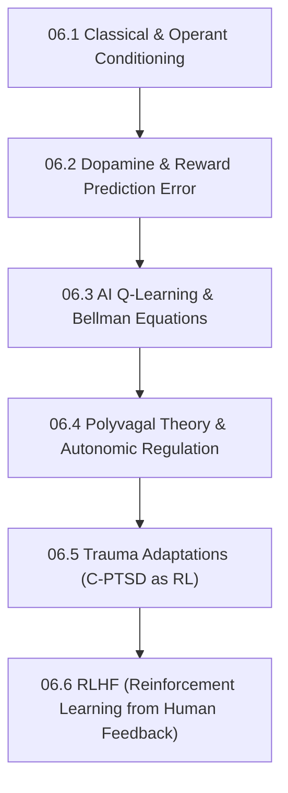

# Subject Syllabus: 06 - Behavioral Psychology & Reinforcement Learning

*Back to [Learning Progress](Learning-Progress)*

This syllabus defines the roadmap to mastering human behavior, motivation, and trauma adaptations, specifically mapped to how Artificial Intelligence (AI) learns through reward optimization.

*Personal Biometric Context:* This curriculum explores the mathematical basis of dopamine loops (e.g., hyper-focus vs. burnout), Polyvagal Theory (the functional freeze state), and how counter-dependency/avoidant attachment styles are essentially human reward functions optimizing for "safety" over "social connection."

---

## 🗺️ 1. Curriculum Mindmap & Milestones

---

## 📚 2. Web-Verified Authoritative Learning Catalog

Following the **Agent Verification Standard**, these resources have been curated from top-tier academic institutions:

*   **🎬 Video Lecture Series:**
    *   [MIT 6.832: Underactuated Robotics (Russ Tedrake)](https://underactuated.mit.edu/) — The bridge between optimal control theory and reinforcement learning.
    *   [David Silver's UCL Course on Reinforcement Learning](https://www.davidsilver.uk/teaching/) — The definitive DeepMind RL course.
*   **📖 Open-Access Reading / Research:**
    *   *Reinforcement Learning: An Introduction* by Sutton and Barto (The absolute standard RL textbook).
    *   *The Polyvagal Theory* by Stephen Porges (Understanding the dorsal vagal shutdown/33 BPM physiological state).
    *   Schultz, W. (1997). *A Neural Substrate of Prediction and Reward* (The landmark paper linking dopamine to the mathematical Reward Prediction Error used in AI).

---

## 🧠 3. Biological Mechanisms vs. AI Architecture

When documenting notes in this folder, you must draw explicit parallels between behavioral psychology and AI/ML algorithms.

### A. Dopamine vs. Temporal Difference (TD) Learning
*   **Biological:** Dopamine neurons do not fire for pleasure; they fire for *reward prediction error*. If a reward is expected, dopamine baseline stays flat. If it exceeds expectations, dopamine spikes.
*   **AI Equivalent:** TD Learning (used in AlphaGo). The AI updates its value function based on the difference between the estimated reward and the actual observed reward.

### B. Trauma Avoidance vs. Policy Optimization
*   **Biological (C-PTSD):** A trauma survivor's brain creates a "policy" that highly penalizes vulnerability. The nervous system assigns a massive negative reward to "trust," trapping the individual in a local optimum (isolation) to ensure survival.
*   **AI Equivalent:** A reinforcement learning agent getting stuck in a local minimum because the penalty for exploring the environment is set too high. Overcoming it requires artificially increasing the `exploration rate (epsilon)`.

### C. Co-Regulation vs. RLHF
*   **Biological:** Human nervous systems co-regulate. A calm person can bring a panicked person into a Ventral Vagal state via tone of voice and micro-expressions.
*   **AI Equivalent:** Reinforcement Learning from Human Feedback (RLHF). An AI outputs text, and a human evaluator acts as the "regulator," adjusting the AI's reward model to align with human safety and values.

---

## 📝 4. Documentation Workflow

1.  **Definitions:** Define psychological and RL terms (e.g., *Policy, Value Function, Extinction, Amygdala Hijack*).
2.  **Mathematical Formulations:** Always provide the math behind the behavior (e.g., The Bellman Equation for calculating future rewards).
3.  **Synthesis:** Explain how adjusting the parameters of human behavior can conceptually improve the design of AI reward systems.

---

## Related Notes
- [06.1 - Classical & Operant Conditioning](06.1---Classical-&-Operant-Conditioning) - Same Behavioral Psycholog folder
- [06.2 - Dopamine & Reward Prediction Error](06.2---Dopamine-&-Reward-Prediction-Error) - Same Behavioral Psycholog folder
- [06.3 - Q-Learning & The Bellman Equation](06.3---Q-Learning-&-The-Bellman-Equation) - Same Behavioral Psycholog folder
- [06.4 - Polyvagal Theory & Autonomic Regulation](06.4---Polyvagal-Theory-&-Autonomic-Regulation) - Same Behavioral Psycholog folder
- [06.5 - Trauma Adaptations - C-PTSD as Reinforcement Learning](06.5---Trauma-Adaptations---C-PTSD-as-Reinforcement-Learning) - Same Behavioral Psycholog folder
