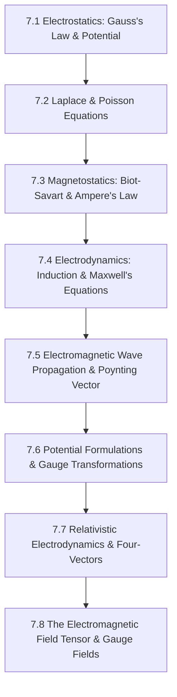

# Subject Syllabus: 07 - Electrodynamics & Classical Field Theory

*Back to [Math & Physics Curriculum](07---Math-and-Physics-Index)*

This syllabus defines the roadmap to mastering electrostatics, magnetostatics, Maxwell's equations (in vacuum and matter), radiation, and relativistic electrodynamics (four-vectors and the electromagnetic field tensor $F^{\mu\nu}$). It connects theoretical proofs to your local C++ `CalculusVisualizer` and `MatrixCommander` tools and provides rigorous, step-by-step mathematical problems.

---

## 🗺️ 1. Curriculum Mindmap & Milestones

---

## 📚 2. Premium Free Learning Catalog

*   **🎬 Video Playlists & Courses:**
    *   [Leonard Susskind - Stanford Theoretical Minimum: Classical Electrodynamics](https://www.youtube.com/playlist?list=PL470E1C92B5F75D27) (Excellent focus on field concepts, gauge invariance, and special relativity covariance).
    *   [MIT OCW - Physics II: Electricity and Magnetism (8.02)](https://ocw.mit.edu/courses/8-02-physics-ii-electricity-and-magnetism-spring-2019/) (Brilliant visual demos of fields, induction, and Maxwell's laws).
    *   [Yale Courses - Fundamentals of Physics II](https://www.youtube.com/playlist?list=PLFE3074A4CD75B025) (Masterfully delivered lectures by Ramamurti Shankar).
*   **📖 Open-Access Textbooks & References:**
    *   *Introduction to Electrodynamics* by David J. Griffiths (The undisputed standard textbook).
    *   *Classical Electrodynamics* by John David Jackson (The legendary graduate-level mountain).

---

## 🛠️ 3. Integration with Local C++ `CalculusVisualizer` & `MatrixCommander`

1.  **3D Vector Calculus Operations:** Electrodynamics is governed by divergence and curl equations (e.g., $\nabla \times \mathbf{E} = -\frac{\partial \mathbf{B}}{\partial t}$). Plot vector fields $\mathbf{E}(x,y,z)$ in `CalculusVisualizer` to observe visual field lines and verify that curl is non-zero in magnetic induction zones.
2.  **Lorentz Transform Matrices:** The electromagnetic field tensor transforms as $F'^{\alpha\beta} = \Lambda^\alpha{}_\mu \Lambda^\beta{}_\nu F^{\mu\nu}$. Construct the Lorentz boost matrices $\Lambda$ and carry out matrix multiplications in `MatrixCommander` to observe the mixing of electric and magnetic fields!

---

## 🎨 4. Visualization Directive
For notes under this section, generate SVGs that highlight:
*   Electric dipoles showing field arrows curving from positive to negative charges.
*   Electromagnetic plane wave propagation (showing orthogonal, sinusoidal $\mathbf{E}$ and $\mathbf{B}$ vectors along the propagation axis).
*   A loop of wire experiencing magnetic flux changes, inducing current (Lenz's Law).

---

## 📝 5. Hand-Written Challenge Problems & Exhaustive Proofs

Solve the following problems by hand. Write down every intermediate step. Check your final mathematical logic against the detailed solutions below.

### 📝 Problem 1: Derivation of the Electromagnetic Wave Equation
**Starting from Maxwell's Equations in vacuum (where charge density $\rho = 0$ and current density $\mathbf{J} = \mathbf{0}$), derive the electromagnetic wave equation for the electric field $\mathbf{E}$:**
$$\nabla^2 \mathbf{E} = \frac{1}{c^2} \frac{\partial^2 \mathbf{E}}{\partial t^2}$$

🔍 View Step-by-Step Solution

#### Step 1: Write down Maxwell's Equations in vacuum
1.  $$\nabla \cdot \mathbf{E} = 0 \quad (\text{Gauss's Law})$$
2.  $$\nabla \cdot \mathbf{B} = 0 \quad (\text{Gauss's Law for Magnetism})$$
3.  $$\nabla \times \mathbf{E} = -\frac{\partial \mathbf{B}}{\partial t} \quad (\text{Faraday's Law})$$
4.  $$\nabla \times \mathbf{B} = \mu_0 \epsilon_0 \frac{\partial \mathbf{E}}{\partial t} \quad (\text{Ampere-Maxwell Law})$$

#### Step 2: Take the curl of Faraday's Law (Equation 3)
$$\nabla \times (\nabla \times \mathbf{E}) = \nabla \times \left( -\frac{\partial \mathbf{B}}{\partial t} \right)$$
Since space and time derivatives commute, pull the time derivative out:
$$\nabla \times (\nabla \times \mathbf{E}) = -\frac{\partial}{\partial t} (\nabla \times \mathbf{B})$$

#### Step 3: Apply vector identity to the double curl
Use the standard vector identity $\nabla \times (\nabla \times \mathbf{V}) = \nabla(\nabla \cdot \mathbf{V}) - \nabla^2 \mathbf{V}$:
$$\nabla(\nabla \cdot \mathbf{E}) - \nabla^2 \mathbf{E} = -\frac{\partial}{\partial t} (\nabla \times \mathbf{B})$$

#### Step 4: Substitute Gauss's Law in vacuum (Equation 1)
Since $\nabla \cdot \mathbf{E} = 0$:
$$\nabla(0) - \nabla^2 \mathbf{E} = -\frac{\partial}{\partial t} (\nabla \times \mathbf{B})$$
$$-\nabla^2 \mathbf{E} = -\frac{\partial}{\partial t} (\nabla \times \mathbf{B})$$
Multiply by $-1$:
$$\nabla^2 \mathbf{E} = \frac{\partial}{\partial t} (\nabla \times \mathbf{B})$$

#### Step 5: Substitute the Ampere-Maxwell Law in vacuum (Equation 4)
Replace $\nabla \times \mathbf{B}$ with $\mu_0 \epsilon_0 \frac{\partial \mathbf{E}}{\partial t}$:
$$\nabla^2 \mathbf{E} = \frac{\partial}{\partial t} \left( \mu_0 \epsilon_0 \frac{\partial \mathbf{E}}{\partial t} \right)$$
Since constants $\mu_0$ and $\epsilon_0$ do not depend on time, pull them out:
$$\nabla^2 \mathbf{E} = \mu_0 \epsilon_0 \frac{\partial^2 \mathbf{E}}{\partial t^2}$$

#### Step 6: Relate constants to the speed of light $c$
By Maxwell's definition, the speed of electromagnetic waves in vacuum is $c = \frac{1}{\sqrt{\mu_0 \epsilon_0}}$, meaning:
$$\mu_0 \epsilon_0 = \frac{1}{c^2}$$
Substitute this into the equation:
$$\nabla^2 \mathbf{E} = \frac{1}{c^2} \frac{\partial^2 \mathbf{E}}{\partial t^2}$$

**Final Answer:**
The electromagnetic wave equation is derived:
$$\nabla^2 \mathbf{E} = \frac{1}{c^2} \frac{\partial^2 \mathbf{E}}{\partial t^2}$$
An identical wave equation can be derived for the magnetic field $\mathbf{B}$ using the exact same steps starting with the curl of Equation 4.

---

## Related Notes
- [AGENT_MANUAL](AGENT_MANUAL) - Shared mathematics/learning focus
- [SVG_TEMPLATES](SVG_TEMPLATES) - Shared mathematics/learning focus
- [7.1 - Electrostatics - Gauss's Law & Potential](7.1---Electrostatics---Gauss's-Law-&-Potential) - Same Electrodynamics & Cl folder
- [7.2 - Laplace & Poisson Equations](7.2---Laplace-&-Poisson-Equations) - Same Electrodynamics & Cl folder
