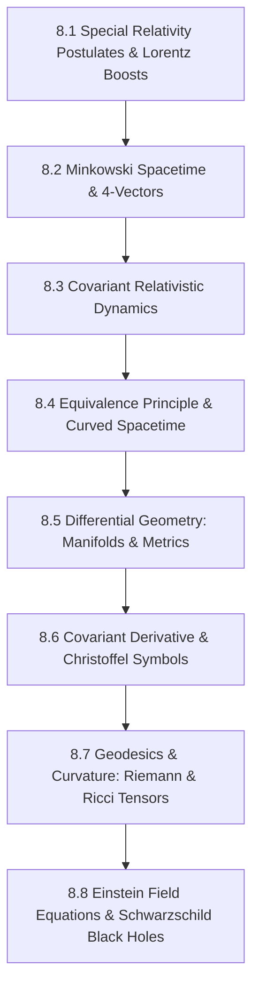

# Subject Syllabus: 08 - Special & General Relativity

*Back to [Math & Physics Curriculum](07---Math-and-Physics-Index)*

This syllabus defines the roadmap to mastering Special Relativity (Minkowski space, Lorentz boosts, 4-vectors) and General Relativity (differential geometry, manifolds, metric tensors, Christoffel symbols, curvature, and the Einstein Field Equations). It connects theoretical proofs to your local C++ `MatrixCommander` and `CalculusVisualizer` tools and provides rigorous, step-by-step mathematical problems.

---

## 🗺️ 1. Curriculum Mindmap & Milestones

---

## 📚 2. Premium Free Learning Catalog

*   **🎬 Video Playlists & Courses:**
    *   [Leonard Susskind - Stanford Theoretical Minimum: Special Relativity & Electrodynamics](https://www.youtube.com/playlist?list=PLD97A3E629007D926) (Clear physical breakdown of coordinate transformations and four-vector invariants).
    *   [Leonard Susskind - Stanford Theoretical Minimum: General Relativity](https://www.youtube.com/playlist?list=PLpGHT1n4-mAtwjxFvQGf__aeNgIIdK-aH) (The gold standard for understanding tensors, metrics, geodesics, and black hole math).
    *   [Sean Carroll - Lecture Series on General Relativity](https://www.youtube.com/playlist?list=PLyQSN7X0ro20gP-t9x0R4XJsk5tNqgL_M) (Extremely comprehensive graduate-level lectures by a prominent cosmologist).
*   **📖 Open-Access Textbooks & References:**
    *   [Spacetime and Geometry: An Introduction to General Relativity](https://arxiv.org/abs/gr-qc/9712019) (Sean Carroll's open lecture notes—exceptional clarity).
    *   *Spacetime Physics* by Edwin F. Taylor and John Archibald Wheeler (Excellent for Special Relativity).

---

## 🛠️ 3. Integration with Local C++ `MatrixCommander` & `CalculusVisualizer`

1.  **Metric Tensor Calculations:** Spacetime geometry is defined by the metric tensor $g_{\mu\nu}$. Carry out matrix inversions of the Schwarzschild metric to isolate contravariant components $g^{\mu\nu}$ using `MatrixCommander`!
2.  **Geodesic Integrator:** The geodesic path of a particle in curved spacetime is a set of second-order coupled non-linear ODEs: $\frac{d^2 x^\mu}{d\lambda^2} + \Gamma^\mu_{\alpha\beta} \frac{dx^\alpha}{d\lambda} \frac{dx^\beta}{d\lambda} = 0$. Plot geodesic orbits around black holes in `CalculusVisualizer` using the integration mode!

---

## 🎨 4. Visualization Directive
For notes under this section, generate SVGs that highlight:
*   Minkowski Spacetime diagrams (showing light cones, world lines, and coordinates tilting during Lorentz boosts).
*   Spacetime curvature (illustrating a 2D rubber sheet coordinate grid curving downward under a central massive star).
*   Parallel transport of a vector along a closed path on a sphere, demonstrating non-zero curvature angle upon return.

---

## 📝 5. Hand-Written Challenge Problems & Exhaustive Proofs

Solve the following problems by hand. Write down every intermediate step. Check your final mathematical logic against the detailed solutions below.

### 📝 Problem 1: Time Dilation Derivation from Lorentz Transformations
**Using the Lorentz transformation equations for coordinates $(ct, x)$, derive the relativistic time dilation equation $t = \gamma t'$ for a clock at rest in a moving frame $S'$:**

🔍 View Step-by-Step Solution

#### Step 1: Establish coordinate frames and relative motion
*   Let frame $S'$ move at constant velocity $v$ along the positive $x$-axis relative to frame $S$.
*   At $t = t' = 0$, their origins coincide.
*   The Lorentz transformation from frame $S'$ to $S$ is:
    $$ct = \gamma \left( ct' + \frac{v}{c} x' \right) \implies t = \gamma \left( t' + \frac{v}{c^2} x' \right)$$
    $$x = \gamma (x' + v t')$$
    Where $\gamma$ is the Lorentz factor:
    $$\gamma = \frac{1}{\sqrt{1 - \frac{v^2}{c^2}}}$$

#### Step 2: Set up the clock measurement in the rest frame $S'$
A clock is placed stationary at the origin of frame $S'$:
$$x'_1 = x'_2 = 0 \quad (\text{the clock does not move in its own rest frame } S')$$
The clock ticks at interval times:
*   First tick: $t'_1 = 0$
*   Second tick: $t'_2 = \tau \quad (\text{where } \tau \text{ is the "proper time" interval } \Delta t' = t'_2 - t'_1 = \tau)$

#### Step 3: Transform clock times to the moving observer frame $S$
Using the Lorentz transformation for time:
*   For the first tick $t'_1 = 0$ at $x'_1 = 0$:
    $$t_1 = \gamma \left( t'_1 + \frac{v}{c^2} x'_1 \right) = \gamma \left( 0 + \frac{v}{c^2} 0 \right) = 0$$
*   For the second tick $t'_2 = \tau$ at $x'_2 = 0$:
    $$t_2 = \gamma \left( t'_2 + \frac{v}{c^2} x'_2 \right) = \gamma \left( \tau + \frac{v}{c^2} 0 \right) = \gamma \tau$$

#### Step 4: Calculate the time interval measured in frame $S$
The measured time interval $\Delta t = t_2 - t_1$:
$$\Delta t = \gamma \tau - 0 = \gamma \tau$$
Substitute proper time $\Delta t'$ for $\tau$:
$$\Delta t = \gamma \Delta t'$$

#### Step 5: Verify physically
Since $v \lt  c$, the Lorentz factor $\gamma \gt  1$. Therefore, $\Delta t \gt  \Delta t'$, indicating that the time interval measured by the moving observer is longer (dilated) compared to the interval measured in the clock's rest frame.

**Final Answer:**
The time dilation equation is:
$$t = \gamma t' \qquad \text{where } \gamma = \frac{1}{\sqrt{1 - v^2/c^2}}$$

---

### 📝 Problem 2: Geodesic Equation from Variational Principle
**The path of a particle in curved spacetime is a curve $x^\mu(\lambda)$ that extremizes the spacetime interval $S = \int d\tau = \int \sqrt{-g_{\mu\nu} \dot{x}^\mu \dot{x}^\nu} d\lambda$. Show that applying the Euler-Lagrange equations to the Lagrangian $L = \frac{1}{2} g_{\mu\nu} \dot{x}^\mu \dot{x}^\nu$ (where $\dot{x}^\mu = \frac{dx^\mu}{d\lambda}$) yields the Geodesic Equation:**
$$\ddot{x}^\mu + \Gamma^\mu_{\alpha\beta} \dot{x}^\alpha \dot{x}^\beta = 0$$

🔍 View Step-by-Step Solution

#### Step 1: Write down the Lagrangian and Euler-Lagrange equations
Let the Lagrangian be:
$$L(x^\sigma, \dot{x}^\sigma) = \frac{1}{2} g_{\alpha\beta}(x) \dot{x}^\alpha \dot{x}^\beta$$
The Euler-Lagrange equation for each coordinate index $\mu$ is:
$$\frac{d}{d\lambda}\left( \frac{\partial L}{\partial \dot{x}^\mu} \right) - \frac{\partial L}{\partial x^\mu} = 0$$

#### Step 2: Compute the partial derivative $\frac{\partial L}{\partial \dot{x}^\mu}$
Using the chain/product rule, noting that $g_{\alpha\beta}$ depends on $x$ and not on $\dot{x}$:
$$\frac{\partial L}{\partial \dot{x}^\mu} = \frac{1}{2} g_{\alpha\beta} \frac{\partial}{\partial \dot{x}^\mu} (\dot{x}^\alpha \dot{x}^\beta) = \frac{1}{2} g_{\alpha\beta} \left( \delta^\alpha_\mu \dot{x}^\beta + \dot{x}^\alpha \delta^\beta_\mu \right)$$
Where $\delta$ is the Kronecker delta.
$$\frac{\partial L}{\partial \dot{x}^\mu} = \frac{1}{2} \left( g_{\mu\beta} \dot{x}^\beta + g_{\alpha\mu} \dot{x}^\alpha \right)$$
Since the metric tensor is symmetric ($g_{\mu\beta} = g_{\beta\mu}$), and renaming dummy indices:
$$\frac{\partial L}{\partial \dot{x}^\mu} = g_{\mu\nu} \dot{x}^\nu$$

#### Step 3: Compute the time derivative $\frac{d}{d\lambda}\left( \frac{\partial L}{\partial \dot{x}^\mu} \right)$
Applying the product rule, noting that $g_{\mu\nu}$ depends on $x(\lambda)$:
$$\frac{d}{d\lambda}\left( g_{\mu\nu} \dot{x}^\nu \right) = g_{\mu\nu} \ddot{x}^\nu + \frac{d}{d\lambda}(g_{\mu\nu}) \dot{x}^\nu$$
Use the chain rule on $g_{\mu\nu}(x)$:
$$\frac{d}{d\lambda}(g_{\mu\nu}) = \frac{\partial g_{\mu\nu}}{\partial x^\sigma} \frac{dx^\sigma}{d\lambda} = \partial_\sigma g_{\mu\nu} \dot{x}^\sigma$$
Substitute this back:
$$\frac{d}{d\lambda}\left( \frac{\partial L}{\partial \dot{x}^\mu} \right) = g_{\mu\nu} \ddot{x}^\nu + \partial_\sigma g_{\mu\nu} \dot{x}^\sigma \dot{x}^\nu$$

#### Step 4: Compute the partial derivative $\frac{\partial L}{\partial x^\mu}$
Since $g_{\alpha\beta}$ is the only term that depends on coordinates $x$:
$$\frac{\partial L}{\partial x^\mu} = \frac{1}{2} \frac{\partial g_{\alpha\beta}}{\partial x^\mu} \dot{x}^\alpha \dot{x}^\beta = \frac{1}{2} \partial_\mu g_{\alpha\beta} \dot{x}^\alpha \dot{x}^\beta$$

#### Step 5: Substitute into the Euler-Lagrange Equation
$$g_{\mu\nu} \ddot{x}^\nu + \partial_\sigma g_{\mu\nu} \dot{x}^\sigma \dot{x}^\nu - \frac{1}{2} \partial_\mu g_{\alpha\beta} \dot{x}^\alpha \dot{x}^\beta = 0$$
Rename dummy indices in the middle term ($\sigma \to \alpha$, $\nu \to \beta$):
$$g_{\mu\nu} \ddot{x}^\nu + \partial_\alpha g_{\mu\beta} \dot{x}^\alpha \dot{x}^\beta - \frac{1}{2} \partial_\mu g_{\alpha\beta} \dot{x}^\alpha \dot{x}^\beta = 0$$
Symmetrize the middle term because it multiplies symmetric $\dot{x}^\alpha \dot{x}^\beta$:
$$\partial_\alpha g_{\mu\beta} \dot{x}^\alpha \dot{x}^\beta = \frac{1}{2} \left( \partial_\alpha g_{\mu\beta} + \partial_\beta g_{\alpha\mu} \right) \dot{x}^\alpha \dot{x}^\beta$$
This yields:
$$g_{\mu\nu} \ddot{x}^\nu + \frac{1}{2} \left( \partial_\alpha g_{\mu\beta} + \partial_\beta g_{\alpha\mu} - \partial_\mu g_{\alpha\beta} \right) \dot{x}^\alpha \dot{x}^\beta = 0$$

#### Step 6: Multiply by the inverse metric $g^{\sigma\mu}$ to isolate $\ddot{x}^\sigma$
Multiply the entire equation by $g^{\sigma\mu}$ (summing over $\mu$):
$$g^{\sigma\mu} g_{\mu\nu} \ddot{x}^\nu + \frac{1}{2} g^{\sigma\mu} \left( \partial_\alpha g_{\mu\beta} + \partial_\beta g_{\alpha\mu} - \partial_\mu g_{\alpha\beta} \right) \dot{x}^\alpha \dot{x}^\beta = 0$$
Since $g^{\sigma\mu} g_{\mu\nu} = \delta^\sigma_\nu$:
$$\ddot{x}^\sigma + \frac{1}{2} g^{\sigma\mu} \left( \partial_\alpha g_{\mu\beta} + \partial_\beta g_{\alpha\mu} - \partial_\mu g_{\alpha\beta} \right) \dot{x}^\alpha \dot{x}^\beta = 0$$

#### Step 7: Define the Christoffel Symbols of the Second Kind $\Gamma^\sigma_{\alpha\beta}$
The expression in front of the velocities is defined exactly as:
$$\Gamma^\sigma_{\alpha\beta} = \frac{1}{2} g^{\sigma\mu} \left( \partial_\alpha g_{\mu\beta} + \partial_\beta g_{\alpha\mu} - \partial_\mu g_{\alpha\beta} \right)$$
Substitute this definition and rename $\sigma \to \mu$:
$$\ddot{x}^\mu + \Gamma^\mu_{\alpha\beta} \dot{x}^\alpha \dot{x}^\beta = 0$$

**Final Answer:**
The geodesic equation is derived:
$$\ddot{x}^\mu + \Gamma^\mu_{\alpha\beta} \dot{x}^\alpha \dot{x}^\beta = 0$$

---

## Related Notes
- [AGENT_MANUAL](AGENT_MANUAL) - Shared mathematics/learning focus
- [SVG_TEMPLATES](SVG_TEMPLATES) - Shared mathematics/learning focus
- [8.1 - Special Relativity Postulates & Lorentz Boosts](8.1---Special-Relativity-Postulates-&-Lorentz-Boosts) - Same Special & General Re folder
- [8.2 - Minkowski Spacetime & 4-Vectors](8.2---Minkowski-Spacetime-&-4-Vectors) - Same Special & General Re folder
